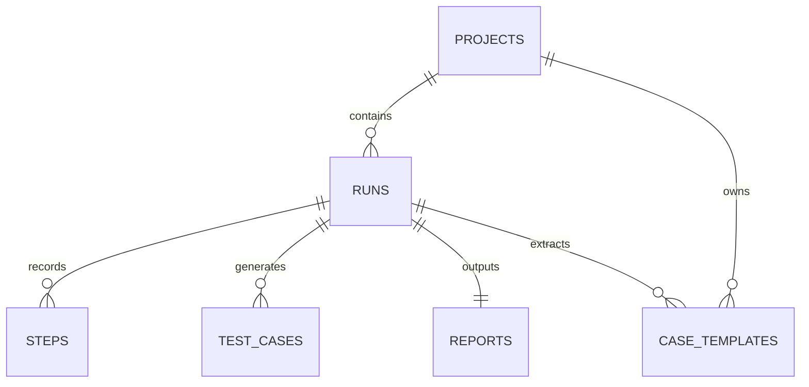

# QPilot Studio 架构扫盲版（ARCHITECTURE 101）

如果你现在还不是“架构扫盲”阶段，而是连“文件、路径、进程、请求、端口、JSON、数据库、DOM、iframe、OCR”这些词都不稳，请先看 [FOUNDATIONS-101.zh-CN.md](./FOUNDATIONS-101.zh-CN.md)。  
那份文档是专门给完全小白补预备知识的。

如果你想要一份“从技术扫盲一路讲到自己如何从 0 开发出这个项目”的单一总手册，请先看 [FROM-0-TO-1.zh-CN.md](./FROM-0-TO-1.zh-CN.md)。  
当前这份文档保留为架构扫盲专题，适合先补最基础概念，再进入其他文档。

## 这份文档适合谁

这份文档是写给“会用电脑，但不懂前端、后端、通信、自动化”的读者的。

如果你看到下面这些词会头大：

- 前端
- 后端
- 接口
- 长连接
- 浏览器自动化
- 数据库
- Electron
- React
- Playwright

那就应该先看这份文档，再去看 [ARCHITECTURE.zh-CN.md](./ARCHITECTURE.zh-CN.md)。

这份文档的目标不是一次把所有工程细节讲完，而是先帮你建立三件事：

1. 你现在学的到底是什么系统。
2. 这个系统里到底有哪几类角色。
3. 以后看代码时，先看哪里最不容易迷路。

---

## 1. 你现在在学的到底是什么系统

### 这是什么

QPilot Studio 是一个“本地运行的浏览器测试代理系统”。

这句话里有四个关键词：

- 本地运行：
  主要程序都在你自己的电脑上跑，不是默认跑在云端。
- 浏览器：
  它会真的启动一个浏览器去打开网页。
- 测试：
  它的目标不是随便浏览网页，而是验证页面和流程是否符合预期。
- 代理系统：
  它不是只有一段脚本，而是“界面 + 调度程序 + 浏览器执行 + AI 规划 + 证据记录”一起工作的系统。

### 为什么要有它

如果只有一个普通自动化脚本，你通常会遇到这些问题：

- 脚本执行时你看不到过程。
- 出错时不知道卡在哪一步。
- 验证码、登录拦截这种情况很难人工接手。
- 跑完以后缺少结构化证据和报告。

QPilot Studio 的目标就是把这些问题补上，让“浏览器自动化”从一段黑盒脚本，变成一个可看、可管、可回放、可接管的系统。

### 在 QPilot Studio 里它是谁

在这个项目里，整个系统不是单个程序，而是几个角色一起工作：

- `apps/desktop`
  桌面窗口外壳。
- `apps/web`
  控制台界面。
- `apps/runtime`
  真正的业务核心。
- `packages/shared`
  前后端共享的数据协议。

### 你在界面上会看到什么

你平时最直接看到的是：

- 项目列表
- 运行列表
- 新建运行表单
- 运行详情页
- 实时截图或实时画面
- 审批按钮、暂停按钮、继续按钮

但这些只是“表面”。真正干活的程序其实主要在后台。

### 对应代码入口

- `apps/desktop/src/main.cjs`
- `apps/web/src/App.tsx`
- `apps/runtime/src/server.ts`
- `apps/runtime/src/orchestrator/run-orchestrator.ts`

---

## 2. 什么叫前端、后端、桌面壳、浏览器、数据库、ORM、接口、长连接

### 这是什么

这一节是在给后面的内容打地基。

如果这些最基础的词不清楚，后面你会很容易把“谁在显示界面”“谁在真正执行逻辑”“谁在保存数据”“谁在一直推送消息”全部混在一起。

### 为什么要有它

因为一个系统里，不同部分负责的事情完全不同。

最怕的不是“不懂代码”，最怕的是一开始把角色搞反了：

- 把前端当成后端
- 把桌面壳当成业务核心
- 把浏览器当成数据库
- 把接口当成页面

只要这些角色关系搞清楚，读代码就会轻松很多。

### 在 QPilot Studio 里它是谁

下面是最重要的 7 个基础词。

#### 前端（Frontend）

前端就是你能看到、能点、能输入的那一层界面。

生活类比：
  像银行大厅的柜台和显示屏。

在 QPilot Studio 里：
  前端就是 `apps/web`。

它负责：

- 显示页面
- 接收用户点击
- 把请求发给 runtime
- 把 runtime 返回的数据展示出来

#### 后端（Backend）

后端就是不直接给你看页面，但负责处理业务逻辑的程序。

生活类比：
  像银行大厅后面的业务处理区。

在 QPilot Studio 里：
  后端主要就是 `apps/runtime`。

它负责：

- 接收前端请求
- 启动浏览器
- 调用 AI
- 保存数据库
- 推送实时状态

#### 桌面壳（Desktop Shell）

桌面壳就是把网页装进桌面窗口里的外壳。

生活类比：
  像电视机的机身。它负责把画面装起来，但不负责写节目内容。

在 QPilot Studio 里：
  桌面壳是 `apps/desktop`，技术上用的是 Electron。

#### 浏览器（Browser）

这里说的浏览器，不是“你平时手动上网那个浏览器概念”，而是“被程序启动和控制的 Chromium 浏览器实例”。

生活类比：
  像一个听指挥办事的现场执行员。

在 QPilot Studio 里：
  浏览器由 Playwright 驱动，真正去打开网页、点击、输入、跳转。

#### 数据库（Database）

数据库是专门用来保存结构化数据的地方。

生活类比：
  像一个非常规整的档案柜，每条记录都有固定字段。

在 QPilot Studio 里：
  用的是 SQLite，本地数据库文件默认在 `apps/runtime/data/qpilot.db`。

#### ORM（Object-Relational Mapping）

`ORM` 全称是 `Object-Relational Mapping`，中文可以理解成“对象关系映射”。
你先不用死记这个词，只要先记住一句人话：

ORM 就是“代码和数据库之间的翻译层”。

生活类比：
像一个懂业务、也懂数据库语法的秘书。

- 你对秘书说：“帮我新建一条 run”
- 秘书再把这句话翻译成数据库真正能执行的写入动作

在 QPilot Studio 里：

- 真正存数据的地方是 `SQLite`
- 让 TypeScript 代码更自然地查表、插入、更新的工具是 `Drizzle ORM`

所以一定不要把这三件事混成一件事：

- 数据库：真的存数据的地方
- 数据库文件：例如 `qpilot.db`
- ORM：程序操作数据库时用的代码化工具层

这个项目里你会经常看到这样的写法：

- `db.insert(runsTable).values(...)`
- `db.select().from(runsTable)...`
- `db.update(runsTable).set(...)`

这些就是 ORM 在工作。

#### 接口（API, Application Programming Interface）

接口就是一个程序给另一个程序开放的“办事入口”。

生活类比：
  像服务窗口。你把材料递进去，对方按规则给你结果。

在 QPilot Studio 里：
  前端通过接口向 runtime 发请求，例如：

- `POST /api/runs`
- `GET /api/runs/:runId`
- `POST /api/runs/:runId/control`

#### 长连接（Long-lived Connection）

长连接就是“不是请求一次就断开，而是保持连着，持续收消息”的连接方式。

生活类比：
  像你开着电话不挂，对方可以一直告诉你最新进展。

在 QPilot Studio 里有两种典型长连接：

- 服务器发送事件（Server-Sent Events, SSE）
  负责持续推送运行状态。
- 网络套接字长连接（WebSocket）
  负责持续推送实时画面和指标。

### 你在界面上会看到什么

你能直接看到的主要是前端页面。

你看不到但一直在工作的主要是：

- runtime 后端
- 浏览器执行器
- 数据库存储
- SSE / WebSocket 连接

### 对应代码入口

- 前端：
  `apps/web/src/main.tsx`
- 后端：
  `apps/runtime/src/server.ts`
- 桌面壳：
  `apps/desktop/src/main.cjs`
- 浏览器控制：
  `apps/runtime/src/playwright/`
- 数据库：
  `apps/runtime/src/db/schema.ts`
- ORM：
  `apps/runtime/src/db/client.ts`
  `apps/runtime/src/server/routes/runs.ts`
- 接口：
  `apps/runtime/src/server/routes/`
- 长连接：
  `apps/runtime/src/server/sse-hub.ts`
  `apps/runtime/src/server/live-stream-hub.ts`

---

## 3. 为什么一个项目里会同时有 `desktop / web / runtime`

### 这是什么

这是 QPilot Studio 最容易让新手迷糊的地方之一。

你会看到仓库里同时存在：

- `apps/desktop`
- `apps/web`
- `apps/runtime`

这不是“写重复了三份”，而是三种不同职责的程序。

### 为什么要有它

因为一个完整的桌面控制台系统，需要同时解决三类问题：

1. 用什么给用户显示界面
2. 用什么做真正的业务逻辑
3. 用什么把网页装进桌面应用

如果全塞进一个程序里，代码会更乱，角色会更难拆清。

### 在 QPilot Studio 里它是谁

#### `desktop`

作用：
  把 Web 控制台装进一个桌面窗口里。

你要记住：
  它不是业务核心。

#### `web`

作用：
  呈现控制台界面，显示状态、步骤、截图、证据和按钮。

你要记住：
  它不是直接操作浏览器的那一层。

#### `runtime`

作用：
  真正处理运行逻辑，去驱动浏览器、调用 AI、落库、推送状态。

你要记住：
  它才是最核心的业务程序。

### 你在界面上会看到什么

从用户视角看，你可能只觉得：

- “我打开了一个桌面应用”
- “里面有个网页界面”
- “我点开始以后，它开始跑”

但从代码视角看，背后其实是：

- Desktop 打开窗口
- Web 负责显示
- Runtime 负责执行

### 对应代码入口

- `apps/desktop/src/main.cjs`
- `apps/web/src/App.tsx`
- `apps/runtime/src/server.ts`

---

## 4. 用户眼里看到的界面，和代码里真正干活的程序分别是谁

### 这是什么

这一节专门解决一个常见误区：

很多人会下意识认为“我看到哪个页面，哪个页面就在干活”。

其实不是。

### 为什么要有它

因为如果你把“显示界面”和“执行业务”混在一起，你就会很难理解：

- 为什么前端明明没直接点浏览器，浏览器却动了
- 为什么页面上显示“planning”，其实是后端在推送状态
- 为什么关闭或重连某条连接，不一定意味着 run 本身失败

### 在 QPilot Studio 里它是谁

从用户眼里看到的东西来说：

- 项目页：
  用户看到的是管理项目的页面。
- 运行列表页：
  用户看到的是历史记录和状态总览。
- 新建运行页：
  用户看到的是表单。
- 运行详情页：
  用户看到的是实时监控大屏、步骤、证据、按钮。

从代码里真正干活的角色来说：

- Web 页面负责显示这些信息。
- Runtime 真正处理这些信息。
- Playwright 真正操作页面。
- AI Planner 真正给出下一步建议。

### 你在界面上会看到什么

你会看到：

- “当前阶段是 planning / executing / manual”
- “有最新截图或实时画面”
- “有草案审批按钮”
- “有暂停、继续、终止按钮”

但这些都不是前端自己凭空想出来的，而是 runtime 推给前端的。

### 对应代码入口

- 页面路由：
  `apps/web/src/App.tsx`
- 新建运行页：
  `apps/web/src/pages/RunCreatePage.tsx`
- 运行详情页：
  `apps/web/src/pages/RunDetailPage.tsx`
- 真正业务执行：
  `apps/runtime/src/orchestrator/run-orchestrator.ts`

---

## 5. `REST / SSE / WebSocket` 分别像什么

### 这是什么

这三个词都是“程序和程序说话”的方式。

它们都属于通信方式，但适合的场景不同。

### 为什么要有它

因为一个系统里，不同信息的更新节奏不同。

有些信息只需要“问一次、答一次”。

有些信息需要“后端一有变化就马上通知前端”。

还有些信息是“像直播一样连续送来”。

如果全用同一种方式，系统就会别扭。

### 在 QPilot Studio 里它是谁

#### 表述性状态查询：REST

REST 是一种普通接口风格。

生活类比：
  像去窗口办一次业务，办完就离开。

在 QPilot Studio 里，REST 负责：

- 查项目
- 查运行列表
- 创建 run
- 暂停 / 继续 / 终止
- 读取步骤和证据

前端入口：
  `apps/web/src/lib/api.ts`

后端入口：
  `apps/runtime/src/server/routes/runs.ts`
  `apps/runtime/src/server/routes/projects.ts`

#### 状态事件推送：SSE

服务器发送事件（Server-Sent Events, SSE）是一种“后端持续把文本事件推给前端”的长连接。

生活类比：
  像老师拿着麦克风持续播报“现在进行到第几步了”。

在 QPilot Studio 里，SSE 负责：

- 推送 `run.status`
- 推送 `run.llm`
- 推送 `step.created`
- 推送 `run.finished`

#### 实时画面直播：WebSocket

WebSocket 是一种适合持续双向通信的长连接。

生活类比：
  像视频直播间。

在 QPilot Studio 里，WebSocket 负责：

- 推送实时画面帧
- 推送实时指标，例如 fps、viewerCount

### 你在界面上会看到什么

- 页面打开后，运行详情页会先通过 REST 拉一份完整初始数据。
- run 还在跑时，前端再连上 SSE，持续接收状态事件。
- 如果你在看 live 画面，前端还会再连上 WebSocket。

所以它不是三选一，而是三种通信方式同时配合。

### 对应代码入口

- REST：
  `apps/web/src/lib/api.ts`
- SSE：
  `apps/runtime/src/server/sse-hub.ts`
  `apps/runtime/src/server/routes/runs.ts`
- WebSocket：
  `apps/runtime/src/server/live-stream-hub.ts`
  `apps/runtime/src/server/routes/live.ts`

---

## 6. 为什么 AI 不直接点浏览器，而是先出计划

### 这是什么

这里的 AI 主要指规划器，也就是 Planner。

它的工作不是直接去点击网页，而是先看当前页面摘要，再输出一个结构化“下一步计划”。

### 为什么要有它

如果 AI 直接接管浏览器，会有两个大问题：

1. 很难做工程化校验
2. 很难在执行前后插入人工审批、规则修正、风险拦截和结果验证

所以更稳的做法是：

- 先让 AI 想下一步
- 再让程序判断这一步是否合理
- 最后再让浏览器执行器去真正操作页面

### 在 QPilot Studio 里它是谁

AI 规划层主要是：

- `apps/runtime/src/llm/planner.ts`

真正操作浏览器的是：

- `apps/runtime/src/playwright/executor/action-executor.ts`

真正调度这一切的是：

- `apps/runtime/src/orchestrator/run-orchestrator.ts`

### 你在界面上会看到什么

你在运行详情页里会看到：

- 当前处于 `planning`
- 最新 planner 决策
- 草案审批内容

这说明 AI 更像“参谋”，不是“现场执行员”。

### 对应代码入口

- Planner：
  `apps/runtime/src/llm/planner.ts`
- AI 网关客户端：
  `packages/ai-gateway/src/client.ts`
- Prompt 种子：
  `packages/prompt-packs/src/seed-prompts.ts`

### 补充：在调用 Planner 之前，runtime 已经先做了一轮“页面检测”

很多新手会下意识以为：

- AI 直接看整张网页
- AI 自己把 DOM 全都理解完
- AI 自己从零判断“这是不是登录页”

工程里一般不会这样做，因为太不稳定了。

QPilot Studio 的做法更像“先做机器可读整理，再把整理结果交给 AI”。

大致顺序是：

1. `collectPageSnapshot(...)`
   先截图，再读取 URL、标题、元素列表。
2. `collectInteractiveElements(...)`
   把主页面和 iframe 里重要的可交互元素、结构元素抓出来。
3. `summarizePageState(...)`
   根据标题、URL、密码框、账号框、弹窗、搜索结果、第三方登录信号，判断页面更像什么类型。
4. `page-guards.ts`
   负责识别并尽量关闭 cookie banner、遮罩、弹窗，同时识别验证码、安全校验、登录墙。
5. `basic-verifier.ts`
   在动作做完之后，再重新采一遍页面，判断“刚才那一步到底有没有真的生效”。

页面检测并不只是“看一眼标题”。
它会综合很多信号：

- URL
- 页面标题
- 主页面元素
- iframe 里的元素
- 元素文本、`aria-label`、`placeholder`
- 附近文本和上下文标签
- 当前有没有密码框、账号框、弹窗、验证码信号

然后系统会把页面归类成这样的 `surface`：

- `generic`
- `modal_dialog`
- `login_chooser`
- `login_form`
- `provider_auth`
- `search_results`
- `security_challenge`
- `dashboard_like`

生活类比：

- 元素采集层像现场记录员，先把页面里最关键的控件抄下来
- 页面分类层像分诊台，先判断“这是登录页、搜索结果页，还是安全拦截页”
- 验证层像质检员，检查动作完成后页面到底有没有朝正确方向变化

如果普通 DOM 定位还是不够稳，系统还有一层视觉兜底：

- `apps/runtime/src/playwright/ocr/visual-targeting.ts`

这里会用 `OCR`，也就是 `Optical Character Recognition`，中文可以理解成“光学字符识别”，从截图里找文字，再辅助点击定位。

另外，元素采集不是无限制整页扫描。
`interactive-elements.ts` 里有总量上限、每个 frame 的上限、去重和排序逻辑，目的就是让后面的 Planner 和 Verifier 拿到的是“足够有用、但不会大到失控”的上下文。

---

## 7. 为什么系统既要数据库又要文件夹

### 这是什么

这是一个“结构化数据”和“文件型证据”并存的系统。

### 为什么要有它

因为不是所有数据都适合放在数据库里。

例如：

- 一条 run 的状态、目标、时间，非常适合放数据库
- 一张截图、一段视频、一个 HTML 报告，更适合放文件夹

如果把所有大文件都塞进数据库，会很臃肿。

如果只放文件，不放数据库，又很难做列表查询和状态管理。

### 在 QPilot Studio 里它是谁

数据库主要存：

- projects
- runs
- steps
- test_cases
- reports
- case_templates

文件夹主要存：

- 截图
- 视频
- evidence.json
- session state
- planner cache
- 报告文件

### 你在界面上会看到什么

你在界面上看到的运行列表、步骤列表、报告入口，主要来自数据库里的结构化记录。

你在界面上看到的截图、录像、证据详情，往往来自文件系统里的实际产物。

### 对应代码入口

- 数据库 schema：
  `apps/runtime/src/db/schema.ts`
- 数据库连接：
  `apps/runtime/src/db/client.ts`
- 证据文件管理：
  `apps/runtime/src/server/evidence-store.ts`
- 报告生成：
  `packages/report-core/src/index.ts`

---

### 补充：数据库、ORM、迁移脚本这三件事别混了

这一块是很多零基础读者最容易绕晕的地方。

你可以这样记：

- `schema.ts`
  负责用 TypeScript 描述“系统里有哪些表、每张表有哪些列、表和表怎么关联”
- `client.ts`
  负责把数据库文件路径变成真正可用的数据库连接，再创建 `Drizzle ORM` 的 `db` 对象
- `migrate.ts`
  负责真正执行 `CREATE TABLE`、`ALTER TABLE`，把数据库文件改成程序期望的结构

三者关系像这样：

- `schema.ts` 是设计图
- `migrate.ts` 是施工队
- `qpilot.db` 是真正建好的房子
- `Drizzle ORM` 是你以后进房子办事时的工具层

在 QPilot Studio 里，runtime 大部分时候不是手写一长串 SQL 去查业务数据，而是通过 Drizzle ORM 做这些事：

- 创建 run
- 更新 run 状态
- 写入 step
- 写入 testcase
- 查询 report

但也不是说这个项目“完全没有 SQL”。
比如 `migrate.ts` 里就直接写了 `CREATE TABLE IF NOT EXISTS ...`，因为迁移脚本本来就更接近“搭表结构”这件事。

所以你可以把它理解成：

- 日常读写业务数据：更常用 ORM
- 建表、补列、迁移：更常看到 SQL

### 补充：6 张核心表到底分别存什么

如果你第一次看 `schema.ts`，很容易被一堆表名吓到。
其实你可以先把它们理解成 6 个“档案柜抽屉”。

先用一句人话记住它们：

- `projects`
  存“这是哪个项目”
- `runs`
  存“这个项目下面发起了哪一次运行”
- `steps`
  存“这次运行里做了哪些具体步骤”
- `test_cases`
  存“这次运行里沉淀出了哪些测试用例”
- `reports`
  存“这次运行最后生成的报告在哪”
- `case_templates`
  存“这次成功运行能不能提炼成可复用模板”

再展开一点看：

#### `projects`

它更像“项目主档案”。
主要放这些信息：

- 项目名字
- 基础地址 `baseUrl`
- 加密后的用户名密码
- 创建时间、更新时间

你可以把它理解成“一个长期存在的测试对象”。

#### `runs`

它更像“一次执行任务的总单据”。
主要放这些信息：

- 属于哪个项目 `projectId`
- 当前状态 `status`
- 运行模式 `mode`
- 目标地址 `targetUrl`
- 目标描述 `goal`
- 用了哪个模型 `model`
- 整体配置 `configJson`
- 启动页信息
- 挑战类型、错误信息
- 视频路径
- 最近一次 LLM 决策
- 开始时间、结束时间

所以 `runs` 是整次运行的中心表。

#### `steps`

它更像“这次运行里的逐步过程记录”。
每一行通常表示一次动作执行后的结果。

主要会存：

- 属于哪个 run `runId`
- 第几步 `stepIndex`
- 当时页面 URL 和标题
- DOM 摘要 `domSummaryJson`
- 截图路径
- 动作内容 `actionJson`
- 动作状态 `actionStatus`
- 观察总结 `observationSummary`
- 校验结果 `verificationJson`

你可以把它理解成“操作日志 + 结果快照”。

#### `test_cases`

它更像“从运行过程中沉淀出来的测试用例卡片”。
主要会存：

- 模块名
- 标题
- 前置条件
- 步骤列表 `stepsJson`
- 预期结果
- 实际结果
- 优先级
- 测试方式

所以它不是每一步都必然写，而是当系统需要产出测试用例时才会写。

#### `reports`

它很简单，主要就是告诉系统：

- 这次 run 的 HTML 报告在哪
- 这次 run 的 XLSX 报告在哪
- 报告是什么时候生成的

它更像“报告索引表”。

#### `case_templates`

它更像“把成功 run 提炼成可复用模板后的模板档案”。
主要会存：

- 属于哪个项目
- 从哪个 run 提炼出来
- 模板类型
- 模板标题
- 入口 URL
- 模板内容 `caseJson`

这张表的意义是：以后系统可能不用完全从零规划，而是优先复用过去跑通的经验。

### 补充：为什么这么多列都叫 `xxxJson`

很多零基础读者看到这些列会困惑：

- `configJson`
- `domSummaryJson`
- `actionJson`
- `verificationJson`
- `stepsJson`
- `caseJson`

为什么不把它们拆成几十列？

因为这些内容本身就更像“一个结构化对象”，不是特别适合完全拆平。

生活类比：

- 很固定、很短的小信息，适合单独放抽屉小格子里
- 很成套、会变化的材料，适合先装进一个文件袋里

这些 `Json` 列就是“文件袋”。

它们的好处是：

- 结构更灵活
- 后续字段变化时不一定每次都要大改表结构
- 写入和读出时更容易保留原始上下文

### 补充：系统怎么知道“这条 step 属于哪次 run”

靠的就是外键和关联字段。

比如：

- `runs.projectId -> projects.id`
- `steps.runId -> runs.id`
- `test_cases.runId -> runs.id`
- `reports.runId -> runs.id`
- `case_templates.projectId -> projects.id`
- `case_templates.runId -> runs.id`

你可以把它理解成“每张小单据上都写着它归哪个大档案柜管”。

这样系统就能做到：

- 先查一个项目下面所有 run
- 再查一个 run 下面所有 step
- 再查这个 run 对应的报告和模板

## 8. 为什么会出现 `paused / manual / drafting`

### 这是什么

这三个词都表示“run 暂时没有继续往下跑”，但原因完全不同。

### 为什么要有它

因为浏览器自动化不是每次都能一条直线跑完。

有些情况需要：

- 用户主动暂停
- 用户人工处理页面
- 用户审批下一步动作

如果系统不把这些情况拆开，就会变成“停了，但不知道为什么停”。

### 在 QPilot Studio 里它是谁

#### `paused`

意思：
  用户自己按了暂停。

你可以把它理解成：
  “我先让系统等等，我稍后再继续。”

#### `manual`

意思：
  系统判断当前页面需要人类自己处理，例如验证码、安全挑战、登录阻塞。

你可以把它理解成：
  “这一步机器人不适合硬闯，先请人接手。”

#### `drafting`

意思：
  系统已经想好了下一步动作，但还没执行，在等人审批。

你可以把它理解成：
  “机器人把下一步草稿写好了，等你点头。”

### 你在界面上会看到什么

在运行详情页或桌面控制条上，你会看到：

- 当前 phase
- 当前 message
- 是否需要 manual review
- 草案审批按钮
- pause / resume / abort 按钮

这些状态的意义不同，不能简单理解成“卡住了”。

### 对应代码入口

- 调度和等待逻辑：
  `apps/runtime/src/orchestrator/run-orchestrator.ts`
- 前端展示与控制：
  `apps/web/src/pages/RunDetailPage.tsx`
  `apps/web/src/components/DesktopControlDock.tsx`

---

## 9. 这个项目最值得先看的 10 个文件，各看什么，不看什么

### 这是什么

这是“零基础读码导航”。

### 为什么要有它

因为这个仓库不小，如果一上来就从最复杂的文件往里扎，很容易迷路。

更好的方式是先按“从外到内”的顺序看。

### 在 QPilot Studio 里它是谁

下面这 10 个文件，是最适合作为第一轮阅读入口的。

#### 1. `apps/web/src/lib/api.ts`

看什么：
  前端到底会请求哪些接口。

先别深究什么：
  先不要纠结每个接口后端内部细节。

#### 2. `apps/web/src/App.tsx`

看什么：
  前端有哪些页面路由。

先别深究什么：
  暂时不用关心页面内部所有 UI 细节。

#### 3. `apps/web/src/pages/RunCreatePage.tsx`

看什么：
  用户如何创建一条 run，表单都有哪些配置项。

先别深究什么：
  先不要被样式代码分散注意力。

#### 4. `apps/web/src/pages/RunDetailPage.tsx`

看什么：
  运行详情页如何拉初始数据、连实时流、展示控制按钮。

先别深究什么：
  先不要试图一次读懂整个文件的所有分支。

#### 5. `apps/runtime/src/server.ts`

看什么：
  runtime 是怎么把数据库、orchestrator、evidence、实时流和路由装起来的。

先别深究什么：
  先不要被所有 import 吓到，重点看“创建了哪些核心对象”。

#### 6. `apps/runtime/src/server/routes/runs.ts`

看什么：
  run 相关接口有哪些，创建 run 和控制 run 的入口在哪。

先别深究什么：
  暂时不用一口气啃完所有 case/template 相关分支。

#### 7. `apps/runtime/src/orchestrator/run-orchestrator.ts`

看什么：
  真正的运行主流程在哪里。

先别深究什么：
  不要一开始就逐行看完，先抓：
  `start()`
  `execute()`
  `resolveDraftAction()`
  `waitForManualTakeover()`

#### 8. `apps/runtime/src/playwright/collector/page-snapshot.ts`

看什么：
  页面快照是怎么来的。

先别深究什么：
  暂时不必把所有元素采样细节看透。

#### 9. `apps/runtime/src/llm/planner.ts`

看什么：
  AI 到底看什么输入，返回什么输出。

先别深究什么：
  先不要太纠结 prompt 里的每一行语义优化。

#### 10. `packages/shared/src/schemas.ts`

看什么：
  前后端共用的核心对象长什么样。

先别深究什么：
  不必一次看完整个文件，先找：
  `RunConfig`
  `Run`
  `Step`
  `LLMDecision`
  `RuntimeEvent`

### 你在界面上会看到什么

当你按这个顺序读代码时，你会更容易把界面上的现象和代码里的责任对上号。

### 对应代码入口

这一节本身列出的 10 个文件，就是对应入口。

---

### 如果你这轮特别想补 ORM 和页面检测，再加看这 9 个文件

1. `apps/runtime/src/db/client.ts`
   看什么：
   数据库连接是怎么创建出来的，`Drizzle ORM` 是怎么挂到 client 上的。
   先别深究什么：
   不必先管底层驱动细节，只要先明白“这里把 SQLite 文件变成了代码可操作的 db 对象”。
2. `apps/runtime/src/db/schema.ts`
   看什么：
   系统里到底有哪些表，表和表之间怎么关联。
   先别深究什么：
   不必第一次就理解全部列，先看 `projects / runs / steps / reports`。
3. `apps/runtime/src/db/migrate.ts`
   看什么：
   为什么新项目第一次跑起来会自动建表，为什么后来加字段还能补列。
   先别深究什么：
   不必先把所有 `ALTER TABLE` 都记住。
4. `apps/runtime/src/playwright/collector/page-snapshot.ts`
   看什么：
   页面快照是怎么由截图、标题、元素和 `pageState` 组合出来的。
   先别深究什么：
   先别纠结截图参数，先看“快照里到底有哪些字段”。
5. `apps/runtime/src/playwright/collector/interactive-elements.ts`
   看什么：
   系统到底从网页里采集了哪些元素，为什么要去重、排序、限量。
   先别深究什么：
   不必第一次就把所有 selector 看完，先看“采什么”和“为什么只采一部分”。
6. `apps/runtime/src/playwright/collector/page-state.ts`
   看什么：
   页面是怎么被判断成 `login_form`、`search_results`、`security_challenge` 这些类型的。
   先别深究什么：
   不必第一次就看完所有正则，先看“输入是什么、输出是什么”。
7. `apps/runtime/src/playwright/collector/page-guards.ts`
   看什么：
   系统怎么识别验证码、登录墙、cookie banner、遮罩弹窗。
   先别深究什么：
   先理解“为什么要先清障再自动化”，再看具体 selector。
8. `apps/runtime/src/playwright/verifier/basic-verifier.ts`
   看什么：
   动作做完以后，系统怎么判断“这一步真的成功了吗”。
   先别深究什么：
   不用先抠每条 rule，先看它怎么使用 `pageState`。
9. `apps/runtime/src/playwright/ocr/visual-targeting.ts`
   看什么：
   当普通 DOM 选择器不够稳时，系统怎么从截图里读字做视觉定位兜底。
   先别深究什么：
   不必第一次就看 OCR 打分公式，先理解“它为什么存在”。

## 10. 零基础 FAQ

### 这是什么

这是给第一次接触这个项目的人准备的常见问题区。

### 为什么要有它

因为很多问题其实不是“不会写代码”，而是“脑子里还没有一张角色地图”。

### 在 QPilot Studio 里它是谁

下面这些问题，基本是零基础读者最常问的。

#### Q1：前端是不是就是整个系统？

不是。

前端只是你看到的界面层。

真正处理逻辑的是 runtime。

#### Q2：Desktop 和 Web 是不是重复了？

不是。

Desktop 是桌面壳，Web 是壳子里面装着的控制台页面。

#### Q3：为什么前端不直接操作浏览器？

因为这样很难做统一调度、证据记录、人工接管和后续复盘。

所以前端只负责“发请求和展示结果”，真正操作浏览器的是 runtime + Playwright。

#### Q4：run 和 step 的区别是什么？

- run：
  一整次运行。
- step：
  运行中的某一步。

你可以把 run 理解成“一整场考试”，把 step 理解成“考试中的每一道题”。

#### Q5：为什么还要保存截图和录像？

因为只有结果没有过程，出了问题很难复盘。

截图和录像是为了让用户知道：

- 当时页面长什么样
- 卡在哪一步
- 为什么需要人工接管

#### Q6：为什么系统有时会停下来不动？

最常见的三种原因就是：

- `paused`
- `manual`
- `drafting`

它们的含义前面已经讲过，不一定是死机。

#### Q7：AI 是不是在直接“看懂整个网页”？

不是。

它看到的是 runtime 先整理好的页面摘要、元素列表和页面状态归纳结果。

#### Q8：我应该先学哪个模块？

零基础最推荐顺序：

1. 先看这份 `ARCHITECTURE-101`
2. 再看 `RUN-LIFECYCLE-101`
3. 最后再看主文档 `ARCHITECTURE.zh-CN.md`

#### Q9：ORM 和 SQLite 到底谁才是数据库？

`SQLite` 才是真正的数据库。
`ORM` 不是数据库，它只是你在代码里操作数据库的方式。

你可以把它记成：

- `SQLite` = 仓库本体
- `Drizzle ORM` = 你拿来开门、登记、查档案的工具

#### Q10：系统到底是怎么判断当前页面是登录页、搜索结果页还是验证码页的？

不是只看 URL，也不是只看截图。

它通常会综合这些信息一起判断：

- URL
- 页面标题
- 当前页面和 iframe 里的元素
- 有没有密码框、账号输入框
- 有没有弹窗和遮罩
- 有没有搜索结果信号
- 有没有验证码或安全校验信号

然后 `page-state.ts` 会把这些信号汇总成一个 `PageState`，给出像下面这样的归类：

- `login_form`
- `login_chooser`
- `provider_auth`
- `search_results`
- `security_challenge`
- `dashboard_like`

后面的 Planner、Executor、Verifier 都会继续使用这份归类结果，而不是各干各的。

#### Q11：为什么表里会有那么多 `Json` 字段，看起来不像“正规数据库”？

这是一个很典型的新手疑问。

答案是：这并不代表设计不正规，而是代表这个系统里有些内容天然更适合“成包保存”。

比如：

- 一次 run 的完整配置
- 一次动作的完整结构
- 一次校验结果的完整细节
- 一个可复用 case 的完整内容

如果把这些内容强行拆成很多很多列：

- 表会更重
- 变更会更频繁
- 读代码时反而更难看懂

所以这里用了“固定列 + Json 列”混合的方式：

- 固定列保存最核心、最常查的字段
- Json 列保存更完整、更灵活的一整包上下文

### 你在界面上会看到什么

如果你读完这份 FAQ，再回到控制台页面，会更容易看懂这些现象：

- 为什么一个按钮会触发一条接口
- 为什么 run 状态和连接状态不是一回事
- 为什么系统有时会要求你审批或接管

### 对应代码入口

如果你想继续往下看，下一步建议直接读：

- [DB-ORM-101.zh-CN.md](./DB-ORM-101.zh-CN.md)
- [PAGE-DETECTION-101.zh-CN.md](./PAGE-DETECTION-101.zh-CN.md)
- [RUN-LIFECYCLE-101.zh-CN.md](./RUN-LIFECYCLE-101.zh-CN.md)
- [ARCHITECTURE.zh-CN.md](./ARCHITECTURE.zh-CN.md)

---

## 最后一句话

如果你只想先记住一件事，那就是：

QPilot Studio 不是“一个页面”也不是“一段自动化脚本”，它是一个由桌面壳、网页控制台、runtime 后端、浏览器执行器、AI 规划层、数据库和证据系统一起组成的本地测试平台。
