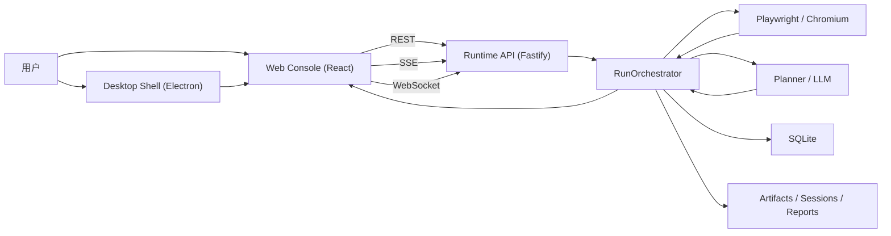
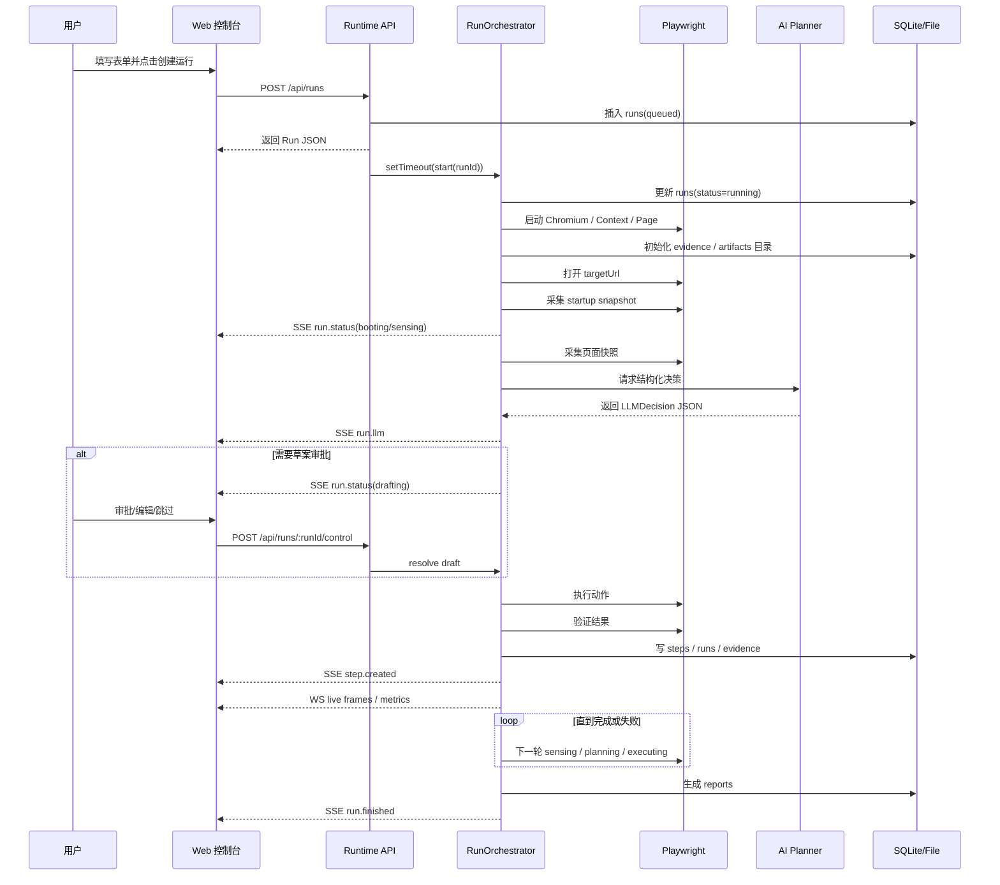

# QPilot Studio 底层架构详解（工程版主文档）

## 先看这里

这份文档现在定位为“工程版主文档”。

如果你是不同类型的读者，建议按下面顺序阅读：

- 如果你现在连“前端、后端、请求、响应、端口、数据库、DOM、OCR”这些词都不稳：
  先看 [FOUNDATIONS-101.zh-CN.md](./FOUNDATIONS-101.zh-CN.md)
  这份文档不是讲 QPilot Studio 细节，而是先补你学这个项目前必须知道的电脑与 Web 基础概念。
- 想从“只会一点 Python / 对工程几乎陌生”一路读到“自己能从 0 做一个同类系统”：
  先看 [FROM-0-TO-1.zh-CN.md](./FROM-0-TO-1.zh-CN.md)
  这份文档是新的零基础总入口，会同时讲当前仓库怎么工作，以及如果你自己从 0 开始该怎么逐步搭起来。
- 完全零基础：
  先看 [ARCHITECTURE-101.zh-CN.md](./ARCHITECTURE-101.zh-CN.md)
  这份文档会先解释“前端、后端、接口、长连接、桌面壳、浏览器代理”这些最基本概念，再讲 QPilot Studio。
- 想先看“一条 run 是怎么从点按钮跑到结束的”：
  先看 [RUN-LIFECYCLE-101.zh-CN.md](./RUN-LIFECYCLE-101.zh-CN.md)
  这份文档会按时间顺序讲清楚从 `RunCreatePage` 提交表单，到 runtime 开始执行，再到生成报告的全过程。
- 想直接理解系统分层、模块边界、数据流和架构设计：
  继续看当前这份主文档。

当前这套文档的分工如下：

- `FOUNDATIONS-101.zh-CN.md`
  面向“很多最基础术语都不熟”的读者，先补文件、进程、端口、接口、JSON、数据库、DOM、iframe、OCR 这些预备知识。
- `FROM-0-TO-1.zh-CN.md`
  面向“会一点 Python，但不懂前后端/自动化/工程化”的读者，按“当前仓库怎么做 + 你自己怎么从 0 开始做”两条线一起讲。
- `ARCHITECTURE-101.zh-CN.md`
  面向完全零基础读者，先扫盲，再建立系统全景。
- `RUN-LIFECYCLE-101.zh-CN.md`
  面向想抓住“过程”的读者，重点讲一次运行怎么开始、怎么推进、怎么结束。
- `ARCHITECTURE.zh-CN.md`
  面向想理解真实工程实现的读者，重点讲分层、模块职责、状态机、通信和架构约束。
- `DB-ORM-101.zh-CN.md`
  面向想专门搞懂 SQLite、Drizzle ORM、6 张核心表、迁移脚本和落库路径的读者。
- `PAGE-DETECTION-101.zh-CN.md`
  面向想专门搞懂页面元素采集、页面归类、清障、验证链和 OCR 兜底的读者。

---

## 7 个先记住的角色

如果你还没开始读正文，只先记住下面 7 个角色就够了：

- 用户
  真的点按钮、看界面、审批草案、接管浏览器的人。
- Desktop
  桌面壳，负责打开一个桌面窗口，把 Web 控制台装进去。
- Web
  控制台前端，负责展示状态、截图、步骤、证据和操作按钮。
- Runtime
  真正的调度中心，负责 run 生命周期、浏览器控制、AI 调用、数据落盘和实时推送。
- Browser
  被 Playwright 驱动的 Chromium 浏览器，真正去打开网页、点按钮、输入内容。
- AI Planner
  负责想“下一步该做什么”的模型规划层，只出计划，不直接操作页面。
- Database / Files
  数据库存结构化记录，文件目录存截图、录像、证据和报告。

## 1. 这份文档是干什么的

这份文档不是写给“已经看过完整代码的人”的速记提纲，而是写给第一次接触这个项目的人。

目标有三个：

1. 解释 QPilot Studio 现在真实的代码实现，而不是理想中的架构图。
2. 把“前端、后端、通信、浏览器自动化、数据库、实时画面、人工接管”这些概念用大白话讲清楚。
3. 让你在不熟悉 React、Fastify、Playwright、SQLite、SSE、WebSocket 的情况下，也能知道“用户点一个按钮后，系统内部到底发生了什么”。

本文所有描述都基于当前仓库真实代码整理，重点参考这些目录：

- `apps/desktop`
- `apps/web`
- `apps/runtime`
- `packages/shared`
- `packages/ai-gateway`
- `packages/prompt-packs`
- `packages/report-core`

---

## 2. 先用一句人话理解这个系统

如果只用一句话概括：

QPilot Studio 是一个“本地运行的浏览器测试代理平台”，它把 AI 规划、浏览器操作、实时监控、人类接管、证据留存和报告生成，全部放进一个桌面/网页控制台里。

你也可以把它想成下面这个组合体：

- `桌面壳`：像一个应用窗口，负责承载控制台。
- `Web 控制台`：像驾驶舱，给你看运行状态、截图、步骤、证据和按钮。
- `Runtime`：像调度中心，真正去启动浏览器、调用 AI、执行动作、写数据库、推送事件。
- `Playwright 浏览器代理`：像执行员，实际去点按钮、输入内容、跳转页面。
- `AI Planner`：像参谋，只负责“下一步建议做什么”，不直接操作页面。
- `Evidence + Report`：像记录员，把过程中的截图、网络请求、控制台日志、报告都存下来。

所以它不是单纯的“写一个 Playwright 脚本跑起来”，也不是纯聊天式 Agent。它更像一个“带监控屏、带人机协同、带留痕”的测试执行平台。

---

## 3. 先搞懂项目里同时存在的 3 个程序

很多人第一次看这个仓库容易乱，是因为它不是“一个前端项目”或者“一个后端项目”，而是 3 个主要程序一起工作。

### 3.1 `apps/desktop`：桌面壳

这个目录是 Electron 应用。

它做的事很少：

- 创建一个桌面窗口 `BrowserWindow`
- 检查本地 runtime 是否存活
- 如果 runtime 没起来，就显示一个等待页面
- 如果 runtime 好了，就打开 Web 控制台地址

它不负责：

- 存数据库
- 控制 run 状态机
- 调用 AI
- 操作浏览器页面

所以 Desktop 更像“外壳”和“宿主”，不是业务核心。

关键文件：

- `apps/desktop/src/main.cjs`
- `apps/desktop/src/preload.cjs`

### 3.2 `apps/web`：控制台前端

这个目录是 React + Vite 前端。

它负责：

- 项目管理界面
- 运行列表界面
- 新建运行表单
- 运行详情大屏
- 报告查看入口
- 实时状态展示
- 审批草案、暂停/继续、人工接管这些按钮

它不直接控制浏览器页面。它只能“向 runtime 发请求”或者“接收 runtime 推送过来的事件和画面”。

关键文件：

- `apps/web/src/main.tsx`
- `apps/web/src/App.tsx`
- `apps/web/src/pages/RunCreatePage.tsx`
- `apps/web/src/pages/RunDetailPage.tsx`
- `apps/web/src/lib/api.ts`
- `apps/web/src/store/run-stream.ts`

### 3.3 `apps/runtime`：真正的业务核心

这个目录是整个系统的大脑。

它负责：

- 启动 HTTP 服务
- 注册 API 路由
- 连接数据库
- 启动浏览器
- 打开目标页面
- 采集截图和页面元素
- 调用 LLM 做规划
- 执行动作
- 验证动作结果
- 保存步骤和证据
- 推送实时状态和实时画面
- 生成人工审批草案
- 进入人工接管流程
- 生成 HTML / Excel 报告

你真正要理解系统架构，最重要的就是读懂 `apps/runtime`。

关键文件：

- `apps/runtime/src/server.ts`
- `apps/runtime/src/orchestrator/run-orchestrator.ts`
- `apps/runtime/src/server/routes/*.ts`
- `apps/runtime/src/playwright/*`
- `apps/runtime/src/llm/*`
- `apps/runtime/src/db/*`

---

## 4. 先扫盲：这份文档里最重要的术语

如果你是完全小白，这一节很重要。

### 4.1 Monorepo

Monorepo 的意思是：把多个项目放在同一个仓库里统一管理。

这个仓库里就同时放了：

- Desktop
- Web
- Runtime
- Shared packages

所以你看到的是一个“多应用 + 多包”的工程，而不是单应用仓库。

### 4.2 Electron

Electron 可以理解为：

“把网页装进桌面窗口里运行”的技术。

所以 QPilot Studio 的桌面版，本质上仍然是在桌面窗口里展示 Web 控制台。

### 4.3 React

React 是前端 UI 框架，用来搭页面、处理状态、响应用户点击。

这里它负责渲染控制台界面。

### 4.4 Fastify

Fastify 是 Node.js 的后端 HTTP 框架。

你可以把它理解成：

“负责接收前端请求、返回 JSON 数据、暴露接口的服务器框架”。

### 4.5 Playwright

Playwright 是浏览器自动化库。

它能：

- 启动 Chromium
- 打开网页
- 点按钮
- 输入表单
- 读取页面文本
- 截图
- 监听网络请求

所以它是这个系统里“真正去操作浏览器”的那个人。

### 4.6 SQLite

SQLite 是一个本地数据库。

和 MySQL / PostgreSQL 不同，它不需要单独起数据库服务，数据直接放在一个本地文件里。

这里默认数据库文件是：

- `apps/runtime/data/qpilot.db`

### 4.7 Drizzle

Drizzle 是数据库访问层。

你可以把它理解成：

“让 TypeScript 代码更方便地读写 SQLite 表”的工具。

### 4.8 REST API

REST API 是最普通的“前端发请求、后端回响应”。

比如：

- 前端发 `POST /api/runs`
- 后端返回新建的 run JSON

它适合做一次性的查询和提交。

### 4.9 SSE

SSE 全称是 Server-Sent Events，服务端推送事件。

它适合这种场景：

- 前端连上后，保持一个长连接
- 后端一有新事件就往前端推
- 比如“现在进入 planning 阶段了”“新步骤创建了”“run 结束了”

SSE 的特点是：

- 单向：主要是服务端推给前端
- 文本事件流
- 很适合状态通知

### 4.10 WebSocket

WebSocket 是双向长连接。

这里它主要被用来传“实时画面帧”和“实时指标”。

为什么不用 SSE 传画面？

因为画面是高频、连续的数据流，WebSocket 更适合这种“直播式”传输。

### 4.11 BrowserContext

Playwright 里有一个概念叫 BrowserContext。

你可以把它理解成：

“浏览器里的一个独立用户空间”。

它包含：

- Cookie
- LocalStorage
- 登录态
- 页面集合

所以：

- `Browser` 是整个浏览器
- `BrowserContext` 是某个用户会话
- `Page` 是具体某个网页标签页

### 4.12 Artifact / Evidence

Artifact 就是产物。

Evidence 就是证据。

在这个项目里，证据包括：

- 截图
- 视频
- 控制台日志
- 网络请求
- Planner 输入输出

这些东西不是“可有可无”，它们是这个平台很重要的一部分，因为只有留证据，用户才能回看为什么成功或失败。

---

## 5. 产品定位与核心约束

从当前实现看，QPilot Studio 不是一个“无限并发的云端代理平台”，它有非常明确的现实约束。

### 5.1 本地优先

当前系统默认一切都在本机：

- 浏览器在本机启动
- 数据库在本机
- 截图和视频在本机
- 报告在本机
- 会话状态在本机

这带来的好处：

- 调试方便
- 延迟低
- 证据好找
- 本地页面和登录态更容易复现

这也带来限制：

- 不适合天然横向扩展
- 更偏单机工具，不是分布式集群

### 5.2 单活运行

当前 runtime 一次只允许一个 active run。

这不是猜测，而是架构上的硬约束：

- `RunOrchestrator` 内部只有一个 `activeRunId`
- 新建 run 时，路由会先检查 `orchestrator.isBusy()`
- 忙的时候直接返回冲突错误

这说明当前系统是“单工调度”，不是多 run 并发执行器。

### 5.3 AI 只负责规划，不直接接管浏览器

LLM 的角色是：

- 读取页面快照摘要
- 输出结构化 JSON 决策
- 告诉系统下一步建议做什么

真正执行动作的是 Playwright executor。

也就是说，这不是“AI 自己直接操作浏览器”的黑盒，而是：

- AI 出方案
- Runtime 做规则修正
- Executor 负责真正执行
- Verifier 负责结果检查

### 5.4 允许人类介入

系统不是死撑到底的纯自动化。

它在这些场景下会主动停下来等人：

- 遇到安全挑战页
- 多次无效尝试
- 打开了草案审批模式
- 用户主动暂停

这意味着它是“半自动代理系统”，不是“全自动无人系统”。

---

## 6. 仓库结构总览

```text
apps/
  desktop/   Electron 桌面壳
  web/       React 控制台
  runtime/   Fastify + Orchestrator + Playwright

packages/
  shared/        前后端共享 schema、类型、事件常量
  ai-gateway/    OpenAI 兼容接口客户端
  prompt-packs/  预置 prompt 种子包
  report-core/   HTML / Excel 报告生成
```

更细一点看：

| 目录 | 作用 | 你可以把它理解成 |
| --- | --- | --- |
| `apps/desktop` | 桌面窗口外壳 | 应用壳子 |
| `apps/web` | 控制台前端 | 驾驶舱 |
| `apps/runtime` | 核心后端 + 调度 + 浏览器执行 | 调度中心 |
| `packages/shared` | 共用协议模型 | 统一语言 |
| `packages/ai-gateway` | 对接 LLM | AI 通讯员 |
| `packages/prompt-packs` | 预置提示词模板 | AI 的任务说明书 |
| `packages/report-core` | 生成报告 | 报告工厂 |

---

## 7. 程序是怎么启动起来的

这一节很关键，因为很多架构理解问题，其实都来自“没搞明白谁先启动、谁依赖谁”。

### 7.1 根脚本

根目录 `package.json` 里有几个关键脚本：

- `pnpm dev:web`
- `pnpm dev:runtime`
- `pnpm dev:desktop`
- `pnpm dev`

其中：

- `pnpm dev` 会并行启动 web 和 runtime
- `pnpm dev:desktop` 会启动 runtime、web、desktop 三者

### 7.2 默认端口

从代码和环境配置看：

- Web 控制台默认在 `http://localhost:5173`
- Runtime 默认在 `http://localhost:8787`
- Desktop 会优先检查 `http://localhost:8787/health`

### 7.3 Desktop 启动时做了什么

`apps/desktop/src/main.cjs` 的逻辑很简单：

1. 创建 Electron 窗口
2. 请求 runtime 的 `/health`
3. 如果 runtime 不通
   - 加载一个内置 fallback HTML
   - 提示用户等待 runtime 启动
4. 如果 runtime 正常
   - 直接加载 web 地址

所以 Desktop 本质上依赖 Web 和 Runtime 都正常。

### 7.4 Runtime 启动时做了什么

`apps/runtime/src/server.ts` 会：

1. 读取环境变量
2. 解析数据库路径
3. 迁移数据库
4. 创建数据库连接
5. 创建这些核心对象
   - `SseHub`
   - `LiveStreamHub`
   - `EvidenceStore`
   - `RunOrchestrator`
6. 挂到 `app.appContext`
7. 注册 CORS、WebSocket、静态文件服务、路由

它还会提前创建几个目录：

- artifacts 目录
- reports 目录
- sessions 目录
- planner-cache 目录

### 7.5 Web 启动时做了什么

`apps/web/src/main.tsx` 会：

1. 创建 React 根节点
2. 注入 `I18nProvider`
3. 注入 `QueryClientProvider`
4. 注入 `BrowserRouter`
5. 渲染 `App`

所以前端的顶层依赖主要是：

- 国际化上下文
- React Query 数据上下文
- 路由上下文

---

## 8. 系统总览图



一句话解释这张图：

用户面对的是桌面壳和网页控制台，但真正干活的是 runtime；runtime 再去驱动浏览器、调用 AI、写数据库、存证据，然后把结果推回前端。

## 9. 通信架构详解：到底是谁和谁在说话

这是你特别提到想详细理解的部分，所以这一节我会说得非常细。

当前系统至少有 6 条主要通信链路。

### 9.1 链路一：Desktop -> Runtime Health

用途：

- 检查 runtime 是否活着

协议：

- 普通 HTTP GET

入口：

- `GET /health`

实现文件：

- `apps/desktop/src/main.cjs`
- `apps/runtime/src/server/routes/health.ts`

它的作用很单纯：

- Electron 启动后先问一句：“后端你在吗？”
- 在，就打开 web 控制台
- 不在，就显示等待页

### 9.2 链路二：Web -> Runtime REST API

用途：

- 查询数据
- 创建项目
- 创建 run
- 控制 run
- 读取步骤、证据、报告

协议：

- HTTP + JSON

前端封装位置：

- `apps/web/src/lib/api.ts`

后端路由位置：

- `apps/runtime/src/server/routes/projects.ts`
- `apps/runtime/src/server/routes/runs.ts`
- `apps/runtime/src/server/routes/runtime.ts`
- `apps/runtime/src/server/routes/reports.ts`

这条链路适合“点一次、回一次”的事情。

比如：

- 我想拿运行列表
- 我想新建一个项目
- 我想暂停一条 run
- 我想读取报告地址

### 9.3 链路三：Runtime -> Web 的 SSE 事件流

用途：

- 推送实时状态
- 推送阶段变化
- 推送最新 LLM 决策
- 推送新步骤
- 推送新测试用例
- 推送运行结束事件

协议：

- SSE（Server-Sent Events）

前端入口：

- `api.createRunStream(runId)`

后端入口：

- `GET /api/runs/:runId/stream`

Hub 实现：

- `apps/runtime/src/server/sse-hub.ts`

当前事件类型：

- `run.status`
- `run.llm`
- `step.created`
- `testcase.created`
- `run.finished`
- `run.error`

另外，`SseHub` 每 15 秒还会发一个 `ping` heartbeat，避免前端不知道连接是不是断了。

### 9.4 链路四：Runtime -> Web 的 WebSocket 实时画面

用途：

- 推送浏览器实时画面帧
- 推送 FPS、采集耗时、viewer 数这些指标

协议：

- WebSocket

前端入口：

- `api.createRunLiveSocket(runId)`
- `apps/web/src/components/LiveRunViewport.tsx`

后端入口：

- `GET /api/runs/:runId/live`（WebSocket）

Hub 实现：

- `apps/runtime/src/server/live-stream-hub.ts`

这里有一个很重要的设计点：

WebSocket 只负责“画面”和“画面指标”，不负责“业务状态真相”。

真正的业务状态真相仍然来自 SSE。

也就是说：

- “现在是 planning 还是 manual”主要信 SSE
- “现在屏幕上长什么样”主要信 WebSocket

这是一个很合理的职责拆分。

### 9.5 链路五：Runtime -> OpenAI Compatible API

用途：

- 让 planner 调用 LLM 生成结构化决策

协议：

- HTTP POST `/chat/completions`

客户端实现：

- `packages/ai-gateway/src/client.ts`

Planner 调用位置：

- `apps/runtime/src/llm/planner.ts`

这里的关键点是：

- runtime 不直接把“页面整页 HTML”喂给模型
- 它会先做页面快照压缩
- 再拼成 prompt
- 再要求模型只输出 JSON

### 9.6 链路六：Runtime -> Chromium / CDP

用途：

- 驱动浏览器
- 截图
- 执行动作
- 采集页面元素
- 通过 CDP 开启 screencast

协议：

- Playwright API
- CDP（Chrome DevTools Protocol）

当前 live stream 优先级是：

1. 优先用 CDP screencast
2. 如果 screencast 不可用，就 fallback 为周期性截图

所以前端看到的实时画面，本质上来自 runtime 对浏览器的持续采样。

---

## 10. 为什么系统同时用了 REST、SSE、WebSocket 三种通信方式

这是一个非常典型、也非常容易让新手困惑的问题。

简单理解：

### 10.1 REST 负责“查”和“改”

适合：

- 查列表
- 查详情
- 创建 run
- 暂停/继续/终止

因为这些动作是：

- 请求发起明确
- 有明确响应
- 不需要持续推送

### 10.2 SSE 负责“通知你发生了什么”

适合：

- phase 变化
- step 创建
- LLM 决策更新
- run 结束

因为这些是：

- 由后端主动发生
- 前端不想一直轮询
- 数据是文本事件，不是大体积二进制

### 10.3 WebSocket 负责“直播画面”

适合：

- 高频图片帧
- 直播指标

因为这类数据：

- 更新很频繁
- 不适合走普通轮询
- 也不太适合只用 SSE 传

所以你可以把它理解成：

- REST = 办业务
- SSE = 发消息
- WebSocket = 开直播

---

## 11. Shared 协议层：为什么前后端能对得上话

在多端系统里，最容易出问题的地方之一，就是前端和后端理解的对象不一致。

比如后端说：

- `status`
- `phase`
- `draft`

前端如果对这些字段的结构理解不一致，就会直接崩。

所以这个仓库专门有一层：

- `packages/shared/src/schemas.ts`

它的作用就是：

- 用 Zod 定义统一 schema
- 前后端共用同一套类型
- 把“协议”放在公共包里，而不是散落在各处

### 11.1 这层解决的是什么问题

它解决的是“系统里的共同语言”问题。

比如：

- 什么叫 `Run`
- 什么叫 `Step`
- 什么叫 `LLMDecision`
- 什么叫 `RuntimeEvent`
- 什么叫 `LiveStreamMessage`

这些不是口头约定，而是明确写成 schema。

### 11.2 关键模型

#### `RunConfig`

代表一次运行的配置输入。

主要字段：

- `targetUrl`
- `mode`
- `language`
- `executionMode`
- `confirmDraft`
- `goal`
- `maxSteps`
- `headed`
- `manualTakeover`
- `sessionProfile`
- `saveSession`
- `replayCase`
- `username`
- `password`

你可以把它理解成：

“用户点开始运行之前，系统拿到的那份操作说明书”。

#### `Run`

代表一条运行记录。

它比 `RunConfig` 多了很多运行后的信息，例如：

- 当前状态
- 当前页面 URL / 标题
- 步骤数量
- 启动截图
- 是否遇到 challenge
- 最后一次 LLM 决策
- 错误信息
- 开始/结束时间
- 报错建议

你可以把它理解成：

“数据库里那一条 run 的主记录”。

#### `Step`

代表一次动作执行后的落盘结果。

里面会保存：

- 第几步
- 执行动作是什么
- 当时页面 URL / 标题
- DOM 摘要
- 截图路径
- 动作状态
- 观察总结
- 验证结果

你可以把它理解成：

“运行过程中的一帧关键里程碑”。

#### `LLMDecision`

这是 planner 输出的 JSON 决策。

结构包括：

- 当前目标
- 页面评估
- 计划说明
- actions 数组
- expected_checks
- test_case_candidate
- is_finished

关键点：

LLM 输出的不是自由文本建议，而是结构化对象。

#### `DraftActionState`

当系统进入“草案审批”模式时，会把下一步动作包成一个 draft。

它会告诉前端：

- 当前是第几步
- 建议动作是什么
- 预期检查项有哪些
- 为什么给出这一步
- 是否正在等待审批

#### `RuntimeEvent`

这是 SSE 的事件统一格式。

它包含：

- `event`
- `runId`
- `ts`
- `data`

#### `LiveStreamMessage`

这是 WebSocket 的消息统一格式。

它分两种：

- `run.frame`
- `run.metric`

也就是：

- 画面消息
- 指标消息

---

## 12. 前端架构详解

这一节专门讲你提到的“前端到底怎么工作”。

### 12.1 前端入口

前端入口是：

- `apps/web/src/main.tsx`

它做了三件最重要的事：

1. 注入国际化 `I18nProvider`
2. 注入 React Query `QueryClientProvider`
3. 注入 React Router `BrowserRouter`

这说明前端天然有三根主线：

- 文本和时间本地化
- 远程数据获取
- 页面路由切换

### 12.2 顶层页面结构

`apps/web/src/App.tsx` 定义了主路由：

- `/projects`
- `/runs`
- `/runs/new`
- `/runs/:runId`
- `/reports/:runId`

同时，顶栏里还有：

- 导航链接
- 语言切换
- Desktop 模式标记

这说明整个前端不是单页面黑盒，而是标准的多页面控制台。

### 12.3 国际化层

国际化由：

- `apps/web/src/i18n/I18nProvider.tsx`

负责。

它做的事包括：

- 读取本地存储中的语言偏好
- 默认跟随浏览器语言
- 暴露 `pick(en, zh)` 方法
- 暴露日期格式化和相对时间格式化

当前实现不是“完整词条表 + key 管理”的传统 i18n 方案，而是大量使用：

- `pick("English", "中文")`

这种“就地双语”的方式。

优点：

- 写起来快

缺点：

- 大型项目里容易分散
- 更难统一治理

### 12.4 React Query：前端的冷数据层

React Query 负责“请求式数据”。

所谓冷数据，意思是：

- 不需要每秒几十次变化
- 可以按需请求
- 可以缓存

这里主要包括：

- 项目列表
- run 列表
- run 详情
- step 列表
- test case 列表
- evidence
- traffic
- cases
- active run 轮询

这些都通过 `apps/web/src/lib/api.ts` 封装。

### 12.5 Zustand：前端的热状态层

`apps/web/src/store/run-stream.ts` 用 Zustand 存实时运行态。

所谓热状态，意思是：

- 变化很频繁
- 需要快速合并
- 主要来自 SSE 实时事件

它保存的东西包括：

- 当前 run
- run 状态
- SSE 连接状态
- 最新 LLM 决策
- 当前 live phase
- 当前 action
- 当前 verification
- 当前 draft
- steps
- testCases

这个 store 的作用很关键：

它相当于把“后端不断推过来的运行状态”接住，然后供多个组件统一消费。

### 12.6 `ProjectsPage`：项目页

项目页做两件事：

1. 创建项目
2. 查看最近项目和最近运行

这里创建项目时会提交：

- `name`
- `baseUrl`
- `username`
- `password`

用户名和密码会在后端加密后写入数据库。

### 12.7 `RunsPage`：运行列表页

运行列表页主要是：

- 按项目筛选
- 按关键字搜索
- 每 2 秒轮询运行列表
- 展示每条 run 的目标、当前页、状态

这页偏“历史视图”和“总览视图”。

### 12.8 `RunCreatePage`：新建运行页

这一页很重要，因为它决定了前端是怎么把用户意图变成 `RunConfig` 的。

用户在这里可以设置：

- 选择项目
- 目标 URL
- 用户名 / 密码
- 模式 `general/login/admin`
- 运行语言
- goal
- maxSteps
- executionMode
- confirmDraft
- headed
- manualTakeover
- sessionProfile
- saveSession

它还会定期轮询 `/api/runtime/active-run`，因为当前系统是单活运行：

- 如果 runtime 已经在跑别的 run
- 前端会阻止你再开一条
- 并提示你打开当前 run 或终止它

### 12.9 `RunDetailPage`：超级控制台页面

`RunDetailPage.tsx` 是当前前端里最重的一个页面。

它承担了非常多的职责：

- 初始拉取 run、steps、testcases
- 连接 SSE
- 接收 run.status / run.llm / step.created / run.finished
- 接收 active-run 的补充控制态
- 管理草案编辑
- 展示当前动作和验证
- 管理步骤筛选
- 查询步骤级 traffic
- 查询全局 traffic
- 查询模板 case
- 处理模板修复草案
- 驱动 LiveRunViewport
- 驱动证据面板

它已经不是一个单纯“详情页”了，而是“实时监控台 + 审批台 + 修复台 + 证据台”的合集。

### 12.10 `RunDetailPage` 的初始化顺序

这个页面的启动顺序非常值得理解：

1. 页面拿到 `runId`
2. 先并发请求：
   - `api.getRun(runId)`
   - `api.getRunSteps(runId)`
   - `api.getRunTestCases(runId)`
   - `api.getActiveRun()`
3. 用这些初始数据灌进 Zustand store
4. 如果 run 已结束
   - 就不再连 SSE
5. 如果 run 还在跑
   - 创建 EventSource
   - 开始接收实时事件

也就是说：

前端不是一打开页面就盲连流，而是先做一次全量补数，再切到增量事件模式。

这个设计是对的，因为这样能避免：

- 页面刚打开时状态空白
- 只靠实时事件导致历史步骤缺失

### 12.11 `LiveRunViewport`：实时画面组件

`apps/web/src/components/LiveRunViewport.tsx` 的职责很明确：

- 打开 WebSocket
- 接收 `run.frame`
- 把 base64 JPEG 画到 `canvas`
- 接收 `run.metric`
- 显示 fps / captureMs / viewerCount / transport
- 如果暂时没有直播帧，就回退到最后一张截图

这说明前端不是简单 `` 轮询刷新，而是真正维护一条实时画面通道。

### 12.12 `RunEvidencePanel`：证据面板

证据面板会轮询：

- `api.getRunEvidence(runId)`

然后展示四类信息：

- Console
- Network
- DOM
- Planner

这个组件的意义很大，因为它把“可观察性”真正暴露给了用户。

很多自动化系统失败时你只会看到“失败了”，但这里你还能看到：

- 页面控制台报错
- 网络请求情况
- 当时的 DOM 摘要
- Planner 的输入输出

---

## 13. 桌面壳架构详解

虽然 `apps/desktop` 很轻，但它在用户体验上依然有独特作用。

### 13.1 它解决了什么问题

它解决的是“让本地工具看起来像一个桌面应用”的问题。

如果没有它，这个系统也能跑，只是用户要自己分别打开：

- 一个浏览器 tab 访问 web 控制台
- 一个本地服务作为 runtime

Electron 的好处是：

- 打包成桌面应用更自然
- 可以有统一窗口和桌面体验
- 更适合后续做桌面级能力扩展

### 13.2 它现在没做什么

当前 Desktop 很刻意地没有承担业务逻辑。

它不负责：

- run 管理
- 数据同步
- 实时事件汇总
- 浏览器控制

这其实是好事。

因为如果桌面壳也承担大量业务逻辑，整个系统会更难维护。

## 14. Runtime 服务层详解

这一节专门讲后端 HTTP 服务本身。

### 14.1 `server.ts` 的角色

`apps/runtime/src/server.ts` 不是业务流程本身，而是“组装器”。

它负责把这些零件拼起来：

- Fastify app
- DB
- Orchestrator
- EvidenceStore
- SseHub
- LiveStreamHub
- 各类 routes

你可以把它理解成：

“系统装配车间”。

### 14.2 `app.appContext`

当前 runtime 会把很多核心对象挂到 `app.appContext` 上：

- `db`
- `orchestrator`
- `evidenceStore`
- `sseHub`
- `liveStreamHub`
- `runtimeBaseUrl`

这样每个 route 都能统一访问核心依赖。

### 14.3 路由分类

当前路由按职责大致分成：

- `health.ts`
- `projects.ts`
- `runtime.ts`
- `runs.ts`
- `reports.ts`
- `live.ts`

其中：

- `projects.ts` 管项目和凭据
- `runtime.ts` 管当前 active run 视图
- `runs.ts` 是最大的一组，管理 run 的创建、控制、步骤、证据、模板
- `live.ts` 只处理 WebSocket live

### 14.4 为什么 `runs.ts` 很大

因为现在很多业务都以 run 为中心：

- 创建 run
- 控制 run
- 查 run 详情
- 查 steps
- 查 evidence
- 查 traffic
- 查 cases
- 打开 stream
- replay case
- repair draft

这使得 `runs.ts` 成了一个很重的聚合路由文件。

---

## 15. Runtime API 详细分类

为了让你看清“前端点一个按钮时到底调的是哪个接口”，这里按用途分类列出来。

### 15.1 项目相关

- `GET /api/projects`
- `POST /api/projects`
- `PATCH /api/projects/:projectId/credentials`

### 15.2 运行总览相关

- `GET /api/runs`
- `POST /api/runs`
- `GET /api/runs/:runId`

### 15.3 运行控制相关

- `POST /api/runs/:runId/control`
- `POST /api/runs/:runId/resume`
- `POST /api/runs/:runId/pause`
- `POST /api/runs/:runId/abort`
- `POST /api/runs/:runId/bring-to-front`
- `POST /api/runs/:runId/execution-mode`
- `POST /api/runs/:runId/draft/approve`
- `POST /api/runs/:runId/draft/skip`

### 15.4 运行过程数据相关

- `GET /api/runs/:runId/steps`
- `GET /api/runs/:runId/testcases`
- `GET /api/runs/:runId/evidence`
- `GET /api/runs/:runId/traffic`
- `GET /api/runs/:runId/steps/:stepRef/traffic`
- `GET /api/runs/:runId/cases`
- `GET /api/runs/:runId/report`

### 15.5 实时相关

- `GET /api/runtime/active-run`
- `GET /api/runs/:runId/stream`
- `WS /api/runs/:runId/live`

### 15.6 模板/案例相关

- `GET /api/cases`
- `POST /api/cases/extract`
- `POST /api/cases/:caseId/replay`
- `POST /api/cases/:caseId/repair-draft`
- `POST /api/cases/:caseId/apply-repair-draft`

---

## 16. 数据存储架构详解

这个系统不是只靠数据库，也不是只靠文件系统，而是“双存储架构”。

### 16.1 为什么要双存储

原因很简单：

- 结构化数据适合进数据库
- 大文件和证据适合进文件系统

如果把截图、视频、整段 planner trace 全塞数据库，会非常难管理。

如果只放文件，不放数据库，又很难查询和展示列表。

所以当前采用：

- SQLite 存结构化索引和主记录
- 文件系统存大体积证据和产物

### 16.2 数据库位置

默认数据库路径：

- `apps/runtime/data/qpilot.db`

由 `apps/runtime/src/config/env.ts` 和 `apps/runtime/src/db/client.ts` 负责解析。

### 16.3 数据库表一览

数据库 schema 定义在：

- `apps/runtime/src/db/schema.ts`

当前核心表如下。

#### `projects`

存项目信息：

- `id`
- `name`
- `base_url`
- 加密后的用户名/密码
- 创建更新时间

注意：

用户名和密码不会明文写入，而是用 AES-256-GCM 加密后存储。

加密逻辑在：

- `apps/runtime/src/security/credentials.ts`

#### `runs`

这是最核心的主表。

它记录：

- run 基本身份
- projectId
- status
- mode
- targetUrl
- goal
- model
- `configJson`
- 启动页面证据
- challenge 信息
- 视频路径
- 最后一次 LLM JSON
- 错误信息
- startedAt / endedAt / createdAt

你可以把这张表理解成：

“运行档案总表”。

#### `steps`

每一步动作都会写入这里。

它记录：

- 第几步
- 页面 URL / 标题
- DOM 摘要 JSON
- 截图路径
- 动作 JSON
- 动作状态
- 观察总结
- 验证结果 JSON

这张表是“过程回放”的核心。

#### `test_cases`

这里存从运行过程中提取出来的测试用例。

说明这个系统不只是“执行”，还会尝试把执行过程沉淀为测试资产。

#### `reports`

这里存报告的路径：

- HTML 路径
- Excel 路径

#### `case_templates`

这里存“从成功运行提炼出来的模板案例”。

这说明系统已经在往“模板复用”方向演进，而不是永远纯靠实时 LLM 规划。

### 16.4 文件系统中的数据

除了数据库，runtime 还维护这些目录。

#### `apps/runtime/data/artifacts`

用途：

- run 截图
- 录屏
- evidence.json

典型结构类似：

```text
apps/runtime/data/artifacts/runs/<runId>/
  step-0001.png
  step-0002.png
  manual-step-0005.png
  evidence.json
  video/
```

#### `apps/runtime/data/reports`

用途：

- HTML 报告
- XLSX 报告

#### `apps/runtime/data/sessions`

用途：

- 保存 Playwright storage state

典型路径模式：

- `apps/runtime/data/sessions/<projectId>/<profile>.json`

这就是“会话复用”的基础。

#### `apps/runtime/data/planner-cache`

用途：

- 缓存 planner 输出

作用：

- 相同上下文下减少重复调用模型
- 提高调试和回放的一致性

### 16.5 EvidenceStore 到底保存什么

`apps/runtime/src/server/evidence-store.ts` 会收集三大类证据：

- 浏览器 console
- network 请求
- planner trace

它通过 `attachPage(runId, page)` 挂到 Playwright `Page` 上，监听：

- `console`
- `pageerror`
- `request`
- `response`
- `requestfailed`

也就是说，只要页面还活着，EvidenceStore 就在持续记笔记。

### 16.6 为什么证据还有限额

当前实现里有一些上限：

- Console 最多 240 条
- Network 最多 320 条
- Planner trace 最多 48 条

这不是随便写的，而是一个很现实的控制手段：

- 避免内存和 evidence 文件无限增长

---

## 17. 安全与凭据设计

很多小白会忽略这一层，但它实际上很重要。

### 17.1 项目凭据怎么存

当前项目凭据不会明文存数据库。

后端会用：

- AES-256-GCM

进行加密，结果拆成：

- ciphertext
- iv
- tag

再分别存进 `projects` 表。

### 17.2 密钥从哪里来

环境变量要求：

- `CREDENTIAL_MASTER_KEY`

它必须是 64 位 hex 字符串。

如果这个环境变量没配好，runtime 启动时就会校验失败。

### 17.3 会话状态怎么复用

如果用户开启：

- `sessionProfile`
- `saveSession`

那么 runtime 会把浏览器会话保存成 storage state 文件。

下次运行同一个 profile 时，就可以直接加载：

- cookie
- localStorage
- 登录态

这对“登录后复测”特别重要。

---

## 18. 浏览器自动化层详解

这一层是整个系统最“像机器人”的地方。

### 18.1 这一层负责什么

浏览器自动化层的职责主要有四件事：

1. 看页面
2. 判断页面属于什么状态
3. 执行动作
4. 检查动作是否真的生效

### 18.2 页面快照是怎么采集的

页面快照由：

- `apps/runtime/src/playwright/collector/page-snapshot.ts`

负责。

它会做这些事：

1. 截图
2. 收集页面上的交互元素
3. 读取标题
4. 根据 URL + 标题 + 元素，归纳一个 `pageState`

最终返回：

- `url`
- `title`
- `screenshotPath`
- `elements`
- `pageState`

### 18.3 页面元素采集为什么不是“整页 DOM”

`interactive-elements.ts` 并不是把整页 HTML 原封不动塞给系统，而是做了“抽样压缩”。

它主要采集：

- 链接
- 按钮
- 输入框
- 选择框
- 带 role 的可交互节点
- 一些有结构意义的节点
- iframe
- modal / dialog 相关节点

还会给元素补很多辅助信息：

- 文本
- ariaLabel
- placeholder
- selector
- 上下文类型
- framePath
- frameUrl
- frameTitle
- 是否可见
- 是否可用

这说明系统不是纯看截图，也不是纯看 DOM，而是把页面转成“结构化元素摘要”。

### 18.4 为什么还要做 `pageState`

因为 AI 只看元素列表还不够，它还需要知道：

- 这是搜索结果页吗
- 这是登录方式选择页吗
- 这是登录表单吗
- 这是第三方授权页吗
- 这是安全挑战页吗
- 这是登录后仪表盘吗

这个工作由：

- `apps/runtime/src/playwright/collector/page-state.ts`

负责。

它会结合：

- URL host
- URL query
- 页面标题
- 元素文字
- iframe / modal / password field 信号

最终把页面归纳成：

- `generic`
- `modal_dialog`
- `login_chooser`
- `login_form`
- `provider_auth`
- `search_results`
- `security_challenge`
- `dashboard_like`

这个层非常重要，因为很多后续策略都是基于它判断的。

### 18.5 动作执行器支持哪些动作

当前 executor 支持 5 类动作：

- `click`
- `input`
- `select`
- `navigate`
- `wait`

执行入口在：

- `apps/runtime/src/playwright/executor/action-executor.ts`

### 18.6 一个 `click` 到底怎么执行

一个点击动作并不是“拿 selector 点一下”那么简单。

大致顺序是：

1. 先做 guard
   - 看有没有 challenge
   - 看是不是高风险动作
2. 尝试解析 target
   - DOM selector
   - 文本匹配
   - 通用 fallback
   - OCR / 视觉定位
3. 如有必要先 dismiss overlay
4. 执行 click
5. 如果是某些登录 provider 场景，再补自动 provider 选择
6. 返回执行结果、目标解析方式、视觉匹配信息等

这说明 executor 不是一个薄薄的 `page.click()` 封装，而是带了不少修正策略。

### 18.7 为什么会用 OCR / 视觉定位

因为有些页面：

- selector 不稳定
- DOM 很脏
- 按钮是图标
- 文本不容易直接取到

所以系统在某些失败场景下，会尝试视觉定位目标，再点击坐标。

这不是主路径，但它是一个重要的 fallback 手段。

### 18.8 验证层在干什么

验证入口在：

- `apps/runtime/src/playwright/verifier/basic-verifier.ts`

它不是只看“代码没报错”，而是会检查：

- URL 是否变化
- 预期文本是否命中
- 当前页面被归纳成什么 `pageState`
- 对于登录类目标，是否真的到了真实登录面，而不是中间页

对于登录类场景，它还会特别判断：

- 目标 host 是否命中
- 账号输入框是否出现
- 密码框是否出现
- 是否进入 provider auth

也就是说，验证层在努力减少“看起来成功，其实是假成功”的情况。

### 18.9 API 验证为什么也很重要

除了页面文本和 URL，系统还有一条交通警察式的验证线：

- `traffic-verifier.ts`

它会根据预期请求规则去看：

- 有没有命中特定 host/path/method/status 的网络请求

这对“页面看着变化不明显，但后台请求已经成功/失败”的场景很有帮助。

---

## 19. AI 规划层详解

这一层是“代理味”最重的部分，但也最容易被误解。

### 19.1 Planner 真正做的事

Planner 不直接操作浏览器。

它的职责只有一个：

基于当前页面快照，输出一份结构化下一步计划。

位置：

- `apps/runtime/src/llm/planner.ts`

### 19.2 Planner 输入是什么

Planner 输入不是整页源码，而是一个压缩包，里面包含：

- 目标 goal
- 当前是第几步
- targetUrl
- mode
- responseLanguage
- seedPrompt
- modePrompt
- lastObservation
- 页面 URL
- 页面标题
- pageState
- 最多前 60 个元素摘要

这非常重要。

因为这说明 AI 看到的是“摘要世界”，不是完整网页世界。

### 19.3 Planner 输出是什么

Planner 被要求只返回严格 JSON，包括：

- 当前目标
- 页面评估
- 计划说明
- actions 数组
- expected_checks
- test_case_candidate
- is_finished

这意味着后端后续可以安全地解析，而不是去猜自然语言。

### 19.4 为什么还要做 schema 校验和重试

模型经常可能输出：

- JSON 不规范
- 字段缺失
- 类型不对

所以 planner 会：

1. 第一次请求模型
2. 试着 parse
3. 如果失败
   - 再告诉模型“上次 schema 校验失败了，请修正”
4. 再 parse 一次
5. 还失败就抛错

这就是为什么它比“直接调一次模型”更稳一点。

### 19.5 为什么有 `seedPrompts`

`packages/prompt-packs/src/seed-prompts.ts` 当前有三套种子提示：

- `genericForm`
- `loginPage`
- `adminConsole`

对应 `RunConfig.mode`：

- `general`
- `login`
- `admin`

这相当于告诉 AI：

- 你现在是在做普通页面探索
- 还是做登录相关
- 还是做后台控制台检查

所以 mode 不是摆设，它会影响规划风格。

### 19.6 为什么还要 PlannerCache

PlannerCache 的意义是：

- 相同上下文不用每次都重新问模型
- 便于调试复现
- 降低成本

这对开发阶段尤其有价值。

### 19.7 决策不是拿来就执行，还要再修正

Planner 输出后，并不会立刻无脑执行。

中间还会经过几层修正：

- `decision-refiner.ts`
- `case-template-matcher.ts`
- `template-replay-policy.ts`

比如：

- goal 明确是 QQ 登录
- 页面上也出现了 QQ / 微信 provider 入口

那么 `decision-refiner.ts` 会把原来过于泛化的登录动作，补成更具体的 provider 路径。

所以系统是：

- 先让 AI 出主意
- 再让程序用规则把主意修得更像“工程化可执行版本”

---

## 20. Orchestrator：系统真正的大脑

这一节是整份文档的核心。

文件：

- `apps/runtime/src/orchestrator/run-orchestrator.ts`

### 20.1 为什么说它是系统大脑

因为它几乎协调了所有核心资源：

- run 生命周期
- 浏览器
- browser context
- page
- live stream
- evidence
- planner
- action executor
- verifier
- database
- reports
- manual takeover
- draft approval
- template replay

也就是说：

如果说 Fastify server 是“门面”，那 orchestrator 就是“真正的调度中心”。

### 20.2 它为什么是有状态的

这个类内部维护了很多内存态 Map：

- `activeRunId`
- `manualWaiters`
- `draftWaiters`
- `activeDrafts`
- `activePages`
- `activeBrowsers`
- `activeBrowserContexts`
- `activePageVideos`
- `activeSessionPersistence`
- `runControls`
- `runExecutionModes`
- `runSnapshots`
- `runResourceClosers`

这说明它不是“拿请求算一下就完事”的无状态服务，而是一个长生命周期对象。

为什么必须有状态？

因为浏览器运行本来就是有状态的：

- 当前页面对象要留着
- 暂停后还得继续
- 草案审批时要挂起等待
- 人工接管时浏览器不能关
- 当前 run 的 live meta 要持续更新

这些都天然要求内存态。

### 20.3 `activeRunId` 为什么重要

`activeRunId` 说明：

当前 orchestrator 默认只服务一条活跃 run。

所以单活约束不仅体现在路由，也体现在 orchestrator 的核心设计上。

### 20.4 `runControls` 里存的是什么

这里面保存：

- 是否请求暂停
- 是否已暂停
- 是否请求终止
- resume resolvers

它相当于 runtime 自己维护的一套“控制面板状态”。

### 20.5 `runSnapshots` 是干什么的

这里保存的是给前端展示的当前 live 控制态快照，例如：

- 当前 phase
- 当前 message
- stepIndex
- 是否 manualRequired
- 当前 executionMode
- 当前 draft
- lastEventAt

这也是 `/api/runtime/active-run` 能拿到控制态的基础。

---

## 21. 一条 run 的完整生命周期

这一节请你一定慢慢读，因为它就是“从点开始，到出报告”的完整时间线。

### 21.1 第一步：用户创建 run

在前端 `RunCreatePage` 点提交后：

1. 前端调用 `POST /api/runs`
2. 后端校验参数
3. 后端检查 runtime 是否忙
4. 不忙的话写入 `runs` 表
5. 初始状态是 `queued`
6. 然后用 `setTimeout(... orchestrator.start(runId))` 异步启动真正执行

这一步很重要：

HTTP 接口本身不会把整个 run 跑完才返回，它只是先把任务建起来，再异步开跑。

### 21.2 第二步：orchestrator.start(runId)

`start()` 会：

1. 检查当前是否已有 active run
2. 设置 `activeRunId`
3. 初始化这条 run 的控制状态
4. 调用 `execute(runId)`

如果中间抛错：

- 可能标记为 `failed`
- 如果是主动 abort，可能标记为 `stopped`

### 21.3 第三步：进入 `execute()`

`execute()` 的前几步通常是：

1. 读 run 上下文
2. parse `configJson`
3. 读取语言文本资源
4. 把 run 写成 `running`
5. 推送 `phase = booting`
6. 创建 artifact / report / video 目录
7. 初始化 evidence

到这里为止，浏览器还没真正开始做动作，但系统已经进入“运行中”。

### 21.4 第四步：启动浏览器与会话

runtime 接下来会：

1. 启动 Chromium
2. 创建 BrowserContext
3. 根据配置决定是否启用 headed
4. 配置视频录制
5. 如果有 session profile，就尝试加载 storage state
6. 打开目标页面

同时它还会把：

- Browser
- BrowserContext
- Page

保存进 orchestrator 的内存状态。

### 21.5 第五步：挂证据采集和 live stream

页面起来后，runtime 会：

- 用 `EvidenceStore.attachPage(runId, page)` 挂上证据采集
- 用 `LiveStreamHub.registerRun(runId, page)` 让直播系统知道这条 run 的 page 在哪里

从这一刻开始：

- console / network 等事件就能被收集
- 前端如果打开 live 视图，也能收到实时画面

### 21.6 第六步：采集 startup snapshot

runtime 会先截取一个启动快照，记录：

- 启动页面 URL
- 启动页面标题
- 启动截图
- 启动观察文字

这些信息会写回 `runs` 表，作为“运行刚开始时长什么样”的证据。

### 21.7 第七步：进入主循环

从这里开始，系统进入一个“感知 -> 规划 -> 执行 -> 验证 -> 持久化”的循环。

这个循环不是一句口号，而是真有对应阶段。

一个典型回合是这样：

1. `sensing`
   - 采集当前页面快照
2. `planning`
   - 调 planner 得到 `LLMDecision`
   - 记录 planner trace
   - 推送 `run.llm`
3. `drafting`（可选）
   - 如果当前模式需要草案审批，就停在这里等人
4. `executing`
   - 调 action executor
5. `verifying`
   - 调 verifier 检查动作结果
6. `persisting`
   - 写 step
   - 更新 run
   - 写 evidence
   - 推送 `step.created`

然后再决定：

- 继续下一步
- 认为已完成
- 进入 manual
- 失败停止

### 21.8 第八步：什么情况下会先进入 `drafting`

如果满足任一条件：

- `executionMode === stepwise_replan`
- `confirmDraft === true`

那么系统不会直接执行动作，而是：

1. 生成 `DraftActionState`
2. 推送 `phase = drafting`
3. 等前端或用户发控制命令

可能的控制命令有：

- `approve`
- `edit_and_run`
- `skip`
- `retry`

也就是说，草案审批模式本质上是“系统先写下一步，再让人拍板”。

### 21.9 第九步：什么情况下会进入 `manual`

常见有几类：

- 检测到验证码或安全挑战
- 多次无效尝试触发 stop-loss guard
- 某一步动作后需要人工继续

进入 `manual` 时，系统会：

1. 再截一张快照
2. 把当前原因写入 startup evidence / status
3. 推送 `phase = manual`
4. 设置 `manualRequired = true`
5. 挂起等待 `resume`

注意：

这不是死机。

这是“显式地停下来等人类处理页面”。

### 21.10 第十步：步骤如何持久化

每一步执行完成后，runtime 会把结果写成 `Step`，里面含：

- action
- before/after 的关键信息归纳结果
- screenshot
- verification
- observationSummary

然后还会：

- 更新 `runs` 表中的当前状态
- 写 evidence 文件
- 必要时提取 test case

### 21.11 第十一步：run 如何结束

结束时会根据情况把 run 标成：

- `passed`
- `failed`
- `stopped`

随后会：

1. 记录 `endedAt`
2. 写入视频路径
3. 生成报告
4. 推送 `run.finished`

报告生成走的是：

- `packages/report-core`

最终写出：

- HTML 文件
- XLSX 文件

并把路径写入 `reports` 表。

---

## 22. 运行时状态机：`status` 和 `phase` 到底有什么区别

很多人第一次看这套系统都会把这两个概念搞混。

### 22.1 `status` 是大状态

`status` 只有几种：

- `queued`
- `running`
- `passed`
- `failed`
- `stopped`

它描述的是：

“这条 run 在业务生命周期里处于什么阶段”

### 22.2 `phase` 是细状态

`phase` 更细，表示 run 在执行中的具体阶段：

- `queued`
- `booting`
- `sensing`
- `planning`
- `drafting`
- `executing`
- `verifying`
- `paused`
- `manual`
- `persisting`
- `reporting`
- `finished`

它描述的是：

“runtime 当前正在做哪种工作”

### 22.3 你可以这样理解二者关系

例如：

- 一条 run 的 `status` 可能一直是 `running`
- 但它的 `phase` 会不断变化：
  - `booting`
  - `sensing`
  - `planning`
  - `executing`
  - `verifying`
  - `persisting`

所以：

- `status` 像电影的大章节
- `phase` 像电影里的具体镜头

### 22.4 各 phase 的人话解释

| phase | 人话解释 |
| --- | --- |
| `booting` | 正在准备运行环境，启动浏览器 |
| `sensing` | 正在看当前页面长什么样 |
| `planning` | 正在让 AI 想下一步 |
| `drafting` | 下一步已经想好了，但在等人审批 |
| `executing` | 正在真正执行动作 |
| `verifying` | 正在检查动作是否有效 |
| `paused` | 用户主动暂停了 |
| `manual` | 需要用户自己处理浏览器页面 |
| `persisting` | 正在把结果写数据库和证据文件 |
| `reporting` | 正在生成 HTML / Excel 报告 |
| `finished` | 整条 run 已结束 |

### 22.5 为什么前端还要有 `connection`

除了 `status` 和 `phase`，前端还有一个概念：

- `connection`

这是 SSE / live stream 的连接状态，例如：

- `connecting`
- `live`
- `reconnecting`
- `closed`

它和 run phase 不是一回事。

例如：

- run 可能还在 `planning`
- 但 SSE 连接短暂断了，所以前端显示 `reconnecting`

如果把这两个东西混为一谈，用户就会觉得：

- “是不是 run 卡住了？”

实际上可能只是“前端正在重连事件流”。

---

## 23. 人机协同模式详解

这是 QPilot Studio 和普通自动化脚本很不一样的地方。

### 23.1 `executionMode`

当前有两种执行模式：

- `auto_batch`
- `stepwise_replan`

#### `auto_batch`

意思是：

- 系统倾向于自动连续执行
- 只在必要时停下来

#### `stepwise_replan`

意思是：

- 每一步都更像“先规划、再给人确认、再执行”
- 更保守
- 更适合高风险或不稳定页面

### 23.2 `confirmDraft`

这是另一个独立开关。

即使 executionMode 不是 `stepwise_replan`，如果：

- `confirmDraft = true`

系统依然会在执行前先产出 draft。

### 23.3 `manualTakeover`

这个开关决定：

当系统遇到 challenge 或高不确定情况时，是直接失败，还是切到人工接管。

如果开启它，系统会更偏向：

- 截图
- 进入 `manual`
- 等你处理页面后再继续

### 23.4 前端可以发哪些控制命令

前端通过 `POST /api/runs/:runId/control` 可以发这些命令：

- `approve`
- `edit_and_run`
- `skip`
- `retry`
- `switch_mode`
- `pause`
- `resume`
- `abort`

也就是说，前端不仅是展示层，也是运行时控制面板。

### 23.5 `pause`、`manual`、`drafting` 三者区别

这三个词看起来都像“停住了”，但本质完全不同。

#### `paused`

表示：

- 用户主动暂停了流程

恢复方式：

- `resume`

#### `manual`

表示：

- 系统认为需要你亲自处理浏览器页面

恢复方式：

- 你先在真实浏览器里处理完页面
- 再 `resume`

#### `drafting`

表示：

- 系统已经想好了下一步
- 但还没执行
- 在等你审批动作

恢复方式：

- `approve`
- `edit_and_run`
- `skip`
- `retry`

如果 UI 不把这三者讲清楚，用户就会很容易觉得“怎么又卡了”。

---

## 24. 实时画面系统详解

这个系统的“直播”能力是它比较有特色的一层。

### 24.1 后端怎么拿到实时画面

`LiveStreamHub` 会在 run 注册 page 之后，尝试做两件事：

1. 创建 CDP session
2. 调 `Page.startScreencast`

如果成功：

- 使用真正的 screencast 帧

如果失败：

- 开启 fallback 定时截图循环

当前 fallback 间隔大约是：

- 900ms

### 24.2 后端推送的不是只有图像

后端会发两类 WebSocket 消息：

#### `run.frame`

内容包括：

- JPEG base64
- frameSeq
- transport 类型
- 宽高
- 当前 phase
- stepIndex
- pageUrl
- pageTitle
- message

#### `run.metric`

内容包括：

- fps
- captureMs
- viewerCount
- transport
- 宽高
- phase
- stepIndex
- pageUrl
- pageTitle

这说明 live stream 不只是“有图”，还把很多运行上下文一起带给了前端。

### 24.3 前端怎么显示实时画面

前端 `LiveRunViewport` 的逻辑是：

1. 打开 WebSocket
2. 收到 `run.frame`
3. 解析成 `Image`
4. 画到 `canvas`
5. 收到 `run.metric`
6. 更新右上角状态标签

如果当前还没有收到 live frame：

- 就显示最后一张 fallback screenshot

所以用户即使暂时没有直播帧，也不会完全黑屏。

---

## 25. 证据系统详解

一个只会“跑”的系统不算完整，一个能“解释自己怎么跑”的系统才更实用。

### 25.1 控制台证据

EvidenceStore 会捕获浏览器 console：

- `log`
- `info`
- `warning`
- `error`
- `debug`
- `pageerror`

前端证据面板可以直接看到这些消息。

### 25.2 网络证据

EvidenceStore 会记录：

- 请求方法
- URL
- host / pathname
- resourceType
- status
- ok
- contentType
- bodyPreview
- failureText

而且它还会给网络请求关联上：

- 当前 stepIndex

这点非常有价值，因为你可以从“步骤”反推当时具体打了哪些请求。

### 25.3 Planner 证据

每次 planner 调用都会记：

- prompt
- rawResponse
- decision
- cacheHit
- cacheKey

这让你能事后回答这些问题：

- 模型当时看到什么
- 模型原始返回了什么
- 是命中缓存还是新调用

### 25.4 DOM 证据

每个 Step 里还会存 `domSummary`。

这不是完整 HTML，但已经足够用于：

- 回看那一步时页面上的关键元素
- 判断为什么定位失败
- 判断是不是 modal / iframe / provider surface

---

## 26. 报告系统详解

系统结束后，会调用：

- `packages/report-core`

生成两种报告：

- HTML 报告
- Excel 报告

### 26.1 HTML 报告里有什么

从 `report-core/src/html.ts` 看，HTML 报告会包含：

- 项目名
- run ID
- 状态
- goal
- 开始/结束时间
- 录像路径
- challenge 信息
- 运行时间线
- 每一步动作表格
- 每条测试用例表格

它更像是“可读性强”的人工回顾报告。

### 26.2 Excel 报告里有什么

从 `report-core/src/xlsx.ts` 看，Excel 会生成几个工作表：

- `RunSummary`
- `Steps`
- `TestCases`

它更适合：

- 导出留档
- 给测试或管理人员做结构化整理

---

## 27. Template / Case 系统详解

当前系统已经不仅仅想做“每次都现想现做”，而是在往“复用成功经验”方向演进。

### 27.1 什么是 Case Template

Case Template 可以理解成：

“从过去成功运行里提炼出来的一套可回放步骤模板”。

当前模板类型包括：

- `ui`
- `api`
- `hybrid`

### 27.2 它解决什么问题

纯 LLM 实时规划有两个天然问题：

- 成本更高
- 稳定性不如复用已知成功路径

所以当系统已经有成功经验时，更合理的做法是：

- 先尝试复用模板
- 模板不行再回退到实时规划

### 27.3 当前相关模块

- `cases/replay-case.ts`
- `cases/template-repair-draft.ts`
- `orchestrator/case-template-matcher.ts`
- `orchestrator/template-replay-policy.ts`

### 27.4 运行中的几种情况

#### 情况 A：没有命中模板

走普通 planner 流程。

#### 情况 B：命中模板且匹配稳定

直接 replay 模板步骤。

#### 情况 C：命中模板但页面漂移

系统会：

- 标记 drift
- 生成 repair candidate
- 前端可以预览 repair draft
- 用户可以决定是否应用修复

这其实是一条非常清晰的产品演进路线：

从“AI 即时决策”慢慢走向“模板化、资产化、可维护化”。

---

## 28. 为什么当前系统会让人觉得“定位不够准”

这部分保留原文的核心判断，但这里我会讲得更像一层层剥开。

### 28.1 AI 看到的是压缩信息，不是完整网页

Planner 最终看到的通常只是：

- 当前 URL / title
- 当前 pageState
- 最多 60 个元素摘要
- 上一步 observation

它看不到：

- 全量 DOM 树
- 真正的视觉层级
- 完整事件绑定
- 完整页面语义

所以它本质上是在“压缩感知”上做规划。

### 28.2 页面元素不是稳定 ID，而常常是字符串提示

当前动作目标核心仍然是：

- `type`
- `target`
- `note`

这里的 `target` 很多时候仍然是：

- selector
- 一段文字
- 一个模糊描述

这意味着它不是“真正的语义节点 ID 系统”。

结果就是：

- 多个相似按钮容易混淆
- 搜索结果页容易点错
- 弹窗和 iframe 容易漂
- 页面一变，旧 target 就失效

### 28.3 复杂页面本来就天然高歧义

例如：

- 搜索结果页
- 登录页
- provider chooser
- 带 iframe 的授权页
- 带 modal 的网站
- 安全挑战页

这些页面的问题是：

- 同类按钮很多
- surface 多层嵌套
- 异步变化频繁
- 安全控件插入页面

这不是这个项目独有的问题，而是这类代理系统最难的部分。

### 28.4 模板既是加速器，也是漂移放大器

模板命中时当然更快、更稳。

但如果页面小改版：

- 旧模板就可能“看起来像对的，实际上已经偏了”

所以模板系统需要 repair 机制，这也是当前架构里已经在做的事情。

---

## 29. 为什么当前交互会让人感觉别扭

这一部分同样保留原分析，但改成更适合小白理解的方式。

### 29.1 一个页面承载了太多模式

`RunDetailPage` 现在同时是：

- 直播页
- 步骤页
- 审批页
- 人工接管页
- 模板修复页
- 证据页

这就像把：

- 监控室
- 审批台
- 调试器
- 录像回放

全塞在同一个房间里。

技术上可行，但认知负担很大。

### 29.2 连接状态和业务状态容易被混淆

前端同时展示：

- `status`
- `phase`
- `connection`

而普通用户很容易把：

- `reconnecting`

理解成：

- run 卡死了
- 浏览器挂了
- AI 不动了

但其实那只是 SSE 或 WebSocket 在重连。

### 29.3 阻塞态没有被做成三种明显工作模式

当前至少有三类“系统不往下走”的情况：

- `paused`
- `manual`
- `drafting`

它们背后的真实含义完全不同，但 UI 上容易看起来都像“停住了”。

所以从交互设计角度看，最需要做的是：

- 清楚告诉用户现在为什么停
- 系统在等谁
- 下一步该点什么

---

## 30. 为什么会出现“步骤 5 卡住像死掉”

如果你在实际使用中遇到“某一步一直不动”，通常不是随机故障，而是进入了下面几种架构上的等待点。

### 30.1 进入 `drafting`

当：

- `stepwise_replan`
- 或 `confirmDraft = true`

时，系统会在执行前等审批。

如果前端没有把审批按钮做得足够显眼，用户就会觉得：

- “怎么不动了？”

但其实系统正在等：

- `approve`
- `edit_and_run`
- `skip`
- `retry`

### 30.2 进入 `manual`

当系统遇到：

- challenge
- 登录拦截
- 连续无效尝试

又开启了 `manualTakeover`

它就会显式停在 `manual`，等用户在真实浏览器里操作之后再继续。

### 30.3 前端连接状态误导

还有一种情况是：

- run 没停
- 但 SSE 或 WebSocket 正在重连

这也会让人误以为“后端卡死了”。

所以要判断是不是“真卡住”，一定要分清：

- 是 `phase` 停了
- 还是 `connection` 在重连

---

## 31. 当前实现已经具备的优点

虽然前面说了很多问题，但这套架构并不是一团乱麻，它其实已经有不少成型优点。

### 31.1 协议层是统一的

前后端共用 `packages/shared`，这一点非常好。

### 31.2 Runtime 的角色边界总体清楚

真正的核心逻辑主要收敛在 runtime，而不是散在 desktop 和 web 各处。

### 31.3 证据体系比较完整

有：

- 截图
- 视频
- console
- network
- planner trace
- 报告

这让问题复盘能力比很多自动化工具都强。

### 31.4 人机协同不是临时补丁，而是架构内建能力

manual、pause、drafting 这些概念都不是“后加一个按钮”，而是进了 orchestrator 和协议层。

### 31.5 实时画面和状态流分离

用 SSE 管状态、用 WebSocket 管画面，这个设计方向是对的。

### 31.6 模板化方向明确

已经有：

- 提取 case
- replay case
- repair draft

这说明系统不是停在“每次都靠 LLM 即兴发挥”的阶段。

---

## 32. 当前架构债务与风险

这部分是站在“继续做大这个项目”的角度来看的。

### 32.1 前端超级页面过重

`RunDetailPage` 职责太多，后续维护成本会越来越高。

### 32.2 单活限制会阻碍扩展

单机单活对早期产品很合理，但如果以后想：

- 并行跑多条任务
- 多窗口同时看
- 多项目连续执行

就必须把 orchestrator 从单活升级为多 run 调度。

### 32.3 动作目标仍然偏字符串

这会长期限制定位稳定性。

后续更理想的方向应该是更强的“语义定位对象”，例如同时携带：

- selector
- text
- frame
- context
- 候选置信度

### 32.4 i18n 仍然是分散式写法

当前 `pick(en, zh)` 很方便，但项目继续变大后会越来越难治理。

### 32.5 源码目录里同时存在 `.ts/.tsx` 和同名 `.js`

从当前仓库可见，`apps/web/src` 里同时存在：

- `.tsx`
- 同名 `.js`

这意味着构建产物和源码文件混在了一起。

从工程治理角度看，这很危险，因为它会导致：

- 模块解析歧义
- “我明明改了 TS，为啥页面像在跑旧 JS”
- 问题更难排查

这不是架构主流程本身的问题，但确实会影响你对系统行为的理解和调试体验。

---

## 33. 如果以后继续演进，我建议的方向

如果把这套系统继续做稳，我建议大方向是下面几条。

### 33.1 把运行时职责进一步拆层

长期看，理想状态应该更像：

- Sensor
- Planner
- Critic
- Executor
- Verifier
- Human Review Router
- Persistence

而不是让一个大 orchestrator 文件不断吞策略复杂度。

### 33.2 把前端拆成多个明显工作台

至少可以朝这些子页面拆：

- Live Monitor
- Human Review Panel
- Evidence Explorer
- Template Repair Panel

### 33.3 让动作目标更语义化

这是提升“定位准确度”的核心工程手段之一。

### 33.4 把模板修复能力继续做强

这会让系统从“代理”慢慢进化成“带知识沉淀的代理平台”。

---

## 34. 一张完整时序图：用户点击“新建运行”之后发生了什么



---

## 35. 最后的总结

如果你只记住 10 句话，我希望是这 10 句：

1. 这个仓库不是一个项目，而是 Desktop、Web、Runtime 三个主要程序组成的 monorepo。
2. Desktop 只是壳，真正干活的是 runtime。
3. Web 控制台也不直接操作浏览器，它只是和 runtime 通信。
4. Runtime 通过 Fastify 暴露 API，通过 Playwright 驱动 Chromium，通过 LLM 做结构化规划。
5. 前端不是只靠 REST，它同时用了 REST、SSE、WebSocket 三条通信链路。
6. REST 负责查改，SSE 负责状态事件，WebSocket 负责实时画面。
7. `packages/shared` 是整个系统的协议层，没有它前后端很容易说不明白同一件事。
8. `RunOrchestrator` 是系统真正的大脑，它是有状态、长生命周期、单活的。
9. 一条 run 的核心循环是：感知 -> 规划 -> 审批（可选）-> 执行 -> 验证 -> 持久化。
10. 这套系统最难的地方不在“调一个模型”或者“点一个按钮”，而在于把浏览器、AI、实时可视化、人类接管、证据和模板沉淀真正串成一个可靠流程。

---

## 36. 我建议你接下来怎么读代码

如果你已经看完这篇文档，下一步最推荐的代码阅读顺序是：

1. `apps/web/src/lib/api.ts`
   - 先知道前端会请求哪些接口
2. `apps/runtime/src/server.ts`
   - 再知道 runtime 是怎么装起来的
3. `apps/runtime/src/server/routes/runs.ts`
   - 看 run 相关入口
4. `apps/runtime/src/orchestrator/run-orchestrator.ts`
   - 看真正调度逻辑
5. `apps/runtime/src/playwright/*`
   - 看浏览器怎么采集、执行、验证
6. `apps/runtime/src/llm/planner.ts`
   - 看 AI 只负责哪一段
7. `packages/shared/src/schemas.ts`
   - 回头对照共享模型

如果你愿意，我下一步还能继续给你补三份更细的文档：

- 《Run 状态机逐行讲解》
- 《前端控制台通信链路逐页讲解》
- 《RunOrchestrator 执行主循环源码导读》
