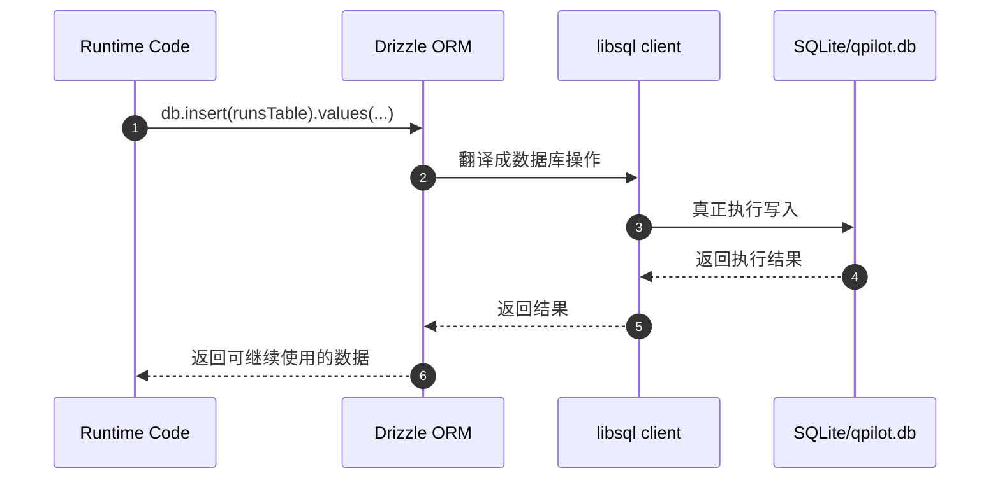
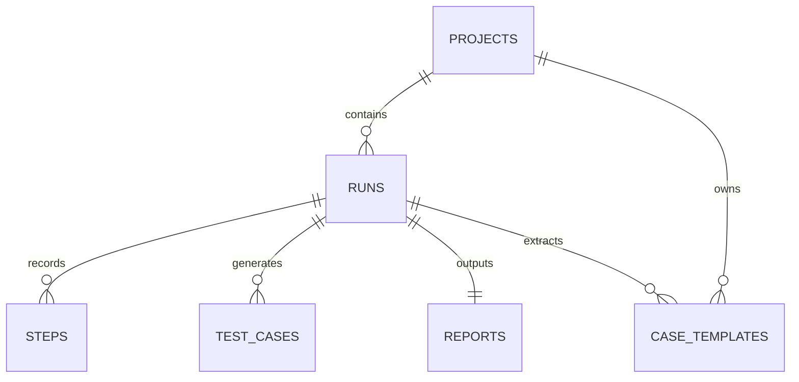
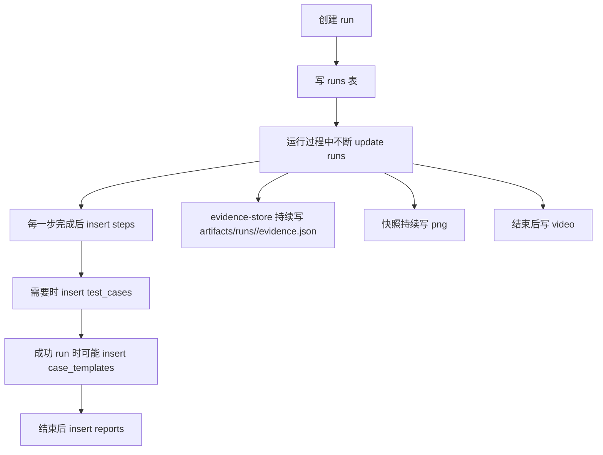

# QPilot Studio 数据库与 ORM 详解（DB / ORM 101）

如果你连“数据库、表、行、字段、主键、外键、JSON”这些词都还不稳，请先看 [FOUNDATIONS-101.zh-CN.md](./FOUNDATIONS-101.zh-CN.md)。  
那份文档会先把这些更基础的概念讲明白。

如果你想先看一份覆盖项目全局、运行链路、OCR、页面检测、ORM 的总手册，请先看 [FROM-0-TO-1.zh-CN.md](./FROM-0-TO-1.zh-CN.md)。  
当前这份文档保留为数据库与 ORM 专题，适合在总手册之后继续深挖存储层。

## 这份文档适合谁

这份文档写给下面这类读者：

- 你已经知道这个项目有前端、runtime、浏览器执行链
- 但你还不清楚“数据到底存哪”“ORM 到底是什么”“一条 run 是怎么写进数据库的”
- 你希望把 `schema.ts / client.ts / migrate.ts / qpilot.db / Drizzle ORM` 这几样东西一次看明白

如果你还没看过总扫盲文档，建议先看 [ARCHITECTURE-101.zh-CN.md](./ARCHITECTURE-101.zh-CN.md)。  
如果你想先看运行过程，再回来看存储层，建议先看 [RUN-LIFECYCLE-101.zh-CN.md](./RUN-LIFECYCLE-101.zh-CN.md)。

## 先记住 10 个词

### 数据库

数据库就是“真正存数据的地方”。

在这个项目里，默认是：

- `SQLite`

### 数据库文件

数据库文件就是 SQLite 真正落在磁盘上的那个文件。

这个项目默认是：

- `apps/runtime/data/qpilot.db`

### 表

表就是数据库里的一张“结构化表格”。

例如：

- `projects`
- `runs`
- `steps`

### 行

行就是表里的一条记录。

例如：

- `runs` 表里的一行 = 一次 run
- `steps` 表里的一行 = 一次 step

### 列

列就是每条记录固定拥有的字段。

例如 `runs` 表里有：

- `status`
- `target_url`
- `goal`

### 主键

主键可以理解成“这一行自己的身份证号”。

例如：

- `projects.id`
- `runs.id`
- `steps.id`

### 外键

外键可以理解成“这条记录指向谁”。

例如：

- `runs.projectId` 指向 `projects.id`
- `steps.runId` 指向 `runs.id`

### ORM

`ORM` 全称是 `Object-Relational Mapping`，中文通常叫“对象关系映射”。

你先记一句人话：

ORM 是“代码和数据库之间的翻译层”。

### 迁移

迁移就是“让数据库结构变成程序想要的样子”的过程。

最像：

- 程序升级了
- 数据库也要补列、建表、更新结构

### Drizzle ORM

这是这个项目里使用的 ORM 工具。

你会经常看到这种写法：

- `db.insert(runsTable).values(...)`
- `db.select().from(runsTable)...`
- `db.update(runsTable).set(...)`

这些都是 Drizzle ORM 在工作。

## 一句话先讲清楚这条链

这个项目的数据层，不是只有一个“数据库”概念，而是 5 层一起配合：

1. `SQLite`
   真正存数据
2. `qpilot.db`
   SQLite 落盘后的文件
3. `@libsql/client`
   负责连上数据库
4. `Drizzle ORM`
   负责让 TypeScript 代码更自然地查表、写表、更新表
5. `schema.ts / migrate.ts`
   一个负责描述结构，一个负责真正把结构建出来

生活类比：

- `SQLite` 像仓库
- `qpilot.db` 像仓库实体
- `@libsql/client` 像开门的钥匙
- `Drizzle ORM` 像仓库管理员的工作台
- `schema.ts` 像设计图
- `migrate.ts` 像施工队

## 实际技术栈到底是什么

### 这是什么

这个项目的数据层不是“只有 SQLite”。

它真正的组合是：

- `SQLite`
- `@libsql/client`
- `drizzle-orm`

### 为什么要这样组合

因为它们解决的问题不一样：

- `SQLite`
  负责把数据存在本地
- `@libsql/client`
  负责创建真正的数据库连接
- `Drizzle ORM`
  负责让 TypeScript 代码操作数据时更自然、更有类型约束

### 在 QPilot Studio 里它是谁

- 连接创建：`apps/runtime/src/db/client.ts`
- 表结构描述：`apps/runtime/src/db/schema.ts`
- 迁移脚本：`apps/runtime/src/db/migrate.ts`

### 你在界面上会看到什么

你在界面上看不到数据库层本身，但你看到的几乎所有列表和详情都离不开它：

- 项目列表
- 运行列表
- 步骤列表
- 报告入口
- 模板复用

### 对应代码入口

- `apps/runtime/src/db/client.ts`
- `apps/runtime/src/db/schema.ts`
- `apps/runtime/src/db/migrate.ts`

## 数据库连接到底是怎么创建出来的

### 这是什么

`client.ts` 负责把配置里的数据库地址，变成真正能用的数据库连接。

### 为什么要有它

因为程序不能直接对一个字符串路径说“开始查数据库吧”。

它需要先做这些事：

- 解析 `DATABASE_URL`
- 把相对路径变成绝对路径
- 保证数据库目录存在
- 创建 client
- 创建 Drizzle 的 `db` 对象

### 在 QPilot Studio 里它是谁

`apps/runtime/src/db/client.ts` 里最关键的两件事是：

- `resolveDatabasePath(...)`
- `createDatabase(...)`

### 你在界面上会看到什么

你不会直接看到它，但如果这一层没建好，整个 runtime 的项目、run、step 查询都会出问题。

### 对应代码入口

- `apps/runtime/src/db/client.ts`

## 迁移脚本到底在干什么

### 这是什么

`migrate.ts` 负责“建表”和“补列”。

### 为什么要有它

因为程序升级后，数据库结构可能也要升级。

比如：

- 原来没有 `startup_page_url`
- 后来代码需要这个字段
- 那数据库里就要补上这列

### 在 QPilot Studio 里它是谁

`apps/runtime/src/db/migrate.ts` 里主要做两类事：

1. `CREATE TABLE IF NOT EXISTS ...`
   确保表存在
2. `ensureColumn(...)`
   如果某列还没有，就 `ALTER TABLE ... ADD COLUMN`

### 你在界面上会看到什么

如果没有迁移脚本，新版本程序跑起来时很容易出现：

- 查询某列失败
- 写入某列失败
- 报表或详情页字段缺失

### 对应代码入口

- `apps/runtime/src/db/migrate.ts`

## 一次写库到底怎么走到 `qpilot.db`

你可以把这条链理解成：

- 业务代码先说“我要写哪张表”
- ORM 负责把这句话翻译成数据库能执行的动作
- client 负责把动作送到 SQLite
- SQLite 真正落到 `qpilot.db`

## 6 张核心表到底怎么理解

如果先只记一句人话：

- `projects` 是项目总档案
- `runs` 是一次运行总单
- `steps` 是这次运行里的逐步过程
- `test_cases` 是沉淀出来的测试用例
- `reports` 是报告索引
- `case_templates` 是从成功运行里提炼出来的可复用模板

## 1. `projects` 表逐列讲解

这一张表代表“长期存在的测试对象”。

| 列 | 含义 | 为什么要有 |
| --- | --- | --- |
| `id` | 项目 id | 让每个项目都有唯一身份 |
| `name` | 项目名字 | 在界面里给人看 |
| `base_url` | 项目基础地址 | 作为后续运行的默认目标来源 |
| `username_cipher` | 加密后的用户名密文 | 不直接明文存用户名 |
| `username_iv` | 用户名加密用的初始化向量 | 解密时需要 |
| `username_tag` | 用户名加密认证标记 | 校验密文合法性 |
| `password_cipher` | 加密后的密码密文 | 不直接明文存密码 |
| `password_iv` | 密码加密用的初始化向量 | 解密时需要 |
| `password_tag` | 密码加密认证标记 | 校验密文合法性 |
| `created_at` | 创建时间 | 做排序和历史记录 |
| `updated_at` | 更新时间 | 知道项目最近有没有改过 |

你可以把这一行理解成：

- “这个项目是谁”
- “它默认访问哪”
- “它有没有保存过登录凭证”

## 2. `runs` 表逐列讲解

这一张表是整个系统最核心的业务表之一。

一行 `runs` 记录 = 一次完整运行。

| 列 | 含义 | 为什么要有 |
| --- | --- | --- |
| `id` | 本次 run 的唯一 id | 前后端、步骤、报告都靠它串起来 |
| `project_id` | 属于哪个项目 | 把 run 归到某个项目下 |
| `status` | 最终状态或当前大状态 | 例如 `queued / running / passed / failed / stopped` |
| `mode` | 运行模式 | 区分 `general / login / admin` |
| `target_url` | 本次目标地址 | 知道浏览器该打开哪里 |
| `goal` | 用户本次目标描述 | 给 AI 和报告使用 |
| `model` | 使用的模型 | 知道这次用了哪个 LLM |
| `config_json` | 这次运行的完整配置包 | 避免把配置拆成过多列 |
| `startup_page_url` | 启动页 URL | 记录 run 刚进入现场时在哪 |
| `startup_page_title` | 启动页标题 | 方便恢复和回放 |
| `startup_screenshot_path` | 启动页截图路径 | 方便后续展示和证据留存 |
| `startup_observation` | 启动阶段观察结果 | 记录一开始看到了什么 |
| `challenge_kind` | 遇到的挑战类型 | 例如验证码、登录墙 |
| `challenge_reason` | 为什么判定为挑战 | 方便解释为什么停在 `manual` |
| `recorded_video_path` | 运行视频路径 | 结束后可回放 |
| `llm_last_json` | 最近一次 LLM 决策包 | 详情页里可以展示最新 AI 决策 |
| `error_message` | 出错信息 | 失败时给人和系统看 |
| `started_at` | 运行真正开始时间 | 不等于创建时间 |
| `ended_at` | 运行结束时间 | 算耗时、展示历史 |
| `created_at` | run 被创建的时间 | 一创建就会写入 |

你可以把 `runs` 看成：

- 这次任务的总单据
- 也是整次执行的中心索引

## 3. `steps` 表逐列讲解

一行 `steps` 记录 = 一次 step 完整执行后的归档结果。

| 列 | 含义 | 为什么要有 |
| --- | --- | --- |
| `id` | step 自己的 id | 让这一步可单独引用 |
| `run_id` | 属于哪个 run | 把 step 归到某次运行下 |
| `step_index` | 这是第几步 | 方便排序和展示 |
| `page_url` | 这一步执行后页面 URL | 回看当时页面在哪 |
| `page_title` | 这一步执行后标题 | 辅助理解页面状态 |
| `dom_summary_json` | 页面摘要包 | 保存页面元素和结构化摘要 |
| `screenshot_path` | 这一步截图路径 | 详情页、报告、回放都要用 |
| `action_json` | 这一步动作内容 | 保存点击、输入、等待等具体动作 |
| `action_status` | 动作结果状态 | 例如是否成功执行 |
| `observation_summary` | 观察总结 | 给人更快看懂这一步发生了什么 |
| `verification_json` | 这一步完整校验结果 | 保存 UI 验证、API 验证、诊断信息 |
| `created_at` | 这一步落库时间 | 做排序和时间线展示 |

这张表的关键词是：

- 页面现场
- 动作内容
- 校验结果

所以它不是单纯日志，而是“步骤档案”。

## 4. `test_cases` 表逐列讲解

这一张表不是每一步都一定会写。
它更像“从运行里沉淀出的测试用例卡片”。

| 列 | 含义 | 为什么要有 |
| --- | --- | --- |
| `id` | 测试用例 id | 让每个 case 都可单独引用 |
| `run_id` | 从哪个 run 产出 | 回溯来源 |
| `module` | 所属模块 | 便于分类 |
| `title` | 用例标题 | 让人一眼看懂测试点 |
| `preconditions` | 前置条件 | 执行这个用例前要满足什么 |
| `steps_json` | 用例步骤包 | 用结构化方式保存步骤 |
| `expected` | 预期结果 | 给人看“应该怎样” |
| `actual` | 实际结果 | 给人看“实际怎样” |
| `status` | 当前用例状态 | 例如 `pending / passed / failed` |
| `priority` | 优先级 | 帮助排序 |
| `method` | 测试方式 | 例如手动、自动化 |
| `created_at` | 生成时间 | 做历史记录 |

## 5. `reports` 表逐列讲解

这一张表非常像“报告索引表”。

| 列 | 含义 | 为什么要有 |
| --- | --- | --- |
| `run_id` | 这份报告属于哪个 run | 一次 run 对应一组报告 |
| `html_path` | HTML 报告路径 | 给前端打开网页报告用 |
| `xlsx_path` | Excel 报告路径 | 给导出和表格查看用 |
| `created_at` | 生成时间 | 知道报告何时落地 |

你会发现它没有存很复杂的正文内容。
原因很简单：

- 真正的报告正文已经在文件里
- 这张表只负责索引

## 6. `case_templates` 表逐列讲解

这张表代表“可复用模板”。

它的意义是：

- 某次成功运行不只是一段历史
- 它还可能变成以后可复用的经验

| 列 | 含义 | 为什么要有 |
| --- | --- | --- |
| `id` | 模板 id | 让模板可单独管理 |
| `project_id` | 属于哪个项目 | 模板不是全局乱飞的 |
| `run_id` | 从哪个 run 提炼而来 | 保留来源 |
| `type` | 模板类型 | 例如 UI / API / Hybrid |
| `title` | 模板标题 | 让人识别 |
| `goal` | 模板目标 | 说明模板要完成什么 |
| `entry_url` | 模板入口地址 | 以后复用时从哪开始 |
| `status` | 模板状态 | 便于管理 |
| `summary` | 模板概览 | 给人快速阅读 |
| `case_json` | 模板完整内容包 | 这是模板真正的主体 |
| `created_at` | 创建时间 | 做历史记录 |
| `updated_at` | 更新时间 | 模板修订时可追踪 |

## 为什么会有这么多 `Json` 列

这个问题非常常见。

例如你会看到：

- `configJson`
- `domSummaryJson`
- `actionJson`
- `verificationJson`
- `stepsJson`
- `caseJson`

它们存在的原因不是“设计偷懒”，而是因为这些内容本来就更像“一整包结构化对象”。

如果硬拆成几十列，反而会带来这些问题：

- 表结构过重
- 字段变化时迁移更频繁
- 读代码时更难把一组信息看成整体

所以这个项目采用的是：

- 高频、稳定、常查询的内容 -> 单独列
- 成套、灵活、上下文强的内容 -> `Json` 列

生活类比：

- 常用的小证件，适合单独放抽屉
- 一整套材料，适合装进文件袋

## 一次 run 从创建到结束，通常会改哪些地方

这张图想告诉你的不是“每次都写满所有位置”。
而是：

- 有些数据进表
- 有些数据进文件
- 一次 run 的完整历史，分散保存在多个位置

## 不是所有东西都应该进数据库

这个项目专门把很多大证据放到了文件系统里，例如：

- `evidence.json`
- 截图
- 视频
- `report.html`
- `report.xlsx`

这样做的原因是：

- 这些东西体积更大
- 结构更灵活
- 更适合直接作为产物文件保存

所以你一定要分清：

- 数据库负责结构化索引
- 文件系统负责大体积证据与产物

## 代码里最常见的 ORM 动作长什么样

在这个项目里，最常见的是 3 种：

### 1. 插入

例如：

- `db.insert(runsTable).values(...)`
- `db.insert(stepsTable).values(...)`
- `db.insert(reportsTable).values(...)`

含义就是：

- 往某张表新加一行

### 2. 查询

例如：

- `db.select().from(runsTable)...`
- `db.select().from(stepsTable)...`

含义就是：

- 从某张表把某些行读出来

### 3. 更新

例如：

- `db.update(runsTable).set(...).where(...)`

含义就是：

- 把已有那一行的状态改掉

## 初学者最容易混淆的 6 件事

### 1. ORM 不是数据库

真正的数据库是 `SQLite`。
ORM 只是操作数据库的方式。

### 2. `schema.ts` 不会自动把表建出来

`schema.ts` 更像设计图。
真正去建表的是 `migrate.ts`。

### 3. `qpilot.db` 不是“代码文件”

它是数据文件。
它和 `schema.ts` 不是同一种东西。

### 4. 一行 `run` 不等于一行 `step`

- 一次 run = 一整次任务
- 一次 step = 任务里的某一步

### 5. 有 `Json` 列不代表这不是关系型数据库

关系型数据库里放 JSON 列是很常见的工程做法。

### 6. 报告正文不一定在数据库里

数据库里通常只放路径和索引。
真正的大报告内容在文件里。

## 建议怎么读源码

如果你是第一次读这一块，推荐顺序是：

1. `apps/runtime/src/db/schema.ts`
   先知道有哪些表
2. `apps/runtime/src/db/client.ts`
   再知道连接怎么创建
3. `apps/runtime/src/db/migrate.ts`
   再知道数据库结构怎么落地
4. `apps/runtime/src/server/routes/runs.ts`
   看 run 是怎么被创建和查询的
5. `apps/runtime/src/orchestrator/run-orchestrator.ts`
   看真正运行过程中怎么写 `runs / steps / reports / case_templates`

## 最后一句人话

如果你现在只想先记住一句，那就是：

QPilot Studio 不是“把所有东西都扔进数据库”，而是把最适合结构化查询的内容放进 SQLite，把最适合做证据和产物保存的内容放进文件系统，再用 Drizzle ORM 把业务代码和数据库连接起来。

下一步如果你想继续补“页面检测到底怎么一层层判断页面”，去看 [PAGE-DETECTION-101.zh-CN.md](./PAGE-DETECTION-101.zh-CN.md)。  
如果你想回到总扫盲文档，去看 [ARCHITECTURE-101.zh-CN.md](./ARCHITECTURE-101.zh-CN.md)。
