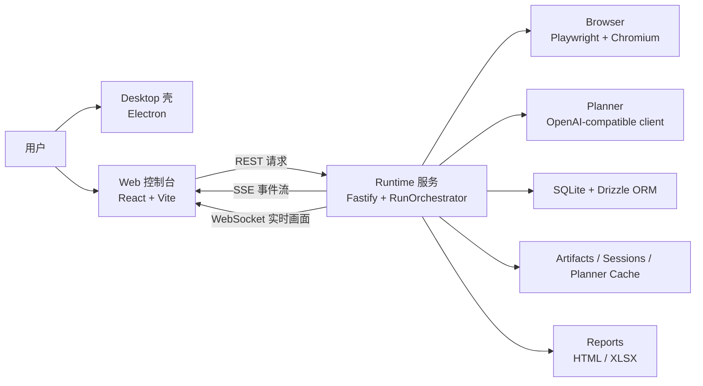
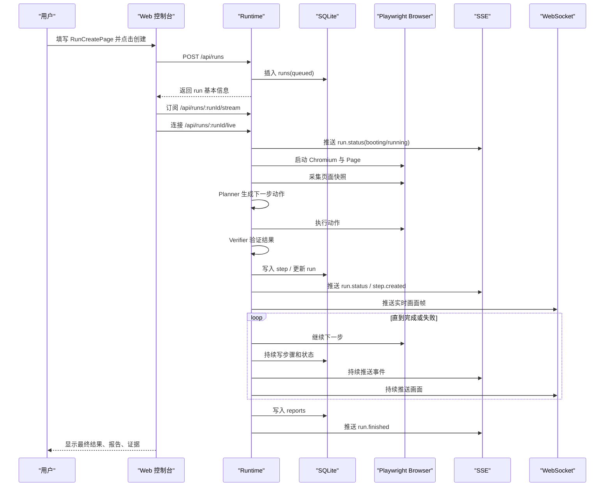

# QPilot Studio《从 0 到 1 开发这个项目》超级详解总手册

如果你现在要的是“真正给完全小白看的百科全书式版本”，并且希望从电脑零基础一路读到部署公网与业务实战，请先看 [ULTIMATE-0-TO-1.zh-CN.md](./ULTIMATE-0-TO-1.zh-CN.md)。  
当前这份文档保留为“中等深度总手册”，更适合已经补过基础词汇、想较快进入系统主线的读者。

## 这份文档适合谁

这份文档写给下面这类读者：

- 你会一点 Python 基础语法，比如变量、函数、`if`、循环
- 但你不熟悉前端、后端、接口、长连接、桌面应用、浏览器自动化、OCR、ORM
- 你不想只看“术语解释”，而是想真正弄明白这个仓库现在怎么工作
- 你还想知道：如果不是看懂现成仓库，而是你自己从 0 开始做一个同类系统，应该先做什么，后做什么

这份文档有两条主线，并且会同时讲：

1. 当前仓库主线：QPilot Studio 现在已经实现了什么，它的真实代码是怎么组织的。
2. 从零开发主线：如果你自己做一个简化版，再一步步长成现在这样，路线应该怎么拆。

如果你现在发现上面那句话里还有很多词本身就不熟，比如：

- 端口
- 请求
- JSON
- 数据库
- DOM
- iframe
- OCR

那请先看 [FOUNDATIONS-101.zh-CN.md](./FOUNDATIONS-101.zh-CN.md)。  
那份文档专门补“学这个项目之前的预备知识”，会比当前这份更基础。

如果你只想看专题深挖，可以跳去这些文档：

- [FOUNDATIONS-101.zh-CN.md](./FOUNDATIONS-101.zh-CN.md)：真正给完全小白补预备知识
- [DEPLOYMENT-101.zh-CN.md](./DEPLOYMENT-101.zh-CN.md)：把本地项目一步步发布到公网的部署 SOP
- [ARCHITECTURE.zh-CN.md](./ARCHITECTURE.zh-CN.md)：工程版架构主文档
- [ARCHITECTURE-101.zh-CN.md](./ARCHITECTURE-101.zh-CN.md)：架构扫盲版
- [RUN-LIFECYCLE-101.zh-CN.md](./RUN-LIFECYCLE-101.zh-CN.md)：一次运行的全过程
- [DB-ORM-101.zh-CN.md](./DB-ORM-101.zh-CN.md)：数据库与 ORM 专项
- [PAGE-DETECTION-101.zh-CN.md](./PAGE-DETECTION-101.zh-CN.md)：页面检测、校验、OCR 专项

---

## 先看总地图

先不要急着看代码。  
如果你还没看过 [FOUNDATIONS-101.zh-CN.md](./FOUNDATIONS-101.zh-CN.md)，并且你对很多最基本的电脑/Web 术语还不熟，建议先过去补地基。

在这个前提下，再记住一句最重要的人话：

QPilot Studio 不是“一个 Python 脚本项目”，也不是“一个只有前端页面的管理台”，它是一个本地优先的 AI 浏览器测试系统。

它至少有下面这些角色：

- `Desktop`：桌面窗口外壳，用 Electron 打开一个本地应用窗口
- `Web`：控制台界面，用 React 显示项目、运行、步骤、画面、报告
- `Runtime`：后端与调度中心，用 Fastify 接口、Playwright 控制浏览器、Drizzle ORM 落库
- `Browser`：被 Playwright 驱动的 Chromium 浏览器实例，真正去打开页面、点击、输入、跳转
- `Planner`：AI 规划层，负责决定“下一步该做什么”
- `Verifier`：验证层，负责判断“刚才那一步到底有没有成功”
- `Database / Files`：一个存结构化数据，一个存截图、视频、证据、缓存、报告



### 这张图你应该怎么读

- 用户不是直接操作 Runtime，而是先看到 Web 控制台
- Web 也不会直接控制浏览器，它只能向 Runtime 发请求
- Runtime 才是整个系统真正的业务核心
- Browser 是 Runtime 的执行手，不是 UI
- Planner 是 Runtime 里的一个能力，不是独立桌面窗口
- SQLite 和文件目录都归 Runtime 管，不归 Web 管

### 建议继续看

- `package.json`
- `apps/desktop/src/main.cjs`
- `apps/web/src/App.tsx`
- `apps/runtime/src/server.ts`
- `apps/runtime/src/orchestrator/run-orchestrator.ts`

---

## 1. 你到底在学什么项目

### 先说人话

如果你以前更多接触的是 Python 脚本，你可能习惯这样理解项目：

- 读一个配置
- 启动一个脚本
- 打开浏览器
- 做几步操作
- 打印一点日志
- 结束

QPilot Studio 不是这个级别。

它更像一个“带驾驶舱的自动驾驶系统”：

- 你可以在界面里新建任务
- 系统会把任务写进数据库
- Runtime 会启动浏览器去执行
- Web 会一边显示状态，一边显示实时画面
- 如果遇到验证码、登录墙、草稿审批，系统会停下来等你
- 跑完后还会把步骤、截图、网络证据、测试用例、报告都存下来

也就是说，它不是“单次脚本”，而是“一个本地产品”。

### 当前仓库里它是谁

从当前仓库结构看，它是一个 `pnpm workspace` 多包工程：

- 根目录负责统一脚本和依赖编排
- `apps/desktop` 是 Electron 桌面壳
- `apps/web` 是 React 控制台
- `apps/runtime` 是 Fastify + Playwright + SQLite + OCR 的业务核心
- `packages/shared` 放前后端共享 schema、常量、类型
- `packages/ai-gateway`、`packages/report-core` 等包负责复用能力

### 如果你自己从 0 开始

你不应该第一天就尝试做完整 QPilot Studio。

正确理解方式是：

- 先把它拆成 4 个问题：界面、调度、浏览器执行、存储
- 然后承认：真正最难的是 Runtime，不是 Web，也不是 Electron
- 再把 Runtime 继续拆成：接口、Run 状态机、页面检测、动作执行、结果验证、证据保存、报告生成

### 本章你该记住的结论

- 这是一个本地运行的浏览器测试系统，不是 Python 小脚本
- 业务核心在 Runtime，不在 Desktop
- 要理解这个项目，先抓 Runtime，再回头看 Web 和 Desktop

### 建议继续看

- `package.json`
- `apps/runtime/package.json`
- `apps/web/package.json`
- `apps/desktop/package.json`

---

## 2. 如果你只会一点 Python，这个仓库该怎么理解

### 先把术语翻译成人话

很多人第一次看这个仓库会被术语吓住。下面我用“Python 参考系”给你翻译一遍。

#### `Node.js`

`Node.js` 是 JavaScript / TypeScript 在本地运行的环境。

你可以先把它理解成：

- Python 世界里的“解释器 + 运行时环境”

区别是：

- Python 主要运行 `.py`
- 这里主要运行 TypeScript / JavaScript

#### `pnpm workspace`

这是一个多包工程管理方式。

你可以先把它理解成：

- “一个大仓库里放了多个彼此配合的小项目”

有点像：

- 一个 Python monorepo 里同时有 `server/`、`web/`、`shared/`、`cli/`

#### `Electron`

Electron 是“把网页装进桌面窗口”的技术。

你可以先把它理解成：

- “一个带浏览器壳的桌面应用容器”

它不是业务逻辑本身，更像宿主。

#### `React`

React 是前端 UI 框架。

你可以先把它理解成：

- Python 里你做 Web 时会有模板引擎或组件系统
- React 相当于一个更现代的、组件化的页面拼装方式

#### `Fastify`

Fastify 是 Node 世界里的后端 Web 框架。

你可以先把它理解成：

- Flask / FastAPI 这一类框架的同类角色

它负责：

- 注册路由
- 接收请求
- 返回 JSON
- 挂载 WebSocket / 静态文件

#### `Playwright`

Playwright 是浏览器自动化框架。

你可以先把它理解成：

- Python 里的 Selenium / Playwright 的 Node 版本同类能力

它负责真正打开浏览器、找元素、点击、输入、截图、监听网络。

#### `ORM`

`ORM` 全称 `Object-Relational Mapping`，中文可以理解成“对象关系映射”。

你先不要背定义，先记一句：

- ORM 是代码和数据库之间的翻译层

在这个项目里：

- 数据库本体是 `SQLite`
- 客户端驱动是 `@libsql/client`
- ORM 是 `Drizzle ORM`

#### `OCR`

`OCR` 全称 `Optical Character Recognition`，中文是“光学字符识别”。

你可以把它理解成：

- 系统先把页面当图片看，再从图片里读字

这在当前项目里不是主流程，而是兜底流程。

### 当前仓库里这些术语分别落在哪

- Node 运行入口：`apps/runtime/src/index.ts`
- Fastify 服务入口：`apps/runtime/src/server.ts`
- React 应用入口：`apps/web/src/App.tsx`
- Electron 入口：`apps/desktop/src/main.cjs`
- ORM：`apps/runtime/src/db/client.ts` + `apps/runtime/src/db/schema.ts`
- OCR：`apps/runtime/src/playwright/ocr/visual-targeting.ts`

### 如果你自己从 0 开始

一开始你不需要“全懂 TypeScript 语法”。

你先只要记住：

- `function` 就像 Python 的 `def`
- `interface/type` 可以理解成“数据长什么样的说明书”
- `class` 跟 Python class 是同一类概念
- `package.json` 先把它当成“项目脚本和依赖清单”

### 本章你该记住的结论

- 这个仓库不是“换了一门语言而已”，而是换了一整套工程组织方式
- 但角色并不神秘，几乎都能用 Python 世界的熟悉概念类比

### 建议继续看

- `apps/runtime/src/index.ts`
- `apps/runtime/src/server.ts`
- `apps/web/src/App.tsx`
- `apps/desktop/src/main.cjs`
- `apps/runtime/src/db/client.ts`

---

## 3. 从仓库目录看全局

### 为什么要先看目录，不先看实现

因为零基础读代码最容易犯的错，不是看不懂语法，而是“看代码时不知道自己现在站在哪一层”。

你必须先知道：

- 哪个目录负责界面
- 哪个目录负责接口
- 哪个目录负责真正操作浏览器
- 哪个目录只是共享类型，不会自己跑

### 当前仓库目录应该这样读

#### `apps/desktop`

桌面外壳。

它最重要的任务只有几个：

- 创建 Electron 窗口
- 检查 `http://localhost:8787/health` 是否存活
- 如果 runtime 没起来，就显示等待页
- 如果 runtime 正常，就打开 `http://localhost:5173`

也就是说：

- Desktop 不直接管理 Run
- Desktop 不直接碰数据库
- Desktop 不直接控制 Playwright

#### `apps/web`

控制台前端。

它负责：

- 表单：新建 run
- 列表：项目、运行、报告
- 详情：步骤、截图、验证结果、实时画面
- 订阅：用 `EventSource` 接 SSE，用 `WebSocket` 接实时画面

#### `apps/runtime`

真正的业务核心。

它负责：

- 启动 Fastify 服务
- 初始化数据库和迁移
- 创建 `RunOrchestrator`
- 注册路由
- 启动 Playwright 浏览器
- 采集快照、做页面检测、执行动作、验证结果、写库、落文件、发事件

#### `packages/shared`

共享协议层。

这里最关键的作用是：

- 让前端和 runtime 对同一份数据结构达成共识

例如：

- 事件名
- `Run` / `Step` / `PageSnapshot` / `VerificationResult` 的结构
- `status` / `phase` / `Action` 的枚举

### 当前仓库最值得先记住的文件

- `package.json`
- `apps/desktop/src/main.cjs`
- `apps/web/src/App.tsx`
- `apps/web/src/lib/api.ts`
- `apps/web/src/pages/RunCreatePage.tsx`
- `apps/web/src/pages/RunDetailPage.tsx`
- `apps/runtime/src/index.ts`
- `apps/runtime/src/server.ts`
- `apps/runtime/src/server/routes/runs.ts`
- `apps/runtime/src/orchestrator/run-orchestrator.ts`
- `packages/shared/src/schemas.ts`
- `packages/shared/src/constants.ts`

### 如果你自己从 0 开始

你完全可以先不要做 monorepo。

第一版你甚至可以只做一个 `runtime/`：

- 一个后端
- 一个 Playwright 执行器
- 一个 SQLite 文件

等你真有了可用的 API，再加 Web；
等 Web 稳定了，再加 Desktop。

### 本章你该记住的结论

- `apps/runtime` 是最重要的目录
- `packages/shared` 是“协议层”，它本身不处理业务
- `apps/desktop` 是壳，`apps/web` 是驾驶舱，`apps/runtime` 是发动机

### 建议继续看

- `apps/desktop/src/main.cjs`
- `apps/web/src/lib/api.ts`
- `apps/runtime/src/server/routes/runs.ts`
- `packages/shared/src/schemas.ts`

---

## 4. 先把项目跑起来

### 你至少要准备什么

从当前仓库能确认的事实看：

- 包管理器是 `pnpm`
- Web 用 `Vite`
- Runtime 用 `Fastify + ts-node/esm`
- Desktop 用 `Electron`
- Browser automation 用 `Playwright`

仓库没有在 `package.json` 里显式写死 `engines.node`。

但从依赖组合看：

- `electron@36`
- `vite@6`
- `playwright@1.52`

可以合理推断：建议使用较新的 Node LTS。  
这是一条工程推断，不是仓库里写死的强约束。

### 第一次启动前要做什么

#### 1. 安装依赖

```bash
pnpm install
```

#### 2. 准备环境变量

当前仓库根目录有 [.env.example](../.env.example)。

最关键的变量有：

- `PORT=8787`
- `CORS_ORIGIN=http://localhost:5173`
- `DATABASE_URL=./data/qpilot.db`
- `ARTIFACTS_DIR=./data/artifacts`
- `REPORTS_DIR=./data/reports`
- `SESSIONS_DIR=./data/sessions`
- `PLANNER_CACHE_DIR=./data/planner-cache`
- `OPENAI_BASE_URL=https://api.openai.com/v1`
- `OPENAI_API_KEY=...`
- `OPENAI_MODEL=gpt-4.1-mini`
- `CREDENTIAL_MASTER_KEY=64 位十六进制`
- `VITE_RUNTIME_BASE_URL=http://localhost:8787`

其中最容易忽略的是：

- `CREDENTIAL_MASTER_KEY`

它不是随便写个字符串就行，必须是 64 位十六进制字符串，因为 runtime 用它加密账号密码。

另外还要记住一条非常关键的事实：

- 如果没有 `OPENAI_API_KEY`，`RunOrchestrator` 里的 `Planner` 不会被创建

也就是说：

- Web 能打开
- Runtime 也能启动
- 但真正依赖 AI 规划的主流程不会完整工作

#### 3. 安装 Playwright 浏览器内核

仓库依赖里已经有 `playwright`，但第一次在本机跑时，通常还需要安装浏览器内核。

最直接的做法是：

```bash
pnpm --filter @qpilot/runtime exec playwright install chromium
```

这一步是 Playwright 的常规初始化动作，不是仓库额外发明的逻辑。

### 当前仓库有哪些启动方式

根目录 `package.json` 里定义了这些脚本：

```bash
pnpm dev:web
pnpm dev:runtime
pnpm dev:desktop
pnpm dev
```

它们的含义分别是：

- `pnpm dev:web`
  只启动 React 控制台
- `pnpm dev:runtime`
  只启动 Runtime 服务
- `pnpm dev:desktop`
  用 `concurrently` 同时拉起 runtime、web、desktop，并用 `wait-on` 等待 `5173` 和 `8787/health` 就绪
- `pnpm dev`
  同时启动 runtime 和 web，但不打开桌面壳

### 你第一次最推荐怎么跑

如果你只是想理解系统：

```bash
pnpm dev
```

这样你只面对两个进程：

- Web
- Runtime

等你明白系统流程以后，再跑：

```bash
pnpm dev:desktop
```

### 为什么这个项目要多个进程一起跑

因为它本来就不是单体脚本：

- Web 是一个 Vite 开发服务器
- Runtime 是一个 Fastify 服务
- Desktop 是一个 Electron 进程

这三个进程相互配合，但职责不同。

### 建议继续看

- `.env.example`
- `package.json`
- `apps/runtime/src/config/env.ts`
- `apps/runtime/src/index.ts`
- `apps/desktop/src/main.cjs`

---

## 5. 前端、桌面壳、 Runtime 到底怎么分工

### Desktop：为什么它不是核心

从 `apps/desktop/src/main.cjs` 可以看得很清楚：

- 它先检查 `healthUrl`
- runtime 不通，就加载一个 fallback HTML
- runtime 通了，就加载 `webUrl`

这说明 Desktop 的本质是：

- 本地宿主窗口
- 不是业务核心

你可以把它理解成：

- 一个电视机外壳
- 真正的内容不是它生产的

### Web：它到底负责什么

Web 负责的是“显示”和“发请求”，不是“直接干活”。

例如：

- `RunCreatePage` 负责收集用户输入
- `api.ts` 负责把请求发给 runtime
- `RunDetailPage` 负责订阅事件流、渲染步骤、渲染状态
- `LiveRunViewport` 负责接 WebSocket 实时画面并画到 `canvas`

它并不会：

- 直接操作 Playwright
- 直接碰 SQLite
- 直接写报告

### Runtime：为什么它才是发动机

Runtime 的入口是 `apps/runtime/src/server.ts`。

这个文件在启动时做了很多关键动作：

- 解析环境变量
- 解析数据库路径
- 执行数据库迁移
- 创建数据库客户端和 Drizzle 实例
- 创建 `SseHub`
- 创建 `LiveStreamHub`
- 创建 `EvidenceStore`
- 创建 `RunOrchestrator`
- 注册路由
- 暴露 `/artifacts/` 和 `/reports/` 静态目录

如果没有 Runtime：

- Web 只能显示空壳
- Desktop 只能显示等待页
- Browser 不会被启动
- Run 不会执行

### 如果你自己从 0 开始

建议先做：

- 一个 Fastify 服务
- 一个 `POST /api/runs`
- 一个最小 `RunOrchestrator`

而不是先做：

- 花里胡哨的 Web UI
- Electron
- 报告导出

### 本章你该记住的结论

- Desktop 是壳
- Web 是驾驶舱
- Runtime 是发动机

### 建议继续看

- `apps/desktop/src/main.cjs`
- `apps/web/src/lib/api.ts`
- `apps/web/src/pages/RunCreatePage.tsx`
- `apps/web/src/pages/RunDetailPage.tsx`
- `apps/runtime/src/server.ts`

---

## 6. 通信为什么有三种：REST、SSE、WebSocket

### `REST` 是什么

`REST` 你先把它理解成“普通接口请求”。

特点是：

- 前端发一次请求
- 后端回一次结果
- 这次通信就结束

在这个项目里，典型例子是：

- 创建 run
- 获取 run 详情
- 获取步骤列表
- 审批草稿
- 暂停、恢复、终止 run

### `SSE` 是什么

`SSE` 全称 `Server-Sent Events`，中文可以理解成“服务器向客户端持续推送事件的长连接”。

你可以把它理解成：

- REST 像你去柜台问一次结果
- SSE 像你挂着电话，柜台有新进展就主动告诉你

本项目里：

- Web 通过 `EventSource` 订阅 `/api/runs/:runId/stream`
- Runtime 用 `SseHub` 把 `run.status`、`step.created`、`run.finished` 等事件持续推送出来
- `SseHub` 还会每 15 秒发一次 `ping` 保活

### `WebSocket` 是什么

`WebSocket` 是“双向实时通道”。

在这个项目里，它主要不是拿来传业务事件，而是拿来传实时画面。

当前代码里：

- Web 用 `api.createRunLiveSocket(runId)` 连 `/api/runs/:runId/live`
- `LiveRunViewport.tsx` 把收到的 base64 JPEG 帧画到 `canvas`

### 为什么不能只留一种通信方式

因为三类数据性质不同：

- REST：适合命令和查询
- SSE：适合有顺序的业务事件
- WebSocket：适合高频实时画面

如果你把实时画面也塞进 SSE：

- 业务事件会被大帧数据淹没
- 前端处理更混乱

如果你把所有控制命令都塞进 WebSocket：

- 业务接口会更难调试
- 也更不符合当前仓库的实现方式

### 本章你该记住的结论

- REST 负责“发命令/查结果”
- SSE 负责“推业务事件”
- WebSocket 负责“推实时画面”

### 建议继续看

- `apps/runtime/src/server/routes/runs.ts`
- `apps/runtime/src/server/routes/live.ts`
- `apps/runtime/src/server/sse-hub.ts`
- `apps/web/src/lib/api.ts`
- `apps/web/src/components/LiveRunViewport.tsx`

---

## 7. 一次 Run 从创建到结束到底怎么走

### 总时序图



### 按时间拆开讲

#### 第 1 步：用户在 `RunCreatePage` 填表

这里填的不只是 URL，还包括：

- `projectId`
- `targetUrl`
- `mode`
- `language`
- `executionMode`
- `confirmDraft`
- `goal`
- `maxSteps`
- `headed`
- `manualTakeover`
- `sessionProfile`
- `saveSession`

也就是说，一次 run 不是“一个网址”那么简单，它还是一套运行策略。

#### 第 2 步：Web 发 `POST /api/runs`

Runtime 在 `runs.ts` 里校验请求体，构造 `RunConfig`，然后插入 `runs` 表。

这时数据库里先出现一条状态为 `queued` 的 run。

#### 第 3 步：Runtime 真正启动执行

真正执行不是在 Web 里开始的，而是由 `RunOrchestrator` 接手。

可以把 `RunOrchestrator` 理解成：

- 整个系统的总导演

它负责：

- 开浏览器
- 采快照
- 调 Planner
- 执行动作
- 调 Verifier
- 记录步骤
- 发 SSE
- 发实时画面
- 处理暂停、人工接管、草稿审批
- 生成报告

#### 第 4 步：启动浏览器并拿到第一张快照

`collectPageSnapshot` 做的事不是只有截图。

它会同时产出：

- 截图文件
- 当前 URL
- 当前 title
- `InteractiveElement[]`
- `PageState`

这一步很重要，因为 Planner 不是“凭空想下一步”，它要基于当前快照做决定。

#### 第 5 步：Planner 决定下一步

Planner 输入的是：

- 当前目标
- 当前页面快照
- 历史步骤
- 工作记忆

输出的是：

- 动作列表
- 预期检查项
- 是否完成
- 测试用例候选

#### 第 6 步：Executor 真正执行动作

这一步由 `action-executor.ts` 完成。

动作类型当前主要有：

- `click`
- `input`
- `select`
- `navigate`
- `wait`

#### 第 7 步：Verifier 判断动作有没有真的成功

“点到了”不等于“成功了”。

系统还要继续检查：

- URL 有没有变化
- 页面是不是进入了目标状态
- 有没有出现错误文案
- 网络请求是否符合预期

#### 第 8 步：把 Step 写下来

每做完一步，就会写一条 `steps` 记录。

它里面至少有：

- 页面 URL / 标题
- 当前快照摘要
- 截图路径
- 动作 JSON
- 动作状态
- 验证 JSON
- 观察总结

#### 第 9 步：前端持续收到更新

Web 一边收：

- `run.status`
- `step.created`
- `run.finished`

另一边还收：

- WebSocket 实时画面

所以你在详情页会觉得“系统是活着的”，不是一直刷新页面。

### 本章你该记住的结论

- Run 的真正生命线不在 Web，而在 Runtime
- 每一步都不是“想完就算”，而是“观察 -> 决策 -> 执行 -> 验证 -> 持久化 -> 推送”

### 建议继续看

- `apps/web/src/pages/RunCreatePage.tsx`
- `apps/runtime/src/server/routes/runs.ts`
- `apps/runtime/src/orchestrator/run-orchestrator.ts`
- `apps/runtime/src/playwright/collector/page-snapshot.ts`

---

## 8. Run、Step、Phase、Status 到底是什么

### `Run`

`Run` 是一次完整任务。

比如：

- “打开某站点，验证登录成功后能看到工作台”

这一整次过程就是一个 `Run`。

### `Step`

`Step` 是 Run 里的一个具体动作结果。

比如：

- 第 1 步：点击登录入口
- 第 2 步：输入用户名
- 第 3 步：输入密码
- 第 4 步：点击登录

每一步都可能单独成功，也可能单独失败。

### `status`：结果层

`RunStatusSchema` 里当前定义的是：

- `queued`
- `running`
- `passed`
- `failed`
- `stopped`

你可以把它理解成“这次 run 最后算什么结果”。

### `phase`：过程层

`RunLivePhaseSchema` 里当前定义的是：

- `queued`
- `booting`
- `sensing`
- `planning`
- `drafting`
- `executing`
- `verifying`
- `paused`
- `manual`
- `persisting`
- `reporting`
- `finished`

你可以把它理解成“run 现在正在做哪一类事情”。

### 为什么要同时有 `status` 和 `phase`

因为它们回答的是两个完全不同的问题：

- `status`：这次 run 最终成绩是什么
- `phase`：当前时间点正在忙什么

例如：

- 一个 run 可以 `status=running`，同时 `phase=planning`
- 也可以 `status=running`，同时 `phase=manual`
- 最终才会变成 `passed/failed/stopped`

### `drafting`、`manual`、`paused` 分别是什么

#### `drafting`

系统已经想出了下一步动作，但先不立即执行，而是把草稿抛给人看。

常见触发条件：

- `executionMode === stepwise_replan`
- 或 `confirmDraft = true`

#### `manual`

系统碰到了需要真人接手的情况。

例如：

- 验证码
- 登录墙
- 特殊授权流程
- 需要你手动点、手动输、手动完成验证

#### `paused`

这是用户主动暂停，或者系统响应暂停命令后的状态。

它跟 `manual` 的区别是：

- `manual` 更像“系统说：这一步我不该自动做了，请你来”
- `paused` 更像“用户说：先停一下”

### 建议继续看

- `packages/shared/src/schemas.ts`
- `packages/shared/src/constants.ts`
- `apps/runtime/src/orchestrator/run-orchestrator.ts`
- `apps/web/src/store/run-stream.ts`

---

## 9. 页面检测逻辑到底怎么做

### 先记住一句最重要的话

页面检测不是“截一张图给 AI 看”。

当前项目真正做的是一条多层流水线：

1. 收集页面里的关键元素
2. 归纳当前页面属于哪一类
3. 检查有没有验证码、遮罩、登录墙
4. 动作执行后再次验证 UI 和网络结果
5. 只有 DOM 定位不行时，才退到 OCR

### 第 1 层：`collectInteractiveElements`

这个函数的任务是：

- 从主页面和 iframe 收集“重要元素”
- 不是整个 DOM 全搬走

它的真实实现里有几个关键点：

- 有总量限制：`MAX_ELEMENTS = 220`
- 每个 frame 还有单独限制：`MAX_ELEMENTS_PER_FRAME = 72`
- 会同时抓交互元素和结构元素
- 会识别弹窗、对话框、iframe 之类的上下文
- 会给元素打分、去重、排序

为什么这样设计？

因为后面模块真正关心的不是“整个 HTML”，而是：

- 有哪些按钮
- 有没有密码框
- 有没有登录入口
- 是否在 iframe 里
- 有没有弹窗把页面挡住

### 第 2 层：`summarizePageState`

它会把页面归类成 `PageState`。

当前支持的 `surface` 包括：

- `generic`
- `modal_dialog`
- `login_chooser`
- `login_form`
- `provider_auth`
- `search_results`
- `security_challenge`
- `dashboard_like`

它不是只看标题，也不是只看 URL，而是综合判断：

- URL
- 页面标题
- 元素文本
- 是否有账号输入框
- 是否有密码框
- 是否有第三方登录入口
- 是否有搜索结果信号
- 是否有验证码/安全验证信号

也就是说，它做的是“页面归类”，不是“截图展示”。

### 第 3 层：`page-guards`

它负责在动作执行前做清障和风险检测。

当前代码里能看见的检测点包括：

- URL 像不像 challenge / verify / captcha
- 文本里有没有“安全验证”“验证码”“are you human”
- 是否出现 captcha iframe
- 是否出现 captcha widget
- 是否是登录墙
- 是否要保留某些授权弹窗而不是误关掉

这一步很关键，因为：

- 如果当前页面是验证码页，继续自动点只会越点越乱

### 第 4 层：`basic-verifier`

动作做完以后，系统不会只看“有没有报错”，还要重新判断页面：

- 当前页面像不像目标页面
- URL 有无变化
- 有没有认证错误文本
- 是否仍然停留在登录表单
- 是否进入登录后的壳页面

### 第 5 层：`traffic-verifier`

有些动作在 UI 上看起来成功了，但后台请求其实失败了。

所以 Runtime 还会检查网络证据：

- 关键请求有没有发生
- 有没有失败请求
- 是否有 token / session 信号
- Host 是否发生合理变化

### 为什么要这么麻烦

因为真实网页不是“点一下肯定成功”的玩具环境。

你经常会遇到：

- 页面跳转了，但跳错地方
- 按钮点了，但被遮罩层挡住
- 表面看似登录成功，其实接口 401
- DOM 不稳定，但画面上肉眼能看见字

### 建议继续看

- `apps/runtime/src/playwright/collector/interactive-elements.ts`
- `apps/runtime/src/playwright/collector/page-state.ts`
- `apps/runtime/src/playwright/collector/page-guards.ts`
- `apps/runtime/src/playwright/verifier/basic-verifier.ts`
- `apps/runtime/src/orchestrator/traffic-verifier.ts`
- [PAGE-DETECTION-101.zh-CN.md](./PAGE-DETECTION-101.zh-CN.md)

---

## 10. OCR 逻辑到底是什么，为什么不是默认就 OCR

### 先说结论

当前项目里，OCR 不是默认主流程，而是 DOM/结构化定位失败后的视觉兜底。

这点非常重要。

很多初学者会误以为：

- “AI 看图更聪明，那干脆每一步都 OCR 不就好了？”

当前仓库没有这么做，原因是：

- DOM 更稳定
- DOM 更便宜
- DOM 有语义
- DOM 能直接填表单、点元素、读属性
- OCR 容易受分辨率、模糊、遮挡、字体、语言包影响

### 当前 OCR 链路的真实入口

OCR 代码在：

- `apps/runtime/src/playwright/ocr/visual-targeting.ts`

但它不是自己凭空跑的。

真正触发它的是：

- `apps/runtime/src/playwright/executor/action-executor.ts`

当前执行器的逻辑大意是：

1. 先尝试普通 DOM/文本定位
2. 如果 `resolveLocator(...)` 失败
3. 再调用 `resolveVisualClickTarget(page, action)`
4. 如果 OCR 找到目标，就按坐标点击
5. 并把 `resolutionMethod` 记成 `ocr`

### OCR 具体做了哪些事

#### 第 1 步：先从动作里提取“要找的字”

OCR 不是对整张图盲搜，它先从动作里提取候选文本。

候选文本可能来自：

- `action.note`
- `action.target`
- 引号里的文本
- 选择器字面量里的 `text=...`
- `aria-label` / `title` / `placeholder` 这样的字面值

例如：

- 如果动作备注是“点击‘密码登录’按钮”
- OCR 就会先把“密码登录”提出来，作为优先搜索词

#### 第 2 步：构造视觉 surface

它不会只识别主页面整张图，还会处理 iframe：

- 先截主页面
- 再遍历子 frame
- 给每个可见 iframe 单独截图
- 记录 iframe 在整页里的偏移量

这样做是因为很多登录、授权、验证码其实在 iframe 里。

#### 第 3 步：启动 Tesseract Worker

当前代码里用的是：

- `tesseract.js`

语言包是：

- `eng+chi_sim`

页面分割模式是：

- `Tesseract.PSM.SPARSE_TEXT`

也就是“稀疏文本模式”。

这非常符合网页按钮/标签/短文案的识别场景，因为网页不是整页密集段落。

#### 第 4 步：把识别结果拉平成文本碎片

OCR 识别后，不是直接输出“唯一答案”，而是很多 block / paragraph / line / word。

当前实现会把这些东西压平为 `OcrTextFragment`，记录：

- 原始文本
- 归一化文本
- 置信度
- 是 line 还是 word
- bbox
- 属于哪个 surface
- 在整页中的偏移量

同时还会过滤：

- 太低置信度的碎片

#### 第 5 步：给候选词和识别碎片打分

系统会把“我要找的候选词”和“OCR 识别出的片段”两两比较。

比较方式包括：

- 完全相等
- 包含关系
- 子串关系
- 子序列关系
- 识别置信度加权
- line 比 word 额外加分
- 候选词越靠前权重越高

如果最终得分低于阈值，就视为没找到。

#### 第 6 步：把文字命中变成点击坐标

一旦找到最佳匹配，系统会：

- 取 bbox 中心点
- 加上 surface 偏移量
- 算出整页点击坐标
- 调 `page.mouse.click(x, y)`

这就是“文字识别”最后落成“鼠标点击”的关键一步。

### 为什么 OCR 只适合兜底

因为 OCR 缺少 DOM 天生拥有的很多信息：

- 它不知道这是按钮还是标题
- 它不知道这个元素是否禁用
- 它不知道这是输入框还是纯文本
- 它很难稳定处理多个同名按钮
- 它无法像 DOM 那样天然支持 `fill()`、`selectOption()`

所以当前项目里：

- `click` 和 `input` 才会在定位失败时尝试 OCR 兜底
- 但像 `select` 这类依赖结构化语义的动作，仍然更依赖 DOM

### OCR 为什么会失败

常见原因包括：

- 字太小
- 对比度低
- 页面缩放或模糊
- 文字是图标字体或图片
- 文案重复太多
- 遮罩层挡住真正目标
- 候选词提取错了
- 文本在动画里瞬间变化

### 如果你自己从 0 开始做

不要在第 1 阶段就引入 OCR。

正确顺序应该是：

1. 先把 DOM 定位做稳
2. 再做基本页面分类
3. 再做动作后验证
4. 最后才加 OCR 兜底

否则你会很早把系统复杂度拉爆。

### 建议继续看

- `apps/runtime/src/playwright/executor/action-executor.ts`
- `apps/runtime/src/playwright/ocr/visual-targeting.ts`
- `apps/runtime/src/tests/visual-targeting.test.ts`
- [PAGE-DETECTION-101.zh-CN.md](./PAGE-DETECTION-101.zh-CN.md)

---

## 11. ORM、数据库、文件存储到底怎么配合

### 先把三层关系分开

很多新手会把下面三件事混在一起：

- 数据库
- 数据库驱动
- ORM

在当前仓库里，它们分别是：

- 数据库：`SQLite`
- 驱动：`@libsql/client`
- ORM：`Drizzle ORM`

你可以这样理解：

- SQLite 是仓库
- `@libsql/client` 是搬运工
- Drizzle ORM 是翻译官

### 当前数据库文件在哪里

默认环境变量是：

- `DATABASE_URL=./data/qpilot.db`

`client.ts` 会把相对路径解析成 runtime 根目录下的绝对路径，因此默认实际落盘位置是：

- `apps/runtime/data/qpilot.db`

### `schema.ts` 做什么

`schema.ts` 不是数据库本体。

它做的是：

- 在 TypeScript 里声明表结构
- 告诉 Drizzle：“有哪些表、字段、外键”

当前核心表包括：

- `projects`
- `runs`
- `steps`
- `test_cases`
- `reports`
- `case_templates`
- `load_profiles`
- `load_runs`

### `migrate.ts` 做什么

`migrate.ts` 负责：

- 首次建表
- 给旧表补列

也就是说，它做的是“把数据库调整到当前代码期望的形状”。

### 为什么很多字段是 `Json` 字符串

你会看到很多列名像这样：

- `configJson`
- `domSummaryJson`
- `actionJson`
- `verificationJson`
- `stepsJson`
- `caseJson`
- `metricsJson`

这说明项目采用了一种很常见的折中方式：

- 强结构字段，单独建列
- 变化大、层次深的数据，先序列化成 JSON 文本存

这样做的优点是：

- 表结构不会因为细节变化频繁爆炸
- 复杂对象仍能完整落库

### 一次 run 会改哪些表

#### `projects`

项目级配置。

包括：

- 项目名
- 基础 URL
- 加密后的账号密码

#### `runs`

一次运行的总记录。

包括：

- 目标地址
- 模式
- 目标(goal)
- 状态
- 模型
- 启动页信息
- 错误信息
- 开始结束时间

#### `steps`

每一步动作的完整记录。

这是你回放和定位问题时最重要的表之一。

#### `test_cases`

从运行过程里提炼出的测试用例。

#### `reports`

最终 HTML/XLSX 报告路径。

#### `case_templates`

从成功运行中沉淀出来的模板案例，供回放和修复草稿使用。

#### `load_profiles / load_runs`

这两张表是负载测试相关，不是这次浏览器 Agent 主线的核心，但仍属于同一个 runtime 存储层。

### 为什么还要文件目录，不能全放数据库吗

不能。

数据库更适合结构化记录，不适合大量大文件。

当前默认目录有：

- `./data/artifacts`
- `./data/reports`
- `./data/sessions`
- `./data/planner-cache`

它们分别承担：

- `artifacts`：截图、运行证据、录像等
- `reports`：最终 HTML/XLSX 报告
- `sessions`：浏览器会话状态
- `planner-cache`：规划缓存

另外，`EvidenceStore` 会把运行期收集的：

- 控制台日志
- 网络请求
- Planner trace

最终写到：

- `artifacts/runs/<runId>/evidence.json`

### 如果你自己从 0 开始

前四阶段建议这样做：

1. 先只建 `runs`
2. 再加 `steps`
3. 再加 `projects`
4. 最后再加 `reports`、`test_cases`、`case_templates`

不要一开始就复制完整数据库结构。

### 建议继续看

- `apps/runtime/src/db/schema.ts`
- `apps/runtime/src/db/client.ts`
- `apps/runtime/src/db/migrate.ts`
- `apps/runtime/src/server/evidence-store.ts`
- [DB-ORM-101.zh-CN.md](./DB-ORM-101.zh-CN.md)

---

## 12. AI 规划、执行、验证为什么要分层

### 为什么 Planner 不直接点页面

如果让 AI 既负责观察，又负责点页面，又负责判断成功失败，会出现一个大问题：

- 责任全混在一起

这样一来你很难知道：

- 是观察错了
- 是计划错了
- 是执行错了
- 还是验证错了

所以当前仓库做了分层：

- `Planner`：想下一步
- `Executor`：真的做动作
- `Verifier`：判断动作是否真的达成目标
- `RunOrchestrator`：把这一切串起来

### `RunOrchestrator` 到底像什么

最接近的比喻是：

- 总导演

它不一定亲自做每一件事，但它安排顺序：

1. 先看当前页面
2. 再规划下一步
3. 再决定要不要先给人审草稿
4. 再执行动作
5. 再校验结果
6. 再存档并推送状态
7. 如有需要，继续下一轮

### 为什么会有 `drafting`

这是人机协作层。

当系统已经想出下一步动作，但不想直接执行时，会进入 `drafting`。

典型场景：

- 你开启了 `confirmDraft`
- 或执行模式是 `stepwise_replan`

这时系统会说：

- “我想下一步点这里，你确认吗？”

### 为什么会有 `manual`

这是比 `drafting` 更进一步的人类接管。

`drafting` 还是让人审批 AI 动作；
`manual` 则是系统承认：

- 这一段不适合自动做了，请你亲自接手

例如：

- 验证码
- 安全挑战
- 高风险动作
- 特殊登录墙

### 为什么要有 Verifier，而不是只看动作有没有报错

因为“没报错”不等于“成功”。

例如：

- 按钮点到了，但页面没变化
- 输入成功了，但账号密码错误
- 页面跳了，但跳去搜索引擎结果页
- UI 上看着正常，后台接口实际上失败

所以 Verifier 负责回答：

- 业务上到底算不算成功

### 本章你该记住的结论

- Planner 不是执行器
- Executor 不是验证器
- Verifier 不是数据库层
- `RunOrchestrator` 是把这些层按顺序编起来的人

### 建议继续看

- `apps/runtime/src/orchestrator/run-orchestrator.ts`
- `apps/runtime/src/llm/planner.ts`
- `apps/runtime/src/playwright/executor/action-executor.ts`
- `apps/runtime/src/playwright/verifier/basic-verifier.ts`

---

## 13. 如果你自己从 0 开始做一个简化版，应该怎么拆里程碑

下面这 10 个阶段，是这份文档最重要的“从零开发路线”。

请注意：

- 每一阶段都只做“当前最必要的闭环”
- 不要贪心
- 不要第一天就复刻完整 QPilot Studio

### 第 1 阶段：只做一个能跑通的 Playwright 脚本

先做什么：

- 传入一个 URL
- 打开 Chromium
- 点击一个按钮
- 输入一段文字
- 截一张图
- 控制台打印结果

先别做什么：

- Web UI
- 数据库
- AI
- OCR
- 桌面端

为什么：

- 因为你必须先有“浏览器自动化最小闭环”

成功标准：

- 你能稳定打开一个页面，完成一小段固定流程

### 第 2 阶段：把脚本包成后端 API

先做什么：

- 建一个 Fastify 服务
- 做一个 `POST /api/runs`
- 请求来了就触发脚本执行
- 返回一个 `runId`

先别做什么：

- 实时画面
- 复杂状态机
- 报告导出

为什么：

- 因为“脚本”要先升级成“服务”

成功标准：

- 你可以用 HTTP 调用浏览器任务，而不是手动改脚本参数

### 第 3 阶段：接一个最小 Web 页面

先做什么：

- 一个表单页
- 一个运行详情页
- 能创建 run
- 能看到最终结果

先别做什么：

- 漂亮 UI
- 多语言
- Electron

为什么：

- 你要先把“人”和“服务”接起来

成功标准：

- 不用命令行也能发起一次 run

### 第 4 阶段：引入 `runs/steps` 数据模型

先做什么：

- SQLite
- `runs` 表
- `steps` 表
- 每执行一步就落库

先别做什么：

- 完整 ORM 抽象
- 模板回放
- 报告分析

为什么：

- 没有步骤记录，你根本无法调试 Agent

成功标准：

- 你能回答“它卡在哪一步”

### 第 5 阶段：做截图与证据保存

先做什么：

- 每步截图
- 保存控制台日志
- 保存关键网络请求
- 按 runId 组织目录

先别做什么：

- 一上来就做复杂 Excel 报告

为什么：

- 证据比花哨报告更重要

成功标准：

- 失败时你能拿到截图和请求记录

### 第 6 阶段：做页面检测与分类

先做什么：

- 元素采集
- 登录页检测
- 搜索结果页检测
- 验证码页检测

先别做什么：

- 全自动通用 AI 页面理解

为什么：

- 没有页面分类，Planner 很容易迷路

成功标准：

- 你能让系统识别“现在大概是什么页面”

### 第 7 阶段：做动作后验证

先做什么：

- URL 是否变化
- 是否进入目标页面类型
- 是否出现错误文案
- 网络请求是否符合预期

先别做什么：

- 把“没报错”当成成功

为什么：

- 验证层是 Agent 是否可用的分水岭

成功标准：

- 系统能分辨“执行成功”和“表面成功”

### 第 8 阶段：加入 OCR 兜底

先做什么：

- 只在 DOM 定位失败时调用 OCR
- 只支持少数高价值场景
- 记录 `resolutionMethod=ocr`

先别做什么：

- 把 OCR 变成默认定位方案

为什么：

- OCR 是补刀，不是主武器

成功标准：

- 一些肉眼可见、DOM 难定位的文案目标能被点击

### 第 9 阶段：加入人工介入、暂停、草稿审批

先做什么：

- pause / resume
- manual takeover
- draft approve / skip

先别做什么：

- 假装一切都能全自动

为什么：

- 真正可用的系统必须允许人接管

成功标准：

- 遇到验证码或敏感动作时，系统能安全停下来

### 第 10 阶段：长成完整产品

先做什么：

- Electron 壳
- 更完整的项目管理
- 报告导出
- 模板沉淀与回放
- 趋势分析

为什么：

- 这时你做的已经不是“脚本”，而是“产品”

成功标准：

- 非开发者也能通过界面使用它

### 本章你该记住的结论

- 从 0 到 1 的关键不是“功能多”，而是“每阶段都有闭环”
- 先做浏览器自动化，再做服务，再做 UI，再做智能化

### 建议继续看

- `apps/runtime/src/server/routes/runs.ts`
- `apps/runtime/src/orchestrator/run-orchestrator.ts`
- `apps/runtime/src/server/evidence-store.ts`
- `apps/runtime/src/playwright/collector/page-snapshot.ts`

---

## 14. 当前仓库视角 vs 你自己复刻视角的对照表

| 主题 | 当前仓库怎么做 | 你自己第一版怎么做 |
| --- | --- | --- |
| 桌面端 | Electron 包一层桌面壳 | 先不要做 |
| Web | React + Vite，多页面控制台 | 先做一个最小表单页 + 详情页 |
| Runtime | Fastify + RunOrchestrator + 多路由 | 先做一个最小 `POST /api/runs` |
| 浏览器执行 | Playwright 驱动 Chromium | 一样，用 Playwright |
| 页面检测 | 元素采集 + 页面分类 + guards + verifier | 先做登录页/验证码页两个分类 |
| OCR | DOM 失败后再用 `tesseract.js` 兜底 | 第 8 阶段再加 |
| 数据库存储 | SQLite + Drizzle ORM + 多张表 | 先只做 `runs` 和 `steps` |
| 证据 | console / network / planner trace + screenshot | 先做 screenshot + network |
| 实时通信 | REST + SSE + WebSocket | 先做 REST，再加 SSE，最后才加 WebSocket |
| 人机协作 | drafting / manual / paused 全都有 | 先做 pause，再做 manual，再做 draft |

### 这张表想告诉你什么

它想帮你避免一个很常见的误区：

- 看见当前仓库很完整，就以为自己第一天也必须做这么完整

不是的。

当前仓库是“长出来”的结果，不是“第一版必须长这样”。

### 建议继续看

- `apps/runtime/src/server.ts`
- `apps/runtime/src/orchestrator/run-orchestrator.ts`
- `apps/runtime/src/db/schema.ts`

---

## 15. 源码阅读顺序、常见误区、FAQ

### 推荐阅读顺序

如果你完全照零基础路线读，推荐顺序是：

1. `package.json`
2. `apps/runtime/src/index.ts`
3. `apps/runtime/src/server.ts`
4. `apps/runtime/src/server/routes/runs.ts`
5. `apps/runtime/src/orchestrator/run-orchestrator.ts`
6. `apps/runtime/src/playwright/collector/page-snapshot.ts`
7. `apps/runtime/src/playwright/collector/page-state.ts`
8. `apps/runtime/src/playwright/executor/action-executor.ts`
9. `apps/runtime/src/playwright/verifier/basic-verifier.ts`
10. `apps/runtime/src/orchestrator/traffic-verifier.ts`
11. `apps/runtime/src/playwright/ocr/visual-targeting.ts`
12. `apps/runtime/src/db/schema.ts`
13. `apps/web/src/lib/api.ts`
14. `apps/web/src/pages/RunCreatePage.tsx`
15. `apps/web/src/pages/RunDetailPage.tsx`
16. `apps/desktop/src/main.cjs`

### 常见误区 1：Electron 是核心

不是。

Electron 在当前仓库里主要负责“打开一个本地窗口”。  
真正的业务核心还是 Runtime。

### 常见误区 2：Web 直接控制浏览器

不是。

Web 只能发请求给 Runtime。  
真正控制浏览器的是 Playwright，而 Playwright 由 Runtime 调用。

### 常见误区 3：数据库能替代文件目录

不能。

SQLite 适合结构化记录；截图、视频、证据 JSON、报告文件更适合落文件系统。

### 常见误区 4：OCR 越早做越好

不是。

没有稳定 DOM 定位、页面分类和验证层时，引入 OCR 只会让问题更多。

### 常见误区 5：Verifier 和 Planner 差不多

完全不是。

- Planner 决定下一步做什么
- Verifier 判断刚才那一步是否真的成功

### 常见误区 6：既然我会一点 Python，就应该先用 Python 重写

不一定。

当前仓库之所以用这套技术栈，是因为：

- Electron 和 Web 控制台天然在 Node/前端生态
- Playwright 的 Node 侧集成非常顺
- 前后端共享 schema 很方便

这不代表 Python 做不了，而是说：

- 如果你的目标是“读懂并继续这个仓库”，最好先接受它的技术栈
- 如果你的目标是“练手做一个同类 MVP”，那你也可以用 Python 先做一个后端 + Playwright 原型

### 看完这份文档后，下一步看什么

- 如果你想继续啃工程实现：看 [ARCHITECTURE.zh-CN.md](./ARCHITECTURE.zh-CN.md)
- 如果你想专门搞懂 run 生命周期：看 [RUN-LIFECYCLE-101.zh-CN.md](./RUN-LIFECYCLE-101.zh-CN.md)
- 如果你想专门搞懂 ORM：看 [DB-ORM-101.zh-CN.md](./DB-ORM-101.zh-CN.md)
- 如果你想专门搞懂页面检测和 OCR：看 [PAGE-DETECTION-101.zh-CN.md](./PAGE-DETECTION-101.zh-CN.md)

---

## 最后再用一句话收尾

如果你把这个项目看成“一个会自动操作浏览器的大脚本”，你会越看越乱。  
如果你把它看成“一个本地运行的、多层协作的浏览器测试系统”，很多模块边界就会一下清楚。

真正的学习顺序不是：

- 先背术语

而是：

- 先知道谁是壳
- 谁是界面
- 谁是发动机
- 谁在想
- 谁在做
- 谁在验
- 谁在存

当这七件事分清了，后面的源码就不再是一团雾了。
