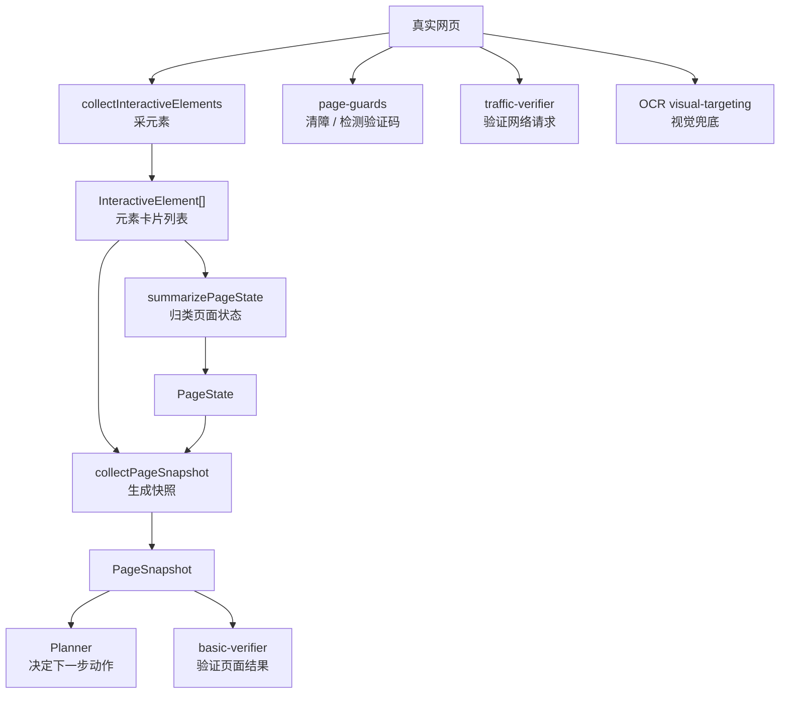

# QPilot Studio 页面检测链详解（PAGE DETECTION 101）

如果你连“浏览器自动化、DOM、元素、选择器、iframe、OCR”这些词都还不熟，请先看 [FOUNDATIONS-101.zh-CN.md](./FOUNDATIONS-101.zh-CN.md)。  
那份文档更适合先补最基础的视觉和页面概念。

如果你想先看一份从项目搭建、运行链路一路讲到页面检测和 OCR 的总手册，请先看 [FROM-0-TO-1.zh-CN.md](./FROM-0-TO-1.zh-CN.md)。  
当前这份文档保留为页面检测专题，适合在总手册之后专门深挖这条链。

## 这份文档适合谁

这份文档写给下面这类读者：

- 你已经知道这个项目会“看页面、想动作、做动作、验结果”
- 但你还不清楚“系统到底怎么判断当前页面是什么类型”
- 你希望把 `collectInteractiveElements / summarizePageState / page-guards / basic-verifier / traffic-verifier / OCR` 这条链一次看明白

如果你还没看过总扫盲文档，建议先看 [ARCHITECTURE-101.zh-CN.md](./ARCHITECTURE-101.zh-CN.md)。  
如果你想先知道这条链在运行生命周期的哪一段出场，建议先看 [RUN-LIFECYCLE-101.zh-CN.md](./RUN-LIFECYCLE-101.zh-CN.md)。

## 先记住一句人话

这个项目里的“页面检测”不是“AI 看一眼网页截图就完事”。

它更像一条流水线：

1. 先把页面里重要元素抄下来
2. 再把页面归类成登录页、搜索结果页、验证码页之类
3. 再把整理后的结果交给 Planner 和 Verifier
4. 如果普通 DOM 定位不稳，再让 OCR 从图片里读字兜底

## 先看总图

## 为什么要把“页面检测”拆成这么多层

### 这是什么

很多新手的第一直觉是：

- 直接把整页 DOM 给 AI
- 或者直接把整张截图给 AI
- 然后让 AI 自己想办法搞定

工程上这样很危险。

### 为什么要有它

因为真实页面的问题很多：

- DOM 很大
- iframe 很多
- 弹窗经常挡住页面
- 有些页面结构乱，但文字肉眼可见
- 有些按钮点到了，但后台请求其实失败了

如果没有分层，系统很难知道到底是：

- 页面没看清
- 还是定位错了
- 还是动作执行了但没生效
- 还是页面看起来成功、后台其实失败

### 在 QPilot Studio 里它是谁

这条链主要由下面几个模块构成：

- `apps/runtime/src/playwright/collector/interactive-elements.ts`
- `apps/runtime/src/playwright/collector/page-state.ts`
- `apps/runtime/src/playwright/collector/page-snapshot.ts`
- `apps/runtime/src/playwright/collector/page-guards.ts`
- `apps/runtime/src/playwright/verifier/basic-verifier.ts`
- `apps/runtime/src/orchestrator/traffic-verifier.ts`
- `apps/runtime/src/playwright/ocr/visual-targeting.ts`

### 你在界面上会看到什么

你虽然看不到这些模块名，但你会看到它们的结果：

- 当前页面被判断成什么阶段
- 当前步骤为什么被判成功或失败
- 为什么系统要求人工接管
- 为什么 API 验证通过或失败

### 对应代码入口

- `apps/runtime/src/playwright/collector/`
- `apps/runtime/src/playwright/verifier/`
- `apps/runtime/src/orchestrator/traffic-verifier.ts`
- `apps/runtime/src/playwright/ocr/visual-targeting.ts`

## 第 1 层：`InteractiveElement` 到底是什么

### 这是什么

你可以把 `InteractiveElement` 理解成：

- “系统眼里的一张元素卡片”

也就是说，网页上的按钮、输入框、链接、弹窗标题、iframe、表单，并不是直接原封不动丢给后续模块，而是先被整理成一张张结构化卡片。

### 为什么要有它

因为后面的判断逻辑如果直接处理整个 DOM，会非常乱。

先把重要信息抽出来以后，后续模块只需要看：

- 这是什么元素
- 它在哪个上下文里
- 它像不像登录入口
- 它是不是密码框

### 在 QPilot Studio 里它是谁

共享结构定义在：

- `packages/shared/src/schemas.ts`

采集逻辑在：

- `apps/runtime/src/playwright/collector/interactive-elements.ts`

### 你在界面上会看到什么

你不会直接在 UI 里看到“元素卡片”这个概念，但你看到的：

- 页面归类
- 动作定位
- 校验结果

背后都依赖这些卡片。

### 对应代码入口

- `packages/shared/src/schemas.ts`
- `apps/runtime/src/playwright/collector/interactive-elements.ts`

## `InteractiveElement` 里主要有哪些字段

你可以先把这些字段看成“系统给一个元素记下来的便签”。

| 字段 | 含义 | 为什么重要 |
| --- | --- | --- |
| `tag` | 标签名，例如 `button`、`input` | 先知道它是什么类型 |
| `id` | DOM id | 方便定位 |
| `className` | class 名 | 便于识别样式和特征 |
| `selector` | 为这个元素生成的简化选择器 | 后续执行或展示时有参考价值 |
| `text` | 元素文字 | 很多判断靠文字完成 |
| `type` | 输入框类型，例如 `password` | 判断登录表单时很关键 |
| `placeholder` | 占位文字 | 识别账号框、搜索框时常用 |
| `name` | name 属性 | 表单字段常用 |
| `ariaLabel` | 无障碍标签 | 页面没文字时，它常常很有用 |
| `role` | 语义角色 | 例如 `button`、`dialog` |
| `title` | title 属性 | 有时能补足文本信息 |
| `testId` | 测试标识 | 某些项目定位时非常稳 |
| `value` | 当前值 | 输入框里已有内容时可用 |
| `nearbyText` | 附近文本 | 帮助理解上下文 |
| `contextType` | 处于主页面、弹窗还是 iframe | 很关键，能知道它是不是被遮挡或嵌套 |
| `contextLabel` | 所在上下文标题 | 帮助理解当前属于哪个对话框 |
| `framePath` | 属于哪个 frame | 区分主页面和 iframe |
| `frameUrl` | 该 frame 的 URL | 辅助判断第三方授权页 |
| `frameTitle` | 该 frame 的标题 | 帮助理解 frame 语义 |
| `isVisible` | 是否可见 | 看不见的元素一般不该优先用 |
| `isEnabled` | 是否可用 | 禁用元素通常不能点 |

## 第 2 层：`collectInteractiveElements` 是怎么采元素的

### 这是什么

这一层的目标不是“把整页 DOM 全量导出”，而是：

- 找出对自动化最有价值的一批元素

### 为什么要有它

真实页面往往节点极多。

如果全部保留，会带来几个问题：

- 上下文太大
- 噪声太多
- 后面的 Planner 很难抓住重点

### 在 QPilot Studio 里它是谁

`interactive-elements.ts` 主要做了这些事：

1. 同时扫描主页面和所有 frame
2. 重点采两类节点
   - 明显可交互节点
   - 结构理解节点
3. 给元素补充上下文信息
4. 给元素打分
5. 去重、排序、限量

### 它重点会采哪些元素

可交互节点包括：

- `a`
- `button`
- `input`
- `select`
- `textarea`
- `summary`
- 带 `role='button'`、`role='link'` 之类语义角色的节点

结构理解节点包括：

- `label`
- 标题
- `form`
- `section`
- `article`
- `nav`
- `main`
- 带 `aria-label`、`title` 的节点
- iframe 本身

### 它是怎么补上下文的

这一层不会只记元素自己。
它还会尽量补下面这些东西：

- label 文本
- `aria-labelledby` 指向的文本
- 前后兄弟节点文本
- 所在弹窗或对话框的标题
- 所在 frame 的 URL 和标题

所以一个输入框最后不是只有：

- “我是 input”

而更像：

- “我是一个 password input，处在某个登录弹窗里，附近文字是‘账号/密码’”

### 它怎么过滤和排序

这层很关键。
不是采完就直接交出去，而是会：

- 过滤不可见元素
- 过滤禁用元素
- 过滤 `type='hidden'`
- 根据重要程度打分
- 优先保留弹窗、密码框、输入框、按钮、iframe、带文本的关键节点

代码里还有两个很重要的限制：

- 总量上限：`MAX_ELEMENTS = 220`
- 每个 frame 上限：`MAX_ELEMENTS_PER_FRAME = 72`

### 它为什么要限量

因为页面检测链不是“采得越多越好”。

太多会带来：

- 噪声更高
- AI 更难抓重点
- 性能更差

所以这里追求的是：

- 信息足够有用
- 但不要大到失控

### 它为什么还会造“synthetic iframe element”

代码里会给非主 frame 额外造一个“合成 iframe 元素”。

这么做的目的不是伪造页面，而是让后续模块至少知道：

- 这里有个 frame
- 这个 frame 大概是谁
- 它来自哪个 host

这对识别第三方授权页很有帮助。

## 第 3 层：`summarizePageState` 怎么把页面归类

### 这是什么

这一层的输入很简单：

- `url`
- `title`
- `elements`

输出是一个 `PageState`。

### 为什么要有它

因为后面的 Planner、Verifier 如果每次都从零看元素，很浪费。

先给页面一个“分诊结论”，后面的模块就更容易工作。

### 在 QPilot Studio 里它是谁

- 定义：`packages/shared/src/schemas.ts`
- 实现：`apps/runtime/src/playwright/collector/page-state.ts`

### `PageState` 里主要有哪些东西

| 字段 | 含义 |
| --- | --- |
| `surface` | 当前页面被归类成什么类型 |
| `hasModal` | 当前是否有弹窗/对话框 |
| `hasIframe` | 当前是否有 iframe |
| `frameCount` | frame 数量 |
| `hasLoginForm` | 当前是否像登录表单 |
| `hasProviderChooser` | 当前是否像第三方登录选择页 |
| `hasSearchResults` | 当前是否像搜索结果页 |
| `matchedSignals` | 命中了哪些判断信号 |
| `primaryContext` | 当前最主要的上下文标签 |

### `surface` 可能有哪些值

- `generic`
- `modal_dialog`
- `login_chooser`
- `login_form`
- `provider_auth`
- `search_results`
- `security_challenge`
- `dashboard_like`

### 它到底看了哪些信号

它会综合很多来源：

- URL host
- URL query
- 页面标题
- 元素文字
- `aria-label`
- `placeholder`
- 是否存在密码框
- 是否存在账号输入框
- 是否存在弹窗
- 是否存在 iframe
- 是否命中第三方登录品牌和授权页特征
- 是否命中搜索结果特征
- 是否命中验证码、安全校验特征
- 是否命中“已登录后页面”的特征

### 归类顺序为什么重要

代码不是“同时给 8 个类型打分后随便选一个”，而是按优先顺序判断。

例如：

1. 先看是不是 `security_challenge`
2. 再看是不是 `search_results`
3. 再看是不是 `provider_auth`
4. 再看是不是 `login_form`
5. 再看是不是 `login_chooser`
6. 再看是不是 `modal_dialog`
7. 最后才可能是 `dashboard_like` 或 `generic`

这个顺序的意义是：

- 更危险、更明确的页面类型优先级更高

## 第 4 层：`page-guards` 为什么存在

### 这是什么

`page-guards.ts` 更像“场地清障员 + 风险探测器”。

### 为什么要有它

因为真实页面里很多失败不是按钮找不到，而是：

- 按钮被 cookie banner 挡住了
- 按钮被弹窗盖住了
- 页面已经进入验证码或登录墙

### 在 QPilot Studio 里它是谁

这一层主要做两类事：

1. `dismissBlockingOverlays(...)`
   尝试关闭遮罩、弹窗、cookie 提示
2. `detectSecurityChallenge(...)`
   检测验证码、安全校验、登录墙

### 它怎么检测验证码

它主要综合看：

- URL 是否像 challenge/captcha 页面
- 页面正文是否出现安全验证关键词
- 是否出现 captcha iframe
- 是否出现 captcha widget

如果命中，就会给出：

- `detected: true`
- `kind`
- `reason`
- `requiresManual: true`

### 它怎么清障

它会尽量去找：

- cookie banner
- dialog / modal
- close 按钮
- accept 按钮

然后做 best-effort 的点击。

这里的关键词是：

- 尽量清掉
- 但不保证一定成功

## 第 5 层：`collectPageSnapshot` 为什么是中间总包

### 这是什么

`collectPageSnapshot(...)` 是这条检测链里的“打包工”。

### 为什么要有它

因为后面的 Planner 和很多调度逻辑，并不想分别拿：

- 截图
- 标题
- URL
- 元素
- 页面状态

它们更想拿到一份“已经整理好的快照总包”。

### 在 QPilot Studio 里它是谁

它会做三件核心事：

1. 截图
2. 调用 `collectInteractiveElements`
3. 调用 `summarizePageState`

最后返回 `PageSnapshot`。

### 它输出的 `PageSnapshot` 里主要有什么

- `url`
- `title`
- `screenshotPath`
- `elements`
- `pageState`

这就是为什么它不是“只截一张图”。

## 第 6 层：`basic-verifier` 怎么判断 UI 是否成功

### 这是什么

`basic-verifier.ts` 是页面侧的质检员。

### 为什么要有它

因为动作不报错，不代表动作真的成功。

例如：

- 点了按钮，但页面没变
- 输入了内容，但表单没真正提交
- 看起来进了登录页，但其实还是原页面上的假弹层

### 在 QPilot Studio 里它是谁

它会结合这些信息来判断：

- 动作前后的 URL
- 当前重新采集到的元素
- 当前 `PageState`
- 预期检查项
- 当前动作是什么类型

### 它的判断思路像什么

比如：

- 点击“登录”后，如果页面变成 `login_form` 或 `provider_auth`，那通常算有效
- 导航动作后 URL 真的变了，那很可能算有效
- 等待动作后页面从 `generic` 变成 `modal_dialog` 或 `search_results`，也可能算有效

### 它输出什么

它最后会参与构建：

- `VerificationResult`

里面会包含：

- `passed`
- `note`
- `rules`
- `pageState`

## 第 7 层：为什么还要有 `traffic-verifier`

### 这是什么

`traffic-verifier.ts` 是 API 侧的质检员。

### 为什么要有它

因为有些动作页面表面看起来像成功了，但后台请求其实失败了。

例如：

- 页面跳了
- 但提交接口返回 500
- 或者根本没发出预期请求

### 在 QPilot Studio 里它是谁

它会查看当前 step 关联到的网络证据，重点关注：

- `xhr`
- `fetch`
- `document`

然后检查：

- 有没有失败请求
- 有没有命中预期请求断言
- 有没有 token / session 信号
- 前后 host 有没有变化

### 它输出什么

它会生成：

- `ApiVerificationResult`

然后再被并入总的 `VerificationResult`。

### 为什么 UI 验证和 API 验证都要看

因为这两者分别回答不同问题：

- UI 验证：页面有没有变成你想要的样子
- API 验证：后台有没有真的发生你想要的请求

两边都看，误判会少很多。

## 第 8 层：OCR 为什么只是兜底，不是主角

### 这是什么

`visual-targeting.ts` 是视觉兜底层。

它会用：

- `OCR`

也就是 `Optical Character Recognition`，中文可以理解成“光学字符识别”。

### 为什么要有它

因为并不是所有页面都很好用 DOM 找目标。

有些页面会出现：

- 结构很乱
- 文本肉眼可见，但 DOM 不稳定
- 复杂 canvas 或视觉化组件

这时普通选择器不稳，OCR 还能从截图里找文字，辅助定位点击点。

### 在 QPilot Studio 里它是谁

它会做这些事：

- 从动作目标和 note 里提炼可搜索文本
- 对截图做 OCR
- 给候选文字片段打分
- 找出最可能的点击位置

### 为什么它不是第一选择

因为 OCR 成本更高，也更容易受画面质量影响。

所以项目的默认策略是：

1. 先用结构化 DOM 信息
2. 不稳时再用 OCR 兜底

## 一条“登录页面”判断链的例子

假设现在页面上有这些东西：

- 一个账号输入框
- 一个密码输入框
- 一个登录按钮
- 一个带“登录”字样的弹窗标题

系统大致会这样走：

1. `collectInteractiveElements`
   把账号框、密码框、登录按钮、弹窗标题采出来
2. `summarizePageState`
   发现有密码框、有账号框，还有登录信号
3. 于是把 `surface` 归成 `login_form`
4. `collectPageSnapshot`
   把截图、元素、`pageState` 打成一个快照
5. Planner
   基于这个快照更容易生成“输入账号 / 输入密码 / 点击登录”
6. 动作执行后
   `basic-verifier` 再看页面有没有进入登录后的状态
7. 如果同时有提交请求
   `traffic-verifier` 还会看登录接口是否成功

所以“系统认出登录页”不是一个瞬间魔法，而是一串很工程化的判断。

## 初学者最容易误会的 8 件事

### 1. 页面检测不等于截图识别

截图只是其中一部分。
更核心的是结构化元素和页面状态归类。

### 2. 页面检测不等于 AI 自己看 DOM

很多整理工作在 AI 之前就已经做完了。

### 3. `pageState` 不是 AI 说了算

它首先是 runtime 的规则归类结果。

### 4. 有 iframe 不等于一定是第三方登录页

只是一个信号，要和别的信号一起判断。

### 5. 有“登录”两个字也不一定真是登录页

还要结合密码框、上下文、授权域名等信息看。

### 6. 动作执行成功不等于业务成功

还要看 Verifier 和 API 验证。

### 7. OCR 不是默认主流程

它更像备用工具，不是每一步都上。

### 8. 页面检测链不是只为 Planner 服务

它同样服务于：

- 执行器定位
- 结果校验
- 人工接管判断
- 报告和证据解释

## 建议怎么读源码

推荐顺序是：

1. `packages/shared/src/schemas.ts`
   先看 `InteractiveElement`、`PageState`、`PageSnapshot`、`VerificationResult`
2. `apps/runtime/src/playwright/collector/interactive-elements.ts`
   看元素是怎么采的
3. `apps/runtime/src/playwright/collector/page-state.ts`
   看页面怎么归类
4. `apps/runtime/src/playwright/collector/page-snapshot.ts`
   看快照怎么打包
5. `apps/runtime/src/playwright/collector/page-guards.ts`
   看清障和安全挑战检测
6. `apps/runtime/src/playwright/verifier/basic-verifier.ts`
   看页面侧验证
7. `apps/runtime/src/orchestrator/traffic-verifier.ts`
   看 API 侧验证
8. `apps/runtime/src/playwright/ocr/visual-targeting.ts`
   最后再看 OCR 兜底

## 最后一句人话

如果你现在只想先记住一句，那就是：

QPilot Studio 的页面检测不是“AI 一眼看图”，而是一条由元素采集、页面归类、清障、页面验证、API 验证和 OCR 兜底组成的工程化流水线。

如果你想继续补数据库和 ORM，去看 [DB-ORM-101.zh-CN.md](./DB-ORM-101.zh-CN.md)。  
如果你想回到总扫盲文档，去看 [ARCHITECTURE-101.zh-CN.md](./ARCHITECTURE-101.zh-CN.md)。
