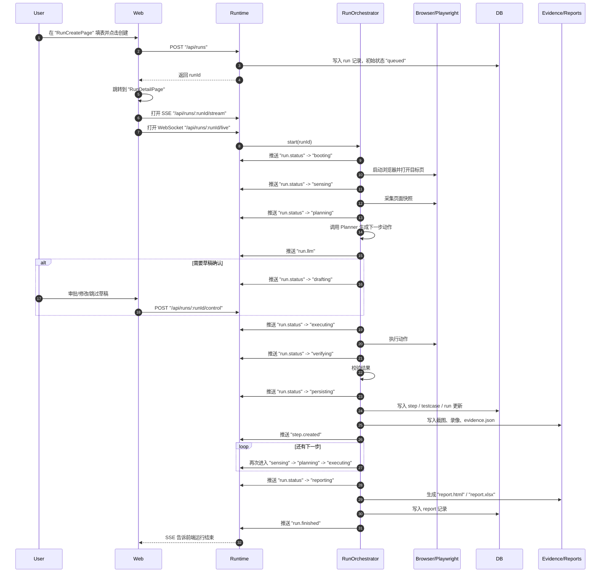

# QPilot Studio 运行全过程图解版（RUN LIFECYCLE 101）

如果你现在还不熟悉“请求、响应、端口、长连接、JSON、数据库、DOM、OCR”这些最基础的词，请先看 [FOUNDATIONS-101.zh-CN.md](./FOUNDATIONS-101.zh-CN.md)。  
那份文档更适合完全小白先补地基。

如果你想先看一份“从项目全貌、架构、OCR、ORM 一直讲到怎么自己从 0 做出来”的总手册，请先看 [FROM-0-TO-1.zh-CN.md](./FROM-0-TO-1.zh-CN.md)。  
当前这份文档保留为运行生命周期专题，重点讲一次 run 怎么从创建走到结束。

## 这份文档适合谁

这份文档写给“完全零基础，但想知道一次运行到底怎么从点按钮走到生成报告”的读者。

如果你现在还不熟悉前端、后端、接口、长连接这些词，建议先看 [ARCHITECTURE-101.zh-CN.md](./ARCHITECTURE-101.zh-CN.md)；如果你已经知道基本概念，只是想把一次 run 的生命过程彻底看明白，这份文档就是给你的。

## 先记住 6 个名字

### `Run`

`Run` 可以理解成“一次完整任务”。  
比如你在界面里填了“打开登录页，验证能不能登录”，然后点创建运行，这一整次过程就是一个 `Run`。

### `Step`

`Step` 可以理解成“一次具体动作”。  
比如“输入用户名”“点击登录按钮”“等待页面加载”，每一个都可能变成一个 `Step`。

### `REST`

`REST` 全称是 `Representational State Transfer`，这里你可以先把它理解成“普通接口请求”。  
最像你在柜台上交一张单子，柜员处理完，再把结果一次性还给你。

### `SSE`

`SSE` 全称是 `Server-Sent Events`，中文可以理解成“服务器持续往前端推送事件的长连接”。  
最像你交完单子以后，不用反复追问，而是柜员有新进展就主动喊你一声。

### `WebSocket`

`WebSocket` 可以理解成“专门用来持续传输实时数据的长连接”。  
在这个项目里，它主要拿来传浏览器实时画面，而不是拿来发业务状态。

### `Playwright`

`Playwright` 是一个浏览器自动化工具。  
你可以把它理解成“真正替 AI 去打开网页、找按钮、输入内容、点击页面的执行手”。

## 先看一张总图



## 再看一张数据流图

```mermaid
flowchart LR
    U["用户"] --> W["Web 前端<br/>表单、详情页、实时面板"]
    W -->| "REST: 创建/暂停/恢复/查询" | R["Runtime 服务"]
    W -->| "SSE: run.status / run.llm / step.created / run.finished" | R
    W -->| "WebSocket: run.frame / run.metric" | R
    R --> O["RunOrchestrator<br/>运行主循环"]
    O --> P["Playwright 浏览器"]
    P --> S["页面快照<br/>截图、标题、URL、元素信息"]
    O --> L["Planner / Executor / Verifier"]
    O --> DB["SQLite / Drizzle<br/>runs、steps、reports 等"]
    O --> E["Artifacts 文件夹<br/>evidence.json、截图、视频"]
    O --> RP["Reports 文件夹<br/>report.html、report.xlsx"]
    DB --> R
    E --> R
    RP --> R
    R --> W
```

## 0. 先把“状态”和“阶段”分开

### 这是什么

很多新手第一次看运行详情页，会把 `status` 和 `phase` 混在一起。

- `status` 是这次 run 的“大结局”
- `phase` 是这次 run 此刻“正在演哪一幕”

### 为什么要分开

因为一个 run 在结束前，几乎一直都处于 `running`。  
但它在 `running` 里面，还会不断经过 `booting`、`planning`、`executing`、`verifying` 这些不同阶段。

如果不把这两个概念拆开，你就会看到“明明一直都是 running，为什么页面内容在一直变”。

### 在 QPilot Studio 里它是谁

- `status` 枚举定义在 `packages/shared/src/schemas.ts`
  - `queued / running / passed / failed / stopped`
- `phase` 枚举也定义在 `packages/shared/src/schemas.ts`
  - `queued / booting / sensing / planning / drafting / executing / verifying / paused / manual / persisting / reporting / finished`

### 你在界面上会看到什么

- 列表页里更常看见的是 `status`
- 详情页顶部、实时画面、步骤推进过程中更常看见的是 `phase`

你可以把它记成：

- `status` 像“考试最终成绩”
- `phase` 像“现在正在答哪一道题”

### 对应代码入口

- `packages/shared/src/schemas.ts`
- `apps/web/src/store/run-stream.ts`
- `apps/web/src/pages/RunDetailPage.tsx`

## 1. 从 `RunCreatePage` 填表开始

### 这一步在干什么

用户进入 `RunCreatePage` 页面，填写本次运行的输入信息，比如：

- 选择项目 `projectId`
- 填目标地址 `targetUrl`
- 选择模式 `mode`
- 写运行目标 `goal`
- 设置最多步数 `maxSteps`
- 选择执行模式 `executionMode`
- 是否需要草稿确认 `confirmDraft`
- 是否打开有头浏览器 `headed`
- 是否允许人工接管 `manualTakeover`
- 是否复用会话 `sessionProfile / saveSession`

这一步本质上是在把“人类想让系统做什么”整理成一份结构化请求。

### 为什么这一步要先做

因为 runtime 不是读心术。  
它必须先知道目标网址、目标任务、运行模式、最大步数、是否允许人工介入，才能决定后面怎么跑。

### 在 QPilot Studio 里它是谁

- 页面组件：`apps/web/src/pages/RunCreatePage.tsx`
- 真正发请求的方法：`apps/web/src/lib/api.ts` 里的 `createRun`

### 你在界面上会看到什么

你看到的是一个“创建运行”的表单页。  
但从系统角度看，这一页的真正作用是把自由描述转成一份标准化 payload。

### 对应代码入口

- `apps/web/src/pages/RunCreatePage.tsx`
- `apps/web/src/lib/api.ts`

## 2. 前端发出的第一个请求是什么

### 这一步在干什么

用户点下创建按钮后，前端会调用：

- `api.createRun(payload)`

然后发出一条普通接口请求：

- `POST /api/runs`

这就是这次 run 的第一条正式请求。

### 为什么第一条不是 SSE 或 WebSocket

因为在 run 还没创建成功之前，前端连 `runId` 都还没有。  
没有 `runId`，就不知道该订阅哪一条运行流，也不知道该去看哪一个实时画面。

所以顺序一定是：

1. 先用 `REST` 请求创建 run
2. 拿到 `runId`
3. 再打开 SSE 和 WebSocket

### 在 QPilot Studio 里它是谁

前端调用点：

- `apps/web/src/pages/RunCreatePage.tsx`
- `apps/web/src/lib/api.ts`

后端接收点：

- `apps/runtime/src/server/routes/runs.ts`

### 你在界面上会看到什么

创建成功后，前端会立刻跳转到：

- `/runs/:runId`

也就是运行详情页 `RunDetailPage`。

### 对应代码入口

- `apps/web/src/pages/RunCreatePage.tsx`
- `apps/web/src/lib/api.ts`
- `apps/runtime/src/server/routes/runs.ts`

## 3. runtime 收到请求后先写什么、再做什么

### 这一步在干什么

`runtime` 收到 `POST /api/runs` 后，不是马上启动浏览器，而是先做一组“建档动作”。

它大致按这个顺序做事：

1. 检查当前 runtime 是否已经在忙
2. 校验请求体格式
3. 检查项目是否存在
4. 如果用户这次带了用户名密码，就先加密后更新到项目记录里
5. 组装 `runConfig`
6. 往数据库 `runs` 表插入一条新 run，初始状态是 `queued`
7. 把新建好的 run 返回给前端
8. 用 `setTimeout(..., 0)` 异步启动 `orchestrator.start(runId)`

### 为什么不是先开浏览器

因为系统要先把“这次任务是谁、配置是什么、数据库里的身份是什么”登记清楚。

你可以把它理解成：

- 先建工单
- 再派工

如果直接开浏览器，后面出错时你甚至不知道这一次属于谁，也很难恢复、暂停、重连、查历史。

### 在 QPilot Studio 里它是谁

最关键的两个位置是：

- `insertRun(...)`：先把 run 写进数据库
- `orchestrator.start(runRow.id)`：再真正开始执行

### 你在界面上会看到什么

前端很快就能拿到一个 run 对象，所以页面可以先跳到详情页。  
这时浏览器可能还没完全启动，但 run 已经“有编号了”。

### 对应代码入口

- `apps/runtime/src/server/routes/runs.ts`
- `apps/runtime/src/db/schema.ts`
- `apps/runtime/src/db/migrate.ts`

## 4. 浏览器是什么时候启动的

### 这一步在干什么

真正的浏览器不是在 `POST /api/runs` 路由里启动的，而是在 `RunOrchestrator.start(runId)` 里启动的。

进入主循环后，orchestrator 会先发出：

- `phase: "booting"`

然后创建这次 run 的产物目录和报告目录，再启动 Playwright 浏览器，打开目标页面，并准备视频录制、会话复用、实时直播等能力。

### 为什么要把“创建 run”和“启动浏览器”拆开

因为这是两种完全不同的事情：

- 创建 run：是业务登记
- 启动浏览器：是实际执行

拆开以后，前端可以更早拿到 runId，用户也能更早进入详情页，同时后端的执行链路更清晰。

### 在 QPilot Studio 里它是谁

- 主循环：`apps/runtime/src/orchestrator/run-orchestrator.ts`
- 浏览器执行器：`apps/runtime/src/playwright/`

### 你在界面上会看到什么

刚进详情页时，你通常会看到 run 进入：

- `booting`

如果实时画面已经连上，你会看到浏览器窗口开始被打开；如果还没连上，稍后也会补上。

### 对应代码入口

- `apps/runtime/src/orchestrator/run-orchestrator.ts`
- `apps/runtime/src/server/live-stream-hub.ts`

## 5. 页面快照、Planner、Executor、Verifier 分别在什么时候出场

### 这一步在干什么

这是整个系统最核心的一段循环。  
你可以把它记成四连拍：

1. 看一眼页面
2. 想下一步怎么做
3. 真正去做
4. 检查做成没

在代码里对应：

- 页面快照 `Page Snapshot`
- 规划器 `Planner`
- 执行器 `Executor`
- 校验器 `Verifier`

### 为什么要拆成四个角色

因为“看”“想”“做”“验”是四种不同工作。

如果不拆开，系统就会变成一团混在一起的黑盒，很难知道：

- 是页面没看清
- 还是规划想错了
- 还是点击没点上
- 还是点上了但结果不符合预期

### 在 QPilot Studio 里它是谁

页面快照：

- `collectPageSnapshot(...)`
- 文件位置：`apps/runtime/src/playwright/collector/page-snapshot.ts`

规划器：

- `apps/runtime/src/llm/planner.ts`

执行器：

- `apps/runtime/src/playwright/executor/action-executor.ts`

校验器：

- `apps/runtime/src/playwright/verifier/basic-verifier.ts`

### 你在界面上会看到什么

详情页里的 phase 往往会这样变化：

- `sensing`：系统正在观察当前页面
- `planning`：系统把快照和目标交给 Planner，请它生成动作草案
- `executing`：系统正在点、输、选、跳转、等待
- `verifying`：系统正在确认刚才动作是否真的达成了目标

### 对应代码入口

- `apps/runtime/src/playwright/collector/page-snapshot.ts`
- `apps/runtime/src/llm/planner.ts`
- `apps/runtime/src/playwright/executor/action-executor.ts`
- `apps/runtime/src/playwright/verifier/basic-verifier.ts`
- `apps/runtime/src/orchestrator/run-orchestrator.ts`

### 补充 1：页面快照到底不是“只截一张图”

很多人看到 `collectPageSnapshot(...)`，会误以为它只是“拍了一张截图”。
其实不是。

它至少会把下面几类信息打包成一个 `PageSnapshot`：

- 当前 URL
- 当前标题
- 当前截图路径
- 当前采集到的元素列表
- 当前页面状态 `pageState`

也就是说，Planner 看到的并不是“只有一张图片”，而是“截图 + 元素 + 页面归类”的组合包。

### 补充 2：元素采集层到底在采什么

`collectInteractiveElements(...)` 会扫描主页面和 iframe。

它重点关心的是两类东西：

1. 明显可交互的元素
   例如：
   - `a`
   - `button`
   - `input`
   - `select`
   - `textarea`
   - 带 `role='button'` 这类可点击角色的节点
2. 能帮助理解页面结构的元素
   例如：
   - 标题
   - `form`
   - `section`
   - `nav`
   - 模态框根节点
   - 带 `aria-label`、`title` 的节点

它不是把 DOM 原封不动全塞给后面，而是会做几件整理工作：

- 去重
- 打分
- 排序
- 限量

这样做的原因很简单：

- 页面太大时，全部塞进去会让上下文失控
- iframe 太多时，必须先把最重要的元素排前面
- 弹窗、密码框、登录入口这类元素通常比普通装饰元素更重要

所以“页面检测”并不是无脑扫全页面，而是先做一轮工程化压缩。

### 补充 3：页面到底是怎么被判断成“登录页”或“搜索结果页”的

`summarizePageState(...)` 会把快照里的信号再归纳成一个 `PageState`。

它会综合看这些信息：

- URL host
- 页面标题
- 元素文本
- `aria-label`
- `placeholder`
- 有没有密码框
- 有没有账号输入框
- 有没有 iframe
- 有没有 modal / dialog
- 有没有搜索结果信号
- 有没有第三方登录信号
- 有没有安全校验信号

最后会把页面归成这几类 `surface` 之一：

- `generic`
- `modal_dialog`
- `login_chooser`
- `login_form`
- `provider_auth`
- `search_results`
- `security_challenge`
- `dashboard_like`

这一步很重要，因为后面的 Planner 和 Verifier 都会用这份分类结果。

生活类比：

- 元素列表像病人的原始症状
- `pageState` 像医生先给出的分诊结论

### 补充 4：为什么还要有 `page-guards.ts`

因为真实网页里，经常不是“页面功能坏了”，而是“页面被遮住了”。

比如：

- cookie banner
- 登录弹窗
- 遮罩层
- 验证码
- 安全校验
- 登录墙

`page-guards.ts` 做的就是两件事：

1. 尽量自动清障
   例如尝试点掉关闭按钮、接受 cookie 提示
2. 检测当前是不是已经进入必须人工介入的阻断页

所以它更像“场地清障员”。
先把明显挡路的东西处理掉，自动化动作才更有机会成功。

### 补充 5：Verifier 为什么还要重新看一遍页面

动作执行完以后，系统不会只因为“click 没报错”就当它成功了。

`basic-verifier.ts` 会重新收集元素、重新总结 `pageState`，再结合：

- URL 有没有变化
- 预期检查项有没有命中
- 当前页面类型有没有朝目标方向变化

来判断刚才这一步到底算不算通过。

比如：

- 点“登录”后，页面进入 `login_form`，那说明这个点击大概率是有效的
- 点按钮后 URL 变了，说明导航可能成功了
- 等待一会儿后从 `generic` 变成了 `modal_dialog` 或 `search_results`，也可能说明页面确实有了反应

### 补充 6：为什么还有 OCR 兜底

有些页面的按钮文字明明肉眼看得见，但 DOM 结构并不好用：

- 选择器很乱
- 文本被包在复杂节点里
- 页面是画出来的，不是规整表单

这时 `visual-targeting.ts` 会用 `OCR`，也就是 `Optical Character Recognition`，中文可以理解成“光学字符识别”，从截图里读文字，再辅助找出点击位置。

所以它不是主流程的第一选择，而更像“普通 DOM 定位不稳时的备用雷达”。

### 补充 7：检测链每一层的输入和输出到底是什么

很多人看源码时会被“这么多层函数”绕晕，本质上是不知道每一层到底拿什么、吐什么。

你可以先按下面这张表记：

| 层 | 输入 | 输出 | 它解决什么问题 |
| --- | --- | --- | --- |
| `collectInteractiveElements` | `page` / `frame` | `InteractiveElement[]` | 把页面里重要元素摘出来 |
| `summarizePageState` | `url` + `title` + `elements` | `PageState` | 判断当前页面更像登录页、搜索结果页还是安全拦截页 |
| `collectPageSnapshot` | `page` + 采集参数 | `PageSnapshot` | 把截图、元素、页面状态打包成一次快照 |
| `planner.ts` | `PageSnapshot` + `goal` + `runConfig` | `LLMDecision` | 决定下一步动作和预期检查项 |
| `action-executor.ts` | `Action` + `page` | 动作执行结果 | 真正去点、输、跳、等 |
| `basic-verifier.ts` | 动作前后页面 + 预期检查项 | `VerificationResult` 的页面侧部分 | 判断页面有没有往预期方向变化 |
| `traffic-verifier.ts` | 当前 step 的网络证据 + 预期请求 | `ApiVerificationResult` | 判断 API 请求有没有符合预期 |
| `run-orchestrator.ts` | 上面所有结果 | `stepRow` / `run status` / 证据写入 | 把这一步变成真正的运行记录 |

如果你现在只能先记住一句，那就记：

- 元素层负责“抄下来”
- 页面状态层负责“归类”
- Planner 负责“想下一步”
- Executor 负责“真的去做”
- Verifier 负责“判断有没有做成”
- Orchestrator 负责“把这一切串起来并落盘”

### 补充 8：Verifier 不只看页面，还会看 API

很多新手会以为：

- “验证成功”就是按钮点到了

其实在这个项目里，验证经常分两路：

1. UI 路
   看页面有没有变化
2. API 路
   看相关网络请求有没有按预期发生

这就是为什么运行过程中不仅会保存截图和页面状态，还会保存网络证据。

`traffic-verifier.ts` 会把当前 step 关联到的网络请求拿出来，重点检查：

- 有没有相关的 `xhr / fetch / document` 请求
- 有没有失败请求
- 有没有命中预期请求断言
- 返回里有没有 token / session 这类信号
- 前后 host 有没有切换

然后把这部分结果整理成：

- `ApiVerificationResult`

再和页面侧验证一起并入总的 `VerificationResult`。

生活类比：

- UI 验证像看“门是不是打开了”
- API 验证像看“后台有没有真的去登记开门记录”

两边都看，系统就不容易被“页面表面看起来变了，但后台其实没完成”这种情况骗过去。

## 6. SSE 怎么把状态推回前端

### 这一步在干什么

`SSE` 全称是 `Server-Sent Events`。  
它在这里负责把“这次 run 的业务进展”持续推回前端。

详情页打开后，前端会创建：

- `new EventSource("/api/runs/:runId/stream")`

后端这条路由会把 HTTP 连接保持不断开，然后不断往里面写事件。

### 为什么这里用 SSE

因为 SSE 很适合“后端持续推送，前端持续接收”的场景。

这个项目里的状态更新，天然就是单向流动：

- runtime 知道最新阶段
- web 只负责展示

所以 SSE 很合适，也比“前端每隔 1 秒轮询一次”更自然。

### 在 QPilot Studio 里它是谁

后端：

- 路由：`/api/runs/:runId/stream`
- Hub：`apps/runtime/src/server/sse-hub.ts`

前端：

- `api.createRunStream(runId)`
- `RunDetailPage` 里注册事件监听

具体监听的核心事件包括：

- `run.status`
- `run.llm`
- `step.created`
- `testcase.created`
- `run.finished`
- `run.error`

这些名字定义在：

- `packages/shared/src/constants.ts`

### 你在界面上会看到什么

你不用手动刷新页面，详情页就会自己更新：

- 当前 phase 变了
- 最新 LLM 决策出来了
- 新 step 加到了步骤列表里
- 运行结束后状态自动切到最终结果

另外，`SseHub` 每 15 秒还会发一次 `ping`，让前端知道连接还活着。

### 对应代码入口

- `packages/shared/src/constants.ts`
- `apps/runtime/src/server/sse-hub.ts`
- `apps/runtime/src/server/routes/runs.ts`
- `apps/web/src/lib/api.ts`
- `apps/web/src/pages/RunDetailPage.tsx`

## 7. WebSocket 怎么把实时画面推回前端

### 这一步在干什么

`WebSocket` 在这里主要负责“传实时浏览器画面”。

前端会连接：

- `/api/runs/:runId/live`

连接成功后，runtime 会把浏览器当前画面持续编码后发给前端。  
前端收到后，把图片数据画到 `canvas` 上，于是你在界面里看到“直播中的浏览器”。

### 为什么这里不用 SSE

因为实时画面比普通状态消息重得多。  
它不只是几个文字字段，而是不断来的图像帧和指标信息。

这个场景更像“视频流”或“实时屏幕投送”，所以更适合用 WebSocket。

### 在 QPilot Studio 里它是谁

后端：

- WebSocket 路由：`apps/runtime/src/server/routes/live.ts`
- 直播中枢：`apps/runtime/src/server/live-stream-hub.ts`

前端：

- `apps/web/src/lib/api.ts` 的 `createRunLiveSocket`
- `apps/web/src/components/LiveRunViewport.tsx`

共享消息结构：

- `packages/shared/src/schemas.ts`

后端发出的消息主要有两类：

- `run.frame`：一帧画面
- `run.metric`：帧率、采集耗时、观看人数、传输方式等指标

### 你在界面上会看到什么

你会在详情页的实时面板里看到：

- 浏览器当前画面
- 当前步骤号
- 当前 phase
- 帧率
- 是否是 `screencast` 还是 `snapshot` 回退模式

如果实时流暂时断了，组件还会尝试重连；如果拿不到实时帧，界面还能退回到已保存截图。

### 对应代码入口

- `apps/runtime/src/server/routes/live.ts`
- `apps/runtime/src/server/live-stream-hub.ts`
- `apps/web/src/components/LiveRunViewport.tsx`
- `packages/shared/src/schemas.ts`

## 8. Step 为什么会落库，证据为什么会落文件

### 这一步在干什么

当一次动作执行完并且校验完，系统会进入：

- `persisting`

也就是“保存阶段”。

在这一阶段里，系统不会只保存一种东西，而是会分成两条线一起落地：

- 结构化数据进数据库
- 大体积证据进文件夹

### 为什么要分成数据库和文件夹

因为它们适合保存的东西不一样。

数据库适合放“方便查、方便筛选、方便列表展示”的结构化数据，比如：

- run 基本信息
- step 记录
- testcase 记录
- report 记录

文件夹适合放“体积大、不适合硬塞进表里”的证据，比如：

- 截图
- 视频
- `evidence.json`
- 生成好的 HTML / XLSX 报告

### 在 QPilot Studio 里它是谁

数据库部分：

- `apps/runtime/src/db/schema.ts`
- `apps/runtime/src/server/routes/runs.ts`
- `apps/runtime/src/orchestrator/run-orchestrator.ts`

证据文件部分：

- `apps/runtime/src/server/evidence-store.ts`

具体路径长这样：

- 证据文件：`artifacts/runs/<runId>/evidence.json`
- 录制视频：`/artifacts/runs/<runId>/video/...`
- 报告文件：`reports/runs/<runId>/report.html`
- 报告表格：`reports/runs/<runId>/report.xlsx`

### 你在界面上会看到什么

这就是为什么详情页既能：

- 很快列出步骤和状态

又能：

- 展示截图
- 回放画面
- 打开报告
- 查看网络证据

因为这些内容本来就不是存放在同一个地方的。

### 对应代码入口

- `apps/runtime/src/db/schema.ts`
- `apps/runtime/src/server/evidence-store.ts`
- `apps/runtime/src/orchestrator/run-orchestrator.ts`

### 补充：这一步里的 ORM 到底是谁

这一步最容易让新手误会成：

- “系统把数据随手写进了数据库”

其实中间还有一层 `ORM`。

`ORM` 全称是 `Object-Relational Mapping`，中文可以理解成“对象关系映射”。
在这个项目里，用的是：

- `Drizzle ORM`

你可以把这一层理解成“运行逻辑”和“SQLite 数据库文件”之间的翻译器。

在 QPilot Studio 里，这三份文件的职责要分开看：

- `apps/runtime/src/db/client.ts`
  负责创建数据库连接，并把它包装成 Drizzle 的 `db` 对象
- `apps/runtime/src/db/schema.ts`
  负责描述表结构，例如 `runsTable`、`stepsTable`、`reportsTable`
- `apps/runtime/src/db/migrate.ts`
  负责真正建表、补列，让数据库文件长成程序期望的样子

所以当运行进入 `persisting` 时，背后通常不是一段神秘黑盒，而是这种比较直白的动作：

- `db.insert(stepsTable).values(stepRow)`
- `db.update(runsTable).set(...)`
- `db.insert(reportsTable).values(...)`

这就是为什么你在 `run-orchestrator.ts` 和 `routes/runs.ts` 里会看到一堆 `.insert(...)`、`.select(...)`、`.update(...)`。

### 补充：为什么 `evidence-store.ts` 不走 ORM

因为 `evidence-store.ts` 管的很多东西本来就不适合进数据库表。

比如：

- 控制台日志集合
- 网络证据集合
- planner trace
- `evidence.json`

这些内容通常：

- 体积更大
- 结构更灵活
- 更适合作为整包证据文件保存

所以它走的是“文件系统 + JSON”这条线，而不是“关系表 + ORM”这条线。

### 补充：一次 step 持久化时，通常会写到哪些表和文件

新手很容易以为：

- “保存一步” = 往数据库里插一行

实际上一整步结束后，系统可能会同时碰到好几个存储位置。

你可以先按下面这张表记：

| 存储位置 | 什么时候写 | 大概写什么 |
| --- | --- | --- |
| `runsTable` | run 创建、状态变化、启动页更新、报错、结束时 | 当前状态、时间、最近 LLM、视频路径、错误信息 |
| `stepsTable` | 每次 step 完成并进入 `persisting` 时 | 当前页面摘要、动作、校验结果、截图路径 |
| `testCasesTable` | 本步或本次 run 需要沉淀测试用例时 | 模块、标题、步骤、预期、状态 |
| `reportsTable` | 运行完成并生成报告后 | `report.html`、`report.xlsx` 路径 |
| `caseTemplatesTable` | 成功 run 被提炼成模板后 | 可复用模板内容 `caseJson` |
| `artifacts/runs/<runId>/evidence.json` | 运行过程中不断刷新 | console、network、planner trace |
| `artifacts/runs/<runId>/...png` | 各次快照采集时 | 页面截图 |
| `artifacts/runs/<runId>/video/...` | 浏览器录制完成后 | 运行视频 |
| `reports/runs/<runId>/report.html` | reporting 阶段 | HTML 报告 |
| `reports/runs/<runId>/report.xlsx` | reporting 阶段 | Excel 报告 |

所以“持久化”其实不是单点动作，而更像一次“把这一步所有结果分别归档”的过程。

### 补充：不是每一步都会写满所有表

这点也很重要。

例如：

- `stepsTable` 几乎每一步都会写
- `testCasesTable` 不是每一步都一定写
- `reportsTable` 只有运行结束生成报告时才写
- `caseTemplatesTable` 一般是成功 run 才更可能写

所以你看到数据库里表很多，不代表每个 step 都会把每张表都改一遍。
更准确的理解是：

- 不同阶段，写不同层级的档案

## 9. 什么时候会停在 `drafting`

### 这一步在干什么

`drafting` 的意思不是“执行失败”，而是“系统已经想好了下一步动作，但这一步先不立刻执行，要把草稿亮给人看”。

你可以把它理解成：

- AI 已经写好了下一步
- 但现在进入的是“待审批”状态

### 为什么会进入这个阶段

常见原因有两类：

1. 当前执行模式就要求先出草稿，再等人确认
2. 当前这一步虽然能做，但系统希望给人一个介入点，让人决定：
   - 直接执行
   - 改一下再执行
   - 跳过
   - 重试

### 在 QPilot Studio 里它是谁

在 orchestrator 里，`resolveDraftAction(...)` 会：

1. 先把草稿存进内存里的 `activeDrafts`
2. 发出 `phase: "drafting"`
3. 如果 `awaitApproval` 为真，就挂起等待人的决定
4. 直到前端通过控制接口把决定发回来

前端把人的决定发到：

- `POST /api/runs/:runId/control`

### 你在界面上会看到什么

详情页会显示：

- 当前 phase 是 `drafting`
- 当前建议动作是什么
- 当前预期检查项是什么

如果允许编辑草稿，你还可以先改动作，再让它执行。

### 对应代码入口

- `apps/runtime/src/orchestrator/run-orchestrator.ts`
- `apps/runtime/src/server/routes/runs.ts`
- `apps/web/src/pages/RunDetailPage.tsx`

## 10. 什么时候会停在 `manual`

### 这一步在干什么

`manual` 的意思是“现在不是让你审批一个动作草稿，而是请你真的接管浏览器现场处理一下”。

这和 `drafting` 完全不是一回事。

- `drafting`：人在决定“下一步动作要不要执行”
- `manual`：人在真的操作浏览器，帮系统脱困

### 为什么会进入这个阶段

最典型的情况是：

- 出现验证码
- 出现安全校验
- 出现登录墙
- 出现必须真人处理的阻断页面

这时 AI 继续硬点往往没用，甚至会把局面越弄越糟。  
所以系统会暂停自动化，把现场交给人。

### 在 QPilot Studio 里它是谁

orchestrator 里的 `waitForManualTakeover(...)` 会：

1. 先对当前卡住的页面拍一张快照
2. 保存当下的证据
3. 发出 `phase: "manual"`，并标记 `manualRequired: true`
4. 最长等待 10 分钟
5. 人处理完成后，再拍一张恢复后的快照
6. 把 phase 切回 `sensing`，继续后续链路

### 你在界面上会看到什么

你会看到：

- phase 变成 `manual`
- 页面提示当前需要人工处理
- 浏览器现场仍然保留着

等你处理完，系统会从新的页面状态继续往下跑，而不是从头开始。

### 对应代码入口

- `apps/runtime/src/orchestrator/run-orchestrator.ts`
- `apps/web/src/pages/RunDetailPage.tsx`

## 11. run 结束后报告怎么生成

### 这一步在干什么

当主循环结束后，系统会先得出最终结论：

- `passed`
- `failed`
- 或者 `stopped`

接着进入：

- `reporting`

这一步的核心工作是把本次运行已经收集到的结构化数据和证据文件整理成可读报告。

### 为什么报告不是边跑边生成

因为报告不是“实时 UI 状态”，而是“事后整理结果”。

只有当系统知道：

- 最终状态是什么
- 一共有多少步
- 哪些检查通过了
- 哪些失败了
- 证据文件落在哪里

它才能生成一份完整、稳定、可分享的报告。

### 在 QPilot Studio 里它是谁

orchestrator 会调用 `generateRunReports(runId)`，然后生成：

- `report.html`
- `report.xlsx`

并把路径写入数据库 `reports` 表。

对外查询接口是：

- `GET /api/runs/:runId/report`

### 你在界面上会看到什么

运行结束后，详情页可以显示：

- 最终状态
- 步骤结论
- 报告入口

如果这次运行最终 `passed`，系统还可能继续做一件额外的事：把成功运行提炼成可复用 case。

### 对应代码入口

- `apps/runtime/src/orchestrator/run-orchestrator.ts`
- `apps/runtime/src/server/routes/runs.ts`
- `packages/report-core`

## 12. 一张“用户动作 -> API -> runtime 模块 -> 页面变化”的总表

| 用户动作 | 前端发什么 | runtime 谁处理 | 后面发生什么 | 页面上你看到什么 |
| --- | --- | --- | --- | --- |
| 在创建页点“创建运行” | `POST /api/runs` | `routes/runs.ts` | 写入 `runs` 表，异步启动 orchestrator | 页面跳到详情页 |
| 详情页打开 | `GET /api/runs/:runId`、`GET /steps`、`GET /evidence` | `routes/runs.ts` | 先把已有 run、步骤、证据补给前端 | 页面先有基础信息 |
| 详情页进入实时订阅 | `EventSource /api/runs/:runId/stream` | `SseHub` | 订阅运行事件流 | phase、step、LLM 信息会自动刷新 |
| 详情页进入实时画面 | `WebSocket /api/runs/:runId/live` | `live-stream-hub.ts` | 建立直播连接并发送画面帧 | 看到浏览器直播画面 |
| runtime 启动浏览器 | 无新增前端请求 | `RunOrchestrator.start` | 创建目录、起 Playwright、进 `booting` | phase 变成 `booting` |
| runtime 采集页面 | 无新增前端请求 | `collectPageSnapshot` + `collectInteractiveElements` + `summarizePageState` | 截图、读标题、读 URL、抽取元素、归类页面类型 | phase 变成 `sensing` |
| runtime 请求 AI 出下一步 | 无新增前端请求 | `planner.ts` | 生成动作草案与预期检查 | phase 变成 `planning`，LLM 面板更新 |
| 需要草稿确认 | 用户点击审批按钮后 `POST /api/runs/:runId/control` | `resolveDraftAction` + `routes/runs.ts` | 等待人确认、修改或跳过 | phase 变成 `drafting` |
| 执行动作 | 无新增前端请求 | `action-executor.ts` | 真正操作浏览器 | phase 变成 `executing` |
| 校验动作结果 | 无新增前端请求 | `basic-verifier.ts` | 判断动作是否成功 | phase 变成 `verifying` |
| 校验相关 API 证据 | 无新增前端请求 | `traffic-verifier.ts` | 判断请求是否命中预期、是否有失败请求、是否有 token/session 信号 | 验证面板里的 API 结果更新 |
| 保存步骤和证据 | 无新增前端请求 | `run-orchestrator.ts` + `Drizzle ORM` + `evidence-store.ts` | step 入库，结构化数据写表，证据写文件 | 步骤列表新增一项，截图/证据可见 |
| 遇到必须真人处理的问题 | 用户现场处理后点恢复/继续 | `waitForManualTakeover` | 暂停自动化，等人接管，再恢复 | phase 变成 `manual` 后再回到 `sensing` |
| 运行结束 | 前端继续收 SSE 事件 | `generateRunReports` | 生成 HTML/XLSX 报告并发 `run.finished` | 页面显示最终结果与报告入口 |

## 最后，把全过程再压缩成一句人话

一次 run 的本质，其实就是下面这条链：

1. 人在前端填目标
2. 前端用 `POST /api/runs` 建一条 run
3. runtime 先登记 run，再启动 orchestrator
4. orchestrator 启动浏览器
5. 系统循环执行“看页面 -> 想动作 -> 做动作 -> 验结果 -> 存证据”
6. 前端一边通过 `SSE` 收业务状态，一边通过 `WebSocket` 收实时画面
7. 跑完以后，runtime 生成报告并发出 `run.finished`

如果你已经读完这份文档，下一步最推荐你去对照源码的顺序是：

1. `apps/web/src/pages/RunCreatePage.tsx`
2. `apps/web/src/lib/api.ts`
3. `apps/runtime/src/server/routes/runs.ts`
4. `apps/runtime/src/orchestrator/run-orchestrator.ts`
5. `apps/web/src/pages/RunDetailPage.tsx`
6. `apps/web/src/components/LiveRunViewport.tsx`

如果你想先补概念，再回来重看全过程，回到 [ARCHITECTURE-101.zh-CN.md](./ARCHITECTURE-101.zh-CN.md)。  
如果你想专门补数据库与落库链，继续看 [DB-ORM-101.zh-CN.md](./DB-ORM-101.zh-CN.md)。  
如果你想专门补页面检测与校验链，继续看 [PAGE-DETECTION-101.zh-CN.md](./PAGE-DETECTION-101.zh-CN.md)。  
如果你想看完整工程全景，继续看 [ARCHITECTURE.zh-CN.md](./ARCHITECTURE.zh-CN.md)。
