# QPilot Studio《从电脑零基础到公网部署与业务实战》超级总手册

> 这份文档是给“很多基础词还不稳，但又真的想把 QPilot Studio 弄明白、跑起来、部署出去、真正会用”的人写的。
>
> 你不用假装自己已经懂前端、后端、部署、OCR、ORM、Playwright、Nginx。
> 这本书会默认你很多地方都还不会，然后一步一步把概念、页面现象、命令、配置、代码入口和真实业务串起来。

## 为什么这一版要整份重写

前一版最大的问题不是“不够长”，而是“不够通”。

它虽然已经写了很多内容，但你指出的两个问题都很成立：

1. 后半段出现了真实乱码，说明它已经不能继续当可靠教材用了。
2. 前半段有不少“这个词是什么、那个词是什么”的模板化堆叠，但没有把这些词真正放回一条连续链路里解释。

所以这一次的目标不是“补丁式修一修”，而是从写法上彻底换思路：

- 不再把术语一个个孤零零摆出来让你背
- 不再让同一套句式换个名词重复几十遍
- 不再只讲抽象定义，不讲它为什么会在你真实操作中冒出来

新的总手册会一直围绕下面这条原则展开：

**先讲你眼前看到了什么，再讲背后发生了什么，再讲这在仓库里对应谁，最后讲如果坏了你该先查什么。**

## 这本书真正要帮你学会什么

如果你读完以后只能背几个名词，那这本书就算失败。

我真正想帮你建立的能力是：

1. 你能分清网页、后端、浏览器自动化、数据库、文件证据、模型接口分别是什么。
2. 你能知道 QPilot 里的问题为什么不能一股脑都怪到“AI 不行”或者“代码坏了”。
3. 你能把“页面、命令、配置、日志、源码”连成一条逻辑链。
4. 你能自己把本地项目搬到服务器，并且知道“部署成功”和“业务跑通”不是同一回事。
5. 你能在失败时先分层，而不是在所有文件里乱找。

## 这本书的结构不是普通教程，而是三层叠加

你可以把这本书理解成三部分叠在一起：

1. 主叙事
   先用人话把整个系统讲顺，让你脑子里先有一张大地图。
2. 专题正文整合
   把已经整理好的基础、架构、生命周期、部署、数据库、页面检测等专题正文合到一份里，省得你来回跳文档。
3. 源码附录
   当你想把“文档里说的东西”和“真实代码”一一对上时，可以直接翻到后面看关键文件。

这样做的原因很简单：

- 小白第一次学时，需要的是连续叙事
- 真开始动手时，需要的是专题展开
- 真想定位实现时，需要的是源码锚点

把这三层放在一个文件里，才更像一本真正能从 0 一路读下去的总手册。

## 先把你这次真实经历讲成一条完整故事

你这次其实已经走完了一条非常典型、也非常有教学价值的路线。

这条路线不是抽象案例，而是几乎所有第一次把本地项目搬到公网的小白都会经历的完整过程：

- 一开始看文档，感觉“每个词都好像懂一点，但连不起来”
- 真正去买云服务器，才发现“选 Windows 还是 Ubuntu”会影响后面所有步骤
- 开始装 Node、pnpm、Nginx、Git
- 拉代码、装依赖、配 `.env`
- 装 Playwright 和 Chromium 时遇到 `dpkg lock`
- 起 runtime 时又遇到 `ts-node` 缺失
- 前端 `build` 时又发现 2G 机器根本不够用
- 公网 IP 能打开网页，却发现页面顶部还在连 `localhost:8787`
- run 真的开始跑了，又遇到 `headed` 浏览器缺 `XServer`
- 再往后，页面明明已经能打开了，却卡在模型调用前
- 最后才发现 `.env` 里真正生效的模型配置跟你以为的不是一回事

这条经历非常值得保留下来，因为它几乎可以当成整本书的主线案例。

### 这条故事真正教了你什么

它表面上是一串故障，实际上是在强迫你学会四件比命令更重要的事：

1. 本地和公网是两个不同世界
2. 网页能打开不代表系统已经全部通了
3. 浏览器问题、模型问题、Nginx 问题、前端构建问题根本不是同一类问题
4. 真实排错必须先分层，再下手

### 你以后最该反复回忆的，不是某条命令，而是“因果关系”

比如你这次碰到：

- 页面顶部还写 `localhost:8787`

这不是“后端没起来”，而是：

- 前端 build 时拿到的 `VITE_RUNTIME_BASE_URL` 还是本地地址

你后来碰到：

- `browserType.launch` 报错，要 XServer

这不是“Playwright 完全坏了”，而是：

- 你在没有图形桌面的 Linux 服务器上开了有头浏览器

你再后来碰到：

- 页面都已经打开了，但 run 在规划前失败

这也不是“浏览器不能访问目标站”，而更像是：

- 模型接口没通
- `OPENAI_BASE_URL` 配置错了
- 或者 `.env` 被覆盖了

这些都是因果关系。  
而学会因果关系，才是真正开始懂系统。

### 为什么我要一直拿你的真实过程举例

因为对完全小白来说，最难的不是定义，而是迁移。

很多文档会告诉你：

- 什么是前端
- 什么是后端
- 什么是数据库

但你真正会卡住的时刻通常是：

- 为什么我页面都能打开了，项目列表还是加载不了
- 为什么我改了配置却像没生效
- 为什么服务器一上来就和本地感觉完全不一样

只有把这些真实体验讲进去，知识才会“活”起来。

## 这本书该怎么读，才不会越读越乱

这本书虽然很长，但你不需要一次性从头看到尾。

### 如果你现在完全零基础

建议顺序是：

1. 先补电脑和 Web 地基
2. 再看架构角色
3. 再看 run 生命周期
4. 再看部署
5. 最后再回头看 OCR、ORM、源码附录

你现在最重要的目标，不是“把所有词背下来”，而是先建立一张地图：

- 用户在网页里做了什么
- 前端发了什么请求
- runtime 做了什么事
- Playwright 什么时候出场
- 数据什么时候进数据库
- 证据什么时候进文件夹
- 报告什么时候生成

### 如果你现在最着急的是把项目部署出去

那你可以这样跳读：

1. 先看本书前面的主叙事和问题分层图
2. 直接跳到部署专题整合正文
3. 遇到看不懂的词，再回到基础部分补

这样做的好处是：

- 你不会因为想解决一个具体问题，被整本书的长度吓到
- 但你也不会因为直接上手命令，而始终不明白自己在做什么

### 如果你现在最着急的是“为什么 run 失败”

那你优先读这些块：

- 运行生命周期
- 页面检测与 OCR
- 模型接口层
- 失败案例与排错思路

因为 run 失败通常不是“一个单点错”，而是下面几层里至少有一层没接上：

- 页面层
- runtime 层
- 浏览器执行层
- 模型接口层
- 数据持久化层

### 读这本书时最重要的习惯

每读到一个术语，都不要只问：

- 这是什么

还要多问三句：

1. 它在 QPilot 里是谁
2. 它如果出错，我会在哪个页面或命令里看到异常
3. 我能用哪一个最小动作验证它是不是正常

只要你一直这样读，整本书就不会变成死记硬背。

## 以后所有问题都先放进这张分层图

很多小白之所以一出故障就崩溃，不是因为不会命令，而是因为不知道先查哪一层。

所以在正式进入正文前，你先把下面这张图记住。

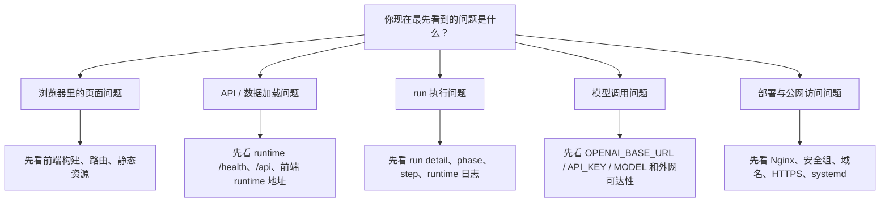

### 这张图怎么用

以后不要一看到报错就同时改 10 个地方。  
你先问自己：

- 这个问题最先暴露在浏览器页面里吗
- 还是最先暴露在后端日志里
- 还是最先暴露在模型接口请求里
- 还是最先暴露在 Nginx / 公网入口里

比如：

- 公网 IP 根本打不开网页
  先看 Nginx、安全组、公网入口
- 网页能打开，但顶部仍然写 `localhost:8787`
  先看前端构建配置
- `/health` 不通
  先看 runtime 是否真正启动
- 目标网站已经能打开，但 planner 还是失败
  先看模型接口配置
- `browserType.launch` 报错
  先看 Playwright 和图形环境

### 你现在最需要建立的能力，不是背更多词，而是先分层

因为同样叫“失败”，背后可能完全不是同一回事：

- 有的失败是页面没连上 API
- 有的失败是浏览器没能启动
- 有的失败是模型请求发不出去
- 有的失败是数据库或目录写不进去
- 有的失败只是前端 build 时用了旧配置

你只要先把问题放进正确层里，后面的排错难度就会下降很多。

---

## 先把“你在业务里到底会做什么”讲清楚

很多完全小白在第一次接触这类系统时，会出现一个很典型的困惑：

- 我看了很多概念
- 但我还是不知道打开网页以后到底该先做什么

所以在正式进入基础正文前，我先用用户视角把你的真实操作主线串一遍。

### 你真正面对的第一件事，不是代码，而是页面

你不会先接触：

- `server.ts`
- `schema.ts`
- `run-orchestrator.ts`

你真正先看到的是：

- 项目列表
- 创建运行的表单
- 运行详情页
- 证据区
- 报告页

这很重要，因为它决定了你学习这套系统的第一视角应该是：

- 我在页面里输入什么
- 系统收到这些输入后会发生什么
- 页面里哪个地方对应后端的哪个阶段

### 业务上的第一个核心动作，是“建项目”

项目不是装饰，它是 run 的容器。

你可以把项目理解成：

- 一组测试对象
- 一段持续积累的历史
- 一块上下文和环境设置的集合

比如你想测的是：

- 百度这类公开页面
- 一个登录页
- 一个后台管理站

它们都能创建 run，但你填的目标、环境、会话复用策略、后面的复跑方式都会不一样。

### 第二个核心动作，是“创建 run”

run 是这套系统里最重要的业务单位之一。  
它不只是“点一下开始”，而是一次完整任务的容器。

当你创建 run 时，你实际上是在告诉系统：

- 从哪个 URL 开始
- 我希望你完成什么目标
- 这次要不要开有头浏览器
- 要不要允许人工接管
- 用哪个 profile 或环境

页面里看起来只是几个输入框和开关，  
但对 runtime 来说，这是一份真正的执行请求。

### 第三个核心动作，是“看 run detail”

run detail 页是你以后最常待的地方。  
因为这里是“过程中心”，不是一个单纯的报错页。

你会在这里看到：

- status
- phase
- 当前页面
- step 列表
- 错误提示
- 证据入口
- 报告入口

你以后真正要学会的，不是“看见很多信息”，而是会判断：

- 它现在停在前端、runtime、浏览器、模型接口中的哪一层
- 它是不是已经打开了目标页
- 它是不是已经进入规划
- 它有没有真正产生 step 和证据

### 第四个核心动作，是“看 evidence”

证据不只是截图收藏夹。  
它真正的价值是帮你建立因果关系。

比如你会通过证据判断：

- 运行失败前，页面到底长什么样
- 系统当时看到了哪些元素
- 页面有没有被登录墙、验证码或弹窗拦住
- 某一步动作之后页面有没有真的变化

所以证据的意义不是“让页面更花”，而是：

- 帮你确认系统真的看到了什么
- 帮你确认错误到底发生在动作前还是动作后

### 第五个核心动作，是“看 report”

run detail 更像过程面板。  
report 更像结果总结。

你可以先这么理解：

- run detail：正在发生什么、刚才发生了什么
- report：最后应该怎么总结这次运行

所以以后你不要把它们混成一件事：

- 想排错，先看 run detail
- 想复盘，重点看 report

### 第六个核心动作，是“重跑和对比”

这一步代表你开始从“会点一次”进入“真正会用工具”。

因为业务里真正重要的不是某一次偶然跑通，  
而是：

- 再跑一次是不是还通
- 改完配置后结果有没有变好
- 两次报告差异是什么

这会帮你开始理解：

- 什么是稳定性
- 什么是可复现
- 什么是对比分析

### 所以你以后真正的学习主线应该是这样

1. 会在页面里完成最基础的业务动作
2. 会把每个动作对应到系统中的一个阶段
3. 会在失败时回到正确的层上查
4. 会用证据和报告，而不是只会刷新页面

当你做到这一步时，你就已经不是“只会看名词的小白”了。

## 第 2 章导读：先补电脑、网页和工程的地基

下面这一整段基础预备知识，不是可有可无的术语附录。  
它就是你后面能不能看懂服务器、Nginx、runtime、Playwright、数据库和模型接口的地基。

你这次之所以会反复觉得“好像每个词都懂一点，但一连起来就乱”，本质上就是地基还没有单独补出来。

所以读这一段时，别着急。  
你只需要反复做一件事：

- 把“文件、进程、服务、端口、请求、响应、JSON、数据库、DOM、iframe、OCR”这些词，
- 一个个放回 QPilot Studio 这套真实系统里去理解。

等你把这些基础稳住，后面的架构、部署和排错就会明显轻很多。

# QPilot Studio 零基础预备知识（FOUNDATIONS 101）

## 这份文档适合谁

这份文档写给下面这类读者：

- 你不是“代码小白中的稍微懂一点”，而是真的很多词都不熟
- 你看到“前端、后端、接口、进程、端口、JSON、数据库、DOM、iframe、OCR”会直接懵
- 你不是暂时看不懂 QPilot Studio，而是连“学这种项目之前要先懂什么”都还没有地图

如果你现在属于这种状态，这很正常。

你不是学得慢，而是前面的地基还没单独讲出来。  
这份文档就是补地基用的。  

看完这份文档以后，你再去看下面这些文档会轻松很多：

- 如果你想从电脑零基础一路读到“本地跑通、理解系统、部署公网、学会业务使用”，第一站先看 [ULTIMATE-0-TO-1.zh-CN.md](./ULTIMATE-0-TO-1.zh-CN.md)。
- [FROM-0-TO-1.zh-CN.md](./FROM-0-TO-1.zh-CN.md)
- [DEPLOYMENT-101.zh-CN.md](./DEPLOYMENT-101.zh-CN.md)
- [ARCHITECTURE-101.zh-CN.md](./ARCHITECTURE-101.zh-CN.md)
- [RUN-LIFECYCLE-101.zh-CN.md](./RUN-LIFECYCLE-101.zh-CN.md)

---

## 先告诉你一件最重要的事

你现在不是不会 QPilot Studio。

你现在缺的是：

- 电脑程序怎么分工
- 网页和后端怎么通信
- 数据怎么保存
- 浏览器为什么能被程序控制
- OCR 为什么不是“AI 万能识图”

这些东西如果没人单独讲，直接看架构文档一定会头大。

所以你现在最应该做的，不是逼自己硬啃源码，而是先记住下面这几个最基础的问题：

1. 文件和文件夹是什么
2. 程序、进程、服务是什么
3. 浏览器、网页、前端、后端分别是什么
4. 请求、响应、接口、JSON 是什么
5. 数据库、表、字段、ORM 是什么
6. DOM、选择器、iframe、OCR 是什么

你只要把这六件事搞清楚，后面就会轻松很多。

---

## 1. 文件、文件夹、路径，到底是什么

### 文件是什么

文件就是电脑里保存内容的单位。

比如：

- 一张图片是文件
- 一份 Word 文档是文件
- 一段代码也是文件

在项目里，常见文件有：

- `package.json`
- `server.ts`
- `App.tsx`
- `schema.ts`

你可以先把它理解成：

- “一张张写着内容的纸”

### 文件夹是什么

文件夹就是装文件的盒子。

比如：

- `apps/`
- `docs/`
- `packages/`

你可以把它理解成：

- “一层层分类的抽屉”

### 路径是什么

路径就是“文件放在哪里”的地址。

比如：

- `apps/runtime/src/server.ts`

意思是：

1. 先进入 `apps`
2. 再进入 `runtime`
3. 再进入 `src`
4. 最后找到 `server.ts`

### 为什么这件事重要

因为你以后看文档时，会不断看到：

- “去看某个文件”
- “这个逻辑在某个目录”
- “数据落在某个路径”

如果你连路径是什么都没建立，就会一直迷路。

### 你现在只要先记住

- 文件是内容
- 文件夹是分类盒子
- 路径是地址

---

## 2. 程序、进程、服务，到底是什么

### 程序是什么

程序就是一堆代码写出来的“做事规则”。

比如：

- 浏览器是程序
- 微信是程序
- 这个项目里的 runtime 也是程序

### 进程是什么

进程是“程序真正跑起来之后的那个活着的实例”。

生活类比：

- 菜谱是程序
- 厨师正在厨房里做菜的那一刻，就是进程

比如：

- 你双击浏览器，浏览器开始运行
- 这个“正在运行的浏览器”就是进程

### 服务是什么

服务是“专门等别人来请求它，然后它再处理事情的程序”。

生活类比：

- 饭店前台一直开着，等客人来点单

在这个项目里：

- `runtime` 就是服务

它不会自己瞎忙，而是等：

- Web 控制台发请求
- 用户让它创建 run
- 用户让它暂停、恢复、获取详情

### 为什么这件事重要

因为这个项目不是“打开一个文件直接执行完就结束”。

它更像：

- 一个程序一直开着
- 等你来发命令
- 它再去处理

### 你现在只要先记住

- 程序：规则
- 进程：跑起来的程序
- 服务：一直开着等请求的程序

---

## 3. 浏览器、网页、网站、前端，到底是什么

### 浏览器是什么

浏览器就是打开网页的软件。

比如：

- Chrome
- Edge
- Chromium

### 网页是什么

网页就是浏览器里打开的一页内容。

比如：

- 登录页
- 文章页
- 搜索结果页

### 网站是什么

网站是很多网页组成的一整个系统。

比如一个电商网站，可能有：

- 首页
- 登录页
- 商品页
- 购物车页
- 订单页

### 前端是什么

前端就是“用户看得到、点得到、输入得到”的那一层界面。

生活类比：

- 餐厅菜单、点餐屏幕、收银台界面

在网页世界里，前端负责：

- 显示按钮
- 显示表单
- 显示图片和文字
- 接收用户点击

在 QPilot Studio 里：

- `apps/web` 就是前端

### 为什么这件事重要

因为很多新手会误以为：

- “我看到的这个页面，就是整个系统”

其实不是。

你看到的页面，只是前端。  
真正处理业务的，通常还有后端。

### 你现在只要先记住

- 浏览器：打开网页的软件
- 网页：浏览器里的一页
- 网站：很多网页组成的整体
- 前端：用户看得见、点得到的那一层

---

## 4. 后端到底是什么

### 后端是什么

后端就是“不直接展示给你看，但负责处理业务逻辑”的程序。

生活类比：

- 餐厅前台给你看菜单
- 后厨真正做菜

前端像前台，后端像后厨。

### 后端通常做什么

- 接收请求
- 读写数据库
- 调用别的服务
- 处理业务规则
- 返回结果

在 QPilot Studio 里：

- `apps/runtime` 是后端

它负责：

- 创建 run
- 启动浏览器
- 调用 AI
- 存步骤
- 发实时状态

### 为什么这件事重要

因为你以后会经常看到：

- “Web 发请求给 runtime”

这句话的本质就是：

- 前端找后端办事

### 你现在只要先记住

- 前端负责展示
- 后端负责处理

---

## 5. 请求、响应、接口、API，到底是什么

### 请求是什么

请求就是：

- “A 让 B 帮自己做一件事”

生活类比：

- 你对服务员说：“给我一杯水。”

这句话就是请求。

### 响应是什么

响应就是：

- 对请求的回复

生活类比：

- 服务员给你端来一杯水
- 或者告诉你“暂时没有”

### 接口 / API 是什么

`API` 全称 `Application Programming Interface`。

你先不要背定义，直接记一句：

- API 就是“程序和程序之间约定好的说话方式”

比如：

- Web 发 `POST /api/runs`
- 意思就是“帮我创建一个 run”

这里的 `/api/runs` 就是一个接口。

### 为什么这件事重要

因为这个项目里最常见的动作之一就是：

- Web 调 Runtime 接口

如果你不理解接口，你就会觉得：

- “为什么点个按钮，不是页面自己就做了，而是还要发请求？”

其实是因为：

- 点按钮的是前端
- 真正处理业务的是后端

### 你现在只要先记住

- 请求：让对方帮你做事
- 响应：对方给你的回话
- API / 接口：双方约定好的说话方式

---

## 6. `http://localhost:8787` 这种东西到底是什么

### `localhost` 是什么

`localhost` 就是“你自己的这台电脑”。

它不是互联网某个远程网站，而是：

- “本机”

### 端口是什么

端口可以先理解成：

- “这台电脑上某个服务正在监听的门牌号”

生活类比：

- 一栋大楼是你的电脑
- 每个房间门牌号是端口
- 不同服务住在不同房间

比如：

- `5173`
- `8787`

就是两个不同房间号。

### URL 是什么

URL 就是地址。

比如：

- `http://localhost:8787/health`

可以拆成：

- `http`：通信规则
- `localhost`：你的电脑
- `8787`：门牌号
- `/health`：这个服务里某个具体入口

### 为什么这件事重要

因为 QPilot Studio 当前默认就是：

- Web 在 `http://localhost:5173`
- Runtime 在 `http://localhost:8787`

所以它们是：

- 同一台电脑上的两个不同服务

### 你现在只要先记住

- `localhost`：本机
- 端口：门牌号
- URL：完整地址

---

## 7. JSON 到底是什么

### JSON 是什么

JSON 是一种“用文本来表示数据”的格式。

你可以把它理解成：

- “程序世界里的清单或小字典”

比如：

```json
{
  "projectId": "p1",
  "targetUrl": "https://example.com",
  "goal": "Open login page"
}
```

这段 JSON 的意思就是：

- `projectId` 的值是 `p1`
- `targetUrl` 的值是某个网址
- `goal` 的值是某句话

### 为什么这件事重要

因为前端和后端交换数据时，经常用 JSON。

例如：

- Web 发一个 JSON 给 Runtime
- Runtime 再回一个 JSON 给 Web

### 你现在只要先记住

- JSON 不是代码逻辑
- JSON 是“装数据的格式”

---

## 8. 命令行、终端、脚本，到底是什么

### 终端是什么

终端就是一个“可以输入命令，让电脑执行”的窗口。

生活类比：

- 你不是点图标，而是直接对电脑说话

### 命令是什么

命令就是你在终端里输入的一句操作。

比如：

```bash
pnpm dev
```

它的意思不是一句自然语言，而是：

- “按项目预先写好的规则，启动开发环境”

### 脚本是什么

这里的“脚本”很多时候不是单个 `.py` 文件的意思，而是：

- `package.json` 里提前起好的命令别名

比如：

- `pnpm dev`
- `pnpm dev:web`
- `pnpm dev:runtime`

### 为什么这件事重要

因为你以后跑项目时，不是手动点一堆 exe。

你通常会：

- 打开终端
- 进入项目目录
- 输入命令

### 你现在只要先记住

- 终端：输入命令的窗口
- 命令：让电脑做事的一句话
- 脚本：项目提前写好的常用命令

---

## 9. `package.json`、依赖、包管理器，到底是什么

### `package.json` 是什么

在 Node 项目里，`package.json` 很像：

- 项目的说明书 + 依赖清单 + 常用命令菜单

它会写：

- 项目名字
- 依赖哪些库
- 常用脚本有哪些

### 依赖是什么

依赖就是：

- 你的项目需要借助别人的现成工具才能工作

比如：

- `react`
- `fastify`
- `playwright`
- `drizzle-orm`

这些都叫依赖。

### 包管理器是什么

包管理器就是：

- 帮你安装和管理依赖的工具

当前项目用的是：

- `pnpm`

### 为什么这件事重要

因为你以后看到：

- `pnpm install`

本质意思就是：

- “把项目需要的依赖都安装下来”

### 你现在只要先记住

- `package.json`：项目菜单和依赖清单
- 依赖：借来的工具
- 包管理器：帮你安装这些工具的软件

---

## 10. 数据库、表、行、字段，到底是什么

### 数据库是什么

数据库就是“专门用来存数据的地方”。

它比普通文本文件更适合：

- 查询
- 筛选
- 更新
- 建立关系

### 表是什么

表就是数据库里的一张表格。

比如：

- `runs`
- `steps`
- `projects`

### 行是什么

行就是表里的一条记录。

比如：

- `runs` 表里的一行，可能就代表“一次运行”

### 字段是什么

字段就是一列信息。

比如一条 run 记录可能有这些字段：

- `id`
- `status`
- `targetUrl`
- `goal`

### 为什么这件事重要

因为当前项目不是随便把所有东西都写进 txt 文件。

它要很清楚地保存：

- 有多少项目
- 有多少 run
- 每个 run 有哪些 step

这就特别适合数据库。

### 你现在只要先记住

- 数据库：大仓库
- 表：分类表格
- 行：一条记录
- 字段：一项属性

---

## 11. 主键、外键，到底是什么

### 主键是什么

主键就是“这条记录独一无二的身份证号”。

比如：

- 每条 run 都有自己的 `id`

### 外键是什么

外键就是“用来指向别的表里某条记录的字段”。

比如：

- `steps` 表里的 `runId`

它的意思是：

- “这一步属于哪一个 run”

### 为什么这件事重要

因为这能让数据库知道：

- run 和 step 是有关联的

### 你现在只要先记住

- 主键：自己的身份证
- 外键：指向别人身份证的引用

---

## 12. ORM 到底是什么

### 先说最简单的人话

ORM 就是：

- 帮代码更方便地读写数据库的工具

你不用先学很正式的定义。

你先记住：

- 没有 ORM 时，你经常要手写数据库语句
- 有 ORM 时，你可以用更接近代码对象的方式操作数据

### 在当前项目里是什么

当前项目里：

- 数据库本体是 `SQLite`
- ORM 是 `Drizzle ORM`

### 为什么这件事重要

因为你以后会看到：

- `schema.ts`
- `client.ts`
- `db.insert(...)`

这些都跟 ORM 有关。

### 你现在只要先记住

- ORM 不是数据库本身
- ORM 是“代码和数据库之间的翻译层”

---

## 13. 浏览器自动化到底是什么

### 浏览器自动化是什么

浏览器自动化就是：

- 让程序代替人去操作浏览器

比如：

- 打开某个网址
- 点击按钮
- 输入文字
- 等待页面变化
- 截图

### 为什么能做到

因为像 Playwright 这样的工具，能直接控制浏览器。

它不是“录屏”，而是真的：

- 能找到页面元素
- 能点击
- 能输入
- 能监听请求

### 在当前项目里是什么

当前项目里：

- `Playwright` 是浏览器自动化工具

### 为什么这件事重要

因为 QPilot Studio 的核心不是“解释页面”，而是：

- 真的去操作页面

### 你现在只要先记住

- 浏览器自动化 = 程序代替人操作浏览器

---

## 14. DOM、元素、选择器，到底是什么

### 元素是什么

网页上的很多东西，在程序眼里都叫元素。

比如：

- 按钮
- 输入框
- 链接
- 图片
- 标题

### DOM 是什么

DOM 你先可以理解成：

- “网页在程序眼里的结构树”

也就是说，网页不是只是一张视觉画面。  
在程序内部，它其实是一棵结构树。

### 选择器是什么

选择器就是“告诉程序你想找哪一个元素的方式”。

比如：

- 找 id 是 `login-btn` 的按钮
- 找文字是“登录”的按钮
- 找某个输入框

### 为什么这件事重要

因为 Playwright 默认最喜欢做的事，就是：

- 先在 DOM 里找元素
- 再去点击或输入

这也是为什么当前项目里 OCR 不是第一选择。

### 你现在只要先记住

- 元素：网页里的一个部件
- DOM：网页在程序里的结构树
- 选择器：找元素的方法

---

## 15. iframe 到底是什么

### iframe 是什么

iframe 可以理解成：

- “网页里嵌着的另一个小网页”

生活类比：

- 一个大页面里又嵌了一个小窗口

### 为什么这件事麻烦

因为对人眼来说，它看起来还是同一个页面。  
但对程序来说：

- 这可能已经是另一个上下文

也就是说：

- 你不能总把它当成主页面的一部分来找元素

### 为什么这件事重要

很多登录框、验证码、授权弹窗都可能在 iframe 里。

所以当前项目会：

- 采集 iframe 元素
- 给 iframe 单独做截图
- OCR 时也单独处理 iframe

### 你现在只要先记住

- iframe = 页面里嵌的小网页

---

## 16. OCR 到底是什么

### OCR 是什么

OCR 全称是 `Optical Character Recognition`，中文是“光学字符识别”。

你可以把它理解成：

- 程序把图片里的字读出来

### 为什么程序已经能读 DOM，还要 OCR

因为有些时候：

- DOM 不好定位
- 页面结构很乱
- 目标字肉眼能看见，但程序很难稳定找到对应元素

这时 OCR 就能帮忙。

### 但为什么 OCR 不是默认方案

因为 OCR 只能看“像素和文字”，看不到 DOM 的很多语义。

比如它不天然知道：

- 这个是不是按钮
- 这个是不是禁用状态
- 这个是不是输入框

所以当前项目的顺序是：

1. 先用 DOM 找
2. 找不到再 OCR 兜底

### 你现在只要先记住

- OCR = 从图片里读字
- OCR 不是第一选择，而是兜底方案

---

## 17. 日志、报错、调试，到底是什么

### 日志是什么

日志就是程序运行时留下来的过程记录。

比如：

- 现在执行到哪一步了
- 刚才请求了哪个地址
- 收到了什么返回结果

### 报错是什么

报错就是程序告诉你：

- 某件事没按预期完成

### 调试是什么

调试不是“改代码”这么简单。

调试更像：

- 根据日志、截图、报错、数据库记录，找出问题发生在哪里

### 为什么这件事重要

因为这个项目最大的价值之一就是：

- 它不是黑盒脚本
- 它会留下很多证据，帮助调试

### 你现在只要先记住

- 日志：过程记录
- 报错：问题提示
- 调试：找原因和修问题

---

## 18. 用最简单的话，再说一遍 QPilot Studio 在干什么

如果你把前面这些词拼起来，这个项目其实就是：

1. 你在前端界面上点一个按钮
2. 前端向后端发一个请求
3. 后端创建一条 run 记录
4. 后端启动浏览器自动化
5. 程序先看页面 DOM，再决定下一步动作
6. 如果动作做完了，就验证有没有成功
7. 如果找元素困难，某些场景下再用 OCR 兜底
8. 整个过程里的状态、步骤、截图、证据会被存起来
9. 前端持续看到进展和实时画面

你现在先不用背每个文件。  
你先只要知道：这是一条“界面 -> 后端 -> 浏览器 -> 验证 -> 存储 -> 回显”的链。

---

## 19. 你现在最不应该着急学什么

如果你是现在这个阶段，下面这些先不要着急：

- 一口气硬啃 `run-orchestrator.ts`
- 纠结 TypeScript 语法细枝末节
- 一上来就背所有表结构
- 一上来就理解所有 phase 和状态机

你现在最该先学的是：

- 这些基础词分别是什么意思
- 它们在项目里分别扮演什么角色

顺序对了，后面会越来越轻松。  
顺序错了，只会越看越乱。

---

## 20. 看完这份文档后，下一步怎么读

推荐顺序是：

1. 先看 [ARCHITECTURE-101.zh-CN.md](./ARCHITECTURE-101.zh-CN.md)
2. 再看 [FROM-0-TO-1.zh-CN.md](./FROM-0-TO-1.zh-CN.md)
3. 再看 [RUN-LIFECYCLE-101.zh-CN.md](./RUN-LIFECYCLE-101.zh-CN.md)
4. 最后按兴趣去看 ORM、页面检测、OCR 专题

如果你读到某个词还是不懂，不是你笨。  
只是说明这个词还需要被继续拆得更细。

---

## 最后给你一句真正适合现在阶段的话

你现在不是在学“高级架构设计”。  
你现在是在慢慢建立一套新的地图。

地图最开始不是拿来精确导航的。  
地图最开始的作用只是：

- 让你不再觉得所有东西都挤成一团

只要你开始能分清：

- 什么是界面
- 什么是后端
- 什么是请求
- 什么是数据库
- 什么是浏览器自动化
- 什么是 OCR

你就已经不在“完全不会”的位置了。

## 第 3 章导读：先学会分角色，再去看复杂链路

基础词补完以后，下一步不是立刻冲进源码，而是先学会“认角色”。

你要先知道：

- 什么是前端
- 什么是后端
- 什么是桌面壳
- 什么是浏览器执行器
- 什么是数据库和文件存储

只有角色先分清了，后面你看到 `desktop / web / runtime / browser / planner / verifier` 才不会全糊在一起。

下面这部分会先用更白话的方式帮你建立角色地图。

# QPilot Studio 架构扫盲版（ARCHITECTURE 101）

如果你现在还不是“架构扫盲”阶段，而是连“文件、路径、进程、请求、端口、JSON、数据库、DOM、iframe、OCR”这些词都不稳，请先看 [FOUNDATIONS-101.zh-CN.md](./FOUNDATIONS-101.zh-CN.md)。  
那份文档是专门给完全小白补预备知识的。

如果你想要一份“从技术扫盲一路讲到自己如何从 0 开发出这个项目”的单一总手册，请先看 [FROM-0-TO-1.zh-CN.md](./FROM-0-TO-1.zh-CN.md)。  
当前这份文档保留为架构扫盲专题，适合先补最基础概念，再进入其他文档。

## 这份文档适合谁

这份文档是写给“会用电脑，但不懂前端、后端、通信、自动化”的读者的。

如果你看到下面这些词会头大：

- 前端
- 后端
- 接口
- 长连接
- 浏览器自动化
- 数据库
- Electron
- React
- Playwright

那就应该先看这份文档，再去看 [ARCHITECTURE.zh-CN.md](./ARCHITECTURE.zh-CN.md)。

这份文档的目标不是一次把所有工程细节讲完，而是先帮你建立三件事：

1. 你现在学的到底是什么系统。
2. 这个系统里到底有哪几类角色。
3. 以后看代码时，先看哪里最不容易迷路。

---

## 1. 你现在在学的到底是什么系统

### 这是什么

QPilot Studio 是一个“本地运行的浏览器测试代理系统”。

这句话里有四个关键词：

- 本地运行：
  主要程序都在你自己的电脑上跑，不是默认跑在云端。
- 浏览器：
  它会真的启动一个浏览器去打开网页。
- 测试：
  它的目标不是随便浏览网页，而是验证页面和流程是否符合预期。
- 代理系统：
  它不是只有一段脚本，而是“界面 + 调度程序 + 浏览器执行 + AI 规划 + 证据记录”一起工作的系统。

### 为什么要有它

如果只有一个普通自动化脚本，你通常会遇到这些问题：

- 脚本执行时你看不到过程。
- 出错时不知道卡在哪一步。
- 验证码、登录拦截这种情况很难人工接手。
- 跑完以后缺少结构化证据和报告。

QPilot Studio 的目标就是把这些问题补上，让“浏览器自动化”从一段黑盒脚本，变成一个可看、可管、可回放、可接管的系统。

### 在 QPilot Studio 里它是谁

在这个项目里，整个系统不是单个程序，而是几个角色一起工作：

- `apps/desktop`
  桌面窗口外壳。
- `apps/web`
  控制台界面。
- `apps/runtime`
  真正的业务核心。
- `packages/shared`
  前后端共享的数据协议。

### 你在界面上会看到什么

你平时最直接看到的是：

- 项目列表
- 运行列表
- 新建运行表单
- 运行详情页
- 实时截图或实时画面
- 审批按钮、暂停按钮、继续按钮

但这些只是“表面”。真正干活的程序其实主要在后台。

### 对应代码入口

- `apps/desktop/src/main.cjs`
- `apps/web/src/App.tsx`
- `apps/runtime/src/server.ts`
- `apps/runtime/src/orchestrator/run-orchestrator.ts`

---

## 2. 什么叫前端、后端、桌面壳、浏览器、数据库、ORM、接口、长连接

### 这是什么

这一节是在给后面的内容打地基。

如果这些最基础的词不清楚，后面你会很容易把“谁在显示界面”“谁在真正执行逻辑”“谁在保存数据”“谁在一直推送消息”全部混在一起。

### 为什么要有它

因为一个系统里，不同部分负责的事情完全不同。

最怕的不是“不懂代码”，最怕的是一开始把角色搞反了：

- 把前端当成后端
- 把桌面壳当成业务核心
- 把浏览器当成数据库
- 把接口当成页面

只要这些角色关系搞清楚，读代码就会轻松很多。

### 在 QPilot Studio 里它是谁

下面是最重要的 7 个基础词。

#### 前端（Frontend）

前端就是你能看到、能点、能输入的那一层界面。

生活类比：
  像银行大厅的柜台和显示屏。

在 QPilot Studio 里：
  前端就是 `apps/web`。

它负责：

- 显示页面
- 接收用户点击
- 把请求发给 runtime
- 把 runtime 返回的数据展示出来

#### 后端（Backend）

后端就是不直接给你看页面，但负责处理业务逻辑的程序。

生活类比：
  像银行大厅后面的业务处理区。

在 QPilot Studio 里：
  后端主要就是 `apps/runtime`。

它负责：

- 接收前端请求
- 启动浏览器
- 调用 AI
- 保存数据库
- 推送实时状态

#### 桌面壳（Desktop Shell）

桌面壳就是把网页装进桌面窗口里的外壳。

生活类比：
  像电视机的机身。它负责把画面装起来，但不负责写节目内容。

在 QPilot Studio 里：
  桌面壳是 `apps/desktop`，技术上用的是 Electron。

#### 浏览器（Browser）

这里说的浏览器，不是“你平时手动上网那个浏览器概念”，而是“被程序启动和控制的 Chromium 浏览器实例”。

生活类比：
  像一个听指挥办事的现场执行员。

在 QPilot Studio 里：
  浏览器由 Playwright 驱动，真正去打开网页、点击、输入、跳转。

#### 数据库（Database）

数据库是专门用来保存结构化数据的地方。

生活类比：
  像一个非常规整的档案柜，每条记录都有固定字段。

在 QPilot Studio 里：
  用的是 SQLite，本地数据库文件默认在 `apps/runtime/data/qpilot.db`。

#### ORM（Object-Relational Mapping）

`ORM` 全称是 `Object-Relational Mapping`，中文可以理解成“对象关系映射”。
你先不用死记这个词，只要先记住一句人话：

ORM 就是“代码和数据库之间的翻译层”。

生活类比：
像一个懂业务、也懂数据库语法的秘书。

- 你对秘书说：“帮我新建一条 run”
- 秘书再把这句话翻译成数据库真正能执行的写入动作

在 QPilot Studio 里：

- 真正存数据的地方是 `SQLite`
- 让 TypeScript 代码更自然地查表、插入、更新的工具是 `Drizzle ORM`

所以一定不要把这三件事混成一件事：

- 数据库：真的存数据的地方
- 数据库文件：例如 `qpilot.db`
- ORM：程序操作数据库时用的代码化工具层

这个项目里你会经常看到这样的写法：

- `db.insert(runsTable).values(...)`
- `db.select().from(runsTable)...`
- `db.update(runsTable).set(...)`

这些就是 ORM 在工作。

#### 接口（API, Application Programming Interface）

接口就是一个程序给另一个程序开放的“办事入口”。

生活类比：
  像服务窗口。你把材料递进去，对方按规则给你结果。

在 QPilot Studio 里：
  前端通过接口向 runtime 发请求，例如：

- `POST /api/runs`
- `GET /api/runs/:runId`
- `POST /api/runs/:runId/control`

#### 长连接（Long-lived Connection）

长连接就是“不是请求一次就断开，而是保持连着，持续收消息”的连接方式。

生活类比：
  像你开着电话不挂，对方可以一直告诉你最新进展。

在 QPilot Studio 里有两种典型长连接：

- 服务器发送事件（Server-Sent Events, SSE）
  负责持续推送运行状态。
- 网络套接字长连接（WebSocket）
  负责持续推送实时画面和指标。

### 你在界面上会看到什么

你能直接看到的主要是前端页面。

你看不到但一直在工作的主要是：

- runtime 后端
- 浏览器执行器
- 数据库存储
- SSE / WebSocket 连接

### 对应代码入口

- 前端：
  `apps/web/src/main.tsx`
- 后端：
  `apps/runtime/src/server.ts`
- 桌面壳：
  `apps/desktop/src/main.cjs`
- 浏览器控制：
  `apps/runtime/src/playwright/`
- 数据库：
  `apps/runtime/src/db/schema.ts`
- ORM：
  `apps/runtime/src/db/client.ts`
  `apps/runtime/src/server/routes/runs.ts`
- 接口：
  `apps/runtime/src/server/routes/`
- 长连接：
  `apps/runtime/src/server/sse-hub.ts`
  `apps/runtime/src/server/live-stream-hub.ts`

---

## 3. 为什么一个项目里会同时有 `desktop / web / runtime`

### 这是什么

这是 QPilot Studio 最容易让新手迷糊的地方之一。

你会看到仓库里同时存在：

- `apps/desktop`
- `apps/web`
- `apps/runtime`

这不是“写重复了三份”，而是三种不同职责的程序。

### 为什么要有它

因为一个完整的桌面控制台系统，需要同时解决三类问题：

1. 用什么给用户显示界面
2. 用什么做真正的业务逻辑
3. 用什么把网页装进桌面应用

如果全塞进一个程序里，代码会更乱，角色会更难拆清。

### 在 QPilot Studio 里它是谁

#### `desktop`

作用：
  把 Web 控制台装进一个桌面窗口里。

你要记住：
  它不是业务核心。

#### `web`

作用：
  呈现控制台界面，显示状态、步骤、截图、证据和按钮。

你要记住：
  它不是直接操作浏览器的那一层。

#### `runtime`

作用：
  真正处理运行逻辑，去驱动浏览器、调用 AI、落库、推送状态。

你要记住：
  它才是最核心的业务程序。

### 你在界面上会看到什么

从用户视角看，你可能只觉得：

- “我打开了一个桌面应用”
- “里面有个网页界面”
- “我点开始以后，它开始跑”

但从代码视角看，背后其实是：

- Desktop 打开窗口
- Web 负责显示
- Runtime 负责执行

### 对应代码入口

- `apps/desktop/src/main.cjs`
- `apps/web/src/App.tsx`
- `apps/runtime/src/server.ts`

---

## 4. 用户眼里看到的界面，和代码里真正干活的程序分别是谁

### 这是什么

这一节专门解决一个常见误区：

很多人会下意识认为“我看到哪个页面，哪个页面就在干活”。

其实不是。

### 为什么要有它

因为如果你把“显示界面”和“执行业务”混在一起，你就会很难理解：

- 为什么前端明明没直接点浏览器，浏览器却动了
- 为什么页面上显示“planning”，其实是后端在推送状态
- 为什么关闭或重连某条连接，不一定意味着 run 本身失败

### 在 QPilot Studio 里它是谁

从用户眼里看到的东西来说：

- 项目页：
  用户看到的是管理项目的页面。
- 运行列表页：
  用户看到的是历史记录和状态总览。
- 新建运行页：
  用户看到的是表单。
- 运行详情页：
  用户看到的是实时监控大屏、步骤、证据、按钮。

从代码里真正干活的角色来说：

- Web 页面负责显示这些信息。
- Runtime 真正处理这些信息。
- Playwright 真正操作页面。
- AI Planner 真正给出下一步建议。

### 你在界面上会看到什么

你会看到：

- “当前阶段是 planning / executing / manual”
- “有最新截图或实时画面”
- “有草案审批按钮”
- “有暂停、继续、终止按钮”

但这些都不是前端自己凭空想出来的，而是 runtime 推给前端的。

### 对应代码入口

- 页面路由：
  `apps/web/src/App.tsx`
- 新建运行页：
  `apps/web/src/pages/RunCreatePage.tsx`
- 运行详情页：
  `apps/web/src/pages/RunDetailPage.tsx`
- 真正业务执行：
  `apps/runtime/src/orchestrator/run-orchestrator.ts`

---

## 5. `REST / SSE / WebSocket` 分别像什么

### 这是什么

这三个词都是“程序和程序说话”的方式。

它们都属于通信方式，但适合的场景不同。

### 为什么要有它

因为一个系统里，不同信息的更新节奏不同。

有些信息只需要“问一次、答一次”。

有些信息需要“后端一有变化就马上通知前端”。

还有些信息是“像直播一样连续送来”。

如果全用同一种方式，系统就会别扭。

### 在 QPilot Studio 里它是谁

#### 表述性状态查询：REST

REST 是一种普通接口风格。

生活类比：
  像去窗口办一次业务，办完就离开。

在 QPilot Studio 里，REST 负责：

- 查项目
- 查运行列表
- 创建 run
- 暂停 / 继续 / 终止
- 读取步骤和证据

前端入口：
  `apps/web/src/lib/api.ts`

后端入口：
  `apps/runtime/src/server/routes/runs.ts`
  `apps/runtime/src/server/routes/projects.ts`

#### 状态事件推送：SSE

服务器发送事件（Server-Sent Events, SSE）是一种“后端持续把文本事件推给前端”的长连接。

生活类比：
  像老师拿着麦克风持续播报“现在进行到第几步了”。

在 QPilot Studio 里，SSE 负责：

- 推送 `run.status`
- 推送 `run.llm`
- 推送 `step.created`
- 推送 `run.finished`

#### 实时画面直播：WebSocket

WebSocket 是一种适合持续双向通信的长连接。

生活类比：
  像视频直播间。

在 QPilot Studio 里，WebSocket 负责：

- 推送实时画面帧
- 推送实时指标，例如 fps、viewerCount

### 你在界面上会看到什么

- 页面打开后，运行详情页会先通过 REST 拉一份完整初始数据。
- run 还在跑时，前端再连上 SSE，持续接收状态事件。
- 如果你在看 live 画面，前端还会再连上 WebSocket。

所以它不是三选一，而是三种通信方式同时配合。

### 对应代码入口

- REST：
  `apps/web/src/lib/api.ts`
- SSE：
  `apps/runtime/src/server/sse-hub.ts`
  `apps/runtime/src/server/routes/runs.ts`
- WebSocket：
  `apps/runtime/src/server/live-stream-hub.ts`
  `apps/runtime/src/server/routes/live.ts`

---

## 6. 为什么 AI 不直接点浏览器，而是先出计划

### 这是什么

这里的 AI 主要指规划器，也就是 Planner。

它的工作不是直接去点击网页，而是先看当前页面摘要，再输出一个结构化“下一步计划”。

### 为什么要有它

如果 AI 直接接管浏览器，会有两个大问题：

1. 很难做工程化校验
2. 很难在执行前后插入人工审批、规则修正、风险拦截和结果验证

所以更稳的做法是：

- 先让 AI 想下一步
- 再让程序判断这一步是否合理
- 最后再让浏览器执行器去真正操作页面

### 在 QPilot Studio 里它是谁

AI 规划层主要是：

- `apps/runtime/src/llm/planner.ts`

真正操作浏览器的是：

- `apps/runtime/src/playwright/executor/action-executor.ts`

真正调度这一切的是：

- `apps/runtime/src/orchestrator/run-orchestrator.ts`

### 你在界面上会看到什么

你在运行详情页里会看到：

- 当前处于 `planning`
- 最新 planner 决策
- 草案审批内容

这说明 AI 更像“参谋”，不是“现场执行员”。

### 对应代码入口

- Planner：
  `apps/runtime/src/llm/planner.ts`
- AI 网关客户端：
  `packages/ai-gateway/src/client.ts`
- Prompt 种子：
  `packages/prompt-packs/src/seed-prompts.ts`

### 补充：在调用 Planner 之前，runtime 已经先做了一轮“页面检测”

很多新手会下意识以为：

- AI 直接看整张网页
- AI 自己把 DOM 全都理解完
- AI 自己从零判断“这是不是登录页”

工程里一般不会这样做，因为太不稳定了。

QPilot Studio 的做法更像“先做机器可读整理，再把整理结果交给 AI”。

大致顺序是：

1. `collectPageSnapshot(...)`
   先截图，再读取 URL、标题、元素列表。
2. `collectInteractiveElements(...)`
   把主页面和 iframe 里重要的可交互元素、结构元素抓出来。
3. `summarizePageState(...)`
   根据标题、URL、密码框、账号框、弹窗、搜索结果、第三方登录信号，判断页面更像什么类型。
4. `page-guards.ts`
   负责识别并尽量关闭 cookie banner、遮罩、弹窗，同时识别验证码、安全校验、登录墙。
5. `basic-verifier.ts`
   在动作做完之后，再重新采一遍页面，判断“刚才那一步到底有没有真的生效”。

页面检测并不只是“看一眼标题”。
它会综合很多信号：

- URL
- 页面标题
- 主页面元素
- iframe 里的元素
- 元素文本、`aria-label`、`placeholder`
- 附近文本和上下文标签
- 当前有没有密码框、账号框、弹窗、验证码信号

然后系统会把页面归类成这样的 `surface`：

- `generic`
- `modal_dialog`
- `login_chooser`
- `login_form`
- `provider_auth`
- `search_results`
- `security_challenge`
- `dashboard_like`

生活类比：

- 元素采集层像现场记录员，先把页面里最关键的控件抄下来
- 页面分类层像分诊台，先判断“这是登录页、搜索结果页，还是安全拦截页”
- 验证层像质检员，检查动作完成后页面到底有没有朝正确方向变化

如果普通 DOM 定位还是不够稳，系统还有一层视觉兜底：

- `apps/runtime/src/playwright/ocr/visual-targeting.ts`

这里会用 `OCR`，也就是 `Optical Character Recognition`，中文可以理解成“光学字符识别”，从截图里找文字，再辅助点击定位。

另外，元素采集不是无限制整页扫描。
`interactive-elements.ts` 里有总量上限、每个 frame 的上限、去重和排序逻辑，目的就是让后面的 Planner 和 Verifier 拿到的是“足够有用、但不会大到失控”的上下文。

---

## 7. 为什么系统既要数据库又要文件夹

### 这是什么

这是一个“结构化数据”和“文件型证据”并存的系统。

### 为什么要有它

因为不是所有数据都适合放在数据库里。

例如：

- 一条 run 的状态、目标、时间，非常适合放数据库
- 一张截图、一段视频、一个 HTML 报告，更适合放文件夹

如果把所有大文件都塞进数据库，会很臃肿。

如果只放文件，不放数据库，又很难做列表查询和状态管理。

### 在 QPilot Studio 里它是谁

数据库主要存：

- projects
- runs
- steps
- test_cases
- reports
- case_templates

文件夹主要存：

- 截图
- 视频
- evidence.json
- session state
- planner cache
- 报告文件

### 你在界面上会看到什么

你在界面上看到的运行列表、步骤列表、报告入口，主要来自数据库里的结构化记录。

你在界面上看到的截图、录像、证据详情，往往来自文件系统里的实际产物。

### 对应代码入口

- 数据库 schema：
  `apps/runtime/src/db/schema.ts`
- 数据库连接：
  `apps/runtime/src/db/client.ts`
- 证据文件管理：
  `apps/runtime/src/server/evidence-store.ts`
- 报告生成：
  `packages/report-core/src/index.ts`

---

### 补充：数据库、ORM、迁移脚本这三件事别混了

这一块是很多零基础读者最容易绕晕的地方。

你可以这样记：

- `schema.ts`
  负责用 TypeScript 描述“系统里有哪些表、每张表有哪些列、表和表怎么关联”
- `client.ts`
  负责把数据库文件路径变成真正可用的数据库连接，再创建 `Drizzle ORM` 的 `db` 对象
- `migrate.ts`
  负责真正执行 `CREATE TABLE`、`ALTER TABLE`，把数据库文件改成程序期望的结构

三者关系像这样：

- `schema.ts` 是设计图
- `migrate.ts` 是施工队
- `qpilot.db` 是真正建好的房子
- `Drizzle ORM` 是你以后进房子办事时的工具层

在 QPilot Studio 里，runtime 大部分时候不是手写一长串 SQL 去查业务数据，而是通过 Drizzle ORM 做这些事：

- 创建 run
- 更新 run 状态
- 写入 step
- 写入 testcase
- 查询 report

但也不是说这个项目“完全没有 SQL”。
比如 `migrate.ts` 里就直接写了 `CREATE TABLE IF NOT EXISTS ...`，因为迁移脚本本来就更接近“搭表结构”这件事。

所以你可以把它理解成：

- 日常读写业务数据：更常用 ORM
- 建表、补列、迁移：更常看到 SQL

### 补充：6 张核心表到底分别存什么

如果你第一次看 `schema.ts`，很容易被一堆表名吓到。
其实你可以先把它们理解成 6 个“档案柜抽屉”。

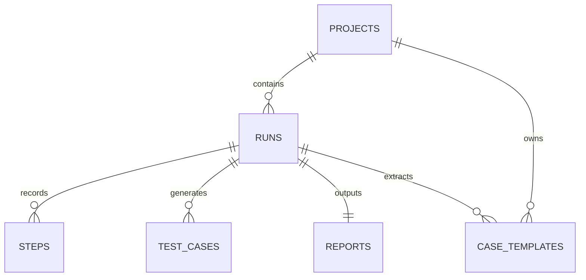

先用一句人话记住它们：

- `projects`
  存“这是哪个项目”
- `runs`
  存“这个项目下面发起了哪一次运行”
- `steps`
  存“这次运行里做了哪些具体步骤”
- `test_cases`
  存“这次运行里沉淀出了哪些测试用例”
- `reports`
  存“这次运行最后生成的报告在哪”
- `case_templates`
  存“这次成功运行能不能提炼成可复用模板”

再展开一点看：

#### `projects`

它更像“项目主档案”。
主要放这些信息：

- 项目名字
- 基础地址 `baseUrl`
- 加密后的用户名密码
- 创建时间、更新时间

你可以把它理解成“一个长期存在的测试对象”。

#### `runs`

它更像“一次执行任务的总单据”。
主要放这些信息：

- 属于哪个项目 `projectId`
- 当前状态 `status`
- 运行模式 `mode`
- 目标地址 `targetUrl`
- 目标描述 `goal`
- 用了哪个模型 `model`
- 整体配置 `configJson`
- 启动页信息
- 挑战类型、错误信息
- 视频路径
- 最近一次 LLM 决策
- 开始时间、结束时间

所以 `runs` 是整次运行的中心表。

#### `steps`

它更像“这次运行里的逐步过程记录”。
每一行通常表示一次动作执行后的结果。

主要会存：

- 属于哪个 run `runId`
- 第几步 `stepIndex`
- 当时页面 URL 和标题
- DOM 摘要 `domSummaryJson`
- 截图路径
- 动作内容 `actionJson`
- 动作状态 `actionStatus`
- 观察总结 `observationSummary`
- 校验结果 `verificationJson`

你可以把它理解成“操作日志 + 结果快照”。

#### `test_cases`

它更像“从运行过程中沉淀出来的测试用例卡片”。
主要会存：

- 模块名
- 标题
- 前置条件
- 步骤列表 `stepsJson`
- 预期结果
- 实际结果
- 优先级
- 测试方式

所以它不是每一步都必然写，而是当系统需要产出测试用例时才会写。

#### `reports`

它很简单，主要就是告诉系统：

- 这次 run 的 HTML 报告在哪
- 这次 run 的 XLSX 报告在哪
- 报告是什么时候生成的

它更像“报告索引表”。

#### `case_templates`

它更像“把成功 run 提炼成可复用模板后的模板档案”。
主要会存：

- 属于哪个项目
- 从哪个 run 提炼出来
- 模板类型
- 模板标题
- 入口 URL
- 模板内容 `caseJson`

这张表的意义是：以后系统可能不用完全从零规划，而是优先复用过去跑通的经验。

### 补充：为什么这么多列都叫 `xxxJson`

很多零基础读者看到这些列会困惑：

- `configJson`
- `domSummaryJson`
- `actionJson`
- `verificationJson`
- `stepsJson`
- `caseJson`

为什么不把它们拆成几十列？

因为这些内容本身就更像“一个结构化对象”，不是特别适合完全拆平。

生活类比：

- 很固定、很短的小信息，适合单独放抽屉小格子里
- 很成套、会变化的材料，适合先装进一个文件袋里

这些 `Json` 列就是“文件袋”。

它们的好处是：

- 结构更灵活
- 后续字段变化时不一定每次都要大改表结构
- 写入和读出时更容易保留原始上下文

### 补充：系统怎么知道“这条 step 属于哪次 run”

靠的就是外键和关联字段。

比如：

- `runs.projectId -> projects.id`
- `steps.runId -> runs.id`
- `test_cases.runId -> runs.id`
- `reports.runId -> runs.id`
- `case_templates.projectId -> projects.id`
- `case_templates.runId -> runs.id`

你可以把它理解成“每张小单据上都写着它归哪个大档案柜管”。

这样系统就能做到：

- 先查一个项目下面所有 run
- 再查一个 run 下面所有 step
- 再查这个 run 对应的报告和模板

## 8. 为什么会出现 `paused / manual / drafting`

### 这是什么

这三个词都表示“run 暂时没有继续往下跑”，但原因完全不同。

### 为什么要有它

因为浏览器自动化不是每次都能一条直线跑完。

有些情况需要：

- 用户主动暂停
- 用户人工处理页面
- 用户审批下一步动作

如果系统不把这些情况拆开，就会变成“停了，但不知道为什么停”。

### 在 QPilot Studio 里它是谁

#### `paused`

意思：
  用户自己按了暂停。

你可以把它理解成：
  “我先让系统等等，我稍后再继续。”

#### `manual`

意思：
  系统判断当前页面需要人类自己处理，例如验证码、安全挑战、登录阻塞。

你可以把它理解成：
  “这一步机器人不适合硬闯，先请人接手。”

#### `drafting`

意思：
  系统已经想好了下一步动作，但还没执行，在等人审批。

你可以把它理解成：
  “机器人把下一步草稿写好了，等你点头。”

### 你在界面上会看到什么

在运行详情页或桌面控制条上，你会看到：

- 当前 phase
- 当前 message
- 是否需要 manual review
- 草案审批按钮
- pause / resume / abort 按钮

这些状态的意义不同，不能简单理解成“卡住了”。

### 对应代码入口

- 调度和等待逻辑：
  `apps/runtime/src/orchestrator/run-orchestrator.ts`
- 前端展示与控制：
  `apps/web/src/pages/RunDetailPage.tsx`
  `apps/web/src/components/DesktopControlDock.tsx`

---

## 9. 这个项目最值得先看的 10 个文件，各看什么，不看什么

### 这是什么

这是“零基础读码导航”。

### 为什么要有它

因为这个仓库不小，如果一上来就从最复杂的文件往里扎，很容易迷路。

更好的方式是先按“从外到内”的顺序看。

### 在 QPilot Studio 里它是谁

下面这 10 个文件，是最适合作为第一轮阅读入口的。

#### 1. `apps/web/src/lib/api.ts`

看什么：
  前端到底会请求哪些接口。

先别深究什么：
  先不要纠结每个接口后端内部细节。

#### 2. `apps/web/src/App.tsx`

看什么：
  前端有哪些页面路由。

先别深究什么：
  暂时不用关心页面内部所有 UI 细节。

#### 3. `apps/web/src/pages/RunCreatePage.tsx`

看什么：
  用户如何创建一条 run，表单都有哪些配置项。

先别深究什么：
  先不要被样式代码分散注意力。

#### 4. `apps/web/src/pages/RunDetailPage.tsx`

看什么：
  运行详情页如何拉初始数据、连实时流、展示控制按钮。

先别深究什么：
  先不要试图一次读懂整个文件的所有分支。

#### 5. `apps/runtime/src/server.ts`

看什么：
  runtime 是怎么把数据库、orchestrator、evidence、实时流和路由装起来的。

先别深究什么：
  先不要被所有 import 吓到，重点看“创建了哪些核心对象”。

#### 6. `apps/runtime/src/server/routes/runs.ts`

看什么：
  run 相关接口有哪些，创建 run 和控制 run 的入口在哪。

先别深究什么：
  暂时不用一口气啃完所有 case/template 相关分支。

#### 7. `apps/runtime/src/orchestrator/run-orchestrator.ts`

看什么：
  真正的运行主流程在哪里。

先别深究什么：
  不要一开始就逐行看完，先抓：
  `start()`
  `execute()`
  `resolveDraftAction()`
  `waitForManualTakeover()`

#### 8. `apps/runtime/src/playwright/collector/page-snapshot.ts`

看什么：
  页面快照是怎么来的。

先别深究什么：
  暂时不必把所有元素采样细节看透。

#### 9. `apps/runtime/src/llm/planner.ts`

看什么：
  AI 到底看什么输入，返回什么输出。

先别深究什么：
  先不要太纠结 prompt 里的每一行语义优化。

#### 10. `packages/shared/src/schemas.ts`

看什么：
  前后端共用的核心对象长什么样。

先别深究什么：
  不必一次看完整个文件，先找：
  `RunConfig`
  `Run`
  `Step`
  `LLMDecision`
  `RuntimeEvent`

### 你在界面上会看到什么

当你按这个顺序读代码时，你会更容易把界面上的现象和代码里的责任对上号。

### 对应代码入口

这一节本身列出的 10 个文件，就是对应入口。

---

### 如果你这轮特别想补 ORM 和页面检测，再加看这 9 个文件

1. `apps/runtime/src/db/client.ts`
   看什么：
   数据库连接是怎么创建出来的，`Drizzle ORM` 是怎么挂到 client 上的。
   先别深究什么：
   不必先管底层驱动细节，只要先明白“这里把 SQLite 文件变成了代码可操作的 db 对象”。
2. `apps/runtime/src/db/schema.ts`
   看什么：
   系统里到底有哪些表，表和表之间怎么关联。
   先别深究什么：
   不必第一次就理解全部列，先看 `projects / runs / steps / reports`。
3. `apps/runtime/src/db/migrate.ts`
   看什么：
   为什么新项目第一次跑起来会自动建表，为什么后来加字段还能补列。
   先别深究什么：
   不必先把所有 `ALTER TABLE` 都记住。
4. `apps/runtime/src/playwright/collector/page-snapshot.ts`
   看什么：
   页面快照是怎么由截图、标题、元素和 `pageState` 组合出来的。
   先别深究什么：
   先别纠结截图参数，先看“快照里到底有哪些字段”。
5. `apps/runtime/src/playwright/collector/interactive-elements.ts`
   看什么：
   系统到底从网页里采集了哪些元素，为什么要去重、排序、限量。
   先别深究什么：
   不必第一次就把所有 selector 看完，先看“采什么”和“为什么只采一部分”。
6. `apps/runtime/src/playwright/collector/page-state.ts`
   看什么：
   页面是怎么被判断成 `login_form`、`search_results`、`security_challenge` 这些类型的。
   先别深究什么：
   不必第一次就看完所有正则，先看“输入是什么、输出是什么”。
7. `apps/runtime/src/playwright/collector/page-guards.ts`
   看什么：
   系统怎么识别验证码、登录墙、cookie banner、遮罩弹窗。
   先别深究什么：
   先理解“为什么要先清障再自动化”，再看具体 selector。
8. `apps/runtime/src/playwright/verifier/basic-verifier.ts`
   看什么：
   动作做完以后，系统怎么判断“这一步真的成功了吗”。
   先别深究什么：
   不用先抠每条 rule，先看它怎么使用 `pageState`。
9. `apps/runtime/src/playwright/ocr/visual-targeting.ts`
   看什么：
   当普通 DOM 选择器不够稳时，系统怎么从截图里读字做视觉定位兜底。
   先别深究什么：
   不必第一次就看 OCR 打分公式，先理解“它为什么存在”。

## 10. 零基础 FAQ

### 这是什么

这是给第一次接触这个项目的人准备的常见问题区。

### 为什么要有它

因为很多问题其实不是“不会写代码”，而是“脑子里还没有一张角色地图”。

### 在 QPilot Studio 里它是谁

下面这些问题，基本是零基础读者最常问的。

#### Q1：前端是不是就是整个系统？

不是。

前端只是你看到的界面层。

真正处理逻辑的是 runtime。

#### Q2：Desktop 和 Web 是不是重复了？

不是。

Desktop 是桌面壳，Web 是壳子里面装着的控制台页面。

#### Q3：为什么前端不直接操作浏览器？

因为这样很难做统一调度、证据记录、人工接管和后续复盘。

所以前端只负责“发请求和展示结果”，真正操作浏览器的是 runtime + Playwright。

#### Q4：run 和 step 的区别是什么？

- run：
  一整次运行。
- step：
  运行中的某一步。

你可以把 run 理解成“一整场考试”，把 step 理解成“考试中的每一道题”。

#### Q5：为什么还要保存截图和录像？

因为只有结果没有过程，出了问题很难复盘。

截图和录像是为了让用户知道：

- 当时页面长什么样
- 卡在哪一步
- 为什么需要人工接管

#### Q6：为什么系统有时会停下来不动？

最常见的三种原因就是：

- `paused`
- `manual`
- `drafting`

它们的含义前面已经讲过，不一定是死机。

#### Q7：AI 是不是在直接“看懂整个网页”？

不是。

它看到的是 runtime 先整理好的页面摘要、元素列表和页面状态归纳结果。

#### Q8：我应该先学哪个模块？

零基础最推荐顺序：

1. 先看这份 `ARCHITECTURE-101`
2. 再看 `RUN-LIFECYCLE-101`
3. 最后再看主文档 `ARCHITECTURE.zh-CN.md`

#### Q9：ORM 和 SQLite 到底谁才是数据库？

`SQLite` 才是真正的数据库。
`ORM` 不是数据库，它只是你在代码里操作数据库的方式。

你可以把它记成：

- `SQLite` = 仓库本体
- `Drizzle ORM` = 你拿来开门、登记、查档案的工具

#### Q10：系统到底是怎么判断当前页面是登录页、搜索结果页还是验证码页的？

不是只看 URL，也不是只看截图。

它通常会综合这些信息一起判断：

- URL
- 页面标题
- 当前页面和 iframe 里的元素
- 有没有密码框、账号输入框
- 有没有弹窗和遮罩
- 有没有搜索结果信号
- 有没有验证码或安全校验信号

然后 `page-state.ts` 会把这些信号汇总成一个 `PageState`，给出像下面这样的归类：

- `login_form`
- `login_chooser`
- `provider_auth`
- `search_results`
- `security_challenge`
- `dashboard_like`

后面的 Planner、Executor、Verifier 都会继续使用这份归类结果，而不是各干各的。

#### Q11：为什么表里会有那么多 `Json` 字段，看起来不像“正规数据库”？

这是一个很典型的新手疑问。

答案是：这并不代表设计不正规，而是代表这个系统里有些内容天然更适合“成包保存”。

比如：

- 一次 run 的完整配置
- 一次动作的完整结构
- 一次校验结果的完整细节
- 一个可复用 case 的完整内容

如果把这些内容强行拆成很多很多列：

- 表会更重
- 变更会更频繁
- 读代码时反而更难看懂

所以这里用了“固定列 + Json 列”混合的方式：

- 固定列保存最核心、最常查的字段
- Json 列保存更完整、更灵活的一整包上下文

### 你在界面上会看到什么

如果你读完这份 FAQ，再回到控制台页面，会更容易看懂这些现象：

- 为什么一个按钮会触发一条接口
- 为什么 run 状态和连接状态不是一回事
- 为什么系统有时会要求你审批或接管

### 对应代码入口

如果你想继续往下看，下一步建议直接读：

- [DB-ORM-101.zh-CN.md](./DB-ORM-101.zh-CN.md)
- [PAGE-DETECTION-101.zh-CN.md](./PAGE-DETECTION-101.zh-CN.md)
- [RUN-LIFECYCLE-101.zh-CN.md](./RUN-LIFECYCLE-101.zh-CN.md)
- [ARCHITECTURE.zh-CN.md](./ARCHITECTURE.zh-CN.md)

---

## 最后一句话

如果你只想先记住一件事，那就是：

QPilot Studio 不是“一个页面”也不是“一段自动化脚本”，它是一个由桌面壳、网页控制台、runtime 后端、浏览器执行器、AI 规划层、数据库和证据系统一起组成的本地测试平台。

## 第 4 章导读：从扫盲版进入工程版架构

前面那一部分帮你把“谁是谁”分开。  
接下来这部分会把视角切到更真实的工程实现上。

这里你要重点带着三个问题读：

1. 当前仓库为什么要分成 `apps/web`、`apps/runtime`、`packages/shared`
2. 为什么 `desktop` 不是公网部署核心
3. 为什么一次 run 明明看起来像点一次按钮，背后却要经过那么多模块

这部分会把系统边界、模块职责、数据流和状态流讲得更工程化一点，但你已经有了前面的地基，所以不会那么容易被吓到。

# QPilot Studio 底层架构详解（工程版主文档）

## 先看这里

这份文档现在定位为“工程版主文档”。

如果你是不同类型的读者，建议按下面顺序阅读：

- 如果你要从电脑零基础一路读到“本地运行、理解架构、部署公网、会用业务页面和排错”：
  先看 [ULTIMATE-0-TO-1.zh-CN.md](./ULTIMATE-0-TO-1.zh-CN.md)
  这份文档是新的最高优先入口，会把基础知识、系统原理、部署流程、业务使用和排错手册放在一个连续的大手册里。
- 如果你现在连“前端、后端、请求、响应、端口、数据库、DOM、OCR”这些词都不稳：
  先看 [FOUNDATIONS-101.zh-CN.md](./FOUNDATIONS-101.zh-CN.md)
  这份文档不是讲 QPilot Studio 细节，而是先补你学这个项目前必须知道的电脑与 Web 基础概念。
- 想从“只会一点 Python / 对工程几乎陌生”一路读到“自己能从 0 做一个同类系统”：
  先看 [FROM-0-TO-1.zh-CN.md](./FROM-0-TO-1.zh-CN.md)
  这份文档是新的零基础总入口，会同时讲当前仓库怎么工作，以及如果你自己从 0 开始该怎么逐步搭起来。
- 如果你现在更想解决“怎么把本地项目真正部署到公网”：
  先看 [DEPLOYMENT-101.zh-CN.md](./DEPLOYMENT-101.zh-CN.md)
  这份文档会把服务器怎么选、`.env` 怎么配、Nginx 怎么接、为什么会卡住、哪些地方最容易配错都按 0 经验视角讲清楚。
- 完全零基础：
  先看 [ARCHITECTURE-101.zh-CN.md](./ARCHITECTURE-101.zh-CN.md)
  这份文档会先解释“前端、后端、接口、长连接、桌面壳、浏览器代理”这些最基本概念，再讲 QPilot Studio。
- 想先看“一条 run 是怎么从点按钮跑到结束的”：
  先看 [RUN-LIFECYCLE-101.zh-CN.md](./RUN-LIFECYCLE-101.zh-CN.md)
  这份文档会按时间顺序讲清楚从 `RunCreatePage` 提交表单，到 runtime 开始执行，再到生成报告的全过程。
- 想直接理解系统分层、模块边界、数据流和架构设计：
  继续看当前这份主文档。

当前这套文档的分工如下：

- `FOUNDATIONS-101.zh-CN.md`
  面向“很多最基础术语都不熟”的读者，先补文件、进程、端口、接口、JSON、数据库、DOM、iframe、OCR 这些预备知识。
- `FROM-0-TO-1.zh-CN.md`
  面向“会一点 Python，但不懂前后端/自动化/工程化”的读者，按“当前仓库怎么做 + 你自己怎么从 0 开始做”两条线一起讲。
- `DEPLOYMENT-101.zh-CN.md`
  面向“已经能在本地跑项目，但还不会上服务器”的读者，重点讲从 Linux 服务器准备、runtime 常驻、前端 build、Nginx 反代到公网验收的完整 SOP。
- `ARCHITECTURE-101.zh-CN.md`
  面向完全零基础读者，先扫盲，再建立系统全景。
- `RUN-LIFECYCLE-101.zh-CN.md`
  面向想抓住“过程”的读者，重点讲一次运行怎么开始、怎么推进、怎么结束。
- `ARCHITECTURE.zh-CN.md`
  面向想理解真实工程实现的读者，重点讲分层、模块职责、状态机、通信和架构约束。
- `DB-ORM-101.zh-CN.md`
  面向想专门搞懂 SQLite、Drizzle ORM、6 张核心表、迁移脚本和落库路径的读者。
- `PAGE-DETECTION-101.zh-CN.md`
  面向想专门搞懂页面元素采集、页面归类、清障、验证链和 OCR 兜底的读者。

---

## 7 个先记住的角色

如果你还没开始读正文，只先记住下面 7 个角色就够了：

- 用户
  真的点按钮、看界面、审批草案、接管浏览器的人。
- Desktop
  桌面壳，负责打开一个桌面窗口，把 Web 控制台装进去。
- Web
  控制台前端，负责展示状态、截图、步骤、证据和操作按钮。
- Runtime
  真正的调度中心，负责 run 生命周期、浏览器控制、AI 调用、数据落盘和实时推送。
- Browser
  被 Playwright 驱动的 Chromium 浏览器，真正去打开网页、点按钮、输入内容。
- AI Planner
  负责想“下一步该做什么”的模型规划层，只出计划，不直接操作页面。
- Database / Files
  数据库存结构化记录，文件目录存截图、录像、证据和报告。

## 1. 这份文档是干什么的

这份文档不是写给“已经看过完整代码的人”的速记提纲，而是写给第一次接触这个项目的人。

目标有三个：

1. 解释 QPilot Studio 现在真实的代码实现，而不是理想中的架构图。
2. 把“前端、后端、通信、浏览器自动化、数据库、实时画面、人工接管”这些概念用大白话讲清楚。
3. 让你在不熟悉 React、Fastify、Playwright、SQLite、SSE、WebSocket 的情况下，也能知道“用户点一个按钮后，系统内部到底发生了什么”。

本文所有描述都基于当前仓库真实代码整理，重点参考这些目录：

- `apps/desktop`
- `apps/web`
- `apps/runtime`
- `packages/shared`
- `packages/ai-gateway`
- `packages/prompt-packs`
- `packages/report-core`

---

## 2. 先用一句人话理解这个系统

如果只用一句话概括：

QPilot Studio 是一个“本地运行的浏览器测试代理平台”，它把 AI 规划、浏览器操作、实时监控、人类接管、证据留存和报告生成，全部放进一个桌面/网页控制台里。

你也可以把它想成下面这个组合体：

- `桌面壳`：像一个应用窗口，负责承载控制台。
- `Web 控制台`：像驾驶舱，给你看运行状态、截图、步骤、证据和按钮。
- `Runtime`：像调度中心，真正去启动浏览器、调用 AI、执行动作、写数据库、推送事件。
- `Playwright 浏览器代理`：像执行员，实际去点按钮、输入内容、跳转页面。
- `AI Planner`：像参谋，只负责“下一步建议做什么”，不直接操作页面。
- `Evidence + Report`：像记录员，把过程中的截图、网络请求、控制台日志、报告都存下来。

所以它不是单纯的“写一个 Playwright 脚本跑起来”，也不是纯聊天式 Agent。它更像一个“带监控屏、带人机协同、带留痕”的测试执行平台。

---

## 3. 先搞懂项目里同时存在的 3 个程序

很多人第一次看这个仓库容易乱，是因为它不是“一个前端项目”或者“一个后端项目”，而是 3 个主要程序一起工作。

### 3.1 `apps/desktop`：桌面壳

这个目录是 Electron 应用。

它做的事很少：

- 创建一个桌面窗口 `BrowserWindow`
- 检查本地 runtime 是否存活
- 如果 runtime 没起来，就显示一个等待页面
- 如果 runtime 好了，就打开 Web 控制台地址

它不负责：

- 存数据库
- 控制 run 状态机
- 调用 AI
- 操作浏览器页面

所以 Desktop 更像“外壳”和“宿主”，不是业务核心。

关键文件：

- `apps/desktop/src/main.cjs`
- `apps/desktop/src/preload.cjs`

### 3.2 `apps/web`：控制台前端

这个目录是 React + Vite 前端。

它负责：

- 项目管理界面
- 运行列表界面
- 新建运行表单
- 运行详情大屏
- 报告查看入口
- 实时状态展示
- 审批草案、暂停/继续、人工接管这些按钮

它不直接控制浏览器页面。它只能“向 runtime 发请求”或者“接收 runtime 推送过来的事件和画面”。

关键文件：

- `apps/web/src/main.tsx`
- `apps/web/src/App.tsx`
- `apps/web/src/pages/RunCreatePage.tsx`
- `apps/web/src/pages/RunDetailPage.tsx`
- `apps/web/src/lib/api.ts`
- `apps/web/src/store/run-stream.ts`

### 3.3 `apps/runtime`：真正的业务核心

这个目录是整个系统的大脑。

它负责：

- 启动 HTTP 服务
- 注册 API 路由
- 连接数据库
- 启动浏览器
- 打开目标页面
- 采集截图和页面元素
- 调用 LLM 做规划
- 执行动作
- 验证动作结果
- 保存步骤和证据
- 推送实时状态和实时画面
- 生成人工审批草案
- 进入人工接管流程
- 生成 HTML / Excel 报告

你真正要理解系统架构，最重要的就是读懂 `apps/runtime`。

关键文件：

- `apps/runtime/src/server.ts`
- `apps/runtime/src/orchestrator/run-orchestrator.ts`
- `apps/runtime/src/server/routes/*.ts`
- `apps/runtime/src/playwright/*`
- `apps/runtime/src/llm/*`
- `apps/runtime/src/db/*`

---

## 4. 先扫盲：这份文档里最重要的术语

如果你是完全小白，这一节很重要。

### 4.1 Monorepo

Monorepo 的意思是：把多个项目放在同一个仓库里统一管理。

这个仓库里就同时放了：

- Desktop
- Web
- Runtime
- Shared packages

所以你看到的是一个“多应用 + 多包”的工程，而不是单应用仓库。

### 4.2 Electron

Electron 可以理解为：

“把网页装进桌面窗口里运行”的技术。

所以 QPilot Studio 的桌面版，本质上仍然是在桌面窗口里展示 Web 控制台。

### 4.3 React

React 是前端 UI 框架，用来搭页面、处理状态、响应用户点击。

这里它负责渲染控制台界面。

### 4.4 Fastify

Fastify 是 Node.js 的后端 HTTP 框架。

你可以把它理解成：

“负责接收前端请求、返回 JSON 数据、暴露接口的服务器框架”。

### 4.5 Playwright

Playwright 是浏览器自动化库。

它能：

- 启动 Chromium
- 打开网页
- 点按钮
- 输入表单
- 读取页面文本
- 截图
- 监听网络请求

所以它是这个系统里“真正去操作浏览器”的那个人。

### 4.6 SQLite

SQLite 是一个本地数据库。

和 MySQL / PostgreSQL 不同，它不需要单独起数据库服务，数据直接放在一个本地文件里。

这里默认数据库文件是：

- `apps/runtime/data/qpilot.db`

### 4.7 Drizzle

Drizzle 是数据库访问层。

你可以把它理解成：

“让 TypeScript 代码更方便地读写 SQLite 表”的工具。

### 4.8 REST API

REST API 是最普通的“前端发请求、后端回响应”。

比如：

- 前端发 `POST /api/runs`
- 后端返回新建的 run JSON

它适合做一次性的查询和提交。

### 4.9 SSE

SSE 全称是 Server-Sent Events，服务端推送事件。

它适合这种场景：

- 前端连上后，保持一个长连接
- 后端一有新事件就往前端推
- 比如“现在进入 planning 阶段了”“新步骤创建了”“run 结束了”

SSE 的特点是：

- 单向：主要是服务端推给前端
- 文本事件流
- 很适合状态通知

### 4.10 WebSocket

WebSocket 是双向长连接。

这里它主要被用来传“实时画面帧”和“实时指标”。

为什么不用 SSE 传画面？

因为画面是高频、连续的数据流，WebSocket 更适合这种“直播式”传输。

### 4.11 BrowserContext

Playwright 里有一个概念叫 BrowserContext。

你可以把它理解成：

“浏览器里的一个独立用户空间”。

它包含：

- Cookie
- LocalStorage
- 登录态
- 页面集合

所以：

- `Browser` 是整个浏览器
- `BrowserContext` 是某个用户会话
- `Page` 是具体某个网页标签页

### 4.12 Artifact / Evidence

Artifact 就是产物。

Evidence 就是证据。

在这个项目里，证据包括：

- 截图
- 视频
- 控制台日志
- 网络请求
- Planner 输入输出

这些东西不是“可有可无”，它们是这个平台很重要的一部分，因为只有留证据，用户才能回看为什么成功或失败。

---

## 5. 产品定位与核心约束

从当前实现看，QPilot Studio 不是一个“无限并发的云端代理平台”，它有非常明确的现实约束。

### 5.1 本地优先

当前系统默认一切都在本机：

- 浏览器在本机启动
- 数据库在本机
- 截图和视频在本机
- 报告在本机
- 会话状态在本机

这带来的好处：

- 调试方便
- 延迟低
- 证据好找
- 本地页面和登录态更容易复现

这也带来限制：

- 不适合天然横向扩展
- 更偏单机工具，不是分布式集群

### 5.2 单活运行

当前 runtime 一次只允许一个 active run。

这不是猜测，而是架构上的硬约束：

- `RunOrchestrator` 内部只有一个 `activeRunId`
- 新建 run 时，路由会先检查 `orchestrator.isBusy()`
- 忙的时候直接返回冲突错误

这说明当前系统是“单工调度”，不是多 run 并发执行器。

### 5.3 AI 只负责规划，不直接接管浏览器

LLM 的角色是：

- 读取页面快照摘要
- 输出结构化 JSON 决策
- 告诉系统下一步建议做什么

真正执行动作的是 Playwright executor。

也就是说，这不是“AI 自己直接操作浏览器”的黑盒，而是：

- AI 出方案
- Runtime 做规则修正
- Executor 负责真正执行
- Verifier 负责结果检查

### 5.4 允许人类介入

系统不是死撑到底的纯自动化。

它在这些场景下会主动停下来等人：

- 遇到安全挑战页
- 多次无效尝试
- 打开了草案审批模式
- 用户主动暂停

这意味着它是“半自动代理系统”，不是“全自动无人系统”。

---

## 6. 仓库结构总览

```text
apps/
  desktop/   Electron 桌面壳
  web/       React 控制台
  runtime/   Fastify + Orchestrator + Playwright

packages/
  shared/        前后端共享 schema、类型、事件常量
  ai-gateway/    OpenAI 兼容接口客户端
  prompt-packs/  预置 prompt 种子包
  report-core/   HTML / Excel 报告生成
```

更细一点看：

| 目录 | 作用 | 你可以把它理解成 |
| --- | --- | --- |
| `apps/desktop` | 桌面窗口外壳 | 应用壳子 |
| `apps/web` | 控制台前端 | 驾驶舱 |
| `apps/runtime` | 核心后端 + 调度 + 浏览器执行 | 调度中心 |
| `packages/shared` | 共用协议模型 | 统一语言 |
| `packages/ai-gateway` | 对接 LLM | AI 通讯员 |
| `packages/prompt-packs` | 预置提示词模板 | AI 的任务说明书 |
| `packages/report-core` | 生成报告 | 报告工厂 |

---

## 7. 程序是怎么启动起来的

这一节很关键，因为很多架构理解问题，其实都来自“没搞明白谁先启动、谁依赖谁”。

### 7.1 根脚本

根目录 `package.json` 里有几个关键脚本：

- `pnpm dev:web`
- `pnpm dev:runtime`
- `pnpm dev:desktop`
- `pnpm dev`

其中：

- `pnpm dev` 会并行启动 web 和 runtime
- `pnpm dev:desktop` 会启动 runtime、web、desktop 三者

### 7.2 默认端口

从代码和环境配置看：

- Web 控制台默认在 `http://localhost:5173`
- Runtime 默认在 `http://localhost:8787`
- Desktop 会优先检查 `http://localhost:8787/health`

### 7.3 Desktop 启动时做了什么

`apps/desktop/src/main.cjs` 的逻辑很简单：

1. 创建 Electron 窗口
2. 请求 runtime 的 `/health`
3. 如果 runtime 不通
   - 加载一个内置 fallback HTML
   - 提示用户等待 runtime 启动
4. 如果 runtime 正常
   - 直接加载 web 地址

所以 Desktop 本质上依赖 Web 和 Runtime 都正常。

### 7.4 Runtime 启动时做了什么

`apps/runtime/src/server.ts` 会：

1. 读取环境变量
2. 解析数据库路径
3. 迁移数据库
4. 创建数据库连接
5. 创建这些核心对象
   - `SseHub`
   - `LiveStreamHub`
   - `EvidenceStore`
   - `RunOrchestrator`
6. 挂到 `app.appContext`
7. 注册 CORS、WebSocket、静态文件服务、路由

它还会提前创建几个目录：

- artifacts 目录
- reports 目录
- sessions 目录
- planner-cache 目录

### 7.5 Web 启动时做了什么

`apps/web/src/main.tsx` 会：

1. 创建 React 根节点
2. 注入 `I18nProvider`
3. 注入 `QueryClientProvider`
4. 注入 `BrowserRouter`
5. 渲染 `App`

所以前端的顶层依赖主要是：

- 国际化上下文
- React Query 数据上下文
- 路由上下文

---

## 8. 系统总览图

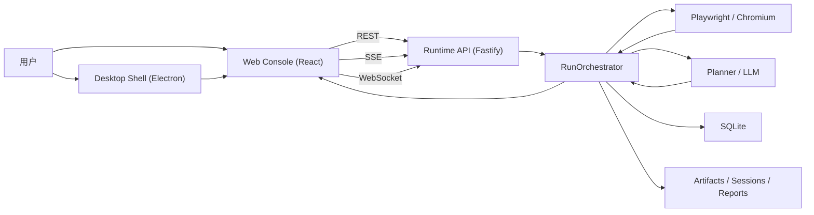

一句话解释这张图：

用户面对的是桌面壳和网页控制台，但真正干活的是 runtime；runtime 再去驱动浏览器、调用 AI、写数据库、存证据，然后把结果推回前端。

## 9. 通信架构详解：到底是谁和谁在说话

这是你特别提到想详细理解的部分，所以这一节我会说得非常细。

当前系统至少有 6 条主要通信链路。

### 9.1 链路一：Desktop -> Runtime Health

用途：

- 检查 runtime 是否活着

协议：

- 普通 HTTP GET

入口：

- `GET /health`

实现文件：

- `apps/desktop/src/main.cjs`
- `apps/runtime/src/server/routes/health.ts`

它的作用很单纯：

- Electron 启动后先问一句：“后端你在吗？”
- 在，就打开 web 控制台
- 不在，就显示等待页

### 9.2 链路二：Web -> Runtime REST API

用途：

- 查询数据
- 创建项目
- 创建 run
- 控制 run
- 读取步骤、证据、报告

协议：

- HTTP + JSON

前端封装位置：

- `apps/web/src/lib/api.ts`

后端路由位置：

- `apps/runtime/src/server/routes/projects.ts`
- `apps/runtime/src/server/routes/runs.ts`
- `apps/runtime/src/server/routes/runtime.ts`
- `apps/runtime/src/server/routes/reports.ts`

这条链路适合“点一次、回一次”的事情。

比如：

- 我想拿运行列表
- 我想新建一个项目
- 我想暂停一条 run
- 我想读取报告地址

### 9.3 链路三：Runtime -> Web 的 SSE 事件流

用途：

- 推送实时状态
- 推送阶段变化
- 推送最新 LLM 决策
- 推送新步骤
- 推送新测试用例
- 推送运行结束事件

协议：

- SSE（Server-Sent Events）

前端入口：

- `api.createRunStream(runId)`

后端入口：

- `GET /api/runs/:runId/stream`

Hub 实现：

- `apps/runtime/src/server/sse-hub.ts`

当前事件类型：

- `run.status`
- `run.llm`
- `step.created`
- `testcase.created`
- `run.finished`
- `run.error`

另外，`SseHub` 每 15 秒还会发一个 `ping` heartbeat，避免前端不知道连接是不是断了。

### 9.4 链路四：Runtime -> Web 的 WebSocket 实时画面

用途：

- 推送浏览器实时画面帧
- 推送 FPS、采集耗时、viewer 数这些指标

协议：

- WebSocket

前端入口：

- `api.createRunLiveSocket(runId)`
- `apps/web/src/components/LiveRunViewport.tsx`

后端入口：

- `GET /api/runs/:runId/live`（WebSocket）

Hub 实现：

- `apps/runtime/src/server/live-stream-hub.ts`

这里有一个很重要的设计点：

WebSocket 只负责“画面”和“画面指标”，不负责“业务状态真相”。

真正的业务状态真相仍然来自 SSE。

也就是说：

- “现在是 planning 还是 manual”主要信 SSE
- “现在屏幕上长什么样”主要信 WebSocket

这是一个很合理的职责拆分。

### 9.5 链路五：Runtime -> OpenAI Compatible API

用途：

- 让 planner 调用 LLM 生成结构化决策

协议：

- HTTP POST `/chat/completions`

客户端实现：

- `packages/ai-gateway/src/client.ts`

Planner 调用位置：

- `apps/runtime/src/llm/planner.ts`

这里的关键点是：

- runtime 不直接把“页面整页 HTML”喂给模型
- 它会先做页面快照压缩
- 再拼成 prompt
- 再要求模型只输出 JSON

### 9.6 链路六：Runtime -> Chromium / CDP

用途：

- 驱动浏览器
- 截图
- 执行动作
- 采集页面元素
- 通过 CDP 开启 screencast

协议：

- Playwright API
- CDP（Chrome DevTools Protocol）

当前 live stream 优先级是：

1. 优先用 CDP screencast
2. 如果 screencast 不可用，就 fallback 为周期性截图

所以前端看到的实时画面，本质上来自 runtime 对浏览器的持续采样。

---

## 10. 为什么系统同时用了 REST、SSE、WebSocket 三种通信方式

这是一个非常典型、也非常容易让新手困惑的问题。

简单理解：

### 10.1 REST 负责“查”和“改”

适合：

- 查列表
- 查详情
- 创建 run
- 暂停/继续/终止

因为这些动作是：

- 请求发起明确
- 有明确响应
- 不需要持续推送

### 10.2 SSE 负责“通知你发生了什么”

适合：

- phase 变化
- step 创建
- LLM 决策更新
- run 结束

因为这些是：

- 由后端主动发生
- 前端不想一直轮询
- 数据是文本事件，不是大体积二进制

### 10.3 WebSocket 负责“直播画面”

适合：

- 高频图片帧
- 直播指标

因为这类数据：

- 更新很频繁
- 不适合走普通轮询
- 也不太适合只用 SSE 传

所以你可以把它理解成：

- REST = 办业务
- SSE = 发消息
- WebSocket = 开直播

---

## 11. Shared 协议层：为什么前后端能对得上话

在多端系统里，最容易出问题的地方之一，就是前端和后端理解的对象不一致。

比如后端说：

- `status`
- `phase`
- `draft`

前端如果对这些字段的结构理解不一致，就会直接崩。

所以这个仓库专门有一层：

- `packages/shared/src/schemas.ts`

它的作用就是：

- 用 Zod 定义统一 schema
- 前后端共用同一套类型
- 把“协议”放在公共包里，而不是散落在各处

### 11.1 这层解决的是什么问题

它解决的是“系统里的共同语言”问题。

比如：

- 什么叫 `Run`
- 什么叫 `Step`
- 什么叫 `LLMDecision`
- 什么叫 `RuntimeEvent`
- 什么叫 `LiveStreamMessage`

这些不是口头约定，而是明确写成 schema。

### 11.2 关键模型

#### `RunConfig`

代表一次运行的配置输入。

主要字段：

- `targetUrl`
- `mode`
- `language`
- `executionMode`
- `confirmDraft`
- `goal`
- `maxSteps`
- `headed`
- `manualTakeover`
- `sessionProfile`
- `saveSession`
- `replayCase`
- `username`
- `password`

你可以把它理解成：

“用户点开始运行之前，系统拿到的那份操作说明书”。

#### `Run`

代表一条运行记录。

它比 `RunConfig` 多了很多运行后的信息，例如：

- 当前状态
- 当前页面 URL / 标题
- 步骤数量
- 启动截图
- 是否遇到 challenge
- 最后一次 LLM 决策
- 错误信息
- 开始/结束时间
- 报错建议

你可以把它理解成：

“数据库里那一条 run 的主记录”。

#### `Step`

代表一次动作执行后的落盘结果。

里面会保存：

- 第几步
- 执行动作是什么
- 当时页面 URL / 标题
- DOM 摘要
- 截图路径
- 动作状态
- 观察总结
- 验证结果

你可以把它理解成：

“运行过程中的一帧关键里程碑”。

#### `LLMDecision`

这是 planner 输出的 JSON 决策。

结构包括：

- 当前目标
- 页面评估
- 计划说明
- actions 数组
- expected_checks
- test_case_candidate
- is_finished

关键点：

LLM 输出的不是自由文本建议，而是结构化对象。

#### `DraftActionState`

当系统进入“草案审批”模式时，会把下一步动作包成一个 draft。

它会告诉前端：

- 当前是第几步
- 建议动作是什么
- 预期检查项有哪些
- 为什么给出这一步
- 是否正在等待审批

#### `RuntimeEvent`

这是 SSE 的事件统一格式。

它包含：

- `event`
- `runId`
- `ts`
- `data`

#### `LiveStreamMessage`

这是 WebSocket 的消息统一格式。

它分两种：

- `run.frame`
- `run.metric`

也就是：

- 画面消息
- 指标消息

---

## 12. 前端架构详解

这一节专门讲你提到的“前端到底怎么工作”。

### 12.1 前端入口

前端入口是：

- `apps/web/src/main.tsx`

它做了三件最重要的事：

1. 注入国际化 `I18nProvider`
2. 注入 React Query `QueryClientProvider`
3. 注入 React Router `BrowserRouter`

这说明前端天然有三根主线：

- 文本和时间本地化
- 远程数据获取
- 页面路由切换

### 12.2 顶层页面结构

`apps/web/src/App.tsx` 定义了主路由：

- `/projects`
- `/runs`
- `/runs/new`
- `/runs/:runId`
- `/reports/:runId`

同时，顶栏里还有：

- 导航链接
- 语言切换
- Desktop 模式标记

这说明整个前端不是单页面黑盒，而是标准的多页面控制台。

### 12.3 国际化层

国际化由：

- `apps/web/src/i18n/I18nProvider.tsx`

负责。

它做的事包括：

- 读取本地存储中的语言偏好
- 默认跟随浏览器语言
- 暴露 `pick(en, zh)` 方法
- 暴露日期格式化和相对时间格式化

当前实现不是“完整词条表 + key 管理”的传统 i18n 方案，而是大量使用：

- `pick("English", "中文")`

这种“就地双语”的方式。

优点：

- 写起来快

缺点：

- 大型项目里容易分散
- 更难统一治理

### 12.4 React Query：前端的冷数据层

React Query 负责“请求式数据”。

所谓冷数据，意思是：

- 不需要每秒几十次变化
- 可以按需请求
- 可以缓存

这里主要包括：

- 项目列表
- run 列表
- run 详情
- step 列表
- test case 列表
- evidence
- traffic
- cases
- active run 轮询

这些都通过 `apps/web/src/lib/api.ts` 封装。

### 12.5 Zustand：前端的热状态层

`apps/web/src/store/run-stream.ts` 用 Zustand 存实时运行态。

所谓热状态，意思是：

- 变化很频繁
- 需要快速合并
- 主要来自 SSE 实时事件

它保存的东西包括：

- 当前 run
- run 状态
- SSE 连接状态
- 最新 LLM 决策
- 当前 live phase
- 当前 action
- 当前 verification
- 当前 draft
- steps
- testCases

这个 store 的作用很关键：

它相当于把“后端不断推过来的运行状态”接住，然后供多个组件统一消费。

### 12.6 `ProjectsPage`：项目页

项目页做两件事：

1. 创建项目
2. 查看最近项目和最近运行

这里创建项目时会提交：

- `name`
- `baseUrl`
- `username`
- `password`

用户名和密码会在后端加密后写入数据库。

### 12.7 `RunsPage`：运行列表页

运行列表页主要是：

- 按项目筛选
- 按关键字搜索
- 每 2 秒轮询运行列表
- 展示每条 run 的目标、当前页、状态

这页偏“历史视图”和“总览视图”。

### 12.8 `RunCreatePage`：新建运行页

这一页很重要，因为它决定了前端是怎么把用户意图变成 `RunConfig` 的。

用户在这里可以设置：

- 选择项目
- 目标 URL
- 用户名 / 密码
- 模式 `general/login/admin`
- 运行语言
- goal
- maxSteps
- executionMode
- confirmDraft
- headed
- manualTakeover
- sessionProfile
- saveSession

它还会定期轮询 `/api/runtime/active-run`，因为当前系统是单活运行：

- 如果 runtime 已经在跑别的 run
- 前端会阻止你再开一条
- 并提示你打开当前 run 或终止它

### 12.9 `RunDetailPage`：超级控制台页面

`RunDetailPage.tsx` 是当前前端里最重的一个页面。

它承担了非常多的职责：

- 初始拉取 run、steps、testcases
- 连接 SSE
- 接收 run.status / run.llm / step.created / run.finished
- 接收 active-run 的补充控制态
- 管理草案编辑
- 展示当前动作和验证
- 管理步骤筛选
- 查询步骤级 traffic
- 查询全局 traffic
- 查询模板 case
- 处理模板修复草案
- 驱动 LiveRunViewport
- 驱动证据面板

它已经不是一个单纯“详情页”了，而是“实时监控台 + 审批台 + 修复台 + 证据台”的合集。

### 12.10 `RunDetailPage` 的初始化顺序

这个页面的启动顺序非常值得理解：

1. 页面拿到 `runId`
2. 先并发请求：
   - `api.getRun(runId)`
   - `api.getRunSteps(runId)`
   - `api.getRunTestCases(runId)`
   - `api.getActiveRun()`
3. 用这些初始数据灌进 Zustand store
4. 如果 run 已结束
   - 就不再连 SSE
5. 如果 run 还在跑
   - 创建 EventSource
   - 开始接收实时事件

也就是说：

前端不是一打开页面就盲连流，而是先做一次全量补数，再切到增量事件模式。

这个设计是对的，因为这样能避免：

- 页面刚打开时状态空白
- 只靠实时事件导致历史步骤缺失

### 12.11 `LiveRunViewport`：实时画面组件

`apps/web/src/components/LiveRunViewport.tsx` 的职责很明确：

- 打开 WebSocket
- 接收 `run.frame`
- 把 base64 JPEG 画到 `canvas`
- 接收 `run.metric`
- 显示 fps / captureMs / viewerCount / transport
- 如果暂时没有直播帧，就回退到最后一张截图

这说明前端不是简单 `` 轮询刷新，而是真正维护一条实时画面通道。

### 12.12 `RunEvidencePanel`：证据面板

证据面板会轮询：

- `api.getRunEvidence(runId)`

然后展示四类信息：

- Console
- Network
- DOM
- Planner

这个组件的意义很大，因为它把“可观察性”真正暴露给了用户。

很多自动化系统失败时你只会看到“失败了”，但这里你还能看到：

- 页面控制台报错
- 网络请求情况
- 当时的 DOM 摘要
- Planner 的输入输出

---

## 13. 桌面壳架构详解

虽然 `apps/desktop` 很轻，但它在用户体验上依然有独特作用。

### 13.1 它解决了什么问题

它解决的是“让本地工具看起来像一个桌面应用”的问题。

如果没有它，这个系统也能跑，只是用户要自己分别打开：

- 一个浏览器 tab 访问 web 控制台
- 一个本地服务作为 runtime

Electron 的好处是：

- 打包成桌面应用更自然
- 可以有统一窗口和桌面体验
- 更适合后续做桌面级能力扩展

### 13.2 它现在没做什么

当前 Desktop 很刻意地没有承担业务逻辑。

它不负责：

- run 管理
- 数据同步
- 实时事件汇总
- 浏览器控制

这其实是好事。

因为如果桌面壳也承担大量业务逻辑，整个系统会更难维护。

## 14. Runtime 服务层详解

这一节专门讲后端 HTTP 服务本身。

### 14.1 `server.ts` 的角色

`apps/runtime/src/server.ts` 不是业务流程本身，而是“组装器”。

它负责把这些零件拼起来：

- Fastify app
- DB
- Orchestrator
- EvidenceStore
- SseHub
- LiveStreamHub
- 各类 routes

你可以把它理解成：

“系统装配车间”。

### 14.2 `app.appContext`

当前 runtime 会把很多核心对象挂到 `app.appContext` 上：

- `db`
- `orchestrator`
- `evidenceStore`
- `sseHub`
- `liveStreamHub`
- `runtimeBaseUrl`

这样每个 route 都能统一访问核心依赖。

### 14.3 路由分类

当前路由按职责大致分成：

- `health.ts`
- `projects.ts`
- `runtime.ts`
- `runs.ts`
- `reports.ts`
- `live.ts`

其中：

- `projects.ts` 管项目和凭据
- `runtime.ts` 管当前 active run 视图
- `runs.ts` 是最大的一组，管理 run 的创建、控制、步骤、证据、模板
- `live.ts` 只处理 WebSocket live

### 14.4 为什么 `runs.ts` 很大

因为现在很多业务都以 run 为中心：

- 创建 run
- 控制 run
- 查 run 详情
- 查 steps
- 查 evidence
- 查 traffic
- 查 cases
- 打开 stream
- replay case
- repair draft

这使得 `runs.ts` 成了一个很重的聚合路由文件。

---

## 15. Runtime API 详细分类

为了让你看清“前端点一个按钮时到底调的是哪个接口”，这里按用途分类列出来。

### 15.1 项目相关

- `GET /api/projects`
- `POST /api/projects`
- `PATCH /api/projects/:projectId/credentials`

### 15.2 运行总览相关

- `GET /api/runs`
- `POST /api/runs`
- `GET /api/runs/:runId`

### 15.3 运行控制相关

- `POST /api/runs/:runId/control`
- `POST /api/runs/:runId/resume`
- `POST /api/runs/:runId/pause`
- `POST /api/runs/:runId/abort`
- `POST /api/runs/:runId/bring-to-front`
- `POST /api/runs/:runId/execution-mode`
- `POST /api/runs/:runId/draft/approve`
- `POST /api/runs/:runId/draft/skip`

### 15.4 运行过程数据相关

- `GET /api/runs/:runId/steps`
- `GET /api/runs/:runId/testcases`
- `GET /api/runs/:runId/evidence`
- `GET /api/runs/:runId/traffic`
- `GET /api/runs/:runId/steps/:stepRef/traffic`
- `GET /api/runs/:runId/cases`
- `GET /api/runs/:runId/report`

### 15.5 实时相关

- `GET /api/runtime/active-run`
- `GET /api/runs/:runId/stream`
- `WS /api/runs/:runId/live`

### 15.6 模板/案例相关

- `GET /api/cases`
- `POST /api/cases/extract`
- `POST /api/cases/:caseId/replay`
- `POST /api/cases/:caseId/repair-draft`
- `POST /api/cases/:caseId/apply-repair-draft`

---

## 16. 数据存储架构详解

这个系统不是只靠数据库，也不是只靠文件系统，而是“双存储架构”。

### 16.1 为什么要双存储

原因很简单：

- 结构化数据适合进数据库
- 大文件和证据适合进文件系统

如果把截图、视频、整段 planner trace 全塞数据库，会非常难管理。

如果只放文件，不放数据库，又很难查询和展示列表。

所以当前采用：

- SQLite 存结构化索引和主记录
- 文件系统存大体积证据和产物

### 16.2 数据库位置

默认数据库路径：

- `apps/runtime/data/qpilot.db`

由 `apps/runtime/src/config/env.ts` 和 `apps/runtime/src/db/client.ts` 负责解析。

### 16.3 数据库表一览

数据库 schema 定义在：

- `apps/runtime/src/db/schema.ts`

当前核心表如下。

#### `projects`

存项目信息：

- `id`
- `name`
- `base_url`
- 加密后的用户名/密码
- 创建更新时间

注意：

用户名和密码不会明文写入，而是用 AES-256-GCM 加密后存储。

加密逻辑在：

- `apps/runtime/src/security/credentials.ts`

#### `runs`

这是最核心的主表。

它记录：

- run 基本身份
- projectId
- status
- mode
- targetUrl
- goal
- model
- `configJson`
- 启动页面证据
- challenge 信息
- 视频路径
- 最后一次 LLM JSON
- 错误信息
- startedAt / endedAt / createdAt

你可以把这张表理解成：

“运行档案总表”。

#### `steps`

每一步动作都会写入这里。

它记录：

- 第几步
- 页面 URL / 标题
- DOM 摘要 JSON
- 截图路径
- 动作 JSON
- 动作状态
- 观察总结
- 验证结果 JSON

这张表是“过程回放”的核心。

#### `test_cases`

这里存从运行过程中提取出来的测试用例。

说明这个系统不只是“执行”，还会尝试把执行过程沉淀为测试资产。

#### `reports`

这里存报告的路径：

- HTML 路径
- Excel 路径

#### `case_templates`

这里存“从成功运行提炼出来的模板案例”。

这说明系统已经在往“模板复用”方向演进，而不是永远纯靠实时 LLM 规划。

### 16.4 文件系统中的数据

除了数据库，runtime 还维护这些目录。

#### `apps/runtime/data/artifacts`

用途：

- run 截图
- 录屏
- evidence.json

典型结构类似：

```text
apps/runtime/data/artifacts/runs/<runId>/
  step-0001.png
  step-0002.png
  manual-step-0005.png
  evidence.json
  video/
```

#### `apps/runtime/data/reports`

用途：

- HTML 报告
- XLSX 报告

#### `apps/runtime/data/sessions`

用途：

- 保存 Playwright storage state

典型路径模式：

- `apps/runtime/data/sessions/<projectId>/<profile>.json`

这就是“会话复用”的基础。

#### `apps/runtime/data/planner-cache`

用途：

- 缓存 planner 输出

作用：

- 相同上下文下减少重复调用模型
- 提高调试和回放的一致性

### 16.5 EvidenceStore 到底保存什么

`apps/runtime/src/server/evidence-store.ts` 会收集三大类证据：

- 浏览器 console
- network 请求
- planner trace

它通过 `attachPage(runId, page)` 挂到 Playwright `Page` 上，监听：

- `console`
- `pageerror`
- `request`
- `response`
- `requestfailed`

也就是说，只要页面还活着，EvidenceStore 就在持续记笔记。

### 16.6 为什么证据还有限额

当前实现里有一些上限：

- Console 最多 240 条
- Network 最多 320 条
- Planner trace 最多 48 条

这不是随便写的，而是一个很现实的控制手段：

- 避免内存和 evidence 文件无限增长

---

## 17. 安全与凭据设计

很多小白会忽略这一层，但它实际上很重要。

### 17.1 项目凭据怎么存

当前项目凭据不会明文存数据库。

后端会用：

- AES-256-GCM

进行加密，结果拆成：

- ciphertext
- iv
- tag

再分别存进 `projects` 表。

### 17.2 密钥从哪里来

环境变量要求：

- `CREDENTIAL_MASTER_KEY`

它必须是 64 位 hex 字符串。

如果这个环境变量没配好，runtime 启动时就会校验失败。

### 17.3 会话状态怎么复用

如果用户开启：

- `sessionProfile`
- `saveSession`

那么 runtime 会把浏览器会话保存成 storage state 文件。

下次运行同一个 profile 时，就可以直接加载：

- cookie
- localStorage
- 登录态

这对“登录后复测”特别重要。

---

## 18. 浏览器自动化层详解

这一层是整个系统最“像机器人”的地方。

### 18.1 这一层负责什么

浏览器自动化层的职责主要有四件事：

1. 看页面
2. 判断页面属于什么状态
3. 执行动作
4. 检查动作是否真的生效

### 18.2 页面快照是怎么采集的

页面快照由：

- `apps/runtime/src/playwright/collector/page-snapshot.ts`

负责。

它会做这些事：

1. 截图
2. 收集页面上的交互元素
3. 读取标题
4. 根据 URL + 标题 + 元素，归纳一个 `pageState`

最终返回：

- `url`
- `title`
- `screenshotPath`
- `elements`
- `pageState`

### 18.3 页面元素采集为什么不是“整页 DOM”

`interactive-elements.ts` 并不是把整页 HTML 原封不动塞给系统，而是做了“抽样压缩”。

它主要采集：

- 链接
- 按钮
- 输入框
- 选择框
- 带 role 的可交互节点
- 一些有结构意义的节点
- iframe
- modal / dialog 相关节点

还会给元素补很多辅助信息：

- 文本
- ariaLabel
- placeholder
- selector
- 上下文类型
- framePath
- frameUrl
- frameTitle
- 是否可见
- 是否可用

这说明系统不是纯看截图，也不是纯看 DOM，而是把页面转成“结构化元素摘要”。

### 18.4 为什么还要做 `pageState`

因为 AI 只看元素列表还不够，它还需要知道：

- 这是搜索结果页吗
- 这是登录方式选择页吗
- 这是登录表单吗
- 这是第三方授权页吗
- 这是安全挑战页吗
- 这是登录后仪表盘吗

这个工作由：

- `apps/runtime/src/playwright/collector/page-state.ts`

负责。

它会结合：

- URL host
- URL query
- 页面标题
- 元素文字
- iframe / modal / password field 信号

最终把页面归纳成：

- `generic`
- `modal_dialog`
- `login_chooser`
- `login_form`
- `provider_auth`
- `search_results`
- `security_challenge`
- `dashboard_like`

这个层非常重要，因为很多后续策略都是基于它判断的。

### 18.5 动作执行器支持哪些动作

当前 executor 支持 5 类动作：

- `click`
- `input`
- `select`
- `navigate`
- `wait`

执行入口在：

- `apps/runtime/src/playwright/executor/action-executor.ts`

### 18.6 一个 `click` 到底怎么执行

一个点击动作并不是“拿 selector 点一下”那么简单。

大致顺序是：

1. 先做 guard
   - 看有没有 challenge
   - 看是不是高风险动作
2. 尝试解析 target
   - DOM selector
   - 文本匹配
   - 通用 fallback
   - OCR / 视觉定位
3. 如有必要先 dismiss overlay
4. 执行 click
5. 如果是某些登录 provider 场景，再补自动 provider 选择
6. 返回执行结果、目标解析方式、视觉匹配信息等

这说明 executor 不是一个薄薄的 `page.click()` 封装，而是带了不少修正策略。

### 18.7 为什么会用 OCR / 视觉定位

因为有些页面：

- selector 不稳定
- DOM 很脏
- 按钮是图标
- 文本不容易直接取到

所以系统在某些失败场景下，会尝试视觉定位目标，再点击坐标。

这不是主路径，但它是一个重要的 fallback 手段。

### 18.8 验证层在干什么

验证入口在：

- `apps/runtime/src/playwright/verifier/basic-verifier.ts`

它不是只看“代码没报错”，而是会检查：

- URL 是否变化
- 预期文本是否命中
- 当前页面被归纳成什么 `pageState`
- 对于登录类目标，是否真的到了真实登录面，而不是中间页

对于登录类场景，它还会特别判断：

- 目标 host 是否命中
- 账号输入框是否出现
- 密码框是否出现
- 是否进入 provider auth

也就是说，验证层在努力减少“看起来成功，其实是假成功”的情况。

### 18.9 API 验证为什么也很重要

除了页面文本和 URL，系统还有一条交通警察式的验证线：

- `traffic-verifier.ts`

它会根据预期请求规则去看：

- 有没有命中特定 host/path/method/status 的网络请求

这对“页面看着变化不明显，但后台请求已经成功/失败”的场景很有帮助。

---

## 19. AI 规划层详解

这一层是“代理味”最重的部分，但也最容易被误解。

### 19.1 Planner 真正做的事

Planner 不直接操作浏览器。

它的职责只有一个：

基于当前页面快照，输出一份结构化下一步计划。

位置：

- `apps/runtime/src/llm/planner.ts`

### 19.2 Planner 输入是什么

Planner 输入不是整页源码，而是一个压缩包，里面包含：

- 目标 goal
- 当前是第几步
- targetUrl
- mode
- responseLanguage
- seedPrompt
- modePrompt
- lastObservation
- 页面 URL
- 页面标题
- pageState
- 最多前 60 个元素摘要

这非常重要。

因为这说明 AI 看到的是“摘要世界”，不是完整网页世界。

### 19.3 Planner 输出是什么

Planner 被要求只返回严格 JSON，包括：

- 当前目标
- 页面评估
- 计划说明
- actions 数组
- expected_checks
- test_case_candidate
- is_finished

这意味着后端后续可以安全地解析，而不是去猜自然语言。

### 19.4 为什么还要做 schema 校验和重试

模型经常可能输出：

- JSON 不规范
- 字段缺失
- 类型不对

所以 planner 会：

1. 第一次请求模型
2. 试着 parse
3. 如果失败
   - 再告诉模型“上次 schema 校验失败了，请修正”
4. 再 parse 一次
5. 还失败就抛错

这就是为什么它比“直接调一次模型”更稳一点。

### 19.5 为什么有 `seedPrompts`

`packages/prompt-packs/src/seed-prompts.ts` 当前有三套种子提示：

- `genericForm`
- `loginPage`
- `adminConsole`

对应 `RunConfig.mode`：

- `general`
- `login`
- `admin`

这相当于告诉 AI：

- 你现在是在做普通页面探索
- 还是做登录相关
- 还是做后台控制台检查

所以 mode 不是摆设，它会影响规划风格。

### 19.6 为什么还要 PlannerCache

PlannerCache 的意义是：

- 相同上下文不用每次都重新问模型
- 便于调试复现
- 降低成本

这对开发阶段尤其有价值。

### 19.7 决策不是拿来就执行，还要再修正

Planner 输出后，并不会立刻无脑执行。

中间还会经过几层修正：

- `decision-refiner.ts`
- `case-template-matcher.ts`
- `template-replay-policy.ts`

比如：

- goal 明确是 QQ 登录
- 页面上也出现了 QQ / 微信 provider 入口

那么 `decision-refiner.ts` 会把原来过于泛化的登录动作，补成更具体的 provider 路径。

所以系统是：

- 先让 AI 出主意
- 再让程序用规则把主意修得更像“工程化可执行版本”

---

## 20. Orchestrator：系统真正的大脑

这一节是整份文档的核心。

文件：

- `apps/runtime/src/orchestrator/run-orchestrator.ts`

### 20.1 为什么说它是系统大脑

因为它几乎协调了所有核心资源：

- run 生命周期
- 浏览器
- browser context
- page
- live stream
- evidence
- planner
- action executor
- verifier
- database
- reports
- manual takeover
- draft approval
- template replay

也就是说：

如果说 Fastify server 是“门面”，那 orchestrator 就是“真正的调度中心”。

### 20.2 它为什么是有状态的

这个类内部维护了很多内存态 Map：

- `activeRunId`
- `manualWaiters`
- `draftWaiters`
- `activeDrafts`
- `activePages`
- `activeBrowsers`
- `activeBrowserContexts`
- `activePageVideos`
- `activeSessionPersistence`
- `runControls`
- `runExecutionModes`
- `runSnapshots`
- `runResourceClosers`

这说明它不是“拿请求算一下就完事”的无状态服务，而是一个长生命周期对象。

为什么必须有状态？

因为浏览器运行本来就是有状态的：

- 当前页面对象要留着
- 暂停后还得继续
- 草案审批时要挂起等待
- 人工接管时浏览器不能关
- 当前 run 的 live meta 要持续更新

这些都天然要求内存态。

### 20.3 `activeRunId` 为什么重要

`activeRunId` 说明：

当前 orchestrator 默认只服务一条活跃 run。

所以单活约束不仅体现在路由，也体现在 orchestrator 的核心设计上。

### 20.4 `runControls` 里存的是什么

这里面保存：

- 是否请求暂停
- 是否已暂停
- 是否请求终止
- resume resolvers

它相当于 runtime 自己维护的一套“控制面板状态”。

### 20.5 `runSnapshots` 是干什么的

这里保存的是给前端展示的当前 live 控制态快照，例如：

- 当前 phase
- 当前 message
- stepIndex
- 是否 manualRequired
- 当前 executionMode
- 当前 draft
- lastEventAt

这也是 `/api/runtime/active-run` 能拿到控制态的基础。

---

## 21. 一条 run 的完整生命周期

这一节请你一定慢慢读，因为它就是“从点开始，到出报告”的完整时间线。

### 21.1 第一步：用户创建 run

在前端 `RunCreatePage` 点提交后：

1. 前端调用 `POST /api/runs`
2. 后端校验参数
3. 后端检查 runtime 是否忙
4. 不忙的话写入 `runs` 表
5. 初始状态是 `queued`
6. 然后用 `setTimeout(... orchestrator.start(runId))` 异步启动真正执行

这一步很重要：

HTTP 接口本身不会把整个 run 跑完才返回，它只是先把任务建起来，再异步开跑。

### 21.2 第二步：orchestrator.start(runId)

`start()` 会：

1. 检查当前是否已有 active run
2. 设置 `activeRunId`
3. 初始化这条 run 的控制状态
4. 调用 `execute(runId)`

如果中间抛错：

- 可能标记为 `failed`
- 如果是主动 abort，可能标记为 `stopped`

### 21.3 第三步：进入 `execute()`

`execute()` 的前几步通常是：

1. 读 run 上下文
2. parse `configJson`
3. 读取语言文本资源
4. 把 run 写成 `running`
5. 推送 `phase = booting`
6. 创建 artifact / report / video 目录
7. 初始化 evidence

到这里为止，浏览器还没真正开始做动作，但系统已经进入“运行中”。

### 21.4 第四步：启动浏览器与会话

runtime 接下来会：

1. 启动 Chromium
2. 创建 BrowserContext
3. 根据配置决定是否启用 headed
4. 配置视频录制
5. 如果有 session profile，就尝试加载 storage state
6. 打开目标页面

同时它还会把：

- Browser
- BrowserContext
- Page

保存进 orchestrator 的内存状态。

### 21.5 第五步：挂证据采集和 live stream

页面起来后，runtime 会：

- 用 `EvidenceStore.attachPage(runId, page)` 挂上证据采集
- 用 `LiveStreamHub.registerRun(runId, page)` 让直播系统知道这条 run 的 page 在哪里

从这一刻开始：

- console / network 等事件就能被收集
- 前端如果打开 live 视图，也能收到实时画面

### 21.6 第六步：采集 startup snapshot

runtime 会先截取一个启动快照，记录：

- 启动页面 URL
- 启动页面标题
- 启动截图
- 启动观察文字

这些信息会写回 `runs` 表，作为“运行刚开始时长什么样”的证据。

### 21.7 第七步：进入主循环

从这里开始，系统进入一个“感知 -> 规划 -> 执行 -> 验证 -> 持久化”的循环。

这个循环不是一句口号，而是真有对应阶段。

一个典型回合是这样：

1. `sensing`
   - 采集当前页面快照
2. `planning`
   - 调 planner 得到 `LLMDecision`
   - 记录 planner trace
   - 推送 `run.llm`
3. `drafting`（可选）
   - 如果当前模式需要草案审批，就停在这里等人
4. `executing`
   - 调 action executor
5. `verifying`
   - 调 verifier 检查动作结果
6. `persisting`
   - 写 step
   - 更新 run
   - 写 evidence
   - 推送 `step.created`

然后再决定：

- 继续下一步
- 认为已完成
- 进入 manual
- 失败停止

### 21.8 第八步：什么情况下会先进入 `drafting`

如果满足任一条件：

- `executionMode === stepwise_replan`
- `confirmDraft === true`

那么系统不会直接执行动作，而是：

1. 生成 `DraftActionState`
2. 推送 `phase = drafting`
3. 等前端或用户发控制命令

可能的控制命令有：

- `approve`
- `edit_and_run`
- `skip`
- `retry`

也就是说，草案审批模式本质上是“系统先写下一步，再让人拍板”。

### 21.9 第九步：什么情况下会进入 `manual`

常见有几类：

- 检测到验证码或安全挑战
- 多次无效尝试触发 stop-loss guard
- 某一步动作后需要人工继续

进入 `manual` 时，系统会：

1. 再截一张快照
2. 把当前原因写入 startup evidence / status
3. 推送 `phase = manual`
4. 设置 `manualRequired = true`
5. 挂起等待 `resume`

注意：

这不是死机。

这是“显式地停下来等人类处理页面”。

### 21.10 第十步：步骤如何持久化

每一步执行完成后，runtime 会把结果写成 `Step`，里面含：

- action
- before/after 的关键信息归纳结果
- screenshot
- verification
- observationSummary

然后还会：

- 更新 `runs` 表中的当前状态
- 写 evidence 文件
- 必要时提取 test case

### 21.11 第十一步：run 如何结束

结束时会根据情况把 run 标成：

- `passed`
- `failed`
- `stopped`

随后会：

1. 记录 `endedAt`
2. 写入视频路径
3. 生成报告
4. 推送 `run.finished`

报告生成走的是：

- `packages/report-core`

最终写出：

- HTML 文件
- XLSX 文件

并把路径写入 `reports` 表。

---

## 22. 运行时状态机：`status` 和 `phase` 到底有什么区别

很多人第一次看这套系统都会把这两个概念搞混。

### 22.1 `status` 是大状态

`status` 只有几种：

- `queued`
- `running`
- `passed`
- `failed`
- `stopped`

它描述的是：

“这条 run 在业务生命周期里处于什么阶段”

### 22.2 `phase` 是细状态

`phase` 更细，表示 run 在执行中的具体阶段：

- `queued`
- `booting`
- `sensing`
- `planning`
- `drafting`
- `executing`
- `verifying`
- `paused`
- `manual`
- `persisting`
- `reporting`
- `finished`

它描述的是：

“runtime 当前正在做哪种工作”

### 22.3 你可以这样理解二者关系

例如：

- 一条 run 的 `status` 可能一直是 `running`
- 但它的 `phase` 会不断变化：
  - `booting`
  - `sensing`
  - `planning`
  - `executing`
  - `verifying`
  - `persisting`

所以：

- `status` 像电影的大章节
- `phase` 像电影里的具体镜头

### 22.4 各 phase 的人话解释

| phase | 人话解释 |
| --- | --- |
| `booting` | 正在准备运行环境，启动浏览器 |
| `sensing` | 正在看当前页面长什么样 |
| `planning` | 正在让 AI 想下一步 |
| `drafting` | 下一步已经想好了，但在等人审批 |
| `executing` | 正在真正执行动作 |
| `verifying` | 正在检查动作是否有效 |
| `paused` | 用户主动暂停了 |
| `manual` | 需要用户自己处理浏览器页面 |
| `persisting` | 正在把结果写数据库和证据文件 |
| `reporting` | 正在生成 HTML / Excel 报告 |
| `finished` | 整条 run 已结束 |

### 22.5 为什么前端还要有 `connection`

除了 `status` 和 `phase`，前端还有一个概念：

- `connection`

这是 SSE / live stream 的连接状态，例如：

- `connecting`
- `live`
- `reconnecting`
- `closed`

它和 run phase 不是一回事。

例如：

- run 可能还在 `planning`
- 但 SSE 连接短暂断了，所以前端显示 `reconnecting`

如果把这两个东西混为一谈，用户就会觉得：

- “是不是 run 卡住了？”

实际上可能只是“前端正在重连事件流”。

---

## 23. 人机协同模式详解

这是 QPilot Studio 和普通自动化脚本很不一样的地方。

### 23.1 `executionMode`

当前有两种执行模式：

- `auto_batch`
- `stepwise_replan`

#### `auto_batch`

意思是：

- 系统倾向于自动连续执行
- 只在必要时停下来

#### `stepwise_replan`

意思是：

- 每一步都更像“先规划、再给人确认、再执行”
- 更保守
- 更适合高风险或不稳定页面

### 23.2 `confirmDraft`

这是另一个独立开关。

即使 executionMode 不是 `stepwise_replan`，如果：

- `confirmDraft = true`

系统依然会在执行前先产出 draft。

### 23.3 `manualTakeover`

这个开关决定：

当系统遇到 challenge 或高不确定情况时，是直接失败，还是切到人工接管。

如果开启它，系统会更偏向：

- 截图
- 进入 `manual`
- 等你处理页面后再继续

### 23.4 前端可以发哪些控制命令

前端通过 `POST /api/runs/:runId/control` 可以发这些命令：

- `approve`
- `edit_and_run`
- `skip`
- `retry`
- `switch_mode`
- `pause`
- `resume`
- `abort`

也就是说，前端不仅是展示层，也是运行时控制面板。

### 23.5 `pause`、`manual`、`drafting` 三者区别

这三个词看起来都像“停住了”，但本质完全不同。

#### `paused`

表示：

- 用户主动暂停了流程

恢复方式：

- `resume`

#### `manual`

表示：

- 系统认为需要你亲自处理浏览器页面

恢复方式：

- 你先在真实浏览器里处理完页面
- 再 `resume`

#### `drafting`

表示：

- 系统已经想好了下一步
- 但还没执行
- 在等你审批动作

恢复方式：

- `approve`
- `edit_and_run`
- `skip`
- `retry`

如果 UI 不把这三者讲清楚，用户就会很容易觉得“怎么又卡了”。

---

## 24. 实时画面系统详解

这个系统的“直播”能力是它比较有特色的一层。

### 24.1 后端怎么拿到实时画面

`LiveStreamHub` 会在 run 注册 page 之后，尝试做两件事：

1. 创建 CDP session
2. 调 `Page.startScreencast`

如果成功：

- 使用真正的 screencast 帧

如果失败：

- 开启 fallback 定时截图循环

当前 fallback 间隔大约是：

- 900ms

### 24.2 后端推送的不是只有图像

后端会发两类 WebSocket 消息：

#### `run.frame`

内容包括：

- JPEG base64
- frameSeq
- transport 类型
- 宽高
- 当前 phase
- stepIndex
- pageUrl
- pageTitle
- message

#### `run.metric`

内容包括：

- fps
- captureMs
- viewerCount
- transport
- 宽高
- phase
- stepIndex
- pageUrl
- pageTitle

这说明 live stream 不只是“有图”，还把很多运行上下文一起带给了前端。

### 24.3 前端怎么显示实时画面

前端 `LiveRunViewport` 的逻辑是：

1. 打开 WebSocket
2. 收到 `run.frame`
3. 解析成 `Image`
4. 画到 `canvas`
5. 收到 `run.metric`
6. 更新右上角状态标签

如果当前还没有收到 live frame：

- 就显示最后一张 fallback screenshot

所以用户即使暂时没有直播帧，也不会完全黑屏。

---

## 25. 证据系统详解

一个只会“跑”的系统不算完整，一个能“解释自己怎么跑”的系统才更实用。

### 25.1 控制台证据

EvidenceStore 会捕获浏览器 console：

- `log`
- `info`
- `warning`
- `error`
- `debug`
- `pageerror`

前端证据面板可以直接看到这些消息。

### 25.2 网络证据

EvidenceStore 会记录：

- 请求方法
- URL
- host / pathname
- resourceType
- status
- ok
- contentType
- bodyPreview
- failureText

而且它还会给网络请求关联上：

- 当前 stepIndex

这点非常有价值，因为你可以从“步骤”反推当时具体打了哪些请求。

### 25.3 Planner 证据

每次 planner 调用都会记：

- prompt
- rawResponse
- decision
- cacheHit
- cacheKey

这让你能事后回答这些问题：

- 模型当时看到什么
- 模型原始返回了什么
- 是命中缓存还是新调用

### 25.4 DOM 证据

每个 Step 里还会存 `domSummary`。

这不是完整 HTML，但已经足够用于：

- 回看那一步时页面上的关键元素
- 判断为什么定位失败
- 判断是不是 modal / iframe / provider surface

---

## 26. 报告系统详解

系统结束后，会调用：

- `packages/report-core`

生成两种报告：

- HTML 报告
- Excel 报告

### 26.1 HTML 报告里有什么

从 `report-core/src/html.ts` 看，HTML 报告会包含：

- 项目名
- run ID
- 状态
- goal
- 开始/结束时间
- 录像路径
- challenge 信息
- 运行时间线
- 每一步动作表格
- 每条测试用例表格

它更像是“可读性强”的人工回顾报告。

### 26.2 Excel 报告里有什么

从 `report-core/src/xlsx.ts` 看，Excel 会生成几个工作表：

- `RunSummary`
- `Steps`
- `TestCases`

它更适合：

- 导出留档
- 给测试或管理人员做结构化整理

---

## 27. Template / Case 系统详解

当前系统已经不仅仅想做“每次都现想现做”，而是在往“复用成功经验”方向演进。

### 27.1 什么是 Case Template

Case Template 可以理解成：

“从过去成功运行里提炼出来的一套可回放步骤模板”。

当前模板类型包括：

- `ui`
- `api`
- `hybrid`

### 27.2 它解决什么问题

纯 LLM 实时规划有两个天然问题：

- 成本更高
- 稳定性不如复用已知成功路径

所以当系统已经有成功经验时，更合理的做法是：

- 先尝试复用模板
- 模板不行再回退到实时规划

### 27.3 当前相关模块

- `cases/replay-case.ts`
- `cases/template-repair-draft.ts`
- `orchestrator/case-template-matcher.ts`
- `orchestrator/template-replay-policy.ts`

### 27.4 运行中的几种情况

#### 情况 A：没有命中模板

走普通 planner 流程。

#### 情况 B：命中模板且匹配稳定

直接 replay 模板步骤。

#### 情况 C：命中模板但页面漂移

系统会：

- 标记 drift
- 生成 repair candidate
- 前端可以预览 repair draft
- 用户可以决定是否应用修复

这其实是一条非常清晰的产品演进路线：

从“AI 即时决策”慢慢走向“模板化、资产化、可维护化”。

---

## 28. 为什么当前系统会让人觉得“定位不够准”

这部分保留原文的核心判断，但这里我会讲得更像一层层剥开。

### 28.1 AI 看到的是压缩信息，不是完整网页

Planner 最终看到的通常只是：

- 当前 URL / title
- 当前 pageState
- 最多 60 个元素摘要
- 上一步 observation

它看不到：

- 全量 DOM 树
- 真正的视觉层级
- 完整事件绑定
- 完整页面语义

所以它本质上是在“压缩感知”上做规划。

### 28.2 页面元素不是稳定 ID，而常常是字符串提示

当前动作目标核心仍然是：

- `type`
- `target`
- `note`

这里的 `target` 很多时候仍然是：

- selector
- 一段文字
- 一个模糊描述

这意味着它不是“真正的语义节点 ID 系统”。

结果就是：

- 多个相似按钮容易混淆
- 搜索结果页容易点错
- 弹窗和 iframe 容易漂
- 页面一变，旧 target 就失效

### 28.3 复杂页面本来就天然高歧义

例如：

- 搜索结果页
- 登录页
- provider chooser
- 带 iframe 的授权页
- 带 modal 的网站
- 安全挑战页

这些页面的问题是：

- 同类按钮很多
- surface 多层嵌套
- 异步变化频繁
- 安全控件插入页面

这不是这个项目独有的问题，而是这类代理系统最难的部分。

### 28.4 模板既是加速器，也是漂移放大器

模板命中时当然更快、更稳。

但如果页面小改版：

- 旧模板就可能“看起来像对的，实际上已经偏了”

所以模板系统需要 repair 机制，这也是当前架构里已经在做的事情。

---

## 29. 为什么当前交互会让人感觉别扭

这一部分同样保留原分析，但改成更适合小白理解的方式。

### 29.1 一个页面承载了太多模式

`RunDetailPage` 现在同时是：

- 直播页
- 步骤页
- 审批页
- 人工接管页
- 模板修复页
- 证据页

这就像把：

- 监控室
- 审批台
- 调试器
- 录像回放

全塞在同一个房间里。

技术上可行，但认知负担很大。

### 29.2 连接状态和业务状态容易被混淆

前端同时展示：

- `status`
- `phase`
- `connection`

而普通用户很容易把：

- `reconnecting`

理解成：

- run 卡死了
- 浏览器挂了
- AI 不动了

但其实那只是 SSE 或 WebSocket 在重连。

### 29.3 阻塞态没有被做成三种明显工作模式

当前至少有三类“系统不往下走”的情况：

- `paused`
- `manual`
- `drafting`

它们背后的真实含义完全不同，但 UI 上容易看起来都像“停住了”。

所以从交互设计角度看，最需要做的是：

- 清楚告诉用户现在为什么停
- 系统在等谁
- 下一步该点什么

---

## 30. 为什么会出现“步骤 5 卡住像死掉”

如果你在实际使用中遇到“某一步一直不动”，通常不是随机故障，而是进入了下面几种架构上的等待点。

### 30.1 进入 `drafting`

当：

- `stepwise_replan`
- 或 `confirmDraft = true`

时，系统会在执行前等审批。

如果前端没有把审批按钮做得足够显眼，用户就会觉得：

- “怎么不动了？”

但其实系统正在等：

- `approve`
- `edit_and_run`
- `skip`
- `retry`

### 30.2 进入 `manual`

当系统遇到：

- challenge
- 登录拦截
- 连续无效尝试

又开启了 `manualTakeover`

它就会显式停在 `manual`，等用户在真实浏览器里操作之后再继续。

### 30.3 前端连接状态误导

还有一种情况是：

- run 没停
- 但 SSE 或 WebSocket 正在重连

这也会让人误以为“后端卡死了”。

所以要判断是不是“真卡住”，一定要分清：

- 是 `phase` 停了
- 还是 `connection` 在重连

---

## 31. 当前实现已经具备的优点

虽然前面说了很多问题，但这套架构并不是一团乱麻，它其实已经有不少成型优点。

### 31.1 协议层是统一的

前后端共用 `packages/shared`，这一点非常好。

### 31.2 Runtime 的角色边界总体清楚

真正的核心逻辑主要收敛在 runtime，而不是散在 desktop 和 web 各处。

### 31.3 证据体系比较完整

有：

- 截图
- 视频
- console
- network
- planner trace
- 报告

这让问题复盘能力比很多自动化工具都强。

### 31.4 人机协同不是临时补丁，而是架构内建能力

manual、pause、drafting 这些概念都不是“后加一个按钮”，而是进了 orchestrator 和协议层。

### 31.5 实时画面和状态流分离

用 SSE 管状态、用 WebSocket 管画面，这个设计方向是对的。

### 31.6 模板化方向明确

已经有：

- 提取 case
- replay case
- repair draft

这说明系统不是停在“每次都靠 LLM 即兴发挥”的阶段。

---

## 32. 当前架构债务与风险

这部分是站在“继续做大这个项目”的角度来看的。

### 32.1 前端超级页面过重

`RunDetailPage` 职责太多，后续维护成本会越来越高。

### 32.2 单活限制会阻碍扩展

单机单活对早期产品很合理，但如果以后想：

- 并行跑多条任务
- 多窗口同时看
- 多项目连续执行

就必须把 orchestrator 从单活升级为多 run 调度。

### 32.3 动作目标仍然偏字符串

这会长期限制定位稳定性。

后续更理想的方向应该是更强的“语义定位对象”，例如同时携带：

- selector
- text
- frame
- context
- 候选置信度

### 32.4 i18n 仍然是分散式写法

当前 `pick(en, zh)` 很方便，但项目继续变大后会越来越难治理。

### 32.5 源码目录里同时存在 `.ts/.tsx` 和同名 `.js`

从当前仓库可见，`apps/web/src` 里同时存在：

- `.tsx`
- 同名 `.js`

这意味着构建产物和源码文件混在了一起。

从工程治理角度看，这很危险，因为它会导致：

- 模块解析歧义
- “我明明改了 TS，为啥页面像在跑旧 JS”
- 问题更难排查

这不是架构主流程本身的问题，但确实会影响你对系统行为的理解和调试体验。

---

## 33. 如果以后继续演进，我建议的方向

如果把这套系统继续做稳，我建议大方向是下面几条。

### 33.1 把运行时职责进一步拆层

长期看，理想状态应该更像：

- Sensor
- Planner
- Critic
- Executor
- Verifier
- Human Review Router
- Persistence

而不是让一个大 orchestrator 文件不断吞策略复杂度。

### 33.2 把前端拆成多个明显工作台

至少可以朝这些子页面拆：

- Live Monitor
- Human Review Panel
- Evidence Explorer
- Template Repair Panel

### 33.3 让动作目标更语义化

这是提升“定位准确度”的核心工程手段之一。

### 33.4 把模板修复能力继续做强

这会让系统从“代理”慢慢进化成“带知识沉淀的代理平台”。

---

## 34. 一张完整时序图：用户点击“新建运行”之后发生了什么

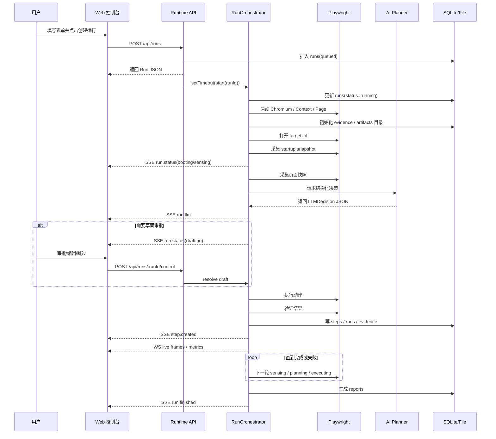

---

## 35. 最后的总结

如果你只记住 10 句话，我希望是这 10 句：

1. 这个仓库不是一个项目，而是 Desktop、Web、Runtime 三个主要程序组成的 monorepo。
2. Desktop 只是壳，真正干活的是 runtime。
3. Web 控制台也不直接操作浏览器，它只是和 runtime 通信。
4. Runtime 通过 Fastify 暴露 API，通过 Playwright 驱动 Chromium，通过 LLM 做结构化规划。
5. 前端不是只靠 REST，它同时用了 REST、SSE、WebSocket 三条通信链路。
6. REST 负责查改，SSE 负责状态事件，WebSocket 负责实时画面。
7. `packages/shared` 是整个系统的协议层，没有它前后端很容易说不明白同一件事。
8. `RunOrchestrator` 是系统真正的大脑，它是有状态、长生命周期、单活的。
9. 一条 run 的核心循环是：感知 -> 规划 -> 审批（可选）-> 执行 -> 验证 -> 持久化。
10. 这套系统最难的地方不在“调一个模型”或者“点一个按钮”，而在于把浏览器、AI、实时可视化、人类接管、证据和模板沉淀真正串成一个可靠流程。

---

## 36. 我建议你接下来怎么读代码

如果你已经看完这篇文档，下一步最推荐的代码阅读顺序是：

1. `apps/web/src/lib/api.ts`
   - 先知道前端会请求哪些接口
2. `apps/runtime/src/server.ts`
   - 再知道 runtime 是怎么装起来的
3. `apps/runtime/src/server/routes/runs.ts`
   - 看 run 相关入口
4. `apps/runtime/src/orchestrator/run-orchestrator.ts`
   - 看真正调度逻辑
5. `apps/runtime/src/playwright/*`
   - 看浏览器怎么采集、执行、验证
6. `apps/runtime/src/llm/planner.ts`
   - 看 AI 只负责哪一段
7. `packages/shared/src/schemas.ts`
   - 回头对照共享模型

如果你愿意，我下一步还能继续给你补三份更细的文档：

- 《Run 状态机逐行讲解》
- 《前端控制台通信链路逐页讲解》
- 《RunOrchestrator 执行主循环源码导读》

## 第 5 章导读：把一次 run 从头到尾看明白

当你已经知道角色分工后，下一步最重要的就是看“流程”。

因为 QPilot 最核心的体验不是“有很多页面”，而是：

- 你点了一次创建运行
- 系统真的开始跑
- 然后它一步步产生状态、步骤、证据和报告

下面这部分会把一次 run 的生命周期拆开讲。  
你读它的时候，最应该留意的是：

- 哪一步是前端发请求
- 哪一步是 runtime 真正接单
- 哪一步开始启动浏览器
- 哪一步开始调用 planner
- 哪一步开始落库和写文件

你后面排错时，90% 都要回到这条主流程来定位。

# QPilot Studio 运行全过程图解版（RUN LIFECYCLE 101）

如果你现在还不熟悉“请求、响应、端口、长连接、JSON、数据库、DOM、OCR”这些最基础的词，请先看 [FOUNDATIONS-101.zh-CN.md](./FOUNDATIONS-101.zh-CN.md)。  
那份文档更适合完全小白先补地基。

如果你想先看一份“从项目全貌、架构、OCR、ORM 一直讲到怎么自己从 0 做出来”的总手册，请先看 [FROM-0-TO-1.zh-CN.md](./FROM-0-TO-1.zh-CN.md)。  
当前这份文档保留为运行生命周期专题，重点讲一次 run 怎么从创建走到结束。

## 这份文档适合谁

这份文档写给“完全零基础，但想知道一次运行到底怎么从点按钮走到生成报告”的读者。

如果你现在还不熟悉前端、后端、接口、长连接这些词，建议先看 [ARCHITECTURE-101.zh-CN.md](./ARCHITECTURE-101.zh-CN.md)；如果你已经知道基本概念，只是想把一次 run 的生命过程彻底看明白，这份文档就是给你的。

## 先记住 6 个名字

### `Run`

`Run` 可以理解成“一次完整任务”。  
比如你在界面里填了“打开登录页，验证能不能登录”，然后点创建运行，这一整次过程就是一个 `Run`。

### `Step`

`Step` 可以理解成“一次具体动作”。  
比如“输入用户名”“点击登录按钮”“等待页面加载”，每一个都可能变成一个 `Step`。

### `REST`

`REST` 全称是 `Representational State Transfer`，这里你可以先把它理解成“普通接口请求”。  
最像你在柜台上交一张单子，柜员处理完，再把结果一次性还给你。

### `SSE`

`SSE` 全称是 `Server-Sent Events`，中文可以理解成“服务器持续往前端推送事件的长连接”。  
最像你交完单子以后，不用反复追问，而是柜员有新进展就主动喊你一声。

### `WebSocket`

`WebSocket` 可以理解成“专门用来持续传输实时数据的长连接”。  
在这个项目里，它主要拿来传浏览器实时画面，而不是拿来发业务状态。

### `Playwright`

`Playwright` 是一个浏览器自动化工具。  
你可以把它理解成“真正替 AI 去打开网页、找按钮、输入内容、点击页面的执行手”。

## 先看一张总图

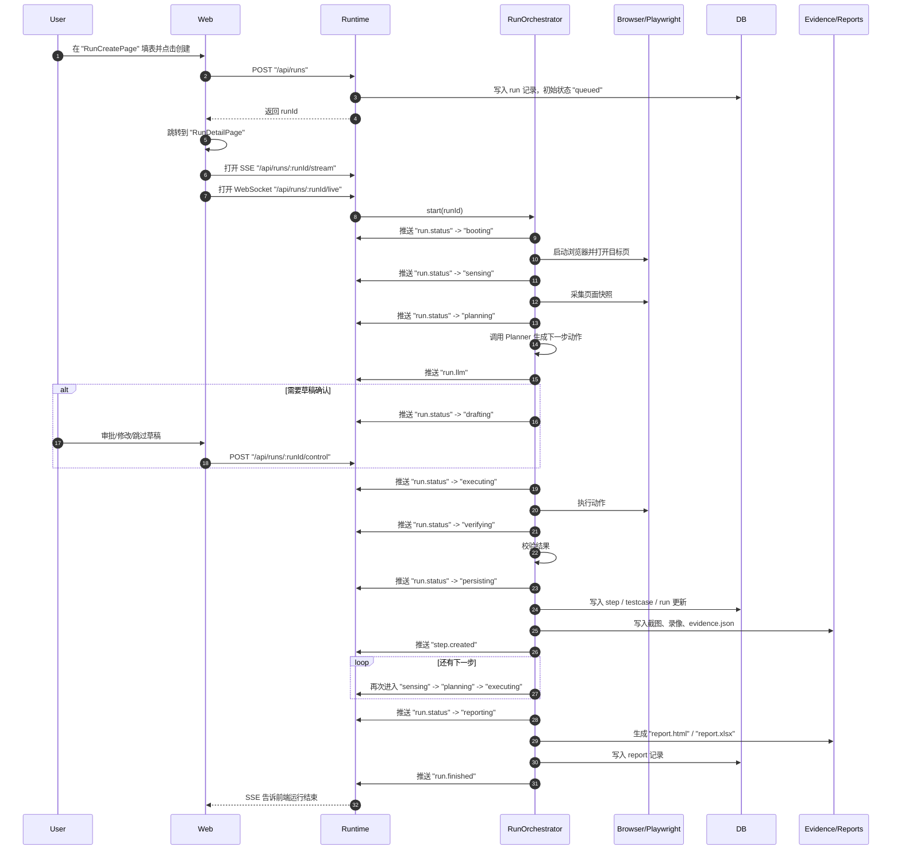

## 再看一张数据流图

```mermaid
flowchart LR
    U["用户"] --> W["Web 前端<br/>表单、详情页、实时面板"]
    W -->| "REST: 创建/暂停/恢复/查询" | R["Runtime 服务"]
    W -->| "SSE: run.status / run.llm / step.created / run.finished" | R
    W -->| "WebSocket: run.frame / run.metric" | R
    R --> O["RunOrchestrator<br/>运行主循环"]
    O --> P["Playwright 浏览器"]
    P --> S["页面快照<br/>截图、标题、URL、元素信息"]
    O --> L["Planner / Executor / Verifier"]
    O --> DB["SQLite / Drizzle<br/>runs、steps、reports 等"]
    O --> E["Artifacts 文件夹<br/>evidence.json、截图、视频"]
    O --> RP["Reports 文件夹<br/>report.html、report.xlsx"]
    DB --> R
    E --> R
    RP --> R
    R --> W
```

## 0. 先把“状态”和“阶段”分开

### 这是什么

很多新手第一次看运行详情页，会把 `status` 和 `phase` 混在一起。

- `status` 是这次 run 的“大结局”
- `phase` 是这次 run 此刻“正在演哪一幕”

### 为什么要分开

因为一个 run 在结束前，几乎一直都处于 `running`。  
但它在 `running` 里面，还会不断经过 `booting`、`planning`、`executing`、`verifying` 这些不同阶段。

如果不把这两个概念拆开，你就会看到“明明一直都是 running，为什么页面内容在一直变”。

### 在 QPilot Studio 里它是谁

- `status` 枚举定义在 `packages/shared/src/schemas.ts`
  - `queued / running / passed / failed / stopped`
- `phase` 枚举也定义在 `packages/shared/src/schemas.ts`
  - `queued / booting / sensing / planning / drafting / executing / verifying / paused / manual / persisting / reporting / finished`

### 你在界面上会看到什么

- 列表页里更常看见的是 `status`
- 详情页顶部、实时画面、步骤推进过程中更常看见的是 `phase`

你可以把它记成：

- `status` 像“考试最终成绩”
- `phase` 像“现在正在答哪一道题”

### 对应代码入口

- `packages/shared/src/schemas.ts`
- `apps/web/src/store/run-stream.ts`
- `apps/web/src/pages/RunDetailPage.tsx`

## 1. 从 `RunCreatePage` 填表开始

### 这一步在干什么

用户进入 `RunCreatePage` 页面，填写本次运行的输入信息，比如：

- 选择项目 `projectId`
- 填目标地址 `targetUrl`
- 选择模式 `mode`
- 写运行目标 `goal`
- 设置最多步数 `maxSteps`
- 选择执行模式 `executionMode`
- 是否需要草稿确认 `confirmDraft`
- 是否打开有头浏览器 `headed`
- 是否允许人工接管 `manualTakeover`
- 是否复用会话 `sessionProfile / saveSession`

这一步本质上是在把“人类想让系统做什么”整理成一份结构化请求。

### 为什么这一步要先做

因为 runtime 不是读心术。  
它必须先知道目标网址、目标任务、运行模式、最大步数、是否允许人工介入，才能决定后面怎么跑。

### 在 QPilot Studio 里它是谁

- 页面组件：`apps/web/src/pages/RunCreatePage.tsx`
- 真正发请求的方法：`apps/web/src/lib/api.ts` 里的 `createRun`

### 你在界面上会看到什么

你看到的是一个“创建运行”的表单页。  
但从系统角度看，这一页的真正作用是把自由描述转成一份标准化 payload。

### 对应代码入口

- `apps/web/src/pages/RunCreatePage.tsx`
- `apps/web/src/lib/api.ts`

## 2. 前端发出的第一个请求是什么

### 这一步在干什么

用户点下创建按钮后，前端会调用：

- `api.createRun(payload)`

然后发出一条普通接口请求：

- `POST /api/runs`

这就是这次 run 的第一条正式请求。

### 为什么第一条不是 SSE 或 WebSocket

因为在 run 还没创建成功之前，前端连 `runId` 都还没有。  
没有 `runId`，就不知道该订阅哪一条运行流，也不知道该去看哪一个实时画面。

所以顺序一定是：

1. 先用 `REST` 请求创建 run
2. 拿到 `runId`
3. 再打开 SSE 和 WebSocket

### 在 QPilot Studio 里它是谁

前端调用点：

- `apps/web/src/pages/RunCreatePage.tsx`
- `apps/web/src/lib/api.ts`

后端接收点：

- `apps/runtime/src/server/routes/runs.ts`

### 你在界面上会看到什么

创建成功后，前端会立刻跳转到：

- `/runs/:runId`

也就是运行详情页 `RunDetailPage`。

### 对应代码入口

- `apps/web/src/pages/RunCreatePage.tsx`
- `apps/web/src/lib/api.ts`
- `apps/runtime/src/server/routes/runs.ts`

## 3. runtime 收到请求后先写什么、再做什么

### 这一步在干什么

`runtime` 收到 `POST /api/runs` 后，不是马上启动浏览器，而是先做一组“建档动作”。

它大致按这个顺序做事：

1. 检查当前 runtime 是否已经在忙
2. 校验请求体格式
3. 检查项目是否存在
4. 如果用户这次带了用户名密码，就先加密后更新到项目记录里
5. 组装 `runConfig`
6. 往数据库 `runs` 表插入一条新 run，初始状态是 `queued`
7. 把新建好的 run 返回给前端
8. 用 `setTimeout(..., 0)` 异步启动 `orchestrator.start(runId)`

### 为什么不是先开浏览器

因为系统要先把“这次任务是谁、配置是什么、数据库里的身份是什么”登记清楚。

你可以把它理解成：

- 先建工单
- 再派工

如果直接开浏览器，后面出错时你甚至不知道这一次属于谁，也很难恢复、暂停、重连、查历史。

### 在 QPilot Studio 里它是谁

最关键的两个位置是：

- `insertRun(...)`：先把 run 写进数据库
- `orchestrator.start(runRow.id)`：再真正开始执行

### 你在界面上会看到什么

前端很快就能拿到一个 run 对象，所以页面可以先跳到详情页。  
这时浏览器可能还没完全启动，但 run 已经“有编号了”。

### 对应代码入口

- `apps/runtime/src/server/routes/runs.ts`
- `apps/runtime/src/db/schema.ts`
- `apps/runtime/src/db/migrate.ts`

## 4. 浏览器是什么时候启动的

### 这一步在干什么

真正的浏览器不是在 `POST /api/runs` 路由里启动的，而是在 `RunOrchestrator.start(runId)` 里启动的。

进入主循环后，orchestrator 会先发出：

- `phase: "booting"`

然后创建这次 run 的产物目录和报告目录，再启动 Playwright 浏览器，打开目标页面，并准备视频录制、会话复用、实时直播等能力。

### 为什么要把“创建 run”和“启动浏览器”拆开

因为这是两种完全不同的事情：

- 创建 run：是业务登记
- 启动浏览器：是实际执行

拆开以后，前端可以更早拿到 runId，用户也能更早进入详情页，同时后端的执行链路更清晰。

### 在 QPilot Studio 里它是谁

- 主循环：`apps/runtime/src/orchestrator/run-orchestrator.ts`
- 浏览器执行器：`apps/runtime/src/playwright/`

### 你在界面上会看到什么

刚进详情页时，你通常会看到 run 进入：

- `booting`

如果实时画面已经连上，你会看到浏览器窗口开始被打开；如果还没连上，稍后也会补上。

### 对应代码入口

- `apps/runtime/src/orchestrator/run-orchestrator.ts`
- `apps/runtime/src/server/live-stream-hub.ts`

## 5. 页面快照、Planner、Executor、Verifier 分别在什么时候出场

### 这一步在干什么

这是整个系统最核心的一段循环。  
你可以把它记成四连拍：

1. 看一眼页面
2. 想下一步怎么做
3. 真正去做
4. 检查做成没

在代码里对应：

- 页面快照 `Page Snapshot`
- 规划器 `Planner`
- 执行器 `Executor`
- 校验器 `Verifier`

### 为什么要拆成四个角色

因为“看”“想”“做”“验”是四种不同工作。

如果不拆开，系统就会变成一团混在一起的黑盒，很难知道：

- 是页面没看清
- 还是规划想错了
- 还是点击没点上
- 还是点上了但结果不符合预期

### 在 QPilot Studio 里它是谁

页面快照：

- `collectPageSnapshot(...)`
- 文件位置：`apps/runtime/src/playwright/collector/page-snapshot.ts`

规划器：

- `apps/runtime/src/llm/planner.ts`

执行器：

- `apps/runtime/src/playwright/executor/action-executor.ts`

校验器：

- `apps/runtime/src/playwright/verifier/basic-verifier.ts`

### 你在界面上会看到什么

详情页里的 phase 往往会这样变化：

- `sensing`：系统正在观察当前页面
- `planning`：系统把快照和目标交给 Planner，请它生成动作草案
- `executing`：系统正在点、输、选、跳转、等待
- `verifying`：系统正在确认刚才动作是否真的达成了目标

### 对应代码入口

- `apps/runtime/src/playwright/collector/page-snapshot.ts`
- `apps/runtime/src/llm/planner.ts`
- `apps/runtime/src/playwright/executor/action-executor.ts`
- `apps/runtime/src/playwright/verifier/basic-verifier.ts`
- `apps/runtime/src/orchestrator/run-orchestrator.ts`

### 补充 1：页面快照到底不是“只截一张图”

很多人看到 `collectPageSnapshot(...)`，会误以为它只是“拍了一张截图”。
其实不是。

它至少会把下面几类信息打包成一个 `PageSnapshot`：

- 当前 URL
- 当前标题
- 当前截图路径
- 当前采集到的元素列表
- 当前页面状态 `pageState`

也就是说，Planner 看到的并不是“只有一张图片”，而是“截图 + 元素 + 页面归类”的组合包。

### 补充 2：元素采集层到底在采什么

`collectInteractiveElements(...)` 会扫描主页面和 iframe。

它重点关心的是两类东西：

1. 明显可交互的元素
   例如：
   - `a`
   - `button`
   - `input`
   - `select`
   - `textarea`
   - 带 `role='button'` 这类可点击角色的节点
2. 能帮助理解页面结构的元素
   例如：
   - 标题
   - `form`
   - `section`
   - `nav`
   - 模态框根节点
   - 带 `aria-label`、`title` 的节点

它不是把 DOM 原封不动全塞给后面，而是会做几件整理工作：

- 去重
- 打分
- 排序
- 限量

这样做的原因很简单：

- 页面太大时，全部塞进去会让上下文失控
- iframe 太多时，必须先把最重要的元素排前面
- 弹窗、密码框、登录入口这类元素通常比普通装饰元素更重要

所以“页面检测”并不是无脑扫全页面，而是先做一轮工程化压缩。

### 补充 3：页面到底是怎么被判断成“登录页”或“搜索结果页”的

`summarizePageState(...)` 会把快照里的信号再归纳成一个 `PageState`。

它会综合看这些信息：

- URL host
- 页面标题
- 元素文本
- `aria-label`
- `placeholder`
- 有没有密码框
- 有没有账号输入框
- 有没有 iframe
- 有没有 modal / dialog
- 有没有搜索结果信号
- 有没有第三方登录信号
- 有没有安全校验信号

最后会把页面归成这几类 `surface` 之一：

- `generic`
- `modal_dialog`
- `login_chooser`
- `login_form`
- `provider_auth`
- `search_results`
- `security_challenge`
- `dashboard_like`

这一步很重要，因为后面的 Planner 和 Verifier 都会用这份分类结果。

生活类比：

- 元素列表像病人的原始症状
- `pageState` 像医生先给出的分诊结论

### 补充 4：为什么还要有 `page-guards.ts`

因为真实网页里，经常不是“页面功能坏了”，而是“页面被遮住了”。

比如：

- cookie banner
- 登录弹窗
- 遮罩层
- 验证码
- 安全校验
- 登录墙

`page-guards.ts` 做的就是两件事：

1. 尽量自动清障
   例如尝试点掉关闭按钮、接受 cookie 提示
2. 检测当前是不是已经进入必须人工介入的阻断页

所以它更像“场地清障员”。
先把明显挡路的东西处理掉，自动化动作才更有机会成功。

### 补充 5：Verifier 为什么还要重新看一遍页面

动作执行完以后，系统不会只因为“click 没报错”就当它成功了。

`basic-verifier.ts` 会重新收集元素、重新总结 `pageState`，再结合：

- URL 有没有变化
- 预期检查项有没有命中
- 当前页面类型有没有朝目标方向变化

来判断刚才这一步到底算不算通过。

比如：

- 点“登录”后，页面进入 `login_form`，那说明这个点击大概率是有效的
- 点按钮后 URL 变了，说明导航可能成功了
- 等待一会儿后从 `generic` 变成了 `modal_dialog` 或 `search_results`，也可能说明页面确实有了反应

### 补充 6：为什么还有 OCR 兜底

有些页面的按钮文字明明肉眼看得见，但 DOM 结构并不好用：

- 选择器很乱
- 文本被包在复杂节点里
- 页面是画出来的，不是规整表单

这时 `visual-targeting.ts` 会用 `OCR`，也就是 `Optical Character Recognition`，中文可以理解成“光学字符识别”，从截图里读文字，再辅助找出点击位置。

所以它不是主流程的第一选择，而更像“普通 DOM 定位不稳时的备用雷达”。

### 补充 7：检测链每一层的输入和输出到底是什么

很多人看源码时会被“这么多层函数”绕晕，本质上是不知道每一层到底拿什么、吐什么。

你可以先按下面这张表记：

| 层 | 输入 | 输出 | 它解决什么问题 |
| --- | --- | --- | --- |
| `collectInteractiveElements` | `page` / `frame` | `InteractiveElement[]` | 把页面里重要元素摘出来 |
| `summarizePageState` | `url` + `title` + `elements` | `PageState` | 判断当前页面更像登录页、搜索结果页还是安全拦截页 |
| `collectPageSnapshot` | `page` + 采集参数 | `PageSnapshot` | 把截图、元素、页面状态打包成一次快照 |
| `planner.ts` | `PageSnapshot` + `goal` + `runConfig` | `LLMDecision` | 决定下一步动作和预期检查项 |
| `action-executor.ts` | `Action` + `page` | 动作执行结果 | 真正去点、输、跳、等 |
| `basic-verifier.ts` | 动作前后页面 + 预期检查项 | `VerificationResult` 的页面侧部分 | 判断页面有没有往预期方向变化 |
| `traffic-verifier.ts` | 当前 step 的网络证据 + 预期请求 | `ApiVerificationResult` | 判断 API 请求有没有符合预期 |
| `run-orchestrator.ts` | 上面所有结果 | `stepRow` / `run status` / 证据写入 | 把这一步变成真正的运行记录 |

如果你现在只能先记住一句，那就记：

- 元素层负责“抄下来”
- 页面状态层负责“归类”
- Planner 负责“想下一步”
- Executor 负责“真的去做”
- Verifier 负责“判断有没有做成”
- Orchestrator 负责“把这一切串起来并落盘”

### 补充 8：Verifier 不只看页面，还会看 API

很多新手会以为：

- “验证成功”就是按钮点到了

其实在这个项目里，验证经常分两路：

1. UI 路
   看页面有没有变化
2. API 路
   看相关网络请求有没有按预期发生

这就是为什么运行过程中不仅会保存截图和页面状态，还会保存网络证据。

`traffic-verifier.ts` 会把当前 step 关联到的网络请求拿出来，重点检查：

- 有没有相关的 `xhr / fetch / document` 请求
- 有没有失败请求
- 有没有命中预期请求断言
- 返回里有没有 token / session 这类信号
- 前后 host 有没有切换

然后把这部分结果整理成：

- `ApiVerificationResult`

再和页面侧验证一起并入总的 `VerificationResult`。

生活类比：

- UI 验证像看“门是不是打开了”
- API 验证像看“后台有没有真的去登记开门记录”

两边都看，系统就不容易被“页面表面看起来变了，但后台其实没完成”这种情况骗过去。

## 6. SSE 怎么把状态推回前端

### 这一步在干什么

`SSE` 全称是 `Server-Sent Events`。  
它在这里负责把“这次 run 的业务进展”持续推回前端。

详情页打开后，前端会创建：

- `new EventSource("/api/runs/:runId/stream")`

后端这条路由会把 HTTP 连接保持不断开，然后不断往里面写事件。

### 为什么这里用 SSE

因为 SSE 很适合“后端持续推送，前端持续接收”的场景。

这个项目里的状态更新，天然就是单向流动：

- runtime 知道最新阶段
- web 只负责展示

所以 SSE 很合适，也比“前端每隔 1 秒轮询一次”更自然。

### 在 QPilot Studio 里它是谁

后端：

- 路由：`/api/runs/:runId/stream`
- Hub：`apps/runtime/src/server/sse-hub.ts`

前端：

- `api.createRunStream(runId)`
- `RunDetailPage` 里注册事件监听

具体监听的核心事件包括：

- `run.status`
- `run.llm`
- `step.created`
- `testcase.created`
- `run.finished`
- `run.error`

这些名字定义在：

- `packages/shared/src/constants.ts`

### 你在界面上会看到什么

你不用手动刷新页面，详情页就会自己更新：

- 当前 phase 变了
- 最新 LLM 决策出来了
- 新 step 加到了步骤列表里
- 运行结束后状态自动切到最终结果

另外，`SseHub` 每 15 秒还会发一次 `ping`，让前端知道连接还活着。

### 对应代码入口

- `packages/shared/src/constants.ts`
- `apps/runtime/src/server/sse-hub.ts`
- `apps/runtime/src/server/routes/runs.ts`
- `apps/web/src/lib/api.ts`
- `apps/web/src/pages/RunDetailPage.tsx`

## 7. WebSocket 怎么把实时画面推回前端

### 这一步在干什么

`WebSocket` 在这里主要负责“传实时浏览器画面”。

前端会连接：

- `/api/runs/:runId/live`

连接成功后，runtime 会把浏览器当前画面持续编码后发给前端。  
前端收到后，把图片数据画到 `canvas` 上，于是你在界面里看到“直播中的浏览器”。

### 为什么这里不用 SSE

因为实时画面比普通状态消息重得多。  
它不只是几个文字字段，而是不断来的图像帧和指标信息。

这个场景更像“视频流”或“实时屏幕投送”，所以更适合用 WebSocket。

### 在 QPilot Studio 里它是谁

后端：

- WebSocket 路由：`apps/runtime/src/server/routes/live.ts`
- 直播中枢：`apps/runtime/src/server/live-stream-hub.ts`

前端：

- `apps/web/src/lib/api.ts` 的 `createRunLiveSocket`
- `apps/web/src/components/LiveRunViewport.tsx`

共享消息结构：

- `packages/shared/src/schemas.ts`

后端发出的消息主要有两类：

- `run.frame`：一帧画面
- `run.metric`：帧率、采集耗时、观看人数、传输方式等指标

### 你在界面上会看到什么

你会在详情页的实时面板里看到：

- 浏览器当前画面
- 当前步骤号
- 当前 phase
- 帧率
- 是否是 `screencast` 还是 `snapshot` 回退模式

如果实时流暂时断了，组件还会尝试重连；如果拿不到实时帧，界面还能退回到已保存截图。

### 对应代码入口

- `apps/runtime/src/server/routes/live.ts`
- `apps/runtime/src/server/live-stream-hub.ts`
- `apps/web/src/components/LiveRunViewport.tsx`
- `packages/shared/src/schemas.ts`

## 8. Step 为什么会落库，证据为什么会落文件

### 这一步在干什么

当一次动作执行完并且校验完，系统会进入：

- `persisting`

也就是“保存阶段”。

在这一阶段里，系统不会只保存一种东西，而是会分成两条线一起落地：

- 结构化数据进数据库
- 大体积证据进文件夹

### 为什么要分成数据库和文件夹

因为它们适合保存的东西不一样。

数据库适合放“方便查、方便筛选、方便列表展示”的结构化数据，比如：

- run 基本信息
- step 记录
- testcase 记录
- report 记录

文件夹适合放“体积大、不适合硬塞进表里”的证据，比如：

- 截图
- 视频
- `evidence.json`
- 生成好的 HTML / XLSX 报告

### 在 QPilot Studio 里它是谁

数据库部分：

- `apps/runtime/src/db/schema.ts`
- `apps/runtime/src/server/routes/runs.ts`
- `apps/runtime/src/orchestrator/run-orchestrator.ts`

证据文件部分：

- `apps/runtime/src/server/evidence-store.ts`

具体路径长这样：

- 证据文件：`artifacts/runs/<runId>/evidence.json`
- 录制视频：`/artifacts/runs/<runId>/video/...`
- 报告文件：`reports/runs/<runId>/report.html`
- 报告表格：`reports/runs/<runId>/report.xlsx`

### 你在界面上会看到什么

这就是为什么详情页既能：

- 很快列出步骤和状态

又能：

- 展示截图
- 回放画面
- 打开报告
- 查看网络证据

因为这些内容本来就不是存放在同一个地方的。

### 对应代码入口

- `apps/runtime/src/db/schema.ts`
- `apps/runtime/src/server/evidence-store.ts`
- `apps/runtime/src/orchestrator/run-orchestrator.ts`

### 补充：这一步里的 ORM 到底是谁

这一步最容易让新手误会成：

- “系统把数据随手写进了数据库”

其实中间还有一层 `ORM`。

`ORM` 全称是 `Object-Relational Mapping`，中文可以理解成“对象关系映射”。
在这个项目里，用的是：

- `Drizzle ORM`

你可以把这一层理解成“运行逻辑”和“SQLite 数据库文件”之间的翻译器。

在 QPilot Studio 里，这三份文件的职责要分开看：

- `apps/runtime/src/db/client.ts`
  负责创建数据库连接，并把它包装成 Drizzle 的 `db` 对象
- `apps/runtime/src/db/schema.ts`
  负责描述表结构，例如 `runsTable`、`stepsTable`、`reportsTable`
- `apps/runtime/src/db/migrate.ts`
  负责真正建表、补列，让数据库文件长成程序期望的样子

所以当运行进入 `persisting` 时，背后通常不是一段神秘黑盒，而是这种比较直白的动作：

- `db.insert(stepsTable).values(stepRow)`
- `db.update(runsTable).set(...)`
- `db.insert(reportsTable).values(...)`

这就是为什么你在 `run-orchestrator.ts` 和 `routes/runs.ts` 里会看到一堆 `.insert(...)`、`.select(...)`、`.update(...)`。

### 补充：为什么 `evidence-store.ts` 不走 ORM

因为 `evidence-store.ts` 管的很多东西本来就不适合进数据库表。

比如：

- 控制台日志集合
- 网络证据集合
- planner trace
- `evidence.json`

这些内容通常：

- 体积更大
- 结构更灵活
- 更适合作为整包证据文件保存

所以它走的是“文件系统 + JSON”这条线，而不是“关系表 + ORM”这条线。

### 补充：一次 step 持久化时，通常会写到哪些表和文件

新手很容易以为：

- “保存一步” = 往数据库里插一行

实际上一整步结束后，系统可能会同时碰到好几个存储位置。

你可以先按下面这张表记：

| 存储位置 | 什么时候写 | 大概写什么 |
| --- | --- | --- |
| `runsTable` | run 创建、状态变化、启动页更新、报错、结束时 | 当前状态、时间、最近 LLM、视频路径、错误信息 |
| `stepsTable` | 每次 step 完成并进入 `persisting` 时 | 当前页面摘要、动作、校验结果、截图路径 |
| `testCasesTable` | 本步或本次 run 需要沉淀测试用例时 | 模块、标题、步骤、预期、状态 |
| `reportsTable` | 运行完成并生成报告后 | `report.html`、`report.xlsx` 路径 |
| `caseTemplatesTable` | 成功 run 被提炼成模板后 | 可复用模板内容 `caseJson` |
| `artifacts/runs/<runId>/evidence.json` | 运行过程中不断刷新 | console、network、planner trace |
| `artifacts/runs/<runId>/...png` | 各次快照采集时 | 页面截图 |
| `artifacts/runs/<runId>/video/...` | 浏览器录制完成后 | 运行视频 |
| `reports/runs/<runId>/report.html` | reporting 阶段 | HTML 报告 |
| `reports/runs/<runId>/report.xlsx` | reporting 阶段 | Excel 报告 |

所以“持久化”其实不是单点动作，而更像一次“把这一步所有结果分别归档”的过程。

### 补充：不是每一步都会写满所有表

这点也很重要。

例如：

- `stepsTable` 几乎每一步都会写
- `testCasesTable` 不是每一步都一定写
- `reportsTable` 只有运行结束生成报告时才写
- `caseTemplatesTable` 一般是成功 run 才更可能写

所以你看到数据库里表很多，不代表每个 step 都会把每张表都改一遍。
更准确的理解是：

- 不同阶段，写不同层级的档案

## 9. 什么时候会停在 `drafting`

### 这一步在干什么

`drafting` 的意思不是“执行失败”，而是“系统已经想好了下一步动作，但这一步先不立刻执行，要把草稿亮给人看”。

你可以把它理解成：

- AI 已经写好了下一步
- 但现在进入的是“待审批”状态

### 为什么会进入这个阶段

常见原因有两类：

1. 当前执行模式就要求先出草稿，再等人确认
2. 当前这一步虽然能做，但系统希望给人一个介入点，让人决定：
   - 直接执行
   - 改一下再执行
   - 跳过
   - 重试

### 在 QPilot Studio 里它是谁

在 orchestrator 里，`resolveDraftAction(...)` 会：

1. 先把草稿存进内存里的 `activeDrafts`
2. 发出 `phase: "drafting"`
3. 如果 `awaitApproval` 为真，就挂起等待人的决定
4. 直到前端通过控制接口把决定发回来

前端把人的决定发到：

- `POST /api/runs/:runId/control`

### 你在界面上会看到什么

详情页会显示：

- 当前 phase 是 `drafting`
- 当前建议动作是什么
- 当前预期检查项是什么

如果允许编辑草稿，你还可以先改动作，再让它执行。

### 对应代码入口

- `apps/runtime/src/orchestrator/run-orchestrator.ts`
- `apps/runtime/src/server/routes/runs.ts`
- `apps/web/src/pages/RunDetailPage.tsx`

## 10. 什么时候会停在 `manual`

### 这一步在干什么

`manual` 的意思是“现在不是让你审批一个动作草稿，而是请你真的接管浏览器现场处理一下”。

这和 `drafting` 完全不是一回事。

- `drafting`：人在决定“下一步动作要不要执行”
- `manual`：人在真的操作浏览器，帮系统脱困

### 为什么会进入这个阶段

最典型的情况是：

- 出现验证码
- 出现安全校验
- 出现登录墙
- 出现必须真人处理的阻断页面

这时 AI 继续硬点往往没用，甚至会把局面越弄越糟。  
所以系统会暂停自动化，把现场交给人。

### 在 QPilot Studio 里它是谁

orchestrator 里的 `waitForManualTakeover(...)` 会：

1. 先对当前卡住的页面拍一张快照
2. 保存当下的证据
3. 发出 `phase: "manual"`，并标记 `manualRequired: true`
4. 最长等待 10 分钟
5. 人处理完成后，再拍一张恢复后的快照
6. 把 phase 切回 `sensing`，继续后续链路

### 你在界面上会看到什么

你会看到：

- phase 变成 `manual`
- 页面提示当前需要人工处理
- 浏览器现场仍然保留着

等你处理完，系统会从新的页面状态继续往下跑，而不是从头开始。

### 对应代码入口

- `apps/runtime/src/orchestrator/run-orchestrator.ts`
- `apps/web/src/pages/RunDetailPage.tsx`

## 11. run 结束后报告怎么生成

### 这一步在干什么

当主循环结束后，系统会先得出最终结论：

- `passed`
- `failed`
- 或者 `stopped`

接着进入：

- `reporting`

这一步的核心工作是把本次运行已经收集到的结构化数据和证据文件整理成可读报告。

### 为什么报告不是边跑边生成

因为报告不是“实时 UI 状态”，而是“事后整理结果”。

只有当系统知道：

- 最终状态是什么
- 一共有多少步
- 哪些检查通过了
- 哪些失败了
- 证据文件落在哪里

它才能生成一份完整、稳定、可分享的报告。

### 在 QPilot Studio 里它是谁

orchestrator 会调用 `generateRunReports(runId)`，然后生成：

- `report.html`
- `report.xlsx`

并把路径写入数据库 `reports` 表。

对外查询接口是：

- `GET /api/runs/:runId/report`

### 你在界面上会看到什么

运行结束后，详情页可以显示：

- 最终状态
- 步骤结论
- 报告入口

如果这次运行最终 `passed`，系统还可能继续做一件额外的事：把成功运行提炼成可复用 case。

### 对应代码入口

- `apps/runtime/src/orchestrator/run-orchestrator.ts`
- `apps/runtime/src/server/routes/runs.ts`
- `packages/report-core`

## 12. 一张“用户动作 -> API -> runtime 模块 -> 页面变化”的总表

| 用户动作 | 前端发什么 | runtime 谁处理 | 后面发生什么 | 页面上你看到什么 |
| --- | --- | --- | --- | --- |
| 在创建页点“创建运行” | `POST /api/runs` | `routes/runs.ts` | 写入 `runs` 表，异步启动 orchestrator | 页面跳到详情页 |
| 详情页打开 | `GET /api/runs/:runId`、`GET /steps`、`GET /evidence` | `routes/runs.ts` | 先把已有 run、步骤、证据补给前端 | 页面先有基础信息 |
| 详情页进入实时订阅 | `EventSource /api/runs/:runId/stream` | `SseHub` | 订阅运行事件流 | phase、step、LLM 信息会自动刷新 |
| 详情页进入实时画面 | `WebSocket /api/runs/:runId/live` | `live-stream-hub.ts` | 建立直播连接并发送画面帧 | 看到浏览器直播画面 |
| runtime 启动浏览器 | 无新增前端请求 | `RunOrchestrator.start` | 创建目录、起 Playwright、进 `booting` | phase 变成 `booting` |
| runtime 采集页面 | 无新增前端请求 | `collectPageSnapshot` + `collectInteractiveElements` + `summarizePageState` | 截图、读标题、读 URL、抽取元素、归类页面类型 | phase 变成 `sensing` |
| runtime 请求 AI 出下一步 | 无新增前端请求 | `planner.ts` | 生成动作草案与预期检查 | phase 变成 `planning`，LLM 面板更新 |
| 需要草稿确认 | 用户点击审批按钮后 `POST /api/runs/:runId/control` | `resolveDraftAction` + `routes/runs.ts` | 等待人确认、修改或跳过 | phase 变成 `drafting` |
| 执行动作 | 无新增前端请求 | `action-executor.ts` | 真正操作浏览器 | phase 变成 `executing` |
| 校验动作结果 | 无新增前端请求 | `basic-verifier.ts` | 判断动作是否成功 | phase 变成 `verifying` |
| 校验相关 API 证据 | 无新增前端请求 | `traffic-verifier.ts` | 判断请求是否命中预期、是否有失败请求、是否有 token/session 信号 | 验证面板里的 API 结果更新 |
| 保存步骤和证据 | 无新增前端请求 | `run-orchestrator.ts` + `Drizzle ORM` + `evidence-store.ts` | step 入库，结构化数据写表，证据写文件 | 步骤列表新增一项，截图/证据可见 |
| 遇到必须真人处理的问题 | 用户现场处理后点恢复/继续 | `waitForManualTakeover` | 暂停自动化，等人接管，再恢复 | phase 变成 `manual` 后再回到 `sensing` |
| 运行结束 | 前端继续收 SSE 事件 | `generateRunReports` | 生成 HTML/XLSX 报告并发 `run.finished` | 页面显示最终结果与报告入口 |

## 最后，把全过程再压缩成一句人话

一次 run 的本质，其实就是下面这条链：

1. 人在前端填目标
2. 前端用 `POST /api/runs` 建一条 run
3. runtime 先登记 run，再启动 orchestrator
4. orchestrator 启动浏览器
5. 系统循环执行“看页面 -> 想动作 -> 做动作 -> 验结果 -> 存证据”
6. 前端一边通过 `SSE` 收业务状态，一边通过 `WebSocket` 收实时画面
7. 跑完以后，runtime 生成报告并发出 `run.finished`

如果你已经读完这份文档，下一步最推荐你去对照源码的顺序是：

1. `apps/web/src/pages/RunCreatePage.tsx`
2. `apps/web/src/lib/api.ts`
3. `apps/runtime/src/server/routes/runs.ts`
4. `apps/runtime/src/orchestrator/run-orchestrator.ts`
5. `apps/web/src/pages/RunDetailPage.tsx`
6. `apps/web/src/components/LiveRunViewport.tsx`

如果你想先补概念，再回来重看全过程，回到 [ARCHITECTURE-101.zh-CN.md](./ARCHITECTURE-101.zh-CN.md)。  
如果你想专门补数据库与落库链，继续看 [DB-ORM-101.zh-CN.md](./DB-ORM-101.zh-CN.md)。  
如果你想专门补页面检测与校验链，继续看 [PAGE-DETECTION-101.zh-CN.md](./PAGE-DETECTION-101.zh-CN.md)。  
如果你想看完整工程全景，继续看 [ARCHITECTURE.zh-CN.md](./ARCHITECTURE.zh-CN.md)。

## 第 6 章导读：系统到底是怎么看网页的

很多人第一次接触这类项目，会误以为“AI 就是看一眼截图然后自己瞎点”。

实际上完全不是这样。

下面这一部分会重点讲：

- 页面元素怎么被采集
- 页面状态怎么被归类
- 普通 DOM 定位为什么优先于 OCR
- OCR 到底什么时候才会兜底出场

你这部分一旦看明白，就会对这类系统的“智能”有一个更现实、也更可控的理解。

# QPilot Studio 页面检测链详解（PAGE DETECTION 101）

如果你连“浏览器自动化、DOM、元素、选择器、iframe、OCR”这些词都还不熟，请先看 [FOUNDATIONS-101.zh-CN.md](./FOUNDATIONS-101.zh-CN.md)。  
那份文档更适合先补最基础的视觉和页面概念。

如果你想先看一份从项目搭建、运行链路一路讲到页面检测和 OCR 的总手册，请先看 [FROM-0-TO-1.zh-CN.md](./FROM-0-TO-1.zh-CN.md)。  
当前这份文档保留为页面检测专题，适合在总手册之后专门深挖这条链。

## 这份文档适合谁

这份文档写给下面这类读者：

- 你已经知道这个项目会“看页面、想动作、做动作、验结果”
- 但你还不清楚“系统到底怎么判断当前页面是什么类型”
- 你希望把 `collectInteractiveElements / summarizePageState / page-guards / basic-verifier / traffic-verifier / OCR` 这条链一次看明白

如果你还没看过总扫盲文档，建议先看 [ARCHITECTURE-101.zh-CN.md](./ARCHITECTURE-101.zh-CN.md)。  
如果你想先知道这条链在运行生命周期的哪一段出场，建议先看 [RUN-LIFECYCLE-101.zh-CN.md](./RUN-LIFECYCLE-101.zh-CN.md)。

## 先记住一句人话

这个项目里的“页面检测”不是“AI 看一眼网页截图就完事”。

它更像一条流水线：

1. 先把页面里重要元素抄下来
2. 再把页面归类成登录页、搜索结果页、验证码页之类
3. 再把整理后的结果交给 Planner 和 Verifier
4. 如果普通 DOM 定位不稳，再让 OCR 从图片里读字兜底

## 先看总图

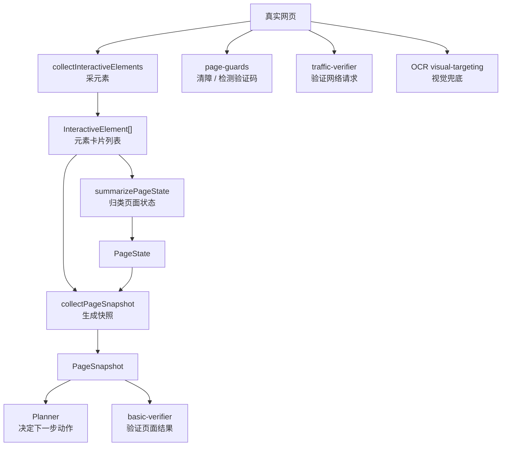

## 为什么要把“页面检测”拆成这么多层

### 这是什么

很多新手的第一直觉是：

- 直接把整页 DOM 给 AI
- 或者直接把整张截图给 AI
- 然后让 AI 自己想办法搞定

工程上这样很危险。

### 为什么要有它

因为真实页面的问题很多：

- DOM 很大
- iframe 很多
- 弹窗经常挡住页面
- 有些页面结构乱，但文字肉眼可见
- 有些按钮点到了，但后台请求其实失败了

如果没有分层，系统很难知道到底是：

- 页面没看清
- 还是定位错了
- 还是动作执行了但没生效
- 还是页面看起来成功、后台其实失败

### 在 QPilot Studio 里它是谁

这条链主要由下面几个模块构成：

- `apps/runtime/src/playwright/collector/interactive-elements.ts`
- `apps/runtime/src/playwright/collector/page-state.ts`
- `apps/runtime/src/playwright/collector/page-snapshot.ts`
- `apps/runtime/src/playwright/collector/page-guards.ts`
- `apps/runtime/src/playwright/verifier/basic-verifier.ts`
- `apps/runtime/src/orchestrator/traffic-verifier.ts`
- `apps/runtime/src/playwright/ocr/visual-targeting.ts`

### 你在界面上会看到什么

你虽然看不到这些模块名，但你会看到它们的结果：

- 当前页面被判断成什么阶段
- 当前步骤为什么被判成功或失败
- 为什么系统要求人工接管
- 为什么 API 验证通过或失败

### 对应代码入口

- `apps/runtime/src/playwright/collector/`
- `apps/runtime/src/playwright/verifier/`
- `apps/runtime/src/orchestrator/traffic-verifier.ts`
- `apps/runtime/src/playwright/ocr/visual-targeting.ts`

## 第 1 层：`InteractiveElement` 到底是什么

### 这是什么

你可以把 `InteractiveElement` 理解成：

- “系统眼里的一张元素卡片”

也就是说，网页上的按钮、输入框、链接、弹窗标题、iframe、表单，并不是直接原封不动丢给后续模块，而是先被整理成一张张结构化卡片。

### 为什么要有它

因为后面的判断逻辑如果直接处理整个 DOM，会非常乱。

先把重要信息抽出来以后，后续模块只需要看：

- 这是什么元素
- 它在哪个上下文里
- 它像不像登录入口
- 它是不是密码框

### 在 QPilot Studio 里它是谁

共享结构定义在：

- `packages/shared/src/schemas.ts`

采集逻辑在：

- `apps/runtime/src/playwright/collector/interactive-elements.ts`

### 你在界面上会看到什么

你不会直接在 UI 里看到“元素卡片”这个概念，但你看到的：

- 页面归类
- 动作定位
- 校验结果

背后都依赖这些卡片。

### 对应代码入口

- `packages/shared/src/schemas.ts`
- `apps/runtime/src/playwright/collector/interactive-elements.ts`

## `InteractiveElement` 里主要有哪些字段

你可以先把这些字段看成“系统给一个元素记下来的便签”。

| 字段 | 含义 | 为什么重要 |
| --- | --- | --- |
| `tag` | 标签名，例如 `button`、`input` | 先知道它是什么类型 |
| `id` | DOM id | 方便定位 |
| `className` | class 名 | 便于识别样式和特征 |
| `selector` | 为这个元素生成的简化选择器 | 后续执行或展示时有参考价值 |
| `text` | 元素文字 | 很多判断靠文字完成 |
| `type` | 输入框类型，例如 `password` | 判断登录表单时很关键 |
| `placeholder` | 占位文字 | 识别账号框、搜索框时常用 |
| `name` | name 属性 | 表单字段常用 |
| `ariaLabel` | 无障碍标签 | 页面没文字时，它常常很有用 |
| `role` | 语义角色 | 例如 `button`、`dialog` |
| `title` | title 属性 | 有时能补足文本信息 |
| `testId` | 测试标识 | 某些项目定位时非常稳 |
| `value` | 当前值 | 输入框里已有内容时可用 |
| `nearbyText` | 附近文本 | 帮助理解上下文 |
| `contextType` | 处于主页面、弹窗还是 iframe | 很关键，能知道它是不是被遮挡或嵌套 |
| `contextLabel` | 所在上下文标题 | 帮助理解当前属于哪个对话框 |
| `framePath` | 属于哪个 frame | 区分主页面和 iframe |
| `frameUrl` | 该 frame 的 URL | 辅助判断第三方授权页 |
| `frameTitle` | 该 frame 的标题 | 帮助理解 frame 语义 |
| `isVisible` | 是否可见 | 看不见的元素一般不该优先用 |
| `isEnabled` | 是否可用 | 禁用元素通常不能点 |

## 第 2 层：`collectInteractiveElements` 是怎么采元素的

### 这是什么

这一层的目标不是“把整页 DOM 全量导出”，而是：

- 找出对自动化最有价值的一批元素

### 为什么要有它

真实页面往往节点极多。

如果全部保留，会带来几个问题：

- 上下文太大
- 噪声太多
- 后面的 Planner 很难抓住重点

### 在 QPilot Studio 里它是谁

`interactive-elements.ts` 主要做了这些事：

1. 同时扫描主页面和所有 frame
2. 重点采两类节点
   - 明显可交互节点
   - 结构理解节点
3. 给元素补充上下文信息
4. 给元素打分
5. 去重、排序、限量

### 它重点会采哪些元素

可交互节点包括：

- `a`
- `button`
- `input`
- `select`
- `textarea`
- `summary`
- 带 `role='button'`、`role='link'` 之类语义角色的节点

结构理解节点包括：

- `label`
- 标题
- `form`
- `section`
- `article`
- `nav`
- `main`
- 带 `aria-label`、`title` 的节点
- iframe 本身

### 它是怎么补上下文的

这一层不会只记元素自己。
它还会尽量补下面这些东西：

- label 文本
- `aria-labelledby` 指向的文本
- 前后兄弟节点文本
- 所在弹窗或对话框的标题
- 所在 frame 的 URL 和标题

所以一个输入框最后不是只有：

- “我是 input”

而更像：

- “我是一个 password input，处在某个登录弹窗里，附近文字是‘账号/密码’”

### 它怎么过滤和排序

这层很关键。
不是采完就直接交出去，而是会：

- 过滤不可见元素
- 过滤禁用元素
- 过滤 `type='hidden'`
- 根据重要程度打分
- 优先保留弹窗、密码框、输入框、按钮、iframe、带文本的关键节点

代码里还有两个很重要的限制：

- 总量上限：`MAX_ELEMENTS = 220`
- 每个 frame 上限：`MAX_ELEMENTS_PER_FRAME = 72`

### 它为什么要限量

因为页面检测链不是“采得越多越好”。

太多会带来：

- 噪声更高
- AI 更难抓重点
- 性能更差

所以这里追求的是：

- 信息足够有用
- 但不要大到失控

### 它为什么还会造“synthetic iframe element”

代码里会给非主 frame 额外造一个“合成 iframe 元素”。

这么做的目的不是伪造页面，而是让后续模块至少知道：

- 这里有个 frame
- 这个 frame 大概是谁
- 它来自哪个 host

这对识别第三方授权页很有帮助。

## 第 3 层：`summarizePageState` 怎么把页面归类

### 这是什么

这一层的输入很简单：

- `url`
- `title`
- `elements`

输出是一个 `PageState`。

### 为什么要有它

因为后面的 Planner、Verifier 如果每次都从零看元素，很浪费。

先给页面一个“分诊结论”，后面的模块就更容易工作。

### 在 QPilot Studio 里它是谁

- 定义：`packages/shared/src/schemas.ts`
- 实现：`apps/runtime/src/playwright/collector/page-state.ts`

### `PageState` 里主要有哪些东西

| 字段 | 含义 |
| --- | --- |
| `surface` | 当前页面被归类成什么类型 |
| `hasModal` | 当前是否有弹窗/对话框 |
| `hasIframe` | 当前是否有 iframe |
| `frameCount` | frame 数量 |
| `hasLoginForm` | 当前是否像登录表单 |
| `hasProviderChooser` | 当前是否像第三方登录选择页 |
| `hasSearchResults` | 当前是否像搜索结果页 |
| `matchedSignals` | 命中了哪些判断信号 |
| `primaryContext` | 当前最主要的上下文标签 |

### `surface` 可能有哪些值

- `generic`
- `modal_dialog`
- `login_chooser`
- `login_form`
- `provider_auth`
- `search_results`
- `security_challenge`
- `dashboard_like`

### 它到底看了哪些信号

它会综合很多来源：

- URL host
- URL query
- 页面标题
- 元素文字
- `aria-label`
- `placeholder`
- 是否存在密码框
- 是否存在账号输入框
- 是否存在弹窗
- 是否存在 iframe
- 是否命中第三方登录品牌和授权页特征
- 是否命中搜索结果特征
- 是否命中验证码、安全校验特征
- 是否命中“已登录后页面”的特征

### 归类顺序为什么重要

代码不是“同时给 8 个类型打分后随便选一个”，而是按优先顺序判断。

例如：

1. 先看是不是 `security_challenge`
2. 再看是不是 `search_results`
3. 再看是不是 `provider_auth`
4. 再看是不是 `login_form`
5. 再看是不是 `login_chooser`
6. 再看是不是 `modal_dialog`
7. 最后才可能是 `dashboard_like` 或 `generic`

这个顺序的意义是：

- 更危险、更明确的页面类型优先级更高

## 第 4 层：`page-guards` 为什么存在

### 这是什么

`page-guards.ts` 更像“场地清障员 + 风险探测器”。

### 为什么要有它

因为真实页面里很多失败不是按钮找不到，而是：

- 按钮被 cookie banner 挡住了
- 按钮被弹窗盖住了
- 页面已经进入验证码或登录墙

### 在 QPilot Studio 里它是谁

这一层主要做两类事：

1. `dismissBlockingOverlays(...)`
   尝试关闭遮罩、弹窗、cookie 提示
2. `detectSecurityChallenge(...)`
   检测验证码、安全校验、登录墙

### 它怎么检测验证码

它主要综合看：

- URL 是否像 challenge/captcha 页面
- 页面正文是否出现安全验证关键词
- 是否出现 captcha iframe
- 是否出现 captcha widget

如果命中，就会给出：

- `detected: true`
- `kind`
- `reason`
- `requiresManual: true`

### 它怎么清障

它会尽量去找：

- cookie banner
- dialog / modal
- close 按钮
- accept 按钮

然后做 best-effort 的点击。

这里的关键词是：

- 尽量清掉
- 但不保证一定成功

## 第 5 层：`collectPageSnapshot` 为什么是中间总包

### 这是什么

`collectPageSnapshot(...)` 是这条检测链里的“打包工”。

### 为什么要有它

因为后面的 Planner 和很多调度逻辑，并不想分别拿：

- 截图
- 标题
- URL
- 元素
- 页面状态

它们更想拿到一份“已经整理好的快照总包”。

### 在 QPilot Studio 里它是谁

它会做三件核心事：

1. 截图
2. 调用 `collectInteractiveElements`
3. 调用 `summarizePageState`

最后返回 `PageSnapshot`。

### 它输出的 `PageSnapshot` 里主要有什么

- `url`
- `title`
- `screenshotPath`
- `elements`
- `pageState`

这就是为什么它不是“只截一张图”。

## 第 6 层：`basic-verifier` 怎么判断 UI 是否成功

### 这是什么

`basic-verifier.ts` 是页面侧的质检员。

### 为什么要有它

因为动作不报错，不代表动作真的成功。

例如：

- 点了按钮，但页面没变
- 输入了内容，但表单没真正提交
- 看起来进了登录页，但其实还是原页面上的假弹层

### 在 QPilot Studio 里它是谁

它会结合这些信息来判断：

- 动作前后的 URL
- 当前重新采集到的元素
- 当前 `PageState`
- 预期检查项
- 当前动作是什么类型

### 它的判断思路像什么

比如：

- 点击“登录”后，如果页面变成 `login_form` 或 `provider_auth`，那通常算有效
- 导航动作后 URL 真的变了，那很可能算有效
- 等待动作后页面从 `generic` 变成 `modal_dialog` 或 `search_results`，也可能算有效

### 它输出什么

它最后会参与构建：

- `VerificationResult`

里面会包含：

- `passed`
- `note`
- `rules`
- `pageState`

## 第 7 层：为什么还要有 `traffic-verifier`

### 这是什么

`traffic-verifier.ts` 是 API 侧的质检员。

### 为什么要有它

因为有些动作页面表面看起来像成功了，但后台请求其实失败了。

例如：

- 页面跳了
- 但提交接口返回 500
- 或者根本没发出预期请求

### 在 QPilot Studio 里它是谁

它会查看当前 step 关联到的网络证据，重点关注：

- `xhr`
- `fetch`
- `document`

然后检查：

- 有没有失败请求
- 有没有命中预期请求断言
- 有没有 token / session 信号
- 前后 host 有没有变化

### 它输出什么

它会生成：

- `ApiVerificationResult`

然后再被并入总的 `VerificationResult`。

### 为什么 UI 验证和 API 验证都要看

因为这两者分别回答不同问题：

- UI 验证：页面有没有变成你想要的样子
- API 验证：后台有没有真的发生你想要的请求

两边都看，误判会少很多。

## 第 8 层：OCR 为什么只是兜底，不是主角

### 这是什么

`visual-targeting.ts` 是视觉兜底层。

它会用：

- `OCR`

也就是 `Optical Character Recognition`，中文可以理解成“光学字符识别”。

### 为什么要有它

因为并不是所有页面都很好用 DOM 找目标。

有些页面会出现：

- 结构很乱
- 文本肉眼可见，但 DOM 不稳定
- 复杂 canvas 或视觉化组件

这时普通选择器不稳，OCR 还能从截图里找文字，辅助定位点击点。

### 在 QPilot Studio 里它是谁

它会做这些事：

- 从动作目标和 note 里提炼可搜索文本
- 对截图做 OCR
- 给候选文字片段打分
- 找出最可能的点击位置

### 为什么它不是第一选择

因为 OCR 成本更高，也更容易受画面质量影响。

所以项目的默认策略是：

1. 先用结构化 DOM 信息
2. 不稳时再用 OCR 兜底

## 一条“登录页面”判断链的例子

假设现在页面上有这些东西：

- 一个账号输入框
- 一个密码输入框
- 一个登录按钮
- 一个带“登录”字样的弹窗标题

系统大致会这样走：

1. `collectInteractiveElements`
   把账号框、密码框、登录按钮、弹窗标题采出来
2. `summarizePageState`
   发现有密码框、有账号框，还有登录信号
3. 于是把 `surface` 归成 `login_form`
4. `collectPageSnapshot`
   把截图、元素、`pageState` 打成一个快照
5. Planner
   基于这个快照更容易生成“输入账号 / 输入密码 / 点击登录”
6. 动作执行后
   `basic-verifier` 再看页面有没有进入登录后的状态
7. 如果同时有提交请求
   `traffic-verifier` 还会看登录接口是否成功

所以“系统认出登录页”不是一个瞬间魔法，而是一串很工程化的判断。

## 初学者最容易误会的 8 件事

### 1. 页面检测不等于截图识别

截图只是其中一部分。
更核心的是结构化元素和页面状态归类。

### 2. 页面检测不等于 AI 自己看 DOM

很多整理工作在 AI 之前就已经做完了。

### 3. `pageState` 不是 AI 说了算

它首先是 runtime 的规则归类结果。

### 4. 有 iframe 不等于一定是第三方登录页

只是一个信号，要和别的信号一起判断。

### 5. 有“登录”两个字也不一定真是登录页

还要结合密码框、上下文、授权域名等信息看。

### 6. 动作执行成功不等于业务成功

还要看 Verifier 和 API 验证。

### 7. OCR 不是默认主流程

它更像备用工具，不是每一步都上。

### 8. 页面检测链不是只为 Planner 服务

它同样服务于：

- 执行器定位
- 结果校验
- 人工接管判断
- 报告和证据解释

## 建议怎么读源码

推荐顺序是：

1. `packages/shared/src/schemas.ts`
   先看 `InteractiveElement`、`PageState`、`PageSnapshot`、`VerificationResult`
2. `apps/runtime/src/playwright/collector/interactive-elements.ts`
   看元素是怎么采的
3. `apps/runtime/src/playwright/collector/page-state.ts`
   看页面怎么归类
4. `apps/runtime/src/playwright/collector/page-snapshot.ts`
   看快照怎么打包
5. `apps/runtime/src/playwright/collector/page-guards.ts`
   看清障和安全挑战检测
6. `apps/runtime/src/playwright/verifier/basic-verifier.ts`
   看页面侧验证
7. `apps/runtime/src/orchestrator/traffic-verifier.ts`
   看 API 侧验证
8. `apps/runtime/src/playwright/ocr/visual-targeting.ts`
   最后再看 OCR 兜底

## 最后一句人话

如果你现在只想先记住一句，那就是：

QPilot Studio 的页面检测不是“AI 一眼看图”，而是一条由元素采集、页面归类、清障、页面验证、API 验证和 OCR 兜底组成的工程化流水线。

如果你想继续补数据库和 ORM，去看 [DB-ORM-101.zh-CN.md](./DB-ORM-101.zh-CN.md)。  
如果你想回到总扫盲文档，去看 [ARCHITECTURE-101.zh-CN.md](./ARCHITECTURE-101.zh-CN.md)。

## 第 7 章导读：为什么数据库和文件夹必须同时存在

小白非常容易问一个问题：

- 既然已经有数据库了，为什么还要 artifacts 目录

这个问题非常好，因为它会逼你真正理解：

- 什么是结构化数据
- 什么是证据文件
- 什么东西适合进表
- 什么东西更适合落盘

下面这一部分会把 SQLite、Drizzle ORM、schema、迁移、reports、evidence 的关系讲清楚。

# QPilot Studio 数据库与 ORM 详解（DB / ORM 101）

如果你连“数据库、表、行、字段、主键、外键、JSON”这些词都还不稳，请先看 [FOUNDATIONS-101.zh-CN.md](./FOUNDATIONS-101.zh-CN.md)。  
那份文档会先把这些更基础的概念讲明白。

如果你想先看一份覆盖项目全局、运行链路、OCR、页面检测、ORM 的总手册，请先看 [FROM-0-TO-1.zh-CN.md](./FROM-0-TO-1.zh-CN.md)。  
当前这份文档保留为数据库与 ORM 专题，适合在总手册之后继续深挖存储层。

## 这份文档适合谁

这份文档写给下面这类读者：

- 你已经知道这个项目有前端、runtime、浏览器执行链
- 但你还不清楚“数据到底存哪”“ORM 到底是什么”“一条 run 是怎么写进数据库的”
- 你希望把 `schema.ts / client.ts / migrate.ts / qpilot.db / Drizzle ORM` 这几样东西一次看明白

如果你还没看过总扫盲文档，建议先看 [ARCHITECTURE-101.zh-CN.md](./ARCHITECTURE-101.zh-CN.md)。  
如果你想先看运行过程，再回来看存储层，建议先看 [RUN-LIFECYCLE-101.zh-CN.md](./RUN-LIFECYCLE-101.zh-CN.md)。

## 先记住 10 个词

### 数据库

数据库就是“真正存数据的地方”。

在这个项目里，默认是：

- `SQLite`

### 数据库文件

数据库文件就是 SQLite 真正落在磁盘上的那个文件。

这个项目默认是：

- `apps/runtime/data/qpilot.db`

### 表

表就是数据库里的一张“结构化表格”。

例如：

- `projects`
- `runs`
- `steps`

### 行

行就是表里的一条记录。

例如：

- `runs` 表里的一行 = 一次 run
- `steps` 表里的一行 = 一次 step

### 列

列就是每条记录固定拥有的字段。

例如 `runs` 表里有：

- `status`
- `target_url`
- `goal`

### 主键

主键可以理解成“这一行自己的身份证号”。

例如：

- `projects.id`
- `runs.id`
- `steps.id`

### 外键

外键可以理解成“这条记录指向谁”。

例如：

- `runs.projectId` 指向 `projects.id`
- `steps.runId` 指向 `runs.id`

### ORM

`ORM` 全称是 `Object-Relational Mapping`，中文通常叫“对象关系映射”。

你先记一句人话：

ORM 是“代码和数据库之间的翻译层”。

### 迁移

迁移就是“让数据库结构变成程序想要的样子”的过程。

最像：

- 程序升级了
- 数据库也要补列、建表、更新结构

### Drizzle ORM

这是这个项目里使用的 ORM 工具。

你会经常看到这种写法：

- `db.insert(runsTable).values(...)`
- `db.select().from(runsTable)...`
- `db.update(runsTable).set(...)`

这些都是 Drizzle ORM 在工作。

## 一句话先讲清楚这条链

这个项目的数据层，不是只有一个“数据库”概念，而是 5 层一起配合：

1. `SQLite`
   真正存数据
2. `qpilot.db`
   SQLite 落盘后的文件
3. `@libsql/client`
   负责连上数据库
4. `Drizzle ORM`
   负责让 TypeScript 代码更自然地查表、写表、更新表
5. `schema.ts / migrate.ts`
   一个负责描述结构，一个负责真正把结构建出来

生活类比：

- `SQLite` 像仓库
- `qpilot.db` 像仓库实体
- `@libsql/client` 像开门的钥匙
- `Drizzle ORM` 像仓库管理员的工作台
- `schema.ts` 像设计图
- `migrate.ts` 像施工队

## 实际技术栈到底是什么

### 这是什么

这个项目的数据层不是“只有 SQLite”。

它真正的组合是：

- `SQLite`
- `@libsql/client`
- `drizzle-orm`

### 为什么要这样组合

因为它们解决的问题不一样：

- `SQLite`
  负责把数据存在本地
- `@libsql/client`
  负责创建真正的数据库连接
- `Drizzle ORM`
  负责让 TypeScript 代码操作数据时更自然、更有类型约束

### 在 QPilot Studio 里它是谁

- 连接创建：`apps/runtime/src/db/client.ts`
- 表结构描述：`apps/runtime/src/db/schema.ts`
- 迁移脚本：`apps/runtime/src/db/migrate.ts`

### 你在界面上会看到什么

你在界面上看不到数据库层本身，但你看到的几乎所有列表和详情都离不开它：

- 项目列表
- 运行列表
- 步骤列表
- 报告入口
- 模板复用

### 对应代码入口

- `apps/runtime/src/db/client.ts`
- `apps/runtime/src/db/schema.ts`
- `apps/runtime/src/db/migrate.ts`

## 数据库连接到底是怎么创建出来的

### 这是什么

`client.ts` 负责把配置里的数据库地址，变成真正能用的数据库连接。

### 为什么要有它

因为程序不能直接对一个字符串路径说“开始查数据库吧”。

它需要先做这些事：

- 解析 `DATABASE_URL`
- 把相对路径变成绝对路径
- 保证数据库目录存在
- 创建 client
- 创建 Drizzle 的 `db` 对象

### 在 QPilot Studio 里它是谁

`apps/runtime/src/db/client.ts` 里最关键的两件事是：

- `resolveDatabasePath(...)`
- `createDatabase(...)`

### 你在界面上会看到什么

你不会直接看到它，但如果这一层没建好，整个 runtime 的项目、run、step 查询都会出问题。

### 对应代码入口

- `apps/runtime/src/db/client.ts`

## 迁移脚本到底在干什么

### 这是什么

`migrate.ts` 负责“建表”和“补列”。

### 为什么要有它

因为程序升级后，数据库结构可能也要升级。

比如：

- 原来没有 `startup_page_url`
- 后来代码需要这个字段
- 那数据库里就要补上这列

### 在 QPilot Studio 里它是谁

`apps/runtime/src/db/migrate.ts` 里主要做两类事：

1. `CREATE TABLE IF NOT EXISTS ...`
   确保表存在
2. `ensureColumn(...)`
   如果某列还没有，就 `ALTER TABLE ... ADD COLUMN`

### 你在界面上会看到什么

如果没有迁移脚本，新版本程序跑起来时很容易出现：

- 查询某列失败
- 写入某列失败
- 报表或详情页字段缺失

### 对应代码入口

- `apps/runtime/src/db/migrate.ts`

## 一次写库到底怎么走到 `qpilot.db`

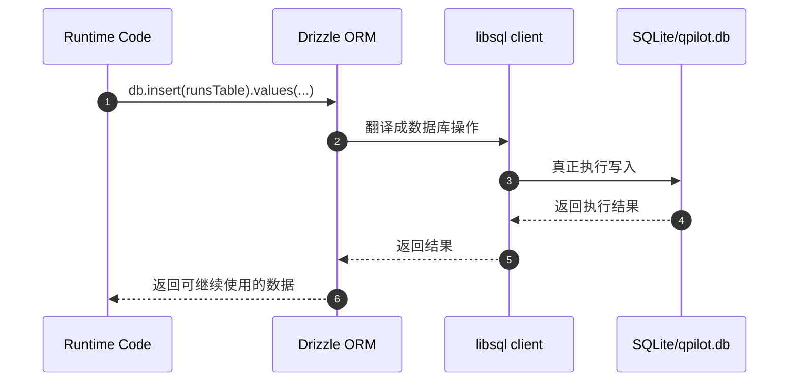

你可以把这条链理解成：

- 业务代码先说“我要写哪张表”
- ORM 负责把这句话翻译成数据库能执行的动作
- client 负责把动作送到 SQLite
- SQLite 真正落到 `qpilot.db`

## 6 张核心表到底怎么理解


如果先只记一句人话：

- `projects` 是项目总档案
- `runs` 是一次运行总单
- `steps` 是这次运行里的逐步过程
- `test_cases` 是沉淀出来的测试用例
- `reports` 是报告索引
- `case_templates` 是从成功运行里提炼出来的可复用模板

## 1. `projects` 表逐列讲解

这一张表代表“长期存在的测试对象”。

| 列 | 含义 | 为什么要有 |
| --- | --- | --- |
| `id` | 项目 id | 让每个项目都有唯一身份 |
| `name` | 项目名字 | 在界面里给人看 |
| `base_url` | 项目基础地址 | 作为后续运行的默认目标来源 |
| `username_cipher` | 加密后的用户名密文 | 不直接明文存用户名 |
| `username_iv` | 用户名加密用的初始化向量 | 解密时需要 |
| `username_tag` | 用户名加密认证标记 | 校验密文合法性 |
| `password_cipher` | 加密后的密码密文 | 不直接明文存密码 |
| `password_iv` | 密码加密用的初始化向量 | 解密时需要 |
| `password_tag` | 密码加密认证标记 | 校验密文合法性 |
| `created_at` | 创建时间 | 做排序和历史记录 |
| `updated_at` | 更新时间 | 知道项目最近有没有改过 |

你可以把这一行理解成：

- “这个项目是谁”
- “它默认访问哪”
- “它有没有保存过登录凭证”

## 2. `runs` 表逐列讲解

这一张表是整个系统最核心的业务表之一。

一行 `runs` 记录 = 一次完整运行。

| 列 | 含义 | 为什么要有 |
| --- | --- | --- |
| `id` | 本次 run 的唯一 id | 前后端、步骤、报告都靠它串起来 |
| `project_id` | 属于哪个项目 | 把 run 归到某个项目下 |
| `status` | 最终状态或当前大状态 | 例如 `queued / running / passed / failed / stopped` |
| `mode` | 运行模式 | 区分 `general / login / admin` |
| `target_url` | 本次目标地址 | 知道浏览器该打开哪里 |
| `goal` | 用户本次目标描述 | 给 AI 和报告使用 |
| `model` | 使用的模型 | 知道这次用了哪个 LLM |
| `config_json` | 这次运行的完整配置包 | 避免把配置拆成过多列 |
| `startup_page_url` | 启动页 URL | 记录 run 刚进入现场时在哪 |
| `startup_page_title` | 启动页标题 | 方便恢复和回放 |
| `startup_screenshot_path` | 启动页截图路径 | 方便后续展示和证据留存 |
| `startup_observation` | 启动阶段观察结果 | 记录一开始看到了什么 |
| `challenge_kind` | 遇到的挑战类型 | 例如验证码、登录墙 |
| `challenge_reason` | 为什么判定为挑战 | 方便解释为什么停在 `manual` |
| `recorded_video_path` | 运行视频路径 | 结束后可回放 |
| `llm_last_json` | 最近一次 LLM 决策包 | 详情页里可以展示最新 AI 决策 |
| `error_message` | 出错信息 | 失败时给人和系统看 |
| `started_at` | 运行真正开始时间 | 不等于创建时间 |
| `ended_at` | 运行结束时间 | 算耗时、展示历史 |
| `created_at` | run 被创建的时间 | 一创建就会写入 |

你可以把 `runs` 看成：

- 这次任务的总单据
- 也是整次执行的中心索引

## 3. `steps` 表逐列讲解

一行 `steps` 记录 = 一次 step 完整执行后的归档结果。

| 列 | 含义 | 为什么要有 |
| --- | --- | --- |
| `id` | step 自己的 id | 让这一步可单独引用 |
| `run_id` | 属于哪个 run | 把 step 归到某次运行下 |
| `step_index` | 这是第几步 | 方便排序和展示 |
| `page_url` | 这一步执行后页面 URL | 回看当时页面在哪 |
| `page_title` | 这一步执行后标题 | 辅助理解页面状态 |
| `dom_summary_json` | 页面摘要包 | 保存页面元素和结构化摘要 |
| `screenshot_path` | 这一步截图路径 | 详情页、报告、回放都要用 |
| `action_json` | 这一步动作内容 | 保存点击、输入、等待等具体动作 |
| `action_status` | 动作结果状态 | 例如是否成功执行 |
| `observation_summary` | 观察总结 | 给人更快看懂这一步发生了什么 |
| `verification_json` | 这一步完整校验结果 | 保存 UI 验证、API 验证、诊断信息 |
| `created_at` | 这一步落库时间 | 做排序和时间线展示 |

这张表的关键词是：

- 页面现场
- 动作内容
- 校验结果

所以它不是单纯日志，而是“步骤档案”。

## 4. `test_cases` 表逐列讲解

这一张表不是每一步都一定会写。
它更像“从运行里沉淀出的测试用例卡片”。

| 列 | 含义 | 为什么要有 |
| --- | --- | --- |
| `id` | 测试用例 id | 让每个 case 都可单独引用 |
| `run_id` | 从哪个 run 产出 | 回溯来源 |
| `module` | 所属模块 | 便于分类 |
| `title` | 用例标题 | 让人一眼看懂测试点 |
| `preconditions` | 前置条件 | 执行这个用例前要满足什么 |
| `steps_json` | 用例步骤包 | 用结构化方式保存步骤 |
| `expected` | 预期结果 | 给人看“应该怎样” |
| `actual` | 实际结果 | 给人看“实际怎样” |
| `status` | 当前用例状态 | 例如 `pending / passed / failed` |
| `priority` | 优先级 | 帮助排序 |
| `method` | 测试方式 | 例如手动、自动化 |
| `created_at` | 生成时间 | 做历史记录 |

## 5. `reports` 表逐列讲解

这一张表非常像“报告索引表”。

| 列 | 含义 | 为什么要有 |
| --- | --- | --- |
| `run_id` | 这份报告属于哪个 run | 一次 run 对应一组报告 |
| `html_path` | HTML 报告路径 | 给前端打开网页报告用 |
| `xlsx_path` | Excel 报告路径 | 给导出和表格查看用 |
| `created_at` | 生成时间 | 知道报告何时落地 |

你会发现它没有存很复杂的正文内容。
原因很简单：

- 真正的报告正文已经在文件里
- 这张表只负责索引

## 6. `case_templates` 表逐列讲解

这张表代表“可复用模板”。

它的意义是：

- 某次成功运行不只是一段历史
- 它还可能变成以后可复用的经验

| 列 | 含义 | 为什么要有 |
| --- | --- | --- |
| `id` | 模板 id | 让模板可单独管理 |
| `project_id` | 属于哪个项目 | 模板不是全局乱飞的 |
| `run_id` | 从哪个 run 提炼而来 | 保留来源 |
| `type` | 模板类型 | 例如 UI / API / Hybrid |
| `title` | 模板标题 | 让人识别 |
| `goal` | 模板目标 | 说明模板要完成什么 |
| `entry_url` | 模板入口地址 | 以后复用时从哪开始 |
| `status` | 模板状态 | 便于管理 |
| `summary` | 模板概览 | 给人快速阅读 |
| `case_json` | 模板完整内容包 | 这是模板真正的主体 |
| `created_at` | 创建时间 | 做历史记录 |
| `updated_at` | 更新时间 | 模板修订时可追踪 |

## 为什么会有这么多 `Json` 列

这个问题非常常见。

例如你会看到：

- `configJson`
- `domSummaryJson`
- `actionJson`
- `verificationJson`
- `stepsJson`
- `caseJson`

它们存在的原因不是“设计偷懒”，而是因为这些内容本来就更像“一整包结构化对象”。

如果硬拆成几十列，反而会带来这些问题：

- 表结构过重
- 字段变化时迁移更频繁
- 读代码时更难把一组信息看成整体

所以这个项目采用的是：

- 高频、稳定、常查询的内容 -> 单独列
- 成套、灵活、上下文强的内容 -> `Json` 列

生活类比：

- 常用的小证件，适合单独放抽屉
- 一整套材料，适合装进文件袋

## 一次 run 从创建到结束，通常会改哪些地方

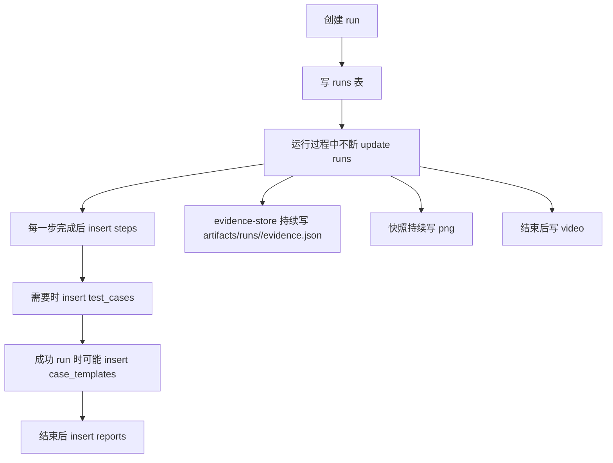

这张图想告诉你的不是“每次都写满所有位置”。
而是：

- 有些数据进表
- 有些数据进文件
- 一次 run 的完整历史，分散保存在多个位置

## 不是所有东西都应该进数据库

这个项目专门把很多大证据放到了文件系统里，例如：

- `evidence.json`
- 截图
- 视频
- `report.html`
- `report.xlsx`

这样做的原因是：

- 这些东西体积更大
- 结构更灵活
- 更适合直接作为产物文件保存

所以你一定要分清：

- 数据库负责结构化索引
- 文件系统负责大体积证据与产物

## 代码里最常见的 ORM 动作长什么样

在这个项目里，最常见的是 3 种：

### 1. 插入

例如：

- `db.insert(runsTable).values(...)`
- `db.insert(stepsTable).values(...)`
- `db.insert(reportsTable).values(...)`

含义就是：

- 往某张表新加一行

### 2. 查询

例如：

- `db.select().from(runsTable)...`
- `db.select().from(stepsTable)...`

含义就是：

- 从某张表把某些行读出来

### 3. 更新

例如：

- `db.update(runsTable).set(...).where(...)`

含义就是：

- 把已有那一行的状态改掉

## 初学者最容易混淆的 6 件事

### 1. ORM 不是数据库

真正的数据库是 `SQLite`。
ORM 只是操作数据库的方式。

### 2. `schema.ts` 不会自动把表建出来

`schema.ts` 更像设计图。
真正去建表的是 `migrate.ts`。

### 3. `qpilot.db` 不是“代码文件”

它是数据文件。
它和 `schema.ts` 不是同一种东西。

### 4. 一行 `run` 不等于一行 `step`

- 一次 run = 一整次任务
- 一次 step = 任务里的某一步

### 5. 有 `Json` 列不代表这不是关系型数据库

关系型数据库里放 JSON 列是很常见的工程做法。

### 6. 报告正文不一定在数据库里

数据库里通常只放路径和索引。
真正的大报告内容在文件里。

## 建议怎么读源码

如果你是第一次读这一块，推荐顺序是：

1. `apps/runtime/src/db/schema.ts`
   先知道有哪些表
2. `apps/runtime/src/db/client.ts`
   再知道连接怎么创建
3. `apps/runtime/src/db/migrate.ts`
   再知道数据库结构怎么落地
4. `apps/runtime/src/server/routes/runs.ts`
   看 run 是怎么被创建和查询的
5. `apps/runtime/src/orchestrator/run-orchestrator.ts`
   看真正运行过程中怎么写 `runs / steps / reports / case_templates`

## 最后一句人话

如果你现在只想先记住一句，那就是：

QPilot Studio 不是“把所有东西都扔进数据库”，而是把最适合结构化查询的内容放进 SQLite，把最适合做证据和产物保存的内容放进文件系统，再用 Drizzle ORM 把业务代码和数据库连接起来。

下一步如果你想继续补“页面检测到底怎么一层层判断页面”，去看 [PAGE-DETECTION-101.zh-CN.md](./PAGE-DETECTION-101.zh-CN.md)。  
如果你想回到总扫盲文档，去看 [ARCHITECTURE-101.zh-CN.md](./ARCHITECTURE-101.zh-CN.md)。

## 第 8 章导读：如果你自己从 0 开始做一个同类系统

当你把当前仓库看懂以后，一个非常自然的问题就是：

- 如果不是看别人的现成项目，而是我自己从头做一个最小版本，该怎么拆路线

下面这一部分会把“从 0 到 1 搭出一个简化版 QPilot”的开发路线讲出来。

你不用把它当作现在立刻就要做的任务。  
你可以把它当作：

- 帮你反向理解现在仓库为什么会长成今天这样
- 以及以后你自己做同类系统时的路线图

# QPilot Studio《从 0 到 1 开发这个项目》超级详解总手册

如果你现在要的是“真正给完全小白看的百科全书式版本”，并且希望从电脑零基础一路读到部署公网与业务实战，请先看 [ULTIMATE-0-TO-1.zh-CN.md](./ULTIMATE-0-TO-1.zh-CN.md)。  
当前这份文档保留为“中等深度总手册”，更适合已经补过基础词汇、想较快进入系统主线的读者。

## 这份文档适合谁

这份文档写给下面这类读者：

- 你会一点 Python 基础语法，比如变量、函数、`if`、循环
- 但你不熟悉前端、后端、接口、长连接、桌面应用、浏览器自动化、OCR、ORM
- 你不想只看“术语解释”，而是想真正弄明白这个仓库现在怎么工作
- 你还想知道：如果不是看懂现成仓库，而是你自己从 0 开始做一个同类系统，应该先做什么，后做什么

这份文档有两条主线，并且会同时讲：

1. 当前仓库主线：QPilot Studio 现在已经实现了什么，它的真实代码是怎么组织的。
2. 从零开发主线：如果你自己做一个简化版，再一步步长成现在这样，路线应该怎么拆。

如果你现在发现上面那句话里还有很多词本身就不熟，比如：

- 端口
- 请求
- JSON
- 数据库
- DOM
- iframe
- OCR

那请先看 [FOUNDATIONS-101.zh-CN.md](./FOUNDATIONS-101.zh-CN.md)。  
那份文档专门补“学这个项目之前的预备知识”，会比当前这份更基础。

如果你只想看专题深挖，可以跳去这些文档：

- [FOUNDATIONS-101.zh-CN.md](./FOUNDATIONS-101.zh-CN.md)：真正给完全小白补预备知识
- [DEPLOYMENT-101.zh-CN.md](./DEPLOYMENT-101.zh-CN.md)：把本地项目一步步发布到公网的部署 SOP
- [ARCHITECTURE.zh-CN.md](./ARCHITECTURE.zh-CN.md)：工程版架构主文档
- [ARCHITECTURE-101.zh-CN.md](./ARCHITECTURE-101.zh-CN.md)：架构扫盲版
- [RUN-LIFECYCLE-101.zh-CN.md](./RUN-LIFECYCLE-101.zh-CN.md)：一次运行的全过程
- [DB-ORM-101.zh-CN.md](./DB-ORM-101.zh-CN.md)：数据库与 ORM 专项
- [PAGE-DETECTION-101.zh-CN.md](./PAGE-DETECTION-101.zh-CN.md)：页面检测、校验、OCR 专项

---

## 先看总地图

先不要急着看代码。  
如果你还没看过 [FOUNDATIONS-101.zh-CN.md](./FOUNDATIONS-101.zh-CN.md)，并且你对很多最基本的电脑/Web 术语还不熟，建议先过去补地基。

在这个前提下，再记住一句最重要的人话：

QPilot Studio 不是“一个 Python 脚本项目”，也不是“一个只有前端页面的管理台”，它是一个本地优先的 AI 浏览器测试系统。

它至少有下面这些角色：

- `Desktop`：桌面窗口外壳，用 Electron 打开一个本地应用窗口
- `Web`：控制台界面，用 React 显示项目、运行、步骤、画面、报告
- `Runtime`：后端与调度中心，用 Fastify 接口、Playwright 控制浏览器、Drizzle ORM 落库
- `Browser`：被 Playwright 驱动的 Chromium 浏览器实例，真正去打开页面、点击、输入、跳转
- `Planner`：AI 规划层，负责决定“下一步该做什么”
- `Verifier`：验证层，负责判断“刚才那一步到底有没有成功”
- `Database / Files`：一个存结构化数据，一个存截图、视频、证据、缓存、报告

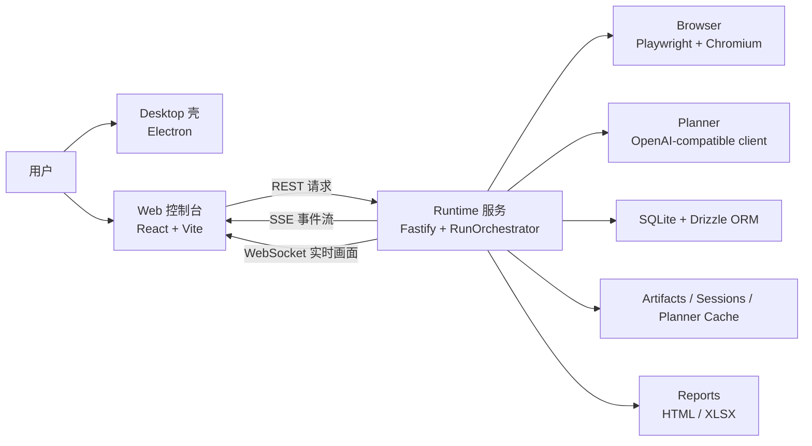

### 这张图你应该怎么读

- 用户不是直接操作 Runtime，而是先看到 Web 控制台
- Web 也不会直接控制浏览器，它只能向 Runtime 发请求
- Runtime 才是整个系统真正的业务核心
- Browser 是 Runtime 的执行手，不是 UI
- Planner 是 Runtime 里的一个能力，不是独立桌面窗口
- SQLite 和文件目录都归 Runtime 管，不归 Web 管

### 建议继续看

- `package.json`
- `apps/desktop/src/main.cjs`
- `apps/web/src/App.tsx`
- `apps/runtime/src/server.ts`
- `apps/runtime/src/orchestrator/run-orchestrator.ts`

---

## 1. 你到底在学什么项目

### 先说人话

如果你以前更多接触的是 Python 脚本，你可能习惯这样理解项目：

- 读一个配置
- 启动一个脚本
- 打开浏览器
- 做几步操作
- 打印一点日志
- 结束

QPilot Studio 不是这个级别。

它更像一个“带驾驶舱的自动驾驶系统”：

- 你可以在界面里新建任务
- 系统会把任务写进数据库
- Runtime 会启动浏览器去执行
- Web 会一边显示状态，一边显示实时画面
- 如果遇到验证码、登录墙、草稿审批，系统会停下来等你
- 跑完后还会把步骤、截图、网络证据、测试用例、报告都存下来

也就是说，它不是“单次脚本”，而是“一个本地产品”。

### 当前仓库里它是谁

从当前仓库结构看，它是一个 `pnpm workspace` 多包工程：

- 根目录负责统一脚本和依赖编排
- `apps/desktop` 是 Electron 桌面壳
- `apps/web` 是 React 控制台
- `apps/runtime` 是 Fastify + Playwright + SQLite + OCR 的业务核心
- `packages/shared` 放前后端共享 schema、常量、类型
- `packages/ai-gateway`、`packages/report-core` 等包负责复用能力

### 如果你自己从 0 开始

你不应该第一天就尝试做完整 QPilot Studio。

正确理解方式是：

- 先把它拆成 4 个问题：界面、调度、浏览器执行、存储
- 然后承认：真正最难的是 Runtime，不是 Web，也不是 Electron
- 再把 Runtime 继续拆成：接口、Run 状态机、页面检测、动作执行、结果验证、证据保存、报告生成

### 本章你该记住的结论

- 这是一个本地运行的浏览器测试系统，不是 Python 小脚本
- 业务核心在 Runtime，不在 Desktop
- 要理解这个项目，先抓 Runtime，再回头看 Web 和 Desktop

### 建议继续看

- `package.json`
- `apps/runtime/package.json`
- `apps/web/package.json`
- `apps/desktop/package.json`

---

## 2. 如果你只会一点 Python，这个仓库该怎么理解

### 先把术语翻译成人话

很多人第一次看这个仓库会被术语吓住。下面我用“Python 参考系”给你翻译一遍。

#### `Node.js`

`Node.js` 是 JavaScript / TypeScript 在本地运行的环境。

你可以先把它理解成：

- Python 世界里的“解释器 + 运行时环境”

区别是：

- Python 主要运行 `.py`
- 这里主要运行 TypeScript / JavaScript

#### `pnpm workspace`

这是一个多包工程管理方式。

你可以先把它理解成：

- “一个大仓库里放了多个彼此配合的小项目”

有点像：

- 一个 Python monorepo 里同时有 `server/`、`web/`、`shared/`、`cli/`

#### `Electron`

Electron 是“把网页装进桌面窗口”的技术。

你可以先把它理解成：

- “一个带浏览器壳的桌面应用容器”

它不是业务逻辑本身，更像宿主。

#### `React`

React 是前端 UI 框架。

你可以先把它理解成：

- Python 里你做 Web 时会有模板引擎或组件系统
- React 相当于一个更现代的、组件化的页面拼装方式

#### `Fastify`

Fastify 是 Node 世界里的后端 Web 框架。

你可以先把它理解成：

- Flask / FastAPI 这一类框架的同类角色

它负责：

- 注册路由
- 接收请求
- 返回 JSON
- 挂载 WebSocket / 静态文件

#### `Playwright`

Playwright 是浏览器自动化框架。

你可以先把它理解成：

- Python 里的 Selenium / Playwright 的 Node 版本同类能力

它负责真正打开浏览器、找元素、点击、输入、截图、监听网络。

#### `ORM`

`ORM` 全称 `Object-Relational Mapping`，中文可以理解成“对象关系映射”。

你先不要背定义，先记一句：

- ORM 是代码和数据库之间的翻译层

在这个项目里：

- 数据库本体是 `SQLite`
- 客户端驱动是 `@libsql/client`
- ORM 是 `Drizzle ORM`

#### `OCR`

`OCR` 全称 `Optical Character Recognition`，中文是“光学字符识别”。

你可以把它理解成：

- 系统先把页面当图片看，再从图片里读字

这在当前项目里不是主流程，而是兜底流程。

### 当前仓库里这些术语分别落在哪

- Node 运行入口：`apps/runtime/src/index.ts`
- Fastify 服务入口：`apps/runtime/src/server.ts`
- React 应用入口：`apps/web/src/App.tsx`
- Electron 入口：`apps/desktop/src/main.cjs`
- ORM：`apps/runtime/src/db/client.ts` + `apps/runtime/src/db/schema.ts`
- OCR：`apps/runtime/src/playwright/ocr/visual-targeting.ts`

### 如果你自己从 0 开始

一开始你不需要“全懂 TypeScript 语法”。

你先只要记住：

- `function` 就像 Python 的 `def`
- `interface/type` 可以理解成“数据长什么样的说明书”
- `class` 跟 Python class 是同一类概念
- `package.json` 先把它当成“项目脚本和依赖清单”

### 本章你该记住的结论

- 这个仓库不是“换了一门语言而已”，而是换了一整套工程组织方式
- 但角色并不神秘，几乎都能用 Python 世界的熟悉概念类比

### 建议继续看

- `apps/runtime/src/index.ts`
- `apps/runtime/src/server.ts`
- `apps/web/src/App.tsx`
- `apps/desktop/src/main.cjs`
- `apps/runtime/src/db/client.ts`

---

## 3. 从仓库目录看全局

### 为什么要先看目录，不先看实现

因为零基础读代码最容易犯的错，不是看不懂语法，而是“看代码时不知道自己现在站在哪一层”。

你必须先知道：

- 哪个目录负责界面
- 哪个目录负责接口
- 哪个目录负责真正操作浏览器
- 哪个目录只是共享类型，不会自己跑

### 当前仓库目录应该这样读

#### `apps/desktop`

桌面外壳。

它最重要的任务只有几个：

- 创建 Electron 窗口
- 检查 `http://localhost:8787/health` 是否存活
- 如果 runtime 没起来，就显示等待页
- 如果 runtime 正常，就打开 `http://localhost:5173`

也就是说：

- Desktop 不直接管理 Run
- Desktop 不直接碰数据库
- Desktop 不直接控制 Playwright

#### `apps/web`

控制台前端。

它负责：

- 表单：新建 run
- 列表：项目、运行、报告
- 详情：步骤、截图、验证结果、实时画面
- 订阅：用 `EventSource` 接 SSE，用 `WebSocket` 接实时画面

#### `apps/runtime`

真正的业务核心。

它负责：

- 启动 Fastify 服务
- 初始化数据库和迁移
- 创建 `RunOrchestrator`
- 注册路由
- 启动 Playwright 浏览器
- 采集快照、做页面检测、执行动作、验证结果、写库、落文件、发事件

#### `packages/shared`

共享协议层。

这里最关键的作用是：

- 让前端和 runtime 对同一份数据结构达成共识

例如：

- 事件名
- `Run` / `Step` / `PageSnapshot` / `VerificationResult` 的结构
- `status` / `phase` / `Action` 的枚举

### 当前仓库最值得先记住的文件

- `package.json`
- `apps/desktop/src/main.cjs`
- `apps/web/src/App.tsx`
- `apps/web/src/lib/api.ts`
- `apps/web/src/pages/RunCreatePage.tsx`
- `apps/web/src/pages/RunDetailPage.tsx`
- `apps/runtime/src/index.ts`
- `apps/runtime/src/server.ts`
- `apps/runtime/src/server/routes/runs.ts`
- `apps/runtime/src/orchestrator/run-orchestrator.ts`
- `packages/shared/src/schemas.ts`
- `packages/shared/src/constants.ts`

### 如果你自己从 0 开始

你完全可以先不要做 monorepo。

第一版你甚至可以只做一个 `runtime/`：

- 一个后端
- 一个 Playwright 执行器
- 一个 SQLite 文件

等你真有了可用的 API，再加 Web；
等 Web 稳定了，再加 Desktop。

### 本章你该记住的结论

- `apps/runtime` 是最重要的目录
- `packages/shared` 是“协议层”，它本身不处理业务
- `apps/desktop` 是壳，`apps/web` 是驾驶舱，`apps/runtime` 是发动机

### 建议继续看

- `apps/desktop/src/main.cjs`
- `apps/web/src/lib/api.ts`
- `apps/runtime/src/server/routes/runs.ts`
- `packages/shared/src/schemas.ts`

---

## 4. 先把项目跑起来

### 你至少要准备什么

从当前仓库能确认的事实看：

- 包管理器是 `pnpm`
- Web 用 `Vite`
- Runtime 用 `Fastify + ts-node/esm`
- Desktop 用 `Electron`
- Browser automation 用 `Playwright`

仓库没有在 `package.json` 里显式写死 `engines.node`。

但从依赖组合看：

- `electron@36`
- `vite@6`
- `playwright@1.52`

可以合理推断：建议使用较新的 Node LTS。  
这是一条工程推断，不是仓库里写死的强约束。

### 第一次启动前要做什么

#### 1. 安装依赖

```bash
pnpm install
```

#### 2. 准备环境变量

当前仓库根目录有 [.env.example](../.env.example)。

最关键的变量有：

- `PORT=8787`
- `CORS_ORIGIN=http://localhost:5173`
- `DATABASE_URL=./data/qpilot.db`
- `ARTIFACTS_DIR=./data/artifacts`
- `REPORTS_DIR=./data/reports`
- `SESSIONS_DIR=./data/sessions`
- `PLANNER_CACHE_DIR=./data/planner-cache`
- `OPENAI_BASE_URL=https://api.openai.com/v1`
- `OPENAI_API_KEY=...`
- `OPENAI_MODEL=gpt-4.1-mini`
- `CREDENTIAL_MASTER_KEY=64 位十六进制`
- `VITE_RUNTIME_BASE_URL=http://localhost:8787`

其中最容易忽略的是：

- `CREDENTIAL_MASTER_KEY`

它不是随便写个字符串就行，必须是 64 位十六进制字符串，因为 runtime 用它加密账号密码。

另外还要记住一条非常关键的事实：

- 如果没有 `OPENAI_API_KEY`，`RunOrchestrator` 里的 `Planner` 不会被创建

也就是说：

- Web 能打开
- Runtime 也能启动
- 但真正依赖 AI 规划的主流程不会完整工作

#### 3. 安装 Playwright 浏览器内核

仓库依赖里已经有 `playwright`，但第一次在本机跑时，通常还需要安装浏览器内核。

最直接的做法是：

```bash
pnpm --filter @qpilot/runtime exec playwright install chromium
```

这一步是 Playwright 的常规初始化动作，不是仓库额外发明的逻辑。

### 当前仓库有哪些启动方式

根目录 `package.json` 里定义了这些脚本：

```bash
pnpm dev:web
pnpm dev:runtime
pnpm dev:desktop
pnpm dev
```

它们的含义分别是：

- `pnpm dev:web`
  只启动 React 控制台
- `pnpm dev:runtime`
  只启动 Runtime 服务
- `pnpm dev:desktop`
  用 `concurrently` 同时拉起 runtime、web、desktop，并用 `wait-on` 等待 `5173` 和 `8787/health` 就绪
- `pnpm dev`
  同时启动 runtime 和 web，但不打开桌面壳

### 你第一次最推荐怎么跑

如果你只是想理解系统：

```bash
pnpm dev
```

这样你只面对两个进程：

- Web
- Runtime

等你明白系统流程以后，再跑：

```bash
pnpm dev:desktop
```

### 为什么这个项目要多个进程一起跑

因为它本来就不是单体脚本：

- Web 是一个 Vite 开发服务器
- Runtime 是一个 Fastify 服务
- Desktop 是一个 Electron 进程

这三个进程相互配合，但职责不同。

### 建议继续看

- `.env.example`
- `package.json`
- `apps/runtime/src/config/env.ts`
- `apps/runtime/src/index.ts`
- `apps/desktop/src/main.cjs`

---

## 5. 前端、桌面壳、 Runtime 到底怎么分工

### Desktop：为什么它不是核心

从 `apps/desktop/src/main.cjs` 可以看得很清楚：

- 它先检查 `healthUrl`
- runtime 不通，就加载一个 fallback HTML
- runtime 通了，就加载 `webUrl`

这说明 Desktop 的本质是：

- 本地宿主窗口
- 不是业务核心

你可以把它理解成：

- 一个电视机外壳
- 真正的内容不是它生产的

### Web：它到底负责什么

Web 负责的是“显示”和“发请求”，不是“直接干活”。

例如：

- `RunCreatePage` 负责收集用户输入
- `api.ts` 负责把请求发给 runtime
- `RunDetailPage` 负责订阅事件流、渲染步骤、渲染状态
- `LiveRunViewport` 负责接 WebSocket 实时画面并画到 `canvas`

它并不会：

- 直接操作 Playwright
- 直接碰 SQLite
- 直接写报告

### Runtime：为什么它才是发动机

Runtime 的入口是 `apps/runtime/src/server.ts`。

这个文件在启动时做了很多关键动作：

- 解析环境变量
- 解析数据库路径
- 执行数据库迁移
- 创建数据库客户端和 Drizzle 实例
- 创建 `SseHub`
- 创建 `LiveStreamHub`
- 创建 `EvidenceStore`
- 创建 `RunOrchestrator`
- 注册路由
- 暴露 `/artifacts/` 和 `/reports/` 静态目录

如果没有 Runtime：

- Web 只能显示空壳
- Desktop 只能显示等待页
- Browser 不会被启动
- Run 不会执行

### 如果你自己从 0 开始

建议先做：

- 一个 Fastify 服务
- 一个 `POST /api/runs`
- 一个最小 `RunOrchestrator`

而不是先做：

- 花里胡哨的 Web UI
- Electron
- 报告导出

### 本章你该记住的结论

- Desktop 是壳
- Web 是驾驶舱
- Runtime 是发动机

### 建议继续看

- `apps/desktop/src/main.cjs`
- `apps/web/src/lib/api.ts`
- `apps/web/src/pages/RunCreatePage.tsx`
- `apps/web/src/pages/RunDetailPage.tsx`
- `apps/runtime/src/server.ts`

---

## 6. 通信为什么有三种：REST、SSE、WebSocket

### `REST` 是什么

`REST` 你先把它理解成“普通接口请求”。

特点是：

- 前端发一次请求
- 后端回一次结果
- 这次通信就结束

在这个项目里，典型例子是：

- 创建 run
- 获取 run 详情
- 获取步骤列表
- 审批草稿
- 暂停、恢复、终止 run

### `SSE` 是什么

`SSE` 全称 `Server-Sent Events`，中文可以理解成“服务器向客户端持续推送事件的长连接”。

你可以把它理解成：

- REST 像你去柜台问一次结果
- SSE 像你挂着电话，柜台有新进展就主动告诉你

本项目里：

- Web 通过 `EventSource` 订阅 `/api/runs/:runId/stream`
- Runtime 用 `SseHub` 把 `run.status`、`step.created`、`run.finished` 等事件持续推送出来
- `SseHub` 还会每 15 秒发一次 `ping` 保活

### `WebSocket` 是什么

`WebSocket` 是“双向实时通道”。

在这个项目里，它主要不是拿来传业务事件，而是拿来传实时画面。

当前代码里：

- Web 用 `api.createRunLiveSocket(runId)` 连 `/api/runs/:runId/live`
- `LiveRunViewport.tsx` 把收到的 base64 JPEG 帧画到 `canvas`

### 为什么不能只留一种通信方式

因为三类数据性质不同：

- REST：适合命令和查询
- SSE：适合有顺序的业务事件
- WebSocket：适合高频实时画面

如果你把实时画面也塞进 SSE：

- 业务事件会被大帧数据淹没
- 前端处理更混乱

如果你把所有控制命令都塞进 WebSocket：

- 业务接口会更难调试
- 也更不符合当前仓库的实现方式

### 本章你该记住的结论

- REST 负责“发命令/查结果”
- SSE 负责“推业务事件”
- WebSocket 负责“推实时画面”

### 建议继续看

- `apps/runtime/src/server/routes/runs.ts`
- `apps/runtime/src/server/routes/live.ts`
- `apps/runtime/src/server/sse-hub.ts`
- `apps/web/src/lib/api.ts`
- `apps/web/src/components/LiveRunViewport.tsx`

---

## 7. 一次 Run 从创建到结束到底怎么走

### 总时序图

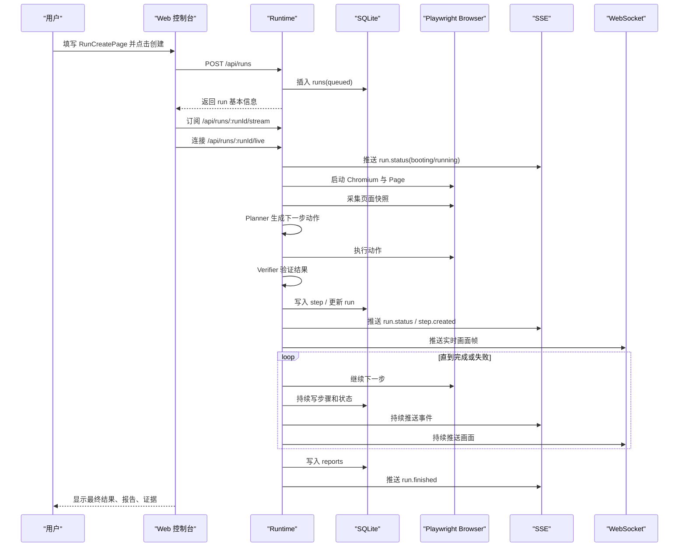

### 按时间拆开讲

#### 第 1 步：用户在 `RunCreatePage` 填表

这里填的不只是 URL，还包括：

- `projectId`
- `targetUrl`
- `mode`
- `language`
- `executionMode`
- `confirmDraft`
- `goal`
- `maxSteps`
- `headed`
- `manualTakeover`
- `sessionProfile`
- `saveSession`

也就是说，一次 run 不是“一个网址”那么简单，它还是一套运行策略。

#### 第 2 步：Web 发 `POST /api/runs`

Runtime 在 `runs.ts` 里校验请求体，构造 `RunConfig`，然后插入 `runs` 表。

这时数据库里先出现一条状态为 `queued` 的 run。

#### 第 3 步：Runtime 真正启动执行

真正执行不是在 Web 里开始的，而是由 `RunOrchestrator` 接手。

可以把 `RunOrchestrator` 理解成：

- 整个系统的总导演

它负责：

- 开浏览器
- 采快照
- 调 Planner
- 执行动作
- 调 Verifier
- 记录步骤
- 发 SSE
- 发实时画面
- 处理暂停、人工接管、草稿审批
- 生成报告

#### 第 4 步：启动浏览器并拿到第一张快照

`collectPageSnapshot` 做的事不是只有截图。

它会同时产出：

- 截图文件
- 当前 URL
- 当前 title
- `InteractiveElement[]`
- `PageState`

这一步很重要，因为 Planner 不是“凭空想下一步”，它要基于当前快照做决定。

#### 第 5 步：Planner 决定下一步

Planner 输入的是：

- 当前目标
- 当前页面快照
- 历史步骤
- 工作记忆

输出的是：

- 动作列表
- 预期检查项
- 是否完成
- 测试用例候选

#### 第 6 步：Executor 真正执行动作

这一步由 `action-executor.ts` 完成。

动作类型当前主要有：

- `click`
- `input`
- `select`
- `navigate`
- `wait`

#### 第 7 步：Verifier 判断动作有没有真的成功

“点到了”不等于“成功了”。

系统还要继续检查：

- URL 有没有变化
- 页面是不是进入了目标状态
- 有没有出现错误文案
- 网络请求是否符合预期

#### 第 8 步：把 Step 写下来

每做完一步，就会写一条 `steps` 记录。

它里面至少有：

- 页面 URL / 标题
- 当前快照摘要
- 截图路径
- 动作 JSON
- 动作状态
- 验证 JSON
- 观察总结

#### 第 9 步：前端持续收到更新

Web 一边收：

- `run.status`
- `step.created`
- `run.finished`

另一边还收：

- WebSocket 实时画面

所以你在详情页会觉得“系统是活着的”，不是一直刷新页面。

### 本章你该记住的结论

- Run 的真正生命线不在 Web，而在 Runtime
- 每一步都不是“想完就算”，而是“观察 -> 决策 -> 执行 -> 验证 -> 持久化 -> 推送”

### 建议继续看

- `apps/web/src/pages/RunCreatePage.tsx`
- `apps/runtime/src/server/routes/runs.ts`
- `apps/runtime/src/orchestrator/run-orchestrator.ts`
- `apps/runtime/src/playwright/collector/page-snapshot.ts`

---

## 8. Run、Step、Phase、Status 到底是什么

### `Run`

`Run` 是一次完整任务。

比如：

- “打开某站点，验证登录成功后能看到工作台”

这一整次过程就是一个 `Run`。

### `Step`

`Step` 是 Run 里的一个具体动作结果。

比如：

- 第 1 步：点击登录入口
- 第 2 步：输入用户名
- 第 3 步：输入密码
- 第 4 步：点击登录

每一步都可能单独成功，也可能单独失败。

### `status`：结果层

`RunStatusSchema` 里当前定义的是：

- `queued`
- `running`
- `passed`
- `failed`
- `stopped`

你可以把它理解成“这次 run 最后算什么结果”。

### `phase`：过程层

`RunLivePhaseSchema` 里当前定义的是：

- `queued`
- `booting`
- `sensing`
- `planning`
- `drafting`
- `executing`
- `verifying`
- `paused`
- `manual`
- `persisting`
- `reporting`
- `finished`

你可以把它理解成“run 现在正在做哪一类事情”。

### 为什么要同时有 `status` 和 `phase`

因为它们回答的是两个完全不同的问题：

- `status`：这次 run 最终成绩是什么
- `phase`：当前时间点正在忙什么

例如：

- 一个 run 可以 `status=running`，同时 `phase=planning`
- 也可以 `status=running`，同时 `phase=manual`
- 最终才会变成 `passed/failed/stopped`

### `drafting`、`manual`、`paused` 分别是什么

#### `drafting`

系统已经想出了下一步动作，但先不立即执行，而是把草稿抛给人看。

常见触发条件：

- `executionMode === stepwise_replan`
- 或 `confirmDraft = true`

#### `manual`

系统碰到了需要真人接手的情况。

例如：

- 验证码
- 登录墙
- 特殊授权流程
- 需要你手动点、手动输、手动完成验证

#### `paused`

这是用户主动暂停，或者系统响应暂停命令后的状态。

它跟 `manual` 的区别是：

- `manual` 更像“系统说：这一步我不该自动做了，请你来”
- `paused` 更像“用户说：先停一下”

### 建议继续看

- `packages/shared/src/schemas.ts`
- `packages/shared/src/constants.ts`
- `apps/runtime/src/orchestrator/run-orchestrator.ts`
- `apps/web/src/store/run-stream.ts`

---

## 9. 页面检测逻辑到底怎么做

### 先记住一句最重要的话

页面检测不是“截一张图给 AI 看”。

当前项目真正做的是一条多层流水线：

1. 收集页面里的关键元素
2. 归纳当前页面属于哪一类
3. 检查有没有验证码、遮罩、登录墙
4. 动作执行后再次验证 UI 和网络结果
5. 只有 DOM 定位不行时，才退到 OCR

### 第 1 层：`collectInteractiveElements`

这个函数的任务是：

- 从主页面和 iframe 收集“重要元素”
- 不是整个 DOM 全搬走

它的真实实现里有几个关键点：

- 有总量限制：`MAX_ELEMENTS = 220`
- 每个 frame 还有单独限制：`MAX_ELEMENTS_PER_FRAME = 72`
- 会同时抓交互元素和结构元素
- 会识别弹窗、对话框、iframe 之类的上下文
- 会给元素打分、去重、排序

为什么这样设计？

因为后面模块真正关心的不是“整个 HTML”，而是：

- 有哪些按钮
- 有没有密码框
- 有没有登录入口
- 是否在 iframe 里
- 有没有弹窗把页面挡住

### 第 2 层：`summarizePageState`

它会把页面归类成 `PageState`。

当前支持的 `surface` 包括：

- `generic`
- `modal_dialog`
- `login_chooser`
- `login_form`
- `provider_auth`
- `search_results`
- `security_challenge`
- `dashboard_like`

它不是只看标题，也不是只看 URL，而是综合判断：

- URL
- 页面标题
- 元素文本
- 是否有账号输入框
- 是否有密码框
- 是否有第三方登录入口
- 是否有搜索结果信号
- 是否有验证码/安全验证信号

也就是说，它做的是“页面归类”，不是“截图展示”。

### 第 3 层：`page-guards`

它负责在动作执行前做清障和风险检测。

当前代码里能看见的检测点包括：

- URL 像不像 challenge / verify / captcha
- 文本里有没有“安全验证”“验证码”“are you human”
- 是否出现 captcha iframe
- 是否出现 captcha widget
- 是否是登录墙
- 是否要保留某些授权弹窗而不是误关掉

这一步很关键，因为：

- 如果当前页面是验证码页，继续自动点只会越点越乱

### 第 4 层：`basic-verifier`

动作做完以后，系统不会只看“有没有报错”，还要重新判断页面：

- 当前页面像不像目标页面
- URL 有无变化
- 有没有认证错误文本
- 是否仍然停留在登录表单
- 是否进入登录后的壳页面

### 第 5 层：`traffic-verifier`

有些动作在 UI 上看起来成功了，但后台请求其实失败了。

所以 Runtime 还会检查网络证据：

- 关键请求有没有发生
- 有没有失败请求
- 是否有 token / session 信号
- Host 是否发生合理变化

### 为什么要这么麻烦

因为真实网页不是“点一下肯定成功”的玩具环境。

你经常会遇到：

- 页面跳转了，但跳错地方
- 按钮点了，但被遮罩层挡住
- 表面看似登录成功，其实接口 401
- DOM 不稳定，但画面上肉眼能看见字

### 建议继续看

- `apps/runtime/src/playwright/collector/interactive-elements.ts`
- `apps/runtime/src/playwright/collector/page-state.ts`
- `apps/runtime/src/playwright/collector/page-guards.ts`
- `apps/runtime/src/playwright/verifier/basic-verifier.ts`
- `apps/runtime/src/orchestrator/traffic-verifier.ts`
- [PAGE-DETECTION-101.zh-CN.md](./PAGE-DETECTION-101.zh-CN.md)

---

## 10. OCR 逻辑到底是什么，为什么不是默认就 OCR

### 先说结论

当前项目里，OCR 不是默认主流程，而是 DOM/结构化定位失败后的视觉兜底。

这点非常重要。

很多初学者会误以为：

- “AI 看图更聪明，那干脆每一步都 OCR 不就好了？”

当前仓库没有这么做，原因是：

- DOM 更稳定
- DOM 更便宜
- DOM 有语义
- DOM 能直接填表单、点元素、读属性
- OCR 容易受分辨率、模糊、遮挡、字体、语言包影响

### 当前 OCR 链路的真实入口

OCR 代码在：

- `apps/runtime/src/playwright/ocr/visual-targeting.ts`

但它不是自己凭空跑的。

真正触发它的是：

- `apps/runtime/src/playwright/executor/action-executor.ts`

当前执行器的逻辑大意是：

1. 先尝试普通 DOM/文本定位
2. 如果 `resolveLocator(...)` 失败
3. 再调用 `resolveVisualClickTarget(page, action)`
4. 如果 OCR 找到目标，就按坐标点击
5. 并把 `resolutionMethod` 记成 `ocr`

### OCR 具体做了哪些事

#### 第 1 步：先从动作里提取“要找的字”

OCR 不是对整张图盲搜，它先从动作里提取候选文本。

候选文本可能来自：

- `action.note`
- `action.target`
- 引号里的文本
- 选择器字面量里的 `text=...`
- `aria-label` / `title` / `placeholder` 这样的字面值

例如：

- 如果动作备注是“点击‘密码登录’按钮”
- OCR 就会先把“密码登录”提出来，作为优先搜索词

#### 第 2 步：构造视觉 surface

它不会只识别主页面整张图，还会处理 iframe：

- 先截主页面
- 再遍历子 frame
- 给每个可见 iframe 单独截图
- 记录 iframe 在整页里的偏移量

这样做是因为很多登录、授权、验证码其实在 iframe 里。

#### 第 3 步：启动 Tesseract Worker

当前代码里用的是：

- `tesseract.js`

语言包是：

- `eng+chi_sim`

页面分割模式是：

- `Tesseract.PSM.SPARSE_TEXT`

也就是“稀疏文本模式”。

这非常符合网页按钮/标签/短文案的识别场景，因为网页不是整页密集段落。

#### 第 4 步：把识别结果拉平成文本碎片

OCR 识别后，不是直接输出“唯一答案”，而是很多 block / paragraph / line / word。

当前实现会把这些东西压平为 `OcrTextFragment`，记录：

- 原始文本
- 归一化文本
- 置信度
- 是 line 还是 word
- bbox
- 属于哪个 surface
- 在整页中的偏移量

同时还会过滤：

- 太低置信度的碎片

#### 第 5 步：给候选词和识别碎片打分

系统会把“我要找的候选词”和“OCR 识别出的片段”两两比较。

比较方式包括：

- 完全相等
- 包含关系
- 子串关系
- 子序列关系
- 识别置信度加权
- line 比 word 额外加分
- 候选词越靠前权重越高

如果最终得分低于阈值，就视为没找到。

#### 第 6 步：把文字命中变成点击坐标

一旦找到最佳匹配，系统会：

- 取 bbox 中心点
- 加上 surface 偏移量
- 算出整页点击坐标
- 调 `page.mouse.click(x, y)`

这就是“文字识别”最后落成“鼠标点击”的关键一步。

### 为什么 OCR 只适合兜底

因为 OCR 缺少 DOM 天生拥有的很多信息：

- 它不知道这是按钮还是标题
- 它不知道这个元素是否禁用
- 它不知道这是输入框还是纯文本
- 它很难稳定处理多个同名按钮
- 它无法像 DOM 那样天然支持 `fill()`、`selectOption()`

所以当前项目里：

- `click` 和 `input` 才会在定位失败时尝试 OCR 兜底
- 但像 `select` 这类依赖结构化语义的动作，仍然更依赖 DOM

### OCR 为什么会失败

常见原因包括：

- 字太小
- 对比度低
- 页面缩放或模糊
- 文字是图标字体或图片
- 文案重复太多
- 遮罩层挡住真正目标
- 候选词提取错了
- 文本在动画里瞬间变化

### 如果你自己从 0 开始做

不要在第 1 阶段就引入 OCR。

正确顺序应该是：

1. 先把 DOM 定位做稳
2. 再做基本页面分类
3. 再做动作后验证
4. 最后才加 OCR 兜底

否则你会很早把系统复杂度拉爆。

### 建议继续看

- `apps/runtime/src/playwright/executor/action-executor.ts`
- `apps/runtime/src/playwright/ocr/visual-targeting.ts`
- `apps/runtime/src/tests/visual-targeting.test.ts`
- [PAGE-DETECTION-101.zh-CN.md](./PAGE-DETECTION-101.zh-CN.md)

---

## 11. ORM、数据库、文件存储到底怎么配合

### 先把三层关系分开

很多新手会把下面三件事混在一起：

- 数据库
- 数据库驱动
- ORM

在当前仓库里，它们分别是：

- 数据库：`SQLite`
- 驱动：`@libsql/client`
- ORM：`Drizzle ORM`

你可以这样理解：

- SQLite 是仓库
- `@libsql/client` 是搬运工
- Drizzle ORM 是翻译官

### 当前数据库文件在哪里

默认环境变量是：

- `DATABASE_URL=./data/qpilot.db`

`client.ts` 会把相对路径解析成 runtime 根目录下的绝对路径，因此默认实际落盘位置是：

- `apps/runtime/data/qpilot.db`

### `schema.ts` 做什么

`schema.ts` 不是数据库本体。

它做的是：

- 在 TypeScript 里声明表结构
- 告诉 Drizzle：“有哪些表、字段、外键”

当前核心表包括：

- `projects`
- `runs`
- `steps`
- `test_cases`
- `reports`
- `case_templates`
- `load_profiles`
- `load_runs`

### `migrate.ts` 做什么

`migrate.ts` 负责：

- 首次建表
- 给旧表补列

也就是说，它做的是“把数据库调整到当前代码期望的形状”。

### 为什么很多字段是 `Json` 字符串

你会看到很多列名像这样：

- `configJson`
- `domSummaryJson`
- `actionJson`
- `verificationJson`
- `stepsJson`
- `caseJson`
- `metricsJson`

这说明项目采用了一种很常见的折中方式：

- 强结构字段，单独建列
- 变化大、层次深的数据，先序列化成 JSON 文本存

这样做的优点是：

- 表结构不会因为细节变化频繁爆炸
- 复杂对象仍能完整落库

### 一次 run 会改哪些表

#### `projects`

项目级配置。

包括：

- 项目名
- 基础 URL
- 加密后的账号密码

#### `runs`

一次运行的总记录。

包括：

- 目标地址
- 模式
- 目标(goal)
- 状态
- 模型
- 启动页信息
- 错误信息
- 开始结束时间

#### `steps`

每一步动作的完整记录。

这是你回放和定位问题时最重要的表之一。

#### `test_cases`

从运行过程里提炼出的测试用例。

#### `reports`

最终 HTML/XLSX 报告路径。

#### `case_templates`

从成功运行中沉淀出来的模板案例，供回放和修复草稿使用。

#### `load_profiles / load_runs`

这两张表是负载测试相关，不是这次浏览器 Agent 主线的核心，但仍属于同一个 runtime 存储层。

### 为什么还要文件目录，不能全放数据库吗

不能。

数据库更适合结构化记录，不适合大量大文件。

当前默认目录有：

- `./data/artifacts`
- `./data/reports`
- `./data/sessions`
- `./data/planner-cache`

它们分别承担：

- `artifacts`：截图、运行证据、录像等
- `reports`：最终 HTML/XLSX 报告
- `sessions`：浏览器会话状态
- `planner-cache`：规划缓存

另外，`EvidenceStore` 会把运行期收集的：

- 控制台日志
- 网络请求
- Planner trace

最终写到：

- `artifacts/runs/<runId>/evidence.json`

### 如果你自己从 0 开始

前四阶段建议这样做：

1. 先只建 `runs`
2. 再加 `steps`
3. 再加 `projects`
4. 最后再加 `reports`、`test_cases`、`case_templates`

不要一开始就复制完整数据库结构。

### 建议继续看

- `apps/runtime/src/db/schema.ts`
- `apps/runtime/src/db/client.ts`
- `apps/runtime/src/db/migrate.ts`
- `apps/runtime/src/server/evidence-store.ts`
- [DB-ORM-101.zh-CN.md](./DB-ORM-101.zh-CN.md)

---

## 12. AI 规划、执行、验证为什么要分层

### 为什么 Planner 不直接点页面

如果让 AI 既负责观察，又负责点页面，又负责判断成功失败，会出现一个大问题：

- 责任全混在一起

这样一来你很难知道：

- 是观察错了
- 是计划错了
- 是执行错了
- 还是验证错了

所以当前仓库做了分层：

- `Planner`：想下一步
- `Executor`：真的做动作
- `Verifier`：判断动作是否真的达成目标
- `RunOrchestrator`：把这一切串起来

### `RunOrchestrator` 到底像什么

最接近的比喻是：

- 总导演

它不一定亲自做每一件事，但它安排顺序：

1. 先看当前页面
2. 再规划下一步
3. 再决定要不要先给人审草稿
4. 再执行动作
5. 再校验结果
6. 再存档并推送状态
7. 如有需要，继续下一轮

### 为什么会有 `drafting`

这是人机协作层。

当系统已经想出下一步动作，但不想直接执行时，会进入 `drafting`。

典型场景：

- 你开启了 `confirmDraft`
- 或执行模式是 `stepwise_replan`

这时系统会说：

- “我想下一步点这里，你确认吗？”

### 为什么会有 `manual`

这是比 `drafting` 更进一步的人类接管。

`drafting` 还是让人审批 AI 动作；
`manual` 则是系统承认：

- 这一段不适合自动做了，请你亲自接手

例如：

- 验证码
- 安全挑战
- 高风险动作
- 特殊登录墙

### 为什么要有 Verifier，而不是只看动作有没有报错

因为“没报错”不等于“成功”。

例如：

- 按钮点到了，但页面没变化
- 输入成功了，但账号密码错误
- 页面跳了，但跳去搜索引擎结果页
- UI 上看着正常，后台接口实际上失败

所以 Verifier 负责回答：

- 业务上到底算不算成功

### 本章你该记住的结论

- Planner 不是执行器
- Executor 不是验证器
- Verifier 不是数据库层
- `RunOrchestrator` 是把这些层按顺序编起来的人

### 建议继续看

- `apps/runtime/src/orchestrator/run-orchestrator.ts`
- `apps/runtime/src/llm/planner.ts`
- `apps/runtime/src/playwright/executor/action-executor.ts`
- `apps/runtime/src/playwright/verifier/basic-verifier.ts`

---

## 13. 如果你自己从 0 开始做一个简化版，应该怎么拆里程碑

下面这 10 个阶段，是这份文档最重要的“从零开发路线”。

请注意：

- 每一阶段都只做“当前最必要的闭环”
- 不要贪心
- 不要第一天就复刻完整 QPilot Studio

### 第 1 阶段：只做一个能跑通的 Playwright 脚本

先做什么：

- 传入一个 URL
- 打开 Chromium
- 点击一个按钮
- 输入一段文字
- 截一张图
- 控制台打印结果

先别做什么：

- Web UI
- 数据库
- AI
- OCR
- 桌面端

为什么：

- 因为你必须先有“浏览器自动化最小闭环”

成功标准：

- 你能稳定打开一个页面，完成一小段固定流程

### 第 2 阶段：把脚本包成后端 API

先做什么：

- 建一个 Fastify 服务
- 做一个 `POST /api/runs`
- 请求来了就触发脚本执行
- 返回一个 `runId`

先别做什么：

- 实时画面
- 复杂状态机
- 报告导出

为什么：

- 因为“脚本”要先升级成“服务”

成功标准：

- 你可以用 HTTP 调用浏览器任务，而不是手动改脚本参数

### 第 3 阶段：接一个最小 Web 页面

先做什么：

- 一个表单页
- 一个运行详情页
- 能创建 run
- 能看到最终结果

先别做什么：

- 漂亮 UI
- 多语言
- Electron

为什么：

- 你要先把“人”和“服务”接起来

成功标准：

- 不用命令行也能发起一次 run

### 第 4 阶段：引入 `runs/steps` 数据模型

先做什么：

- SQLite
- `runs` 表
- `steps` 表
- 每执行一步就落库

先别做什么：

- 完整 ORM 抽象
- 模板回放
- 报告分析

为什么：

- 没有步骤记录，你根本无法调试 Agent

成功标准：

- 你能回答“它卡在哪一步”

### 第 5 阶段：做截图与证据保存

先做什么：

- 每步截图
- 保存控制台日志
- 保存关键网络请求
- 按 runId 组织目录

先别做什么：

- 一上来就做复杂 Excel 报告

为什么：

- 证据比花哨报告更重要

成功标准：

- 失败时你能拿到截图和请求记录

### 第 6 阶段：做页面检测与分类

先做什么：

- 元素采集
- 登录页检测
- 搜索结果页检测
- 验证码页检测

先别做什么：

- 全自动通用 AI 页面理解

为什么：

- 没有页面分类，Planner 很容易迷路

成功标准：

- 你能让系统识别“现在大概是什么页面”

### 第 7 阶段：做动作后验证

先做什么：

- URL 是否变化
- 是否进入目标页面类型
- 是否出现错误文案
- 网络请求是否符合预期

先别做什么：

- 把“没报错”当成成功

为什么：

- 验证层是 Agent 是否可用的分水岭

成功标准：

- 系统能分辨“执行成功”和“表面成功”

### 第 8 阶段：加入 OCR 兜底

先做什么：

- 只在 DOM 定位失败时调用 OCR
- 只支持少数高价值场景
- 记录 `resolutionMethod=ocr`

先别做什么：

- 把 OCR 变成默认定位方案

为什么：

- OCR 是补刀，不是主武器

成功标准：

- 一些肉眼可见、DOM 难定位的文案目标能被点击

### 第 9 阶段：加入人工介入、暂停、草稿审批

先做什么：

- pause / resume
- manual takeover
- draft approve / skip

先别做什么：

- 假装一切都能全自动

为什么：

- 真正可用的系统必须允许人接管

成功标准：

- 遇到验证码或敏感动作时，系统能安全停下来

### 第 10 阶段：长成完整产品

先做什么：

- Electron 壳
- 更完整的项目管理
- 报告导出
- 模板沉淀与回放
- 趋势分析

为什么：

- 这时你做的已经不是“脚本”，而是“产品”

成功标准：

- 非开发者也能通过界面使用它

### 本章你该记住的结论

- 从 0 到 1 的关键不是“功能多”，而是“每阶段都有闭环”
- 先做浏览器自动化，再做服务，再做 UI，再做智能化

### 建议继续看

- `apps/runtime/src/server/routes/runs.ts`
- `apps/runtime/src/orchestrator/run-orchestrator.ts`
- `apps/runtime/src/server/evidence-store.ts`
- `apps/runtime/src/playwright/collector/page-snapshot.ts`

---

## 14. 当前仓库视角 vs 你自己复刻视角的对照表

| 主题 | 当前仓库怎么做 | 你自己第一版怎么做 |
| --- | --- | --- |
| 桌面端 | Electron 包一层桌面壳 | 先不要做 |
| Web | React + Vite，多页面控制台 | 先做一个最小表单页 + 详情页 |
| Runtime | Fastify + RunOrchestrator + 多路由 | 先做一个最小 `POST /api/runs` |
| 浏览器执行 | Playwright 驱动 Chromium | 一样，用 Playwright |
| 页面检测 | 元素采集 + 页面分类 + guards + verifier | 先做登录页/验证码页两个分类 |
| OCR | DOM 失败后再用 `tesseract.js` 兜底 | 第 8 阶段再加 |
| 数据库存储 | SQLite + Drizzle ORM + 多张表 | 先只做 `runs` 和 `steps` |
| 证据 | console / network / planner trace + screenshot | 先做 screenshot + network |
| 实时通信 | REST + SSE + WebSocket | 先做 REST，再加 SSE，最后才加 WebSocket |
| 人机协作 | drafting / manual / paused 全都有 | 先做 pause，再做 manual，再做 draft |

### 这张表想告诉你什么

它想帮你避免一个很常见的误区：

- 看见当前仓库很完整，就以为自己第一天也必须做这么完整

不是的。

当前仓库是“长出来”的结果，不是“第一版必须长这样”。

### 建议继续看

- `apps/runtime/src/server.ts`
- `apps/runtime/src/orchestrator/run-orchestrator.ts`
- `apps/runtime/src/db/schema.ts`

---

## 15. 源码阅读顺序、常见误区、FAQ

### 推荐阅读顺序

如果你完全照零基础路线读，推荐顺序是：

1. `package.json`
2. `apps/runtime/src/index.ts`
3. `apps/runtime/src/server.ts`
4. `apps/runtime/src/server/routes/runs.ts`
5. `apps/runtime/src/orchestrator/run-orchestrator.ts`
6. `apps/runtime/src/playwright/collector/page-snapshot.ts`
7. `apps/runtime/src/playwright/collector/page-state.ts`
8. `apps/runtime/src/playwright/executor/action-executor.ts`
9. `apps/runtime/src/playwright/verifier/basic-verifier.ts`
10. `apps/runtime/src/orchestrator/traffic-verifier.ts`
11. `apps/runtime/src/playwright/ocr/visual-targeting.ts`
12. `apps/runtime/src/db/schema.ts`
13. `apps/web/src/lib/api.ts`
14. `apps/web/src/pages/RunCreatePage.tsx`
15. `apps/web/src/pages/RunDetailPage.tsx`
16. `apps/desktop/src/main.cjs`

### 常见误区 1：Electron 是核心

不是。

Electron 在当前仓库里主要负责“打开一个本地窗口”。  
真正的业务核心还是 Runtime。

### 常见误区 2：Web 直接控制浏览器

不是。

Web 只能发请求给 Runtime。  
真正控制浏览器的是 Playwright，而 Playwright 由 Runtime 调用。

### 常见误区 3：数据库能替代文件目录

不能。

SQLite 适合结构化记录；截图、视频、证据 JSON、报告文件更适合落文件系统。

### 常见误区 4：OCR 越早做越好

不是。

没有稳定 DOM 定位、页面分类和验证层时，引入 OCR 只会让问题更多。

### 常见误区 5：Verifier 和 Planner 差不多

完全不是。

- Planner 决定下一步做什么
- Verifier 判断刚才那一步是否真的成功

### 常见误区 6：既然我会一点 Python，就应该先用 Python 重写

不一定。

当前仓库之所以用这套技术栈，是因为：

- Electron 和 Web 控制台天然在 Node/前端生态
- Playwright 的 Node 侧集成非常顺
- 前后端共享 schema 很方便

这不代表 Python 做不了，而是说：

- 如果你的目标是“读懂并继续这个仓库”，最好先接受它的技术栈
- 如果你的目标是“练手做一个同类 MVP”，那你也可以用 Python 先做一个后端 + Playwright 原型

### 看完这份文档后，下一步看什么

- 如果你想继续啃工程实现：看 [ARCHITECTURE.zh-CN.md](./ARCHITECTURE.zh-CN.md)
- 如果你想专门搞懂 run 生命周期：看 [RUN-LIFECYCLE-101.zh-CN.md](./RUN-LIFECYCLE-101.zh-CN.md)
- 如果你想专门搞懂 ORM：看 [DB-ORM-101.zh-CN.md](./DB-ORM-101.zh-CN.md)
- 如果你想专门搞懂页面检测和 OCR：看 [PAGE-DETECTION-101.zh-CN.md](./PAGE-DETECTION-101.zh-CN.md)

---

## 最后再用一句话收尾

如果你把这个项目看成“一个会自动操作浏览器的大脚本”，你会越看越乱。  
如果你把它看成“一个本地运行的、多层协作的浏览器测试系统”，很多模块边界就会一下清楚。

真正的学习顺序不是：

- 先背术语

而是：

- 先知道谁是壳
- 谁是界面
- 谁是发动机
- 谁在想
- 谁在做
- 谁在验
- 谁在存

当这七件事分清了，后面的源码就不再是一团雾了。

## 第 9 章导读：回到你最在意的事——本地到公网

到这里，你已经有足够背景，再回头看部署就不会只剩命令了。

这部分会重点解决你这次最真实的几个问题：

- 为什么本地能跑，公网不一定能跑
- 为什么 `desktop` 不上公网
- 为什么 `VITE_RUNTIME_BASE_URL` 会决定前端到底连谁
- 为什么 Nginx 不是“装了就行”，而是公网入口
- 为什么 `headless`、`headed`、`manual takeover` 在服务器上要慎选
- 为什么模型接口配置一错，页面虽然能开，run 还是照样会失败

你读这一部分时，建议一边想你那次阿里云部署，一边对照每一步。

# QPilot Studio 公网部署 101

如果你现在想先把整套背景知识补齐，再回来学部署，请先看 [ULTIMATE-0-TO-1.zh-CN.md](./ULTIMATE-0-TO-1.zh-CN.md)。  
当前这份文档保留为“部署专题版”，更适合已经知道项目大致结构、现在只想集中解决上云问题的读者。

## 这份文档适合谁

这份文档写给下面这类读者：

- 你已经把项目在本地跑起来过，或者至少知道怎么打开本地页面
- 你现在最关心的不是继续读源码，而是把它真正放到一台服务器上
- 你希望别人通过一个公网 IP 或域名就能打开网页
- 你对 Linux、Nginx、systemd、域名、HTTPS 还不熟，想要一份从 0 到 1 的上云 SOP

如果你现在连“前端、后端、端口、API、数据库、DOM、OCR”这些词还很陌生，先看 [FOUNDATIONS-101.zh-CN.md](./FOUNDATIONS-101.zh-CN.md)。  
如果你想先搞懂整个系统怎么工作，再回来部署，先看 [FROM-0-TO-1.zh-CN.md](./FROM-0-TO-1.zh-CN.md)。

---

## 先用一句人话讲明白

把本地项目部署到公网，意思不是“把一个文件传上去”。

真正发生的事情是：

1. 你把本地能跑的前端和后端搬到一台一直在线的 Linux 服务器上。
2. 你让前端网页和后端接口都在这台服务器上正常工作。
3. 你再用 `Nginx + 公网 IP / 域名 + HTTPS` 把它们包装成一个别人能访问的网站。

对 QPilot Studio 来说，公网部署的是：

- `apps/web`
- `apps/runtime`
- SQLite 数据库文件
- `artifacts / reports / sessions / planner-cache` 这些目录

不部署的是：

- `apps/desktop`

因为 `desktop` 是本地 Electron 桌面壳，不是公网网站。

---

## 先搞懂你到底在发布什么

很多第一次部署的人会把“代码仓库”“前端页面”“后端服务”“服务器”“域名”混成一团。先把这 5 个角色分开。

### 1. 代码仓库

代码仓库像菜谱。

它描述了：

- 前端代码怎么写
- 后端代码怎么写
- 配置项叫什么
- 启动命令是什么

但它本身不是网站。

### 2. 前端 `apps/web`

这是浏览器里真正显示给用户看的网页。

它负责：

- 列出项目
- 列出运行记录
- 创建 run
- 显示实时步骤
- 显示报告和证据

它本质上是一个 Vite 前端项目。生产环境不是继续跑开发服务器，而是先 build 成静态文件，再交给 Nginx 对外提供。

### 3. 后端 `apps/runtime`

这是整个系统真正干活的地方。

它负责：

- 接收 `/api` 请求
- 控制 Playwright 浏览器
- 调用大模型
- 读写 SQLite
- 保存截图、视频、日志、报告
- 用 SSE 和 WebSocket 往前端推送实时状态

它不是静态文件，而是一个常驻运行的 Node 服务。

### 4. 服务器

服务器就是“一台一直开着、别人能从互联网访问到的电脑”。

你把前端、后端、数据库文件和目录都放在它上面，它才有可能变成真正的公网网站。

### 5. 域名

域名就是别人输入的网址，比如：

- `https://qpilot.example.com`

如果暂时没有域名，也可以先用公网 IP 测试。

---

## 先记住部署后的真实结构

部署成功后，整个项目大致会变成这样：

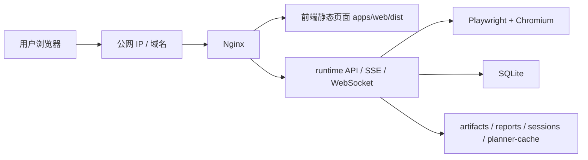

把这张图翻译成人话就是：

1. 用户先访问公网 IP 或域名。
2. 请求先到 Nginx。
3. 如果请求的是网页，就返回 `apps/web/dist` 里的前端文件。
4. 如果请求的是 `/api/...`，就转发给 runtime。
5. runtime 再去控制浏览器、调用模型、写数据库、保存证据。

所以“别人通过网址打开网站”，背后其实是：

- 前端页面被成功托管了
- 后端接口被成功反向代理了
- 运行时服务本身一直活着

---

## 这套仓库在部署时最重要的真实事实

这些不是抽象经验，而是当前仓库的真实情况。

- 前端是 Vite 静态站，发布前必须执行 `pnpm --filter @qpilot/web build`
- 后端启动命令是 `pnpm --filter @qpilot/runtime start`
- 健康检查地址是 `GET /health`
- 前端通过 `VITE_RUNTIME_BASE_URL` 决定去连哪个 runtime
- runtime 默认依赖 SQLite 和本地文件目录，不是纯无状态服务
- 第一次部署时，不要启用 `Redis / Postgres / Prometheus`
- 如果服务器没有图形桌面，就先用无头浏览器，不要开可见浏览器

---

## 部署前的标准判断

在上服务器之前，先做这 4 件事。

### 1. 本地依赖能装好

```bash
pnpm install
pnpm --filter @qpilot/runtime exec playwright install chromium
```

### 2. 本地前后端能启动

```bash
pnpm dev:runtime
pnpm dev:web
```

### 3. 本地地址能打开

- `http://localhost:5173`
- `http://localhost:8787/health`

### 4. 本地至少成功跑过一次最简单的 run

原因很简单：

如果本地都没通，到了服务器上你会同时面对：

- 代码问题
- 环境问题
- Linux 问题
- Nginx 问题
- 网络问题

排错会一下子变得很乱。

---

## 服务器怎么选

### 操作系统

优先选：

- `Ubuntu 24.04 LTS`

原因：

- Node、pnpm、Nginx、Playwright 的教程最多
- systemd 和常见部署方法都围绕 Linux 展开
- 比 Windows 服务器更适合这类项目

### 地域

如果你是第一次部署，建议优先这样理解：

- 想最快上公网：`中国香港`
- 想长期做中国内地正式站点：`中国内地 + 后续备案`

### 配置

建议这样选：

- 最低尝试：`2核 4G`
- 更稳推荐：`2核 8G`

不建议长期使用：

- `2核 2G`

因为这个项目会同时遇到这些吃内存的场景：

- 前端 build
- runtime 常驻
- Playwright 启动 Chromium
- OCR / 截图 / 录像

如果机器只有 `2G`，就默认准备两件事：

1. 构建前先停掉 runtime
2. 额外加一块 swap

---

## 第一次上云的完整 SOP

下面这套顺序适合第一次部署，也最不容易乱。

### 第 1 步：创建服务器

创建一台 Linux ECS。

建议：

- Ubuntu 24.04
- 设置 root 密码
- 记住公网 IP

安全组至少先放行：

- `22`
- `80`
- `443`

这里的原因是：

- `22` 给你远程连接服务器
- `80` 给 HTTP 网页
- `443` 给 HTTPS 网页

### 第 2 步：登录服务器

你可以用：

- 阿里云 Workbench
- SSH 客户端

登录后先验证：

```bash
whoami
uname -a
```

这一步只是确认：

- 你确实进了 Linux
- 你当前权限够

### 第 3 步：安装基础环境

安装这些工具：

- `git`
- `curl`
- `nginx`
- `nodejs`
- `pnpm`

原因：

- `git` 用来拉代码
- `curl` 用来自检接口
- `nginx` 用来托管网页和反代后端
- `nodejs` 用来跑 runtime 和构建 web
- `pnpm` 是这个 monorepo 的包管理器

### 第 4 步：把代码放到服务器

推荐目录：

- `/srv/qpilot/QPilot-Studio`

最常见方式：

```bash
mkdir -p /srv/qpilot
cd /srv/qpilot
git clone 你的仓库地址 QPilot-Studio
```

这样做的好处是：

- 路径整齐
- 后面配置 systemd 和 Nginx 更容易

### 第 5 步：安装依赖

在项目根目录执行：

```bash
cd /srv/qpilot/QPilot-Studio
pnpm install
```

这一步有一个非常重要的纪律：

- 不要中途 `Ctrl + C`

因为如果被打断，依赖会装一半，最常见的后果就是：

- `ts-node` 找不到
- 启动脚本失败

### 第 6 步：准备生产环境 `.env`

从模板复制：

```bash
cp .env.example .env
```

生产环境至少要改这些值：

```env
HOST=127.0.0.1
PORT=8787
CORS_ORIGIN=http://你的公网IP或域名
DATABASE_URL=/srv/qpilot/data/qpilot.db
ARTIFACTS_DIR=/srv/qpilot/data/artifacts
REPORTS_DIR=/srv/qpilot/data/reports
SESSIONS_DIR=/srv/qpilot/data/sessions
PLANNER_CACHE_DIR=/srv/qpilot/data/planner-cache
OPENAI_BASE_URL=你的兼容模型接口
OPENAI_API_KEY=你的真实 key
OPENAI_MODEL=你的真实模型名
CREDENTIAL_MASTER_KEY=64位十六进制密钥
PLATFORM_REDIS_WORKER_ENABLED=false
PLATFORM_METRICS_ENABLED=false
```

这里最容易错的几个点：

1. `HOST` 建议写 `127.0.0.1`  
   原因：runtime 只监听本机，由 Nginx 对外暴露，更安全。

2. `OPENAI_BASE_URL` 不是示例值就一定能用。  
   你必须填“这台服务器真正能访问到的兼容接口”。

3. `OPENAI_API_KEY` 不能写假值。  
   后端能启动，不代表 run 能成功。

4. `CREDENTIAL_MASTER_KEY` 必须是真正的 64 位十六进制值。

第一次部署时，这些先不要启用：

- `PLATFORM_POSTGRES_URL`
- `PLATFORM_REDIS_URL`

因为第一次上云的目标是先跑通主流程，不是先跑完整平台化能力。

### 第 7 步：创建运行目录

执行：

```bash
mkdir -p /srv/qpilot/data/artifacts
mkdir -p /srv/qpilot/data/reports
mkdir -p /srv/qpilot/data/sessions
mkdir -p /srv/qpilot/data/planner-cache
```

原因：

- SQLite、截图、视频、报告、session、cache 都要落磁盘

### 第 8 步：安装 Playwright 浏览器

执行：

```bash
pnpm --filter @qpilot/runtime exec playwright install --with-deps chromium
```

这一阶段常见两个问题：

1. `dpkg lock`  
   说明系统自动更新占用了安装锁，等自动更新结束再装。

2. Ubuntu 交互提示打断安装  
   说明系统包在收尾时弹了交互提示，可以先把 `dpkg` 配置补完，再重试安装。

### 第 9 步：先手工启动 runtime 做自检

执行：

```bash
pnpm --filter @qpilot/runtime start
```

然后新开一个终端测试：

```bash
curl http://127.0.0.1:8787/health
```

如果这里都不通，先不要急着配 Nginx。  
先把 runtime 自己的问题解决掉。

### 第 10 步：把 runtime 改成后台常驻

第一次手工启动只是自检。真正上线时，要把它改成 `systemd` 服务。

目标是：

- 开机自动启动
- 崩了自动重启

验证方式：

```bash
systemctl status qpilot-runtime
curl http://127.0.0.1:8787/health
```

### 第 11 步：构建前端

执行：

```bash
pnpm --filter @qpilot/web build
```

成功后会生成：

- `apps/web/dist`

这一步在小机器上最容易卡住，因为它会同时做：

- TypeScript 检查
- Vite 打包

如果服务器只有 `2G`，前端构建前建议先停掉 runtime，或者先加 swap。

### 第 12 步：让前端指向正确的 runtime

这是最容易错的一步。

如果前端 build 时仍然用的是：

- `http://localhost:8787`

那公网用户打开网页后，浏览器就会尝试请求“用户自己电脑上的 localhost”，而不是你的服务器。

正确做法是：

在生产环境给前端写：

```env
VITE_RUNTIME_BASE_URL=http://你的公网IP或域名
```

推荐用：

- `apps/web/.env.production`

然后重新 build 一次。

这里还有一个非常重要的小细节：

- `VITE_RUNTIME_BASE_URL` 不要手动写 `/api`

因为前端代码会自己再拼 `/api/...`。

### 第 13 步：配置 Nginx

Nginx 负责把“前端网页”和“后端接口”组合成一个网站。

最核心的规则是：

- `/` 指向 `apps/web/dist`
- `/api/` 反代到 `http://127.0.0.1:8787`
- `/artifacts/` 反代到 runtime
- `/reports/` 反代到 runtime

因为前端是 SPA，所以必须有：

```nginx
try_files $uri $uri/ /index.html;
```

反代 `/api/` 时还要记得：

- 打开 WebSocket 升级头
- 提高读写超时
- `proxy_buffering off`

这样 SSE 和 WebSocket 才不容易出问题。

### 第 14 步：本机验收

先在服务器本机测：

```bash
curl http://127.0.0.1
curl http://127.0.0.1:8787/health
```

你期望看到的是：

- 第一个返回前端 HTML
- 第二个返回健康 JSON

### 第 15 步：放通安全组

安全组至少放行：

- `80`
- `443`

然后在你自己电脑浏览器里测：

- `http://公网IP`
- `http://公网IP/api/projects`

如果这两个都通，说明：

- Nginx 对外通了
- runtime 反代也通了

### 第 16 步：域名和 HTTPS

如果你已经有域名：

1. 增加一条 `A` 记录指向服务器公网 IP
2. 用 `Certbot + Let's Encrypt` 申请 HTTPS

上 HTTPS 后，记得同步修改：

- `VITE_RUNTIME_BASE_URL`
- `CORS_ORIGIN`

然后：

1. 重新 build 前端
2. 重启 runtime
3. reload Nginx

---

## 这个仓库最容易踩的坑

### 1. 把 `apps/desktop` 当成公网网站部署

这是最经典的误解。

公网真正部署的是：

- `apps/web`
- `apps/runtime`

不是：

- `apps/desktop`

### 2. 前端页面能打开，但顶部还写着 `localhost:8787`

原因：

- 前端 build 时还在用本地地址

处理：

1. 修改 `VITE_RUNTIME_BASE_URL`
2. 重新 build 前端
3. 刷新浏览器缓存

### 3. Nginx 能打开首页，但 `/api` 不通

原因通常只有两个：

1. `/api/` 没配反代
2. runtime 没启动成功

先查：

```bash
curl http://127.0.0.1:8787/health
```

### 4. runtime 启动报 `ts-node` 找不到

原因：

- `pnpm install` 中途被打断

处理：

- 回到项目根目录重新完整执行一次 `pnpm install`

### 5. Playwright 安装失败

原因：

- `apt/dpkg` 锁被系统自动更新占用

处理：

- 等自动更新结束，再重新安装 Chromium

### 6. 前端 build 卡住

原因：

- 内存不够，尤其是 `2G`

处理：

1. 先停掉 runtime 再 build
2. 增加 swap
3. 或直接升级到 `4G/8G`

### 7. 运行时提示浏览器启动失败，需要 XServer

原因：

- 你开了 `headed=true`
- 服务器没有图形桌面

处理：

第一次部署先用：

- `headless`
- `manualTakeover=false`

真要开可见浏览器，再给服务器加：

- `Xvfb`

### 8. 页面能打开，浏览器也能打开目标网站，但 run 在规划前失败

原因通常是模型接口不通或配置错误。

重点排查：

- `OPENAI_BASE_URL`
- `OPENAI_API_KEY`
- `OPENAI_MODEL`
- 服务器能不能访问这个模型接口

尤其中国内地机器，如果直接写 OpenAI 官方地址，很容易不通。

### 9. 你明明配过 DeepSeek，结果服务器里变成 OpenAI 了

原因：

- 后面整份覆盖 `.env` 时把原值冲掉了

处理：

- 永远以服务器上的真实 `.env` 为准
- 不要靠记忆判断

### 10. 真实 API Key 泄露

原因：

- 把 key 发到聊天
- 截到图里
- 写进仓库
- 留在终端历史里

处理：

1. 立刻撤销旧 key
2. 生成新 key
3. 清理终端历史

以后不要把真实 key 发到任何对话或截图里。

### 11. 刚启动 service 就立刻 curl，结果以为服务挂了

原因：

- systemd 刚拉起时，Node 还没来得及真正监听端口

处理：

- 等几秒再查
- 或看日志：

```bash
journalctl -u qpilot-runtime -n 50 --no-pager
```

---

## 标准排错顺序

以后不管是哪一步出问题，尽量按这个顺序排，不要东一榔头西一棒子。

### 第 1 层：先看进程活不活

```bash
systemctl status qpilot-runtime
```

### 第 2 层：看后端健康检查

```bash
curl http://127.0.0.1:8787/health
```

### 第 3 层：看前端 build 产物还在不在

```bash
ls apps/web/dist
```

### 第 4 层：看 Nginx 配置有没有语法问题

```bash
nginx -t
```

### 第 5 层：看 Nginx 本机能不能返回网页

```bash
curl http://127.0.0.1
```

### 第 6 层：看公网 IP 能不能打开

直接在浏览器里打开：

- `http://公网IP`

### 第 7 层：看安全组有没有放行

重点看：

- `80`
- `443`

### 第 8 层：看模型配置是不是服务器真正能访问的那个

重点核对：

- `OPENAI_BASE_URL`
- `OPENAI_MODEL`
- `OPENAI_API_KEY`

### 第 9 层：最后看日志

```bash
journalctl -u qpilot-runtime -n 100 --no-pager
```

---

## 一份以后可复用的“最短记忆版”

如果你以后不想看长文，只想快速回忆顺序，记住下面这 19 步就够了。

1. 本地跑通
2. 选 Ubuntu 服务器
3. 安装 Node、pnpm、Nginx
4. `git clone`
5. `pnpm install`
6. 配 `.env`
7. 建数据目录
8. 安装 Playwright Chromium
9. 手工起 runtime
10. `curl /health`
11. `systemd` 托管 runtime
12. `web build`
13. 正确设置 `VITE_RUNTIME_BASE_URL`
14. 配 Nginx
15. 开安全组 `80/443`
16. 浏览器用公网 IP 验收
17. 绑定域名
18. 上 HTTPS
19. 最后再考虑 Xvfb、远程接管、优化配置

---

## 验收清单

### 本地验收

- `http://localhost:5173` 可打开
- `http://localhost:8787/health` 返回 `ok`

### 服务器内网验收

- `curl http://127.0.0.1:8787/health` 成功
- `curl http://127.0.0.1` 返回前端 HTML

### 公网验收

- `http://公网IP` 可打开
- `http://公网IP/api/projects` 返回 JSON

### 业务验收

- 能创建项目
- 能创建 run
- 在 `headless` 下至少成功跑完一次简单站点

### 稳定性验收

- 重启服务器后 runtime 能自动起来
- Nginx 能自动提供网页

---

## 最后给小白的一句提醒

第一次部署最容易犯的错误，不是“命令不会敲”，而是：

- 一次同时改太多东西
- 页面一报错就怀疑所有层都坏了
- 不先确认“是前端问题、后端问题、Nginx 问题，还是模型接口问题”

以后只要你记住这条思路，就会越来越稳：

先本地，后上云；  
先后端，后前端；  
先内网自测，后公网暴露；  
先 IP，后域名；  
先 HTTP，后 HTTPS；  
先跑通，再优化。

## 第 10 章导读：当你想从文档走回代码时

前面的正文和专题整合，主要目标是让你先把概念、流程、实战和排错串起来。

但如果你已经开始想：

- 这些话到底在代码里是哪一行体现的
- runtime 到底在什么地方监听了 `/health`
- run 生命周期到底是哪个文件最关键
- OCR 为什么会走到 `visual-targeting`
- 数据库表到底在哪里定义

那你就可以进入后面的源码附录。

我把几个最关键的真实文件直接并到了这本书里。  
你不用马上把每一行都看懂，但你至少能做到：

- 先把文档里提到的概念和真实文件名对上
- 以后排查时知道先翻哪几个文件

---

## 源码附录怎么读

后面的源码不是让你逐行背，而是让你建立“文档 -> 文件 -> 实现”的映射。

建议顺序是：

1. 先看 `apps/web/src/lib/api.ts`
   这是前端到底怎么连 runtime 的真实入口。
2. 再看 `apps/runtime/src/server.ts`
   这是 runtime 起服务、挂路由、暴露 `/health` 的入口。
3. 再看 `apps/runtime/src/orchestrator/run-orchestrator.ts`
   这是整条 run 主循环最核心的文件。
4. 再看页面检测、OCR、schema 相关文件
   这样你就能把“页面感知、定位、落库、报告”分别对上。

## 源码附录 1：`apps/runtime/src/server.ts`
```ts
import { mkdirSync } from "node:fs";
import { resolve } from "node:path";
import cors from "@fastify/cors";
import staticPlugin from "@fastify/static";
import websocket from "@fastify/websocket";
import Fastify from "fastify";
import { env, RUNTIME_ROOT } from "./config/env.js";
import { createDatabase, resolveDatabasePath } from "./db/client.js";
import { migrateDatabase } from "./db/migrate.js";
import { RunOrchestrator } from "./orchestrator/run-orchestrator.js";
import { executePersistedPlatformLoadRun } from "./platform/load-control-plane.js";
import { PlatformLoadQueue } from "./platform/load-queue.js";
import { EvidenceStore } from "./server/evidence-store.js";
import { LiveStreamHub } from "./server/live-stream-hub.js";
import { registerHealthRoutes } from "./server/routes/health.js";
import { registerLiveRoutes } from "./server/routes/live.js";
import { registerLoadRoutes } from "./server/routes/load.js";
import { registerPlatformRoutes } from "./server/routes/platform.js";
import { registerMetricsRoutes } from "./server/routes/metrics.js";
import { registerProjectRoutes } from "./server/routes/projects.js";
import { registerReportRoutes } from "./server/routes/reports.js";
import { registerRuntimeRoutes } from "./server/routes/runtime.js";
import { registerRunRoutes } from "./server/routes/runs.js";
import { SseHub } from "./server/sse-hub.js";
import type { AppFastify } from "./server/types.js";

const resolvePath = (value: string): string => resolve(RUNTIME_ROOT, value);

export const createServer = async (): Promise<AppFastify> => {
  const app = Fastify({ logger: true }) as unknown as AppFastify;

  const databasePath = resolveDatabasePath(env.DATABASE_URL, RUNTIME_ROOT);
  await migrateDatabase();
  const { client, db } = await createDatabase(databasePath);

  const artifactsRoot = resolvePath(env.ARTIFACTS_DIR);
  const reportsRoot = resolvePath(env.REPORTS_DIR);
  const sessionsRoot = resolvePath(env.SESSIONS_DIR);
  const plannerCacheRoot = resolvePath(env.PLANNER_CACHE_DIR);
  mkdirSync(artifactsRoot, { recursive: true });
  mkdirSync(reportsRoot, { recursive: true });
  mkdirSync(sessionsRoot, { recursive: true });
  mkdirSync(plannerCacheRoot, { recursive: true });

  const sseHub = new SseHub();
  const liveStreamHub = new LiveStreamHub();
  const evidenceStore = new EvidenceStore(artifactsRoot);
  const orchestrator = new RunOrchestrator({
    db,
    evidenceStore,
    sseHub,
    liveStreamHub,
    artifactsRoot,
    reportsRoot,
    sessionsRoot,
    plannerCacheRoot
  });
  const platformLoadQueue = new PlatformLoadQueue({
    redisUrl: env.PLATFORM_REDIS_URL,
    queueName: env.PLATFORM_REDIS_QUEUE_NAME,
    workerEnabled: env.PLATFORM_REDIS_WORKER_ENABLED,
    workerConcurrency: env.PLATFORM_REDIS_WORKER_CONCURRENCY,
    jobAttempts: env.PLATFORM_REDIS_JOB_ATTEMPTS,
    jobBackoffMs: env.PLATFORM_REDIS_JOB_BACKOFF_MS,
    workerHeartbeatTimeoutMs: env.PLATFORM_WORKER_HEARTBEAT_TIMEOUT_MS,
    processor: async ({ runId }) => {
      await executePersistedPlatformLoadRun({
        db,
        runId,
        heartbeatIntervalMs: env.PLATFORM_WORKER_HEARTBEAT_INTERVAL_MS
      });
    },
    log: {
      info: (message) => app.log.info(message),
      error: (message, error) => app.log.error({ error }, message)
    }
  });

  app.appContext = {
    db,
    orchestrator,
    evidenceStore,
    sseHub,
    liveStreamHub,
    runtimeBaseUrl: `http://${env.HOST}:${env.PORT}`,
    platformLoadQueue
  };

  await app.register(cors, {
    origin: env.CORS_ORIGIN,
    credentials: true
  });
  await app.register(websocket);

  await app.register(staticPlugin, {
    root: artifactsRoot,
    prefix: "/artifacts/"
  });

  await app.register(staticPlugin, {
    root: reportsRoot,
    prefix: "/reports/",
    decorateReply: false
  });

  registerHealthRoutes(app);
  registerLiveRoutes(app);
  registerLoadRoutes(app);
  registerMetricsRoutes(app);
  registerPlatformRoutes(app);
  registerProjectRoutes(app);
  registerRuntimeRoutes(app);
  registerRunRoutes(app);
  registerReportRoutes(app);

  app.addHook("onClose", async () => {
    sseHub.close();
    liveStreamHub.close();
    await platformLoadQueue.close();
    client.close();
  });

  return app;
};
```

## 源码附录 2：`apps/runtime/src/orchestrator/run-orchestrator.ts`
```ts
import { existsSync } from "node:fs";
import { mkdir } from "node:fs/promises";
import { basename, resolve } from "node:path";
import { OpenAICompatibleClient } from "@qpilot/ai-gateway";
import { generateReports } from "@qpilot/report-core";
import {
  type Action,
  type ChallengeKind,
  type DraftActionState,
  type ExecutionMode,
  type LLMDecision,
  type PageSnapshot,
  type ReplayCaseStep,
  type RunConfig,
  type Run,
  type RunLivePhase,
  type RunWorkingMemory,
  RunConfigSchema,
  RUNTIME_EVENTS,
  type TrafficAssertion,
  type RuntimeEvent,
  type VerificationResult
} from "@qpilot/shared";
import { asc, desc, eq } from "drizzle-orm";
import { nanoid } from "nanoid";
import { chromium, type Browser, type BrowserContext, type Page } from "playwright";
import { env } from "../config/env.js";
import {
  caseTemplatesTable,
  projectsTable,
  reportsTable,
  runsTable,
  stepsTable,
  testCasesTable
} from "../db/schema.js";
import { runtimeText } from "../i18n/runtime-text.js";
import { Planner } from "../llm/planner.js";
import { PlannerCache } from "../llm/planner-cache.js";
import {
  collectPageSnapshot
} from "../playwright/collector/page-snapshot.js";
import {
  type SecurityChallengeResult,
  detectSecurityChallenge
} from "../playwright/collector/page-guards.js";
import { executeAction } from "../playwright/executor/action-executor.js";
import {
  reconcileVerificationWithApiSignals,
  verifyPageOutcome
} from "../playwright/verifier/basic-verifier.js";
import { decryptText } from "../security/credentials.js";
import { resolveSessionStatePath } from "../security/session-state.js";
import type { EvidenceStore } from "../server/evidence-store.js";
import type { LiveStreamHub } from "../server/live-stream-hub.js";
import type { SseHub } from "../server/sse-hub.js";
import {
  buildLoginActions,
  buildLoginScenarios,
  inferLoginSelectors
} from "./login-strategy.js";
import { findBestCaseTemplateMatch } from "./case-template-matcher.js";
import { refineDecisionForAuthProvider } from "./decision-refiner.js";
import {
  detectCredentialValidationFailure,
  detectRepeatedIneffectiveAttempts,
  shouldClearFlowFailuresAfterSuccess,
  shouldReplanAfterRecoverableStep,
  type GeneralFlowAttempt
} from "./general-flow-guard.js";
import { buildGoalGuardObservation } from "./goal-alignment.js";
import { applyStageActionPolicy } from "./stage-action-policy.js";
import { decideTemplateReplayFallback } from "./template-replay-policy.js";
import { buildApiVerification, buildApiVerificationRules } from "./traffic-verifier.js";
import { buildExecutionDiagnostics } from "./step-diagnostics.js";
import {
  mapProjectRow,
  mapRunRow,
  mapStepRow,
  mapTestCaseRow,
  type CaseTemplateRow,
  type ProjectRow,
  type RunRow,
  type StepRow,
  type TestCaseRow
} from "../utils/mappers.js";
import {
  buildRunWorkingMemory,
  deriveStepOutcome,
  markRunWorkingMemoryCompleted,
  summarizeRunWorkingMemory
} from "./run-memory.js";

type EventName = keyof typeof RUNTIME_EVENTS;

interface OrchestratorDeps {
  db: any;
  evidenceStore: EvidenceStore;
  sseHub: SseHub;
  liveStreamHub: LiveStreamHub;
  artifactsRoot: string;
  reportsRoot: string;
  sessionsRoot: string;
  plannerCacheRoot: string;
}

interface RunContext {
  run: RunRow & { configJson: string };
  project: ProjectRow;
}

interface FlowExecutionResult {
  stepIndex: number;
  lastObservation: string;
  hasFailures: boolean;
  workingMemory?: RunWorkingMemory;
  haltReason?: string;
}

interface StepExecutionResult {
  stepIndex: number;
  lastObservation: string;
  hasFailures: boolean;
  verification: VerificationResult;
  workingMemory?: RunWorkingMemory;
  page: Page;
  haltReason?: string;
}

interface UiSettleMetrics {
  url: string;
  frameCount: number;
  visibleIframeCount: number;
  visibleModalCount: number;
}

const RECORDED_VIDEO_SIZE = {
  width: 1280,
  height: 720
} as const;

interface RunStatusEventData {
  status?: string;
  phase?: RunLivePhase;
  stepIndex?: number;
  message?: string;
  phaseProgress?: number;
  phaseStartedAt?: string;
  action?: Action;
  verification?: VerificationResult;
  pageUrl?: string;
  pageTitle?: string;
  screenshotPath?: string;
  observationSummary?: string;
  haltReason?: string | null;
  manualRequired?: boolean;
  challengeKind?: ChallengeKind;
  executionMode?: ExecutionMode;
  draft?: DraftActionState | null;
  cacheHit?: boolean;
  replayCaseId?: string | null;
  replayCaseTitle?: string | null;
  replayCaseType?: Run["replayCaseType"] | null;
}

interface ManualWaiter {
  resolve: () => void;
  reject: (error: Error) => void;
  timeout: NodeJS.Timeout;
}

interface DraftWaiter {
  resolve: (resolution: DraftResolution) => void;
  reject: (error: Error) => void;
}

type DraftResolution =
  | { type: "approve"; action?: Action }
  | { type: "skip" };

interface RunControlState {
  pauseRequested: boolean;
  paused: boolean;
  abortRequested: boolean;
  resumeResolvers: Set<() => void>;
}

interface SessionPersistenceState {
  path: string;
  save: boolean;
}

interface ActiveRunSnapshot {
  phase: RunLivePhase | "idle";
  message?: string;
  stepIndex?: number;
  paused: boolean;
  manualRequired: boolean;
  executionMode?: ExecutionMode;
  draft?: DraftActionState | null;
  lastEventAt?: string;
}

class RunAbortedError extends Error {
  constructor(message = "Run aborted from desktop control bar.") {
    super(message);
    this.name = "RunAbortedError";
  }
}

export class RunOrchestrator {
  private activeRunId: string | null = null;
  private readonly planner: Planner | null;
  private readonly manualWaiters = new Map<string, ManualWaiter>();
  private readonly draftWaiters = new Map<string, DraftWaiter>();
  private readonly activeDrafts = new Map<string, DraftActionState>();
  private readonly activePages = new Map<string, Page>();
  private readonly activeBrowsers = new Map<string, Browser>();
  private readonly activeBrowserContexts = new Map<string, BrowserContext>();
  private readonly activePageVideos = new Map<string, ReturnType<Page["video"]>>();
  private readonly activeSessionPersistence = new Map<string, SessionPersistenceState>();
  private readonly runControls = new Map<string, RunControlState>();
  private readonly runExecutionModes = new Map<string, ExecutionMode>();
  private readonly runSnapshots = new Map<string, ActiveRunSnapshot>();
  private readonly runResourceClosers = new Map<string, Promise<void>>();

  constructor(private readonly deps: OrchestratorDeps) {
    this.planner = env.OPENAI_API_KEY
      ? new Planner(
          new OpenAICompatibleClient({
            baseURL: env.OPENAI_BASE_URL,
            apiKey: env.OPENAI_API_KEY,
            model: env.OPENAI_MODEL,
            timeoutMs: env.OPENAI_TIMEOUT_MS
          }),
          new PlannerCache(deps.plannerCacheRoot)
        )
      : null;
  }

  isBusy(): boolean {
    return this.activeRunId !== null;
  }

  getActiveRunId(): string | null {
    return this.activeRunId;
  }

  async bringBrowserToFront(runId: string): Promise<boolean> {
    const page = this.activePages.get(runId);
    if (!page || page.isClosed()) {
      return false;
    }

    try {
      await page.bringToFront();
      return true;
    } catch {
      return false;
    }
  }

  private getCurrentPage(runId: string, fallback: Page): Page {
    const activePage = this.activePages.get(runId);
    if (activePage && !activePage.isClosed()) {
      return activePage;
    }
    return fallback;
  }

  private async syncCurrentPage(
    runId: string,
    fallback: Page,
    options?: { waitForNewPageMs?: number }
  ): Promise<Page> {
    let currentPage = this.getCurrentPage(runId, fallback);
    const waitForNewPageMs = options?.waitForNewPageMs ?? 0;

    if (currentPage === fallback && waitForNewPageMs > 0) {
      const deadline = Date.now() + waitForNewPageMs;
      while (Date.now() < deadline) {
        await new Promise((resolve) => setTimeout(resolve, 100));
        currentPage = this.getCurrentPage(runId, fallback);
        if (currentPage !== fallback) {
          break;
        }
      }
    }

    if (!currentPage.isClosed()) {
      await currentPage.waitForLoadState("domcontentloaded", { timeout: 5_000 }).catch(() => undefined);
    }

    return currentPage;
  }

  private async readUiSettleMetrics(page: Page): Promise<UiSettleMetrics> {
    const fallback: UiSettleMetrics = {
      url: page.url(),
      frameCount: page.frames().length,
      visibleIframeCount: 0,
      visibleModalCount: 0
    };

    if (page.isClosed()) {
      return fallback;
    }

    const domMetrics = await page
      .evaluate((contextSelector) => {
        const isVisible = (element: Element): boolean => {
          if (!(element instanceof HTMLElement)) {
            return false;
          }
          const style = window.getComputedStyle(element);
          const rect = element.getBoundingClientRect();
          return (
            style.visibility !== "hidden" &&
            style.display !== "none" &&
            Number(style.opacity || "1") > 0 &&
            rect.width > 1 &&
            rect.height > 1
          );
        };

        return {
          visibleIframeCount: Array.from(document.querySelectorAll("iframe")).filter(isVisible).length,
          visibleModalCount: Array.from(document.querySelectorAll(contextSelector)).filter(isVisible).length
        };
      }, "dialog,[role='dialog'],[role='alertdialog'],[aria-modal='true'],[id*='modal'],[class*='modal'],[class*='dialog'],[class*='popup']")
      .catch(() => ({
        visibleIframeCount: 0,
        visibleModalCount: 0
      }));

    return {
      url: page.url(),
      frameCount: page.frames().length,
      visibleIframeCount: domMetrics.visibleIframeCount,
      visibleModalCount: domMetrics.visibleModalCount
    };
  }

  private async waitForActionSettle(
    page: Page,
    action: Action,
    baseline: UiSettleMetrics | null
  ): Promise<void> {
    if (action.type !== "click" || !baseline || page.isClosed()) {
      return;
    }

    const deadline = Date.now() + 1_200;
    await page.waitForTimeout(180);

    while (Date.now() < deadline && !page.isClosed()) {
      const current = await this.readUiSettleMetrics(page);
      const changed =
        current.url !== baseline.url ||
        current.frameCount > baseline.frameCount ||
        current.visibleIframeCount > baseline.visibleIframeCount ||
        current.visibleModalCount !== baseline.visibleModalCount;

      if (changed) {
        await page.waitForTimeout(260);
        return;
      }

      await page.waitForTimeout(120);
    }
  }

  pauseRun(runId: string): boolean {
    if (this.activeRunId !== runId) {
      return false;
    }

    const state = this.getOrCreateRunControl(runId);
    if (state.abortRequested) {
      return false;
    }
    state.pauseRequested = true;
    return true;
  }

  resumeRun(runId: string): boolean {
    const manualResumed = this.resumeManual(runId);
    if (manualResumed) {
      return true;
    }

    const state = this.runControls.get(runId);
    if (!state) {
      return false;
    }

    state.pauseRequested = false;
    state.paused = false;
    this.resolveRunResumes(runId);
    return true;
  }

  abortRun(runId: string): boolean {
    if (this.activeRunId !== runId) {
      return false;
    }

    const state = this.getOrCreateRunControl(runId);
    state.abortRequested = true;
    state.pauseRequested = false;
    state.paused = false;
    this.resolveRunResumes(runId);

    const snapshot = this.runSnapshots.get(runId);
    this.emitRunStatus(runId, {
      status: "running",
      phase: "finished",
      stepIndex: snapshot?.stepIndex,
      manualRequired: false,
      executionMode: snapshot?.executionMode ?? this.runExecutionModes.get(runId),
      draft: null,
      message: runtimeText().abortingRun
    });

    const waiter = this.manualWaiters.get(runId);
    if (waiter) {
      clearTimeout(waiter.timeout);
      this.manualWaiters.delete(runId);
      waiter.reject(new RunAbortedError());
    }

    const draftWaiter = this.draftWaiters.get(runId);
    if (draftWaiter) {
      this.draftWaiters.delete(runId);
      this.activeDrafts.delete(runId);
      draftWaiter.reject(new RunAbortedError());
    }

    this.activeDrafts.delete(runId);
    void this.deps.liveStreamHub.unregisterRun(runId).catch(() => undefined);
    void this.closeRunResources(runId);

    return true;
  }

  getActiveRunSnapshot():
    | {
        runId: string;
        control: ActiveRunSnapshot;
      }
    | null {
    if (!this.activeRunId) {
      return null;
    }

    const snapshot = this.runSnapshots.get(this.activeRunId);
    const state = this.runControls.get(this.activeRunId);

    return {
      runId: this.activeRunId,
      control: {
        phase: state?.abortRequested ? "finished" : snapshot?.phase ?? "idle",
        message: snapshot?.message,
        stepIndex: snapshot?.stepIndex,
        paused: state?.abortRequested ? false : state?.paused ?? false,
        manualRequired: state?.abortRequested
          ? false
          : snapshot?.manualRequired ?? Boolean(this.manualWaiters.has(this.activeRunId)),
        executionMode:
          snapshot?.executionMode ?? this.runExecutionModes.get(this.activeRunId),
        draft: state?.abortRequested
          ? null
          : this.activeDrafts.get(this.activeRunId) ?? snapshot?.draft ?? null,
        lastEventAt: snapshot?.lastEventAt
      }
    };
  }

  resumeManual(runId: string): boolean {
    const waiter = this.manualWaiters.get(runId);
    if (!waiter) {
      return false;
    }

    clearTimeout(waiter.timeout);
    this.manualWaiters.delete(runId);
    waiter.resolve();
    return true;
  }

  switchExecutionMode(runId: string, executionMode: ExecutionMode): boolean {
    if (this.activeRunId !== runId) {
      return false;
    }
    this.runExecutionModes.set(runId, executionMode);
    const snapshot = this.runSnapshots.get(runId);
    const phase =
      snapshot?.phase && snapshot.phase !== "idle"
        ? snapshot.phase
        : this.activeDrafts.has(runId)
          ? "drafting"
          : "planning";
    this.emitRunStatus(runId, {
      status: "running",
      phase,
      stepIndex: snapshot?.stepIndex,
      manualRequired: snapshot?.manualRequired ?? Boolean(this.manualWaiters.has(runId)),
      executionMode,
      draft: this.activeDrafts.get(runId) ?? snapshot?.draft ?? null,
      message: snapshot?.message
    });
    return true;
  }

  private emitDraftResolution(runId: string, phase: RunLivePhase, action?: Action): void {
    const snapshot = this.runSnapshots.get(runId);
    this.emitRunStatus(runId, {
      status: "running",
      phase,
      stepIndex: snapshot?.stepIndex,
      action,
      manualRequired: false,
      executionMode: snapshot?.executionMode ?? this.runExecutionModes.get(runId),
      draft: null
    });
  }

  approveDraft(runId: string, action?: Action): boolean {
    const waiter = this.draftWaiters.get(runId);
    if (!waiter) {
      return false;
    }
    const currentDraft = this.activeDrafts.get(runId);
    const resolvedAction = action ?? currentDraft?.action;
    this.draftWaiters.delete(runId);
    this.activeDrafts.delete(runId);
    this.emitDraftResolution(runId, "executing", resolvedAction);
    waiter.resolve({ type: "approve", action });
    return true;
  }

  skipDraft(runId: string): boolean {
    const waiter = this.draftWaiters.get(runId);
    if (!waiter) {
      return false;
    }
    this.draftWaiters.delete(runId);
    this.activeDrafts.delete(runId);
    this.emitDraftResolution(runId, "planning");
    waiter.resolve({ type: "skip" });
    return true;
  }

  retryDraft(runId: string): boolean {
    const draft = this.activeDrafts.get(runId);
    if (!draft) {
      return false;
    }
    return this.approveDraft(runId, draft.action);
  }

  async extractCasesForRun(runId: string): Promise<void> {
    const context = await this.loadContext(runId);
    const runConfig = RunConfigSchema.parse(JSON.parse(context.run.configJson)) as RunConfig;
    await this.extractCaseTemplates(runId, context.project.id, runConfig);
  }

  async start(runId: string): Promise<void> {
    if (this.activeRunId && this.activeRunId !== runId) {
      throw new Error(`Runtime is busy with run ${this.activeRunId}`);
    }
    this.activeRunId = runId;
    this.runControls.set(runId, {
      pauseRequested: false,
      paused: false,
      abortRequested: false,
      resumeResolvers: new Set()
    });

    try {
      await this.execute(runId);
    } catch (error) {
      const message = error instanceof Error ? error.message : "Unknown run failure";
      if (error instanceof RunAbortedError) {
        await this.markRunStopped(runId, message);
        await this.generateRunReports(runId);
        this.emit("RUN_FINISHED", runId, {
          status: "stopped",
          endedAt: new Date().toISOString(),
          haltReason: message
        });
      } else {
        await this.markRunFailed(runId, message);
        this.emit("RUN_ERROR", runId, { message });
      }
    } finally {
      const waiter = this.manualWaiters.get(runId);
      if (waiter) {
        clearTimeout(waiter.timeout);
        this.manualWaiters.delete(runId);
        waiter.reject(new Error("Run ended before manual intervention completed."));
      }
      const draftWaiter = this.draftWaiters.get(runId);
      if (draftWaiter) {
        this.draftWaiters.delete(runId);
        this.activeDrafts.delete(runId);
        draftWaiter.reject(new Error("Run ended before the draft action was resolved."));
      }
      this.activeRunId = null;
      this.runControls.delete(runId);
      this.runExecutionModes.delete(runId);
      this.runSnapshots.delete(runId);
    }
  }

  private emit(eventKey: EventName, runId: string, data: unknown): void {
    const payload: RuntimeEvent = {
      event: RUNTIME_EVENTS[eventKey],
      runId,
      ts: new Date().toISOString(),
      data
    };
    this.deps.sseHub.publish(payload);
  }

  private emitRunStatus(runId: string, data: RunStatusEventData): void {
    const current = this.runSnapshots.get(runId);
    this.runSnapshots.set(runId, {
      phase: data.phase ?? current?.phase ?? "idle",
      message: data.message ?? current?.message,
      stepIndex: data.stepIndex ?? current?.stepIndex,
      paused: this.runControls.get(runId)?.paused ?? false,
      manualRequired:
        data.manualRequired ??
        (data.phase
          ? data.phase === "manual"
          : current?.manualRequired ?? false),
      executionMode: data.executionMode ?? current?.executionMode ?? this.runExecutionModes.get(runId),
      draft: data.draft === undefined ? current?.draft ?? null : data.draft,
      lastEventAt: new Date().toISOString()
    });
    this.deps.liveStreamHub.updateRunMeta(runId, {
      phase: data.phase ?? undefined,
      stepIndex: data.stepIndex,
      message: data.message,
      pageUrl: data.pageUrl,
      pageTitle: data.pageTitle
    });
    this.emit("RUN_STATUS", runId, data);
  }

  private getOrCreateRunControl(runId: string): RunControlState {
    const existing = this.runControls.get(runId);
    if (existing) {
      return existing;
    }

    const created: RunControlState = {
      pauseRequested: false,
      paused: false,
      abortRequested: false,
      resumeResolvers: new Set()
    };
    this.runControls.set(runId, created);
    return created;
  }

  private resolveRunResumes(runId: string): void {
    const state = this.runControls.get(runId);
    if (!state) {
      return;
    }

    const callbacks = Array.from(state.resumeResolvers);
    state.resumeResolvers.clear();
    for (const resolve of callbacks) {
      resolve();
    }
  }

  private async awaitWithTimeout(
    operation: Promise<unknown>,
    timeoutMs: number
  ): Promise<void> {
    await Promise.race([
      operation.then(() => undefined).catch(() => undefined),
      new Promise<void>((resolve) => {
        setTimeout(resolve, timeoutMs);
      })
    ]);
  }

  private closeRunResources(runId: string): Promise<void> {
    const existing = this.runResourceClosers.get(runId);
    if (existing) {
      return existing;
    }

    const browserContext = this.activeBrowserContexts.get(runId);
    const browser = this.activeBrowsers.get(runId);
    const pageVideo = this.activePageVideos.get(runId);
    const sessionPersistence = this.activeSessionPersistence.get(runId);

    const closePromise = (async () => {
      if (browserContext && sessionPersistence?.save) {
        await this.awaitWithTimeout(
          browserContext.storageState({ path: sessionPersistence.path }),
          2_000
        );
      }

      if (browserContext) {
        await this.awaitWithTimeout(browserContext.close(), 4_000);
      }

      if (pageVideo) {
        await this.persistRecordedVideo(runId, pageVideo).catch(() => undefined);
      }

      await this.deps.evidenceStore.persistRun(runId).catch(() => undefined);

      if (browser) {
        await this.awaitWithTimeout(browser.close(), 2_500);
      }
    })().finally(() => {
      this.runResourceClosers.delete(runId);
      this.activeBrowsers.delete(runId);
      this.activeBrowserContexts.delete(runId);
      this.activePageVideos.delete(runId);
      this.activeSessionPersistence.delete(runId);
    });

    this.runResourceClosers.set(runId, closePromise);
    return closePromise;
  }

  private async checkRunControl(input: {
    runId: string;
    page: Page;
    artifactDir: string;
    stepIndex: number;
    language?: RunConfig["language"];
    resumePhase: RunLivePhase;
    resumeMessage: string;
  }): Promise<void> {
    const state = this.runControls.get(input.runId);
    if (!state) {
      return;
    }

    if (state.abortRequested) {
      throw new RunAbortedError();
    }

    if (!state.pauseRequested) {
      return;
    }

    if (!state.paused) {
      const text = runtimeText(input.language);
      state.paused = true;
      const pauseSnapshot = await collectPageSnapshot(input.page, {
        artifactDir: input.artifactDir,
        screenshotPublicPrefix: `/artifacts/runs/${input.runId}`,
        stepIndex: input.stepIndex,
        label: `paused-step-${String(Math.max(input.stepIndex, 0)).padStart(4, "0")}`
      });
      this.emitRunStatus(input.runId, {
        status: "running",
        phase: "paused",
        stepIndex: input.stepIndex,
        phaseStartedAt: new Date().toISOString(),
        phaseProgress: 1,
        pageUrl: pauseSnapshot.url,
        pageTitle: pauseSnapshot.title,
        screenshotPath: pauseSnapshot.screenshotPath,
        observationSummary: text.pausedObservation,
        message: text.pausedMessage
      });
    }

    await new Promise<void>((resolve) => {
      state.resumeResolvers.add(resolve);
    });

    if (state.abortRequested) {
      throw new RunAbortedError();
    }

    state.paused = false;
    this.emitRunStatus(input.runId, {
      status: "running",
      phase: input.resumePhase,
      stepIndex: input.stepIndex,
      phaseStartedAt: new Date().toISOString(),
      pageUrl: input.page.url(),
      message: input.resumeMessage
    });
  }

  private getExecutionMode(runId: string, fallback: ExecutionMode): ExecutionMode {
    return this.runExecutionModes.get(runId) ?? fallback;
  }

  private async resolveDraftAction(input: {
    runId: string;
    stepIndex: number;
    action: Action;
    expectedChecks: string[];
    fallbackExecutionMode: ExecutionMode;
    reason?: string;
    language?: RunConfig["language"];
    awaitApproval: boolean;
    pageUrl?: string;
    pageTitle?: string;
    screenshotPath?: string;
  }): Promise<Action | null> {
    const text = runtimeText(input.language);
    const draft: DraftActionState = {
      stepIndex: input.stepIndex,
      action: input.action,
      expectedChecks: input.expectedChecks,
      reason: input.reason,
      awaitingApproval: input.awaitApproval
    };
    this.activeDrafts.set(input.runId, draft);
    this.emitRunStatus(input.runId, {
      status: "running",
      phase: "drafting",
      stepIndex: input.stepIndex,
      executionMode: this.getExecutionMode(input.runId, input.fallbackExecutionMode),
      draft,
      pageUrl: input.pageUrl,
      pageTitle: input.pageTitle,
      screenshotPath: input.screenshotPath,
      message: input.awaitApproval
        ? text.awaitingDraftApproval
        : text.nextActionDrafted(input.action)
    });

    if (!input.awaitApproval) {
      this.activeDrafts.delete(input.runId);
      return input.action;
    }

    return await new Promise<Action | null>((resolve, reject) => {
      this.draftWaiters.set(input.runId, {
        resolve: (resolution) => {
          this.draftWaiters.delete(input.runId);
          this.activeDrafts.delete(input.runId);
          if (resolution.type === "skip") {
            resolve(null);
            return;
          }
          resolve(resolution.action ?? input.action);
        },
        reject
      });
    });
  }

  private getStepTrafficEntries(runId: string, stepIndex: number) {
    return (
      this.deps.evidenceStore
        .getEvidence(runId)
        ?.network.filter((entry) => entry.stepIndex === stepIndex) ?? []
    );
  }

  private getExpectedChecksFromReplayStep(step: ReplayCaseStep): string[] {
    return step.expectedChecks;
  }

  private getExpectedRequestsFromReplayStep(step: ReplayCaseStep): TrafficAssertion[] {
    return step.expectedRequests;
  }

  private async maybeAttachMatchedReplayCase(input: {
    runId: string;
    projectId: string;
    runConfig: RunConfig;
    snapshot: PageSnapshot;
    stepIndex: number;
  }): Promise<RunConfig> {
    if (input.runConfig.mode !== "general" || input.runConfig.replayCase) {
      return input.runConfig;
    }

    const templateRows = (await this.deps.db
      .select()
      .from(caseTemplatesTable)
      .where(eq(caseTemplatesTable.projectId, input.projectId))
      .orderBy(desc(caseTemplatesTable.updatedAt))) as CaseTemplateRow[];

    const match = findBestCaseTemplateMatch({
      snapshot: input.snapshot,
      runConfig: input.runConfig,
      templates: templateRows
    });
    if (!match) {
      return input.runConfig;
    }

    const nextConfig: RunConfig = {
      ...input.runConfig,
      replayCase: match.replayCase
    };
    await this.deps.db
      .update(runsTable)
      .set({
        configJson: JSON.stringify(nextConfig)
      })
      .where(eq(runsTable.id, input.runId));

    this.deps.evidenceStore.recordPlanner(input.runId, {
      stepIndex: Math.max(input.stepIndex - 1, 0),
      prompt: JSON.stringify(
        {
          source: "case-template-match",
          snapshot: {
            url: input.snapshot.url,
            title: input.snapshot.title,
            pageState: input.snapshot.pageState
          },
          goal: input.runConfig.goal
        },
        null,
        2
      ),
      rawResponse: JSON.stringify(
        {
          source: "case-template-match",
          templateId: match.replayCase.templateId,
          templateTitle: match.replayCase.title,
          templateType: match.replayCase.type,
          score: Number(match.score.toFixed(3)),
          reasons: match.reasons
        },
        null,
        2
      ),
      cacheHit: true,
      cacheKey: `case-template:${match.replayCase.templateId}`
    });

    const text = runtimeText(input.runConfig.language);
    this.emitRunStatus(input.runId, {
      status: "running",
      phase: "planning",
      stepIndex: input.stepIndex,
      executionMode: this.getExecutionMode(input.runId, input.runConfig.executionMode),
      pageUrl: input.snapshot.url,
      pageTitle: input.snapshot.title,
      screenshotPath: input.snapshot.screenshotPath,
      replayCaseId: match.replayCase.templateId,
      replayCaseTitle: match.replayCase.title,
      replayCaseType: match.replayCase.type,
      message: text.templateReplayMatched(match.replayCase.title, match.score)
    });

    return nextConfig;
  }

  private async disableReplayCaseForRun(input: {
    runId: string;
    runConfig: RunConfig;
    stepIndex: number;
    page: Page;
    category?: string;
    reason: string;
  }): Promise<RunConfig> {
    const replayCase = input.runConfig.replayCase;
    if (!replayCase) {
      return input.runConfig;
    }

    const nextConfig: RunConfig = {
      ...input.runConfig,
      replayCase: undefined
    };
    await this.deps.db
      .update(runsTable)
      .set({
        configJson: JSON.stringify(nextConfig)
      })
      .where(eq(runsTable.id, input.runId));

    const title = await input.page.title().catch(() => undefined);
    this.deps.evidenceStore.recordPlanner(input.runId, {
      stepIndex: Math.max(input.stepIndex, 0),
      prompt: JSON.stringify(
        {
          source: "case-template-fallback",
          templateId: replayCase.templateId,
          templateTitle: replayCase.title,
          templateType: replayCase.type,
          pageUrl: input.page.url(),
          pageTitle: title
        },
        null,
        2
      ),
      rawResponse: JSON.stringify(
        {
          source: "case-template-fallback",
          templateId: replayCase.templateId,
          templateTitle: replayCase.title,
          category: input.category,
          reason: input.reason
        },
        null,
        2
      ),
      cacheHit: true,
      cacheKey: `case-template:${replayCase.templateId}:fallback`
    });

    const text = runtimeText(input.runConfig.language);
    this.emitRunStatus(input.runId, {
      status: "running",
      phase: "planning",
      stepIndex: input.stepIndex,
      executionMode: this.getExecutionMode(input.runId, input.runConfig.executionMode),
      pageUrl: input.page.url(),
      pageTitle: title,
      replayCaseId: null,
      replayCaseTitle: null,
      replayCaseType: null,
      message: text.templateReplayFallback(replayCase.title, input.category)
    });

    return nextConfig;
  }

  private async loadContext(runId: string): Promise<RunContext> {
    const row = await this.deps.db
      .select({
        run: runsTable,
        project: projectsTable
      })
      .from(runsTable)
      .innerJoin(projectsTable, eq(runsTable.projectId, projectsTable.id))
      .where(eq(runsTable.id, runId))
      .limit(1);

    const first = row[0];
    if (!first) {
      throw new Error(`Run ${runId} does not exist.`);
    }

    return {
      run: first.run as RunContext["run"],
      project: first.project as ProjectRow
    };
  }

  private async execute(runId: string): Promise<void> {
    const now = Date.now();
    const context = await this.loadContext(runId);
    let runConfig = RunConfigSchema.parse(JSON.parse(context.run.configJson)) as RunConfig;
    const text = runtimeText(runConfig.language);
    this.runExecutionModes.set(runId, runConfig.executionMode);
    let finalStatus: "passed" | "failed" = "failed";
    let finishedAtIso: string | null = null;
    let finishedHaltReason: string | null = null;

    if (!this.planner) {
      throw new Error(text.missingApiKey);
    }

    await this.deps.db
      .update(runsTable)
      .set({ status: "running", startedAt: now })
      .where(eq(runsTable.id, runId));
    this.emitRunStatus(runId, {
      status: "running",
      phase: "booting",
      message: text.bootingBrowser
    });

    const artifactDir = resolve(this.deps.artifactsRoot, "runs", runId);
    const reportDir = resolve(this.deps.reportsRoot, "runs", runId);
    const videoDir = resolve(artifactDir, "video");
    await mkdir(artifactDir, { recursive: true });
    await mkdir(reportDir, { recursive: true });
    await mkdir(videoDir, { recursive: true });

    const sessionStatePath = await resolveSessionStatePath(
      this.deps.sessionsRoot,
      context.project.id,
      runConfig.sessionProfile
    );
    const shouldLoadSavedSession =
      Boolean(runConfig.sessionProfile) &&
      typeof sessionStatePath === "string" &&
      existsSync(sessionStatePath);

    const browser = await chromium.launch({
      headless: !runConfig.headed,
      slowMo: runConfig.headed ? 75 : 0
    });
    const browserContext = await browser.newContext({
      ...(shouldLoadSavedSession && sessionStatePath
        ? { storageState: sessionStatePath }
        : {}),
      recordVideo: {
        dir: videoDir,
        size: RECORDED_VIDEO_SIZE
      }
    });
    const page = await browserContext.newPage();
    let latestPageVideo = page.video();
    this.activeBrowsers.set(runId, browser);
    this.activeBrowserContexts.set(runId, browserContext);
    if (latestPageVideo) {
      this.activePageVideos.set(runId, latestPageVideo);
    }
    if (sessionStatePath) {
      this.activeSessionPersistence.set(runId, {
        path: sessionStatePath,
        save: runConfig.saveSession
      });
    }
    this.deps.evidenceStore.initRun(runId);
    const trackedPages = new Set<Page>();
    const pageDetachHandlers = new Map<Page, () => void>();
    const registerTrackedPage = (trackedPage: Page): void => {
      if (pageDetachHandlers.has(trackedPage)) {
        return;
      }

      trackedPages.add(trackedPage);
      pageDetachHandlers.set(trackedPage, this.deps.evidenceStore.attachPage(runId, trackedPage));
      trackedPage.on("close", () => {
        trackedPages.delete(trackedPage);
        const detach = pageDetachHandlers.get(trackedPage);
        if (detach) {
          detach();
          pageDetachHandlers.delete(trackedPage);
        }

        if (this.activePages.get(runId) === trackedPage) {
          const replacement = Array.from(trackedPages).reverse().find((candidate) => !candidate.isClosed());
          if (replacement) {
            this.activePages.set(runId, replacement);
            this.deps.liveStreamHub.registerRun(runId, replacement);
            this.deps.liveStreamHub.updateRunMeta(runId, {
              pageUrl: replacement.url()
            });
          }
        }
      });
    };
    const adoptRunPage = async (
      nextPage: Page,
      options?: { waitForLoad?: boolean; bringToFront?: boolean }
    ): Promise<void> => {
      registerTrackedPage(nextPage);
      this.activePages.set(runId, nextPage);
      this.deps.liveStreamHub.registerRun(runId, nextPage);
      latestPageVideo = nextPage.video() ?? latestPageVideo;
      if (latestPageVideo) {
        this.activePageVideos.set(runId, latestPageVideo);
      }

      if (options?.waitForLoad !== false) {
        await nextPage.waitForLoadState("domcontentloaded", { timeout: 10_000 }).catch(() => undefined);
      }

      const title = await nextPage.title().catch(() => undefined);
      this.deps.liveStreamHub.updateRunMeta(runId, {
        pageUrl: nextPage.url(),
        pageTitle: title
      });

      if (options?.bringToFront !== false && runConfig.headed) {
        await nextPage.bringToFront().catch(() => undefined);
      }
    };
    browserContext.on("page", (nextPage) => {
      if (nextPage === page) {
        return;
      }
      void adoptRunPage(nextPage, {
        waitForLoad: true,
        bringToFront: true
      });
    });
    await adoptRunPage(page, {
      waitForLoad: false,
      bringToFront: false
    });

    let stepIndex = 1;
    let lastObservation = "";
    let hasFailures = false;
    let workingMemory: RunWorkingMemory | undefined;
    let haltReason: string | undefined;

    try {
      await page.goto(runConfig.targetUrl, {
        waitUntil: "domcontentloaded",
        timeout: 20_000
      });
      const startupSnapshot = await collectPageSnapshot(page, {
        artifactDir,
        screenshotPublicPrefix: `/artifacts/runs/${runId}`,
        stepIndex: 0,
        label: "startup"
      });
      await this.persistStartupEvidence(
        runId,
        startupSnapshot,
        shouldLoadSavedSession && runConfig.sessionProfile
          ? text.loadedSessionProfile(runConfig.sessionProfile)
          : text.startupCaptured
      );
      this.emitRunStatus(runId, {
        status: "running",
        phase: "sensing",
        stepIndex: 0,
        phaseStartedAt: new Date().toISOString(),
        pageUrl: startupSnapshot.url,
        pageTitle: startupSnapshot.title,
        screenshotPath: startupSnapshot.screenshotPath,
        observationSummary:
          shouldLoadSavedSession && runConfig.sessionProfile
            ? text.sessionLoaded(runConfig.sessionProfile)
            : text.initialPageReady,
        message: runConfig.headed
          ? text.visibleStartupCaptured
          : text.headlessStartupCaptured
      });
      await this.checkRunControl({
        runId,
        page,
        artifactDir,
        stepIndex: 0,
        language: runConfig.language,
        resumePhase: "sensing",
        resumeMessage: text.resumeFromStartup
      });

      runConfig = await this.maybeAttachMatchedReplayCase({
        runId,
        projectId: context.project.id,
        runConfig,
        snapshot: startupSnapshot,
        stepIndex
      });

      const decryptedUsername = context.project.usernameCipher &&
        context.project.usernameIv &&
        context.project.usernameTag
        ? decryptText(
            {
              ciphertext: context.project.usernameCipher,
              iv: context.project.usernameIv,
              tag: context.project.usernameTag
            },
            env.CREDENTIAL_MASTER_KEY
          )
        : runConfig.username;

      const decryptedPassword = context.project.passwordCipher &&
        context.project.passwordIv &&
        context.project.passwordTag
        ? decryptText(
            {
              ciphertext: context.project.passwordCipher,
              iv: context.project.passwordIv,
              tag: context.project.passwordTag
            },
            env.CREDENTIAL_MASTER_KEY
          )
        : runConfig.password;
      const runtimeRunConfig: RunConfig =
        decryptedUsername || decryptedPassword
          ? {
              ...runConfig,
              ...(decryptedUsername ? { username: decryptedUsername } : {}),
              ...(decryptedPassword ? { password: decryptedPassword } : {})
            }
          : runConfig;
      workingMemory = buildRunWorkingMemory({
        goal: runtimeRunConfig.goal,
        snapshot: startupSnapshot,
        previousMemory: workingMemory
      });

      if (runConfig.mode === "login" && decryptedUsername && decryptedPassword) {
        const result = await this.executeLoginFlow({
          runId,
          runConfig: runtimeRunConfig,
          page,
          artifactDir,
          username: decryptedUsername,
          password: decryptedPassword,
          manualTakeover: runtimeRunConfig.manualTakeover && runtimeRunConfig.headed,
          stepIndex,
          lastObservation,
          workingMemory
        });
        stepIndex = result.stepIndex;
        lastObservation = result.lastObservation;
        hasFailures ||= result.hasFailures;
        workingMemory = result.workingMemory ?? workingMemory;
        haltReason = result.haltReason;
      } else {
        const result = await this.executeGeneralFlow({
          runId,
          runConfig: runtimeRunConfig,
          page,
          artifactDir,
          manualTakeover: runtimeRunConfig.manualTakeover && runtimeRunConfig.headed,
          stepIndex,
          lastObservation,
          workingMemory
        });
        stepIndex = result.stepIndex;
        lastObservation = result.lastObservation;
        hasFailures ||= result.hasFailures;
        workingMemory = result.workingMemory ?? workingMemory;
        haltReason = result.haltReason;
      }

      const finishedAt = Date.now();
      finalStatus = hasFailures || haltReason ? "failed" : "passed";
      finishedAtIso = new Date(finishedAt).toISOString();
      finishedHaltReason = haltReason ?? null;
      await this.deps.db
        .update(runsTable)
        .set({
          status: finalStatus,
          endedAt: finishedAt,
          errorMessage: haltReason ?? null
        })
        .where(eq(runsTable.id, runId));
    } finally {
      for (const detach of pageDetachHandlers.values()) {
        detach();
      }
      pageDetachHandlers.clear();
      trackedPages.clear();
      this.activePages.delete(runId);
      await this.deps.liveStreamHub.unregisterRun(runId);
      await this.closeRunResources(runId);
    }

    this.emitRunStatus(runId, {
      status: finalStatus,
      phase: "reporting",
      stepIndex: Math.max(stepIndex - 1, 0),
      message: text.generatingReports
    });
    await this.generateRunReports(runId);
    if (finalStatus === "passed") {
      this.emitRunStatus(runId, {
        status: finalStatus,
        phase: "reporting",
        stepIndex: Math.max(stepIndex - 1, 0),
        executionMode: this.getExecutionMode(runId, runConfig.executionMode),
        message: text.extractingCases
      });
      await this.extractCaseTemplates(runId, context.project.id, runConfig);
    }
    this.emit("RUN_FINISHED", runId, {
      status: finalStatus,
      endedAt: finishedAtIso,
      haltReason: finishedHaltReason
    });
  }

  private async executeGeneralFlow(input: {
    runId: string;
    runConfig: RunConfig;
    page: any;
    artifactDir: string;
    manualTakeover: boolean;
    stepIndex: number;
    lastObservation: string;
    workingMemory?: RunWorkingMemory;
  }): Promise<FlowExecutionResult> {
    const text = runtimeText(input.runConfig.language);
    let stepIndex = input.stepIndex;
    let lastObservation = input.lastObservation;
    let hasFailures = false;
    let haltReason: string | undefined;
    let workingMemory = input.workingMemory;
    let currentPage = this.getCurrentPage(input.runId, input.page);
    const recentAttempts: GeneralFlowAttempt[] = [];
    let latestVerificationPassed = false;

    if (input.runConfig.replayCase?.steps?.length) {
      return this.executeReplayFlow({
        ...input,
        currentPage,
        stepIndex,
        lastObservation
      });
    }

    while (stepIndex <= input.runConfig.maxSteps) {
      currentPage = await this.syncCurrentPage(input.runId, currentPage);
      await this.checkRunControl({
        runId: input.runId,
        page: currentPage,
        artifactDir: input.artifactDir,
        stepIndex,
        language: input.runConfig.language,
        resumePhase: "sensing",
        resumeMessage: text.resumeGeneralPlanning
      });
      currentPage = this.getCurrentPage(input.runId, currentPage);
      const challenge = await detectSecurityChallenge(currentPage);
      if (challenge.detected) {
        await this.persistChallengeState(input.runId, challenge);
        if (input.manualTakeover) {
          lastObservation = await this.waitForManualTakeover({
            runId: input.runId,
            page: currentPage,
            artifactDir: input.artifactDir,
            stepIndex,
            kind: challenge.kind,
            reason: challenge.reason ?? text.defaultBlockedPageReason,
            message: text.manualReviewBeforePlanning,
            language: input.runConfig.language
          });
          continue;
        }
        haltReason = challenge.reason ?? text.securityChallengeDetected;
        hasFailures = true;
        break;
      }

      const repeatedAttemptGuard = detectRepeatedIneffectiveAttempts(recentAttempts);
      if (repeatedAttemptGuard) {
        const guardReason = text.repeatedIneffectiveActions(
          repeatedAttemptGuard.streakLength,
          repeatedAttemptGuard.host,
          repeatedAttemptGuard.surface
        );
        hasFailures = true;
        if (input.manualTakeover) {
          lastObservation = await this.waitForManualTakeover({
            runId: input.runId,
            page: currentPage,
            artifactDir: input.artifactDir,
            stepIndex,
            reason: guardReason,
            message: text.manualReviewBeforePlanning,
            language: input.runConfig.language
          });
          recentAttempts.length = 0;
          continue;
        }
        haltReason = guardReason;
        break;
      }

      this.emitRunStatus(input.runId, {
        status: "running",
        phase: "sensing",
        stepIndex,
        phaseStartedAt: new Date().toISOString(),
        message: text.captureBeforePlanning
      });
      const beforeSnapshot = await collectPageSnapshot(currentPage, {
        artifactDir: input.artifactDir,
        screenshotPublicPrefix: `/artifacts/runs/${input.runId}`,
        stepIndex
      });
      this.emitRunStatus(input.runId, {
        status: "running",
        phase: "planning",
        stepIndex,
        phaseStartedAt: new Date().toISOString(),
        pageUrl: beforeSnapshot.url,
        pageTitle: beforeSnapshot.title,
        screenshotPath: beforeSnapshot.screenshotPath,
        message: text.snapshotSentToPlanner
      });

      const plannerResult = await this.planner!.plan({
        snapshot: beforeSnapshot,
        runConfig: input.runConfig,
        stepIndex,
        seedPrompt: "General exploratory validation",
        lastObservation,
        workingMemory
      });
      const { decision, raw, promptPayload, cacheHit, cacheKey } = plannerResult;
      const refinedDecision = refineDecisionForAuthProvider({
        snapshot: beforeSnapshot,
        runConfig: input.runConfig,
        decision,
        lastObservation,
        workingMemory
      });
      const policyDecision = applyStageActionPolicy({
        snapshot: beforeSnapshot,
        runConfig: input.runConfig,
        decision: refinedDecision,
        workingMemory
      });

      await this.deps.db
        .update(runsTable)
        .set({ llmLastJson: JSON.stringify(policyDecision) })
        .where(eq(runsTable.id, input.runId));
      this.deps.evidenceStore.recordPlanner(input.runId, {
        stepIndex,
        prompt: promptPayload,
        rawResponse: raw,
        decision: policyDecision,
        cacheHit,
        cacheKey
      });
      this.emit("RUN_LLM", input.runId, {
        stepIndex,
        decision: policyDecision,
        raw,
        cacheHit,
        cacheKey
      });
      this.emitRunStatus(input.runId, {
        status: "running",
        phase: "planning",
        stepIndex,
        executionMode: this.getExecutionMode(input.runId, input.runConfig.executionMode),
        pageUrl: beforeSnapshot.url,
        pageTitle: beforeSnapshot.title,
        screenshotPath: beforeSnapshot.screenshotPath,
        cacheHit,
        message: cacheHit ? text.plannerCacheHit : text.plannerFreshDecision
      });

      if (policyDecision.test_case_candidate.generate) {
        await this.insertTestCaseFromDecision(input.runId, policyDecision);
      }

      if (policyDecision.actions.length === 0) {
        if (policyDecision.is_finished) {
          workingMemory = markRunWorkingMemoryCompleted(workingMemory) ?? workingMemory;
          lastObservation = [
            lastObservation,
            summarizeRunWorkingMemory(workingMemory)
          ]
            .filter(Boolean)
            .join("; ");
        }
        break;
      }
      for (const [actionIndex, action] of policyDecision.actions.entries()) {
        if (stepIndex > input.runConfig.maxSteps) {
          break;
        }
        const executionMode = this.getExecutionMode(input.runId, input.runConfig.executionMode);
        if (executionMode === "stepwise_replan" && actionIndex > 0) {
          break;
        }
        const nextAction = await this.resolveDraftAction({
          runId: input.runId,
          stepIndex,
          action,
          expectedChecks: policyDecision.expected_checks,
          fallbackExecutionMode: input.runConfig.executionMode,
          reason: policyDecision.plan.reason,
          language: input.runConfig.language,
          awaitApproval:
            executionMode === "stepwise_replan" || input.runConfig.confirmDraft,
          pageUrl: beforeSnapshot.url,
          pageTitle: beforeSnapshot.title,
          screenshotPath: beforeSnapshot.screenshotPath
        });
        if (!nextAction) {
          lastObservation = text.draftSkippedObservation;
          continue;
        }
        currentPage = await this.syncCurrentPage(input.runId, currentPage);
        await this.checkRunControl({
          runId: input.runId,
          page: currentPage,
          artifactDir: input.artifactDir,
          stepIndex,
          language: input.runConfig.language,
          resumePhase: "executing",
          resumeMessage: text.resumeActionExecution
        });
        const result = await this.executeAndPersistStep({
          runId: input.runId,
          runConfig: input.runConfig,
          page: currentPage,
          action: nextAction,
          expectedChecks: policyDecision.expected_checks,
          expectedRequests: [],
          artifactDir: input.artifactDir,
          manualTakeover: input.manualTakeover,
          stepIndex,
          workingMemory
        });
        currentPage = result.page;
        stepIndex = result.stepIndex;
        lastObservation = result.lastObservation;
        hasFailures ||= result.hasFailures;
        latestVerificationPassed = result.verification.passed;
        workingMemory = result.workingMemory ?? workingMemory;
        recentAttempts.push({
          action: nextAction,
          pageUrl: currentPage.url(),
          pageState: result.verification.pageState,
          failureCategory: result.verification.execution?.failureCategory,
          hasPlannedFollowUp: actionIndex < refinedDecision.actions.length - 1
        });
        if (recentAttempts.length > 8) {
          recentAttempts.shift();
        }
        if (result.haltReason) {
          haltReason = result.haltReason;
          break;
        }
        if (
          shouldReplanAfterRecoverableStep({
            action: nextAction,
            pageUrl: currentPage.url(),
            pageState: result.verification.pageState,
            failureCategory: result.verification.execution?.failureCategory,
            hasPlannedFollowUp: actionIndex < refinedDecision.actions.length - 1
          })
        ) {
          this.emitRunStatus(input.runId, {
            status: "running",
            phase: "planning",
            stepIndex,
            executionMode: this.getExecutionMode(input.runId, input.runConfig.executionMode),
            pageUrl: currentPage.url(),
            pageTitle: await currentPage.title().catch(() => undefined),
            message: text.replanningAfterStepFailure(
              result.verification.execution?.failureCategory
            )
          });
          break;
        }
      }

      if (
        shouldClearFlowFailuresAfterSuccess({
          isFinished: refinedDecision.is_finished,
          latestVerificationPassed,
          haltReason
        })
      ) {
        hasFailures = false;
        workingMemory = markRunWorkingMemoryCompleted(workingMemory) ?? workingMemory;
        lastObservation = [
          lastObservation,
          summarizeRunWorkingMemory(workingMemory)
        ]
          .filter(Boolean)
          .join("; ");
      }

      if (refinedDecision.is_finished || haltReason) {
        break;
      }
    }

    if (!haltReason && stepIndex > input.runConfig.maxSteps) {
      haltReason = text.stoppedAtMaxSteps(input.runConfig.maxSteps);
    }

    return {
      stepIndex,
      lastObservation,
      hasFailures,
      workingMemory,
      haltReason
    };
  }

  private async executeReplayFlow(input: {
    runId: string;
    runConfig: RunConfig;
    page: any;
    currentPage: Page;
    artifactDir: string;
    manualTakeover: boolean;
    stepIndex: number;
    lastObservation: string;
    workingMemory?: RunWorkingMemory;
  }): Promise<FlowExecutionResult> {
    const text = runtimeText(input.runConfig.language);
    const replayCase = input.runConfig.replayCase;
    if (!replayCase) {
      return {
        stepIndex: input.stepIndex,
        lastObservation: input.lastObservation,
        hasFailures: false
      };
    }

    let stepIndex = input.stepIndex;
    let lastObservation = input.lastObservation;
    let hasFailures = false;
    let haltReason: string | undefined;
    let workingMemory = input.workingMemory;
    let currentPage = input.currentPage;

    this.emitRunStatus(input.runId, {
      status: "running",
      phase: "planning",
      stepIndex,
      executionMode: this.getExecutionMode(input.runId, input.runConfig.executionMode),
      replayCaseId: replayCase.templateId,
      replayCaseTitle: replayCase.title,
      replayCaseType: replayCase.type,
      message: text.replayingCaseTemplate(replayCase.title)
    });

    for (const [replayIndex, step] of replayCase.steps.entries()) {
      if (stepIndex > input.runConfig.maxSteps) {
        haltReason = text.stoppedAtMaxSteps(input.runConfig.maxSteps);
        break;
      }

      currentPage = await this.syncCurrentPage(input.runId, currentPage);
      await this.checkRunControl({
        runId: input.runId,
        page: currentPage,
        artifactDir: input.artifactDir,
        stepIndex,
        language: input.runConfig.language,
        resumePhase: "executing",
        resumeMessage: text.resumeActionExecution
      });

      const beforeSnapshot = await collectPageSnapshot(currentPage, {
        artifactDir: input.artifactDir,
        screenshotPublicPrefix: `/artifacts/runs/${input.runId}`,
        stepIndex,
        label: `replay-step-${String(stepIndex).padStart(4, "0")}-before`
      });
      const executionMode = this.getExecutionMode(input.runId, input.runConfig.executionMode);
      const nextAction = await this.resolveDraftAction({
        runId: input.runId,
        stepIndex,
        action: step.action,
        expectedChecks: this.getExpectedChecksFromReplayStep(step),
        fallbackExecutionMode: input.runConfig.executionMode,
        reason: step.note ?? `Replay step ${replayIndex + 1}/${replayCase.steps.length}`,
        language: input.runConfig.language,
        awaitApproval:
          executionMode === "stepwise_replan" || input.runConfig.confirmDraft,
        pageUrl: beforeSnapshot.url,
        pageTitle: beforeSnapshot.title,
        screenshotPath: beforeSnapshot.screenshotPath
      });

      if (!nextAction) {
        lastObservation = text.draftSkippedObservation;
        continue;
      }

      const result = await this.executeAndPersistStep({
        runId: input.runId,
        runConfig: input.runConfig,
        page: currentPage,
        action: nextAction,
        expectedChecks: this.getExpectedChecksFromReplayStep(step),
        expectedRequests: this.getExpectedRequestsFromReplayStep(step),
        artifactDir: input.artifactDir,
        manualTakeover: input.manualTakeover,
        stepIndex,
        workingMemory,
        templateReplay: {
          templateId: replayCase.templateId,
          templateTitle: replayCase.title,
          templateType: replayCase.type,
          stepIndex: replayIndex + 1,
          stepCount: replayCase.steps.length
        }
      });
      currentPage = result.page;
      stepIndex = result.stepIndex;
      lastObservation = result.lastObservation;
      workingMemory = result.workingMemory ?? workingMemory;
      const replayFallback = decideTemplateReplayFallback({
        hasFailures: result.hasFailures,
        haltReason: result.haltReason,
        verification: result.verification
      });
      if (replayFallback) {
        const nextConfig = await this.disableReplayCaseForRun({
          runId: input.runId,
          runConfig: input.runConfig,
          stepIndex: Math.max(stepIndex - 1, 0),
          page: currentPage,
          category: replayFallback.category,
          reason: replayFallback.reason
        });
        return this.executeGeneralFlow({
          ...input,
          runConfig: nextConfig,
          page: currentPage,
          stepIndex,
          lastObservation: replayFallback.reason,
          workingMemory
        });
      }
      hasFailures ||= result.hasFailures;
      if (result.haltReason) {
        haltReason = result.haltReason;
        break;
      }
    }

    return {
      stepIndex,
      lastObservation,
      hasFailures,
      workingMemory,
      haltReason
    };
  }

  private async executeLoginFlow(input: {
    runId: string;
    runConfig: RunConfig;
    page: any;
    artifactDir: string;
    username: string;
    password: string;
    manualTakeover: boolean;
    stepIndex: number;
    lastObservation: string;
    workingMemory?: RunWorkingMemory;
  }): Promise<FlowExecutionResult> {
    const text = runtimeText(input.runConfig.language);
    let stepIndex = input.stepIndex;
    let lastObservation = input.lastObservation;
    let hasFailures = false;
    let haltReason: string | undefined;
    let workingMemory = input.workingMemory;
    let currentPage = this.getCurrentPage(input.runId, input.page);
    let latestVerificationPassed = false;

    const scenarios = buildLoginScenarios(input.username, input.password);

    for (let i = 0; i < scenarios.length; i += 1) {
      const scenario = scenarios[i];
      if (!scenario) {
        continue;
      }

      if (stepIndex > input.runConfig.maxSteps) {
        haltReason = text.stoppedAtMaxSteps(input.runConfig.maxSteps);
        break;
      }

      currentPage = await this.syncCurrentPage(input.runId, currentPage);
      await this.checkRunControl({
        runId: input.runId,
        page: currentPage,
        artifactDir: input.artifactDir,
        stepIndex,
        language: input.runConfig.language,
        resumePhase: "sensing",
        resumeMessage: text.resumeLoginScenario
      });

      currentPage = this.getCurrentPage(input.runId, currentPage);
      const challenge = await detectSecurityChallenge(currentPage);
      if (challenge.detected) {
        await this.persistChallengeState(input.runId, challenge);
        if (input.manualTakeover) {
          lastObservation = await this.waitForManualTakeover({
            runId: input.runId,
            page: currentPage,
            artifactDir: input.artifactDir,
            stepIndex,
            kind: challenge.kind,
            reason: challenge.reason ?? text.loginBlockedReason,
            message: text.manualReviewBeforeLogin,
            language: input.runConfig.language
          });
          continue;
        }
        haltReason = challenge.reason ?? text.securityChallengeDetected;
        hasFailures = true;
        break;
      }

      this.emitRunStatus(input.runId, {
        status: "running",
        phase: "sensing",
        stepIndex,
        phaseStartedAt: new Date().toISOString(),
        message: text.captureLoginScenario(i + 1, scenarios.length, scenario.name)
      });
      const snapshot = await collectPageSnapshot(currentPage, {
        artifactDir: input.artifactDir,
        screenshotPublicPrefix: `/artifacts/runs/${input.runId}`,
        stepIndex
      });
      this.emitRunStatus(input.runId, {
        status: "running",
        phase: "planning",
        stepIndex,
        phaseStartedAt: new Date().toISOString(),
        pageUrl: snapshot.url,
        pageTitle: snapshot.title,
        screenshotPath: snapshot.screenshotPath,
        message: text.loginScenarioSnapshotSent(scenario.name)
      });

      const plannerResult = await this.planner!.plan({
        snapshot,
        runConfig: {
          ...input.runConfig,
          goal: text.loginScenarioGoal(scenario.name)
        },
        stepIndex,
        seedPrompt: "Login page abnormal-then-normal strategy",
        lastObservation,
        workingMemory
      });

      const selectors = inferLoginSelectors(snapshot.elements);
      const decision: LLMDecision = {
        ...plannerResult.decision,
        goal: text.loginScenarioGoal(scenario.name),
        actions: buildLoginActions(selectors, scenario),
        expected_checks: scenario.expectedChecks,
        is_finished: i === scenarios.length - 1
      };
      const policyDecision = applyStageActionPolicy({
        snapshot,
        runConfig: input.runConfig,
        decision,
        workingMemory
      });

      await this.deps.db
        .update(runsTable)
        .set({ llmLastJson: JSON.stringify(policyDecision) })
        .where(eq(runsTable.id, input.runId));
      this.deps.evidenceStore.recordPlanner(input.runId, {
        stepIndex,
        prompt: plannerResult.promptPayload,
        rawResponse: plannerResult.raw,
        decision: policyDecision,
        cacheHit: plannerResult.cacheHit,
        cacheKey: plannerResult.cacheKey
      });
      this.emit("RUN_LLM", input.runId, {
        stepIndex,
        decision: policyDecision,
        raw: plannerResult.raw,
        cacheHit: plannerResult.cacheHit,
        cacheKey: plannerResult.cacheKey
      });
      this.emitRunStatus(input.runId, {
        status: "running",
        phase: "planning",
        stepIndex,
        pageUrl: snapshot.url,
        pageTitle: snapshot.title,
        screenshotPath: snapshot.screenshotPath,
        message: plannerResult.cacheHit ? text.plannerCacheHit : text.plannerFreshDecision
      });

      let scenarioLastResult: VerificationResult | null = null;

      if (policyDecision.actions.length === 0) {
        if (policyDecision.is_finished) {
          latestVerificationPassed = true;
          hasFailures = false;
          workingMemory = markRunWorkingMemoryCompleted(workingMemory) ?? workingMemory;
          lastObservation = [
            lastObservation,
            summarizeRunWorkingMemory(workingMemory)
          ]
            .filter(Boolean)
            .join("; ");
          break;
        }
        continue;
      }

      for (const action of policyDecision.actions) {
        if (stepIndex > input.runConfig.maxSteps) {
          haltReason = text.stoppedAtMaxSteps(input.runConfig.maxSteps);
          break;
        }

        currentPage = await this.syncCurrentPage(input.runId, currentPage);
        await this.checkRunControl({
          runId: input.runId,
          page: currentPage,
          artifactDir: input.artifactDir,
          stepIndex,
          language: input.runConfig.language,
          resumePhase: "executing",
          resumeMessage: text.resumeLoginActionExecution
        });

        const executionMode = this.getExecutionMode(input.runId, input.runConfig.executionMode);
        const nextAction = await this.resolveDraftAction({
          runId: input.runId,
          stepIndex,
          action,
          expectedChecks: policyDecision.expected_checks,
          fallbackExecutionMode: input.runConfig.executionMode,
          reason: policyDecision.plan.reason,
          language: input.runConfig.language,
          awaitApproval:
            executionMode === "stepwise_replan" || input.runConfig.confirmDraft,
          pageUrl: currentPage.url(),
          pageTitle: await currentPage.title().catch(() => undefined)
        });
        if (!nextAction) {
          lastObservation = text.draftSkippedObservation;
          continue;
        }

        const result = await this.executeAndPersistStep({
          runId: input.runId,
          runConfig: input.runConfig,
          page: currentPage,
          action: nextAction,
          expectedChecks: policyDecision.expected_checks,
          expectedRequests: [],
          artifactDir: input.artifactDir,
          manualTakeover: input.manualTakeover,
          stepIndex,
          workingMemory
        });
        currentPage = result.page;
        stepIndex = result.stepIndex;
        lastObservation = result.lastObservation;
        hasFailures ||= result.hasFailures;
        latestVerificationPassed = result.verification.passed;
        workingMemory = result.workingMemory ?? workingMemory;
        scenarioLastResult = result.verification;
        if (result.haltReason) {
          haltReason = result.haltReason;
          break;
        }
      }

      const status = scenarioLastResult?.passed ? "passed" : "failed";
      const testCaseRow = {
        id: nanoid(),
        runId: input.runId,
        module: "Login Authentication",
        title: scenario.name,
        preconditions: "Page is in login state",
        stepsJson: JSON.stringify(policyDecision.actions),
        expected: scenario.expectedChecks.join(" | "),
        actual: scenarioLastResult
          ? JSON.stringify(scenarioLastResult.checks)
          : "No verification result",
        status,
        priority: "P0",
        method: "abnormal-then-normal",
        createdAt: Date.now()
      };
      await this.deps.db.insert(testCasesTable).values(testCaseRow);
      this.emit("TESTCASE_CREATED", input.runId, {
        testCase: mapTestCaseRow(testCaseRow)
      });

      if (i < scenarios.length - 1) {
        currentPage = this.getCurrentPage(input.runId, currentPage);
        await currentPage.goto(input.runConfig.targetUrl, {
          waitUntil: "domcontentloaded",
          timeout: 20_000
        });
      }

      if (haltReason) {
        break;
      }

      if (
        shouldClearFlowFailuresAfterSuccess({
          isFinished: policyDecision.is_finished,
          latestVerificationPassed,
          haltReason
        })
      ) {
        hasFailures = false;
        workingMemory = markRunWorkingMemoryCompleted(workingMemory) ?? workingMemory;
        lastObservation = [
          lastObservation,
          summarizeRunWorkingMemory(workingMemory)
        ]
          .filter(Boolean)
          .join("; ");
      }
    }

    return {
      stepIndex,
      lastObservation,
      hasFailures,
      workingMemory,
      haltReason
    };
  }

  private async executeAndPersistStep(input: {
    runId: string;
    runConfig: RunConfig;
    page: any;
    action: Action;
    expectedChecks: string[];
    expectedRequests: TrafficAssertion[];
    artifactDir: string;
    manualTakeover: boolean;
    stepIndex: number;
    workingMemory?: RunWorkingMemory;
    templateReplay?: {
      templateId: string;
      templateTitle: string;
      templateType: "ui" | "hybrid";
      stepIndex: number;
      stepCount: number;
    };
  }): Promise<StepExecutionResult> {
    const text = runtimeText(input.runConfig.language);
    let currentPage = await this.syncCurrentPage(input.runId, input.page);
    await this.checkRunControl({
      runId: input.runId,
      page: currentPage,
      artifactDir: input.artifactDir,
      stepIndex: input.stepIndex,
      language: input.runConfig.language,
      resumePhase: "executing",
      resumeMessage: text.continuingPendingAction
    });
    currentPage = this.getCurrentPage(input.runId, currentPage);
    const previousUrl = currentPage.url();
    const executionStartedAt = new Date().toISOString();
    const liveFrame = await collectPageSnapshot(currentPage, {
      artifactDir: input.artifactDir,
      screenshotPublicPrefix: `/artifacts/runs/${input.runId}`,
      stepIndex: input.stepIndex,
      label: `live-step-${String(input.stepIndex).padStart(4, "0")}-before`
    });
    this.emitRunStatus(input.runId, {
      status: "running",
      phase: "executing",
      stepIndex: input.stepIndex,
      executionMode: this.getExecutionMode(input.runId, input.runConfig.executionMode),
      phaseStartedAt: executionStartedAt,
      phaseProgress: 0,
      action: input.action,
      draft: null,
      pageUrl: liveFrame.url,
      pageTitle: liveFrame.title,
      screenshotPath: liveFrame.screenshotPath,
      message: text.executingAction(input.action)
    });
    this.deps.evidenceStore.setActiveStep(input.runId, input.stepIndex);
    const settleBaseline =
      input.action.type === "click" ? await this.readUiSettleMetrics(currentPage) : null;
    let actionResult = await executeAction(currentPage, input.action, async (progress) => {
      this.emitRunStatus(input.runId, {
        status: "running",
        phase: "executing",
        stepIndex: input.stepIndex,
        phaseStartedAt: executionStartedAt,
        phaseProgress: progress.progress,
        action: input.action,
        draft: null,
        pageUrl: currentPage.url(),
        message: progress.message
      });
    }, input.runConfig.language, {
      goal: input.runConfig.goal
    });
    currentPage = await this.syncCurrentPage(input.runId, currentPage, {
      waitForNewPageMs: input.action.type === "click" ? 1_500 : 0
    });
    await this.waitForActionSettle(currentPage, input.action, settleBaseline);

    let manualObservation: string | undefined;

    if (input.manualTakeover && actionResult.challenge?.detected) {
      await this.persistChallengeState(input.runId, actionResult.challenge);
      manualObservation = await this.waitForManualTakeover({
        runId: input.runId,
        page: currentPage,
        artifactDir: input.artifactDir,
        stepIndex: input.stepIndex,
        kind: actionResult.challenge.kind,
        reason: actionResult.blockingReason ?? text.actionNeedsManualVerification,
        message: text.manualReviewDuringAction,
        language: input.runConfig.language
      });

      if (actionResult.challengePhase === "before") {
        this.emitRunStatus(input.runId, {
          status: "running",
          phase: "executing",
          stepIndex: input.stepIndex,
          phaseStartedAt: new Date().toISOString(),
          phaseProgress: 0.15,
          action: input.action,
          pageUrl: currentPage.url(),
          message: text.retryAfterManualReview
        });
        const retrySettleBaseline =
          input.action.type === "click" ? await this.readUiSettleMetrics(currentPage) : null;
        actionResult = await executeAction(currentPage, input.action, async (progress) => {
          this.emitRunStatus(input.runId, {
            status: "running",
            phase: "executing",
            stepIndex: input.stepIndex,
            phaseStartedAt: executionStartedAt,
            phaseProgress: progress.progress,
            action: input.action,
            draft: null,
            pageUrl: currentPage.url(),
            message: progress.message
          });
        }, input.runConfig.language, {
          goal: input.runConfig.goal
        });
        currentPage = await this.syncCurrentPage(input.runId, currentPage, {
          waitForNewPageMs: input.action.type === "click" ? 1_500 : 0
        });
        await this.waitForActionSettle(currentPage, input.action, retrySettleBaseline);
      } else {
        actionResult = {
          ...actionResult,
          status: "success",
          observation: `${actionResult.observation}; ${text.manualReviewCompletedSuffix}`,
          shouldHalt: false,
          blockingReason: undefined,
          challenge: undefined,
          challengePhase: undefined
        };
      }
    }

    const verifyingStartedAt = new Date().toISOString();
    let verification = await verifyPageOutcome(
      currentPage,
      previousUrl,
      input.expectedChecks,
      {
        goal: input.runConfig.goal,
        targetUrl: input.runConfig.targetUrl,
        language: input.runConfig.language,
        action: input.action
      }
    );
    this.emitRunStatus(input.runId, {
      status: "running",
      phase: "verifying",
      stepIndex: input.stepIndex,
      phaseStartedAt: verifyingStartedAt,
      phaseProgress: 1,
      action: input.action,
      verification,
      pageUrl: currentPage.url(),
      message: text.checkingOutcome
    });

    if (actionResult.blockingReason) {
      verification.note = actionResult.blockingReason;
    }
    if (manualObservation) {
      verification.note = [verification.note, manualObservation].filter(Boolean).join(" ");
    }

    const apiVerification = buildApiVerification({
      networkEntries: this.getStepTrafficEntries(input.runId, input.stepIndex),
      expectedRequests: input.expectedRequests,
      previousUrl,
      currentUrl: currentPage.url()
    });
    verification.api = apiVerification;
    verification.rules = [
      ...(verification.rules ?? []),
      ...buildApiVerificationRules(apiVerification)
    ];
    verification = reconcileVerificationWithApiSignals({
      verification,
      apiVerification,
      previousUrl,
      currentUrl: currentPage.url(),
      expectedChecks: input.expectedChecks,
      goal: input.runConfig.goal,
      targetUrl: input.runConfig.targetUrl,
      language: input.runConfig.language,
      action: input.action
    });
    verification.execution = buildExecutionDiagnostics({
      action: input.action,
      actionResult,
      verification,
      language: input.runConfig.language,
      expectedChecks: input.expectedChecks,
      expectedRequests: input.expectedRequests,
      templateReplay: input.templateReplay
    });
    const credentialValidationFailure = detectCredentialValidationFailure({
      action: input.action,
      pageState: verification.pageState
    });
    const credentialValidationReason = credentialValidationFailure
      ? text.credentialValidationFailed(credentialValidationFailure)
      : undefined;

    const persistingStartedAt = new Date().toISOString();
    this.emitRunStatus(input.runId, {
      status: "running",
      phase: "persisting",
      stepIndex: input.stepIndex,
      phaseStartedAt: persistingStartedAt,
      phaseProgress: 0.3,
      action: input.action,
      verification,
      draft: null,
      pageUrl: currentPage.url(),
      message: text.captureAndStoreEvidence
    });
    const snapshot = await collectPageSnapshot(currentPage, {
      artifactDir: input.artifactDir,
      screenshotPublicPrefix: `/artifacts/runs/${input.runId}`,
      stepIndex: input.stepIndex
    });

    const executionHint = verification.execution?.failureCategory
      ? `; diagnosis=${verification.execution.failureCategory}`
      : verification.execution?.targetUsed
        ? `; target=${verification.execution.targetUsed}`
        : "";
    const templateHint = verification.execution?.templateReplay
      ? `; template=${verification.execution.templateReplay.stepIndex}/${verification.execution.templateReplay.stepCount}:${verification.execution.templateReplay.outcome}`
      : "";
    const observationSummary = `${actionResult.observation}; checks=${text.checksSummary(
      verification.checks
    )}; api=${apiVerification.status}(${apiVerification.requestCount})${executionHint}${templateHint}`;
    const goalGuardObservation = buildGoalGuardObservation({
      goal: input.runConfig.goal,
      snapshot,
      pageState: verification.pageState,
      action: input.action
    });
    const haltReason = actionResult.shouldHalt
      ? actionResult.blockingReason ?? text.executionHaltedByPageGuard
      : credentialValidationReason;
    const stepOutcome = deriveStepOutcome({
      verification,
      haltReason,
      actionStatus: actionResult.status,
      credentialValidationReason
    });
    const nextWorkingMemory = buildRunWorkingMemory({
      goal: input.runConfig.goal,
      snapshot,
      pageState: verification.pageState,
      verification,
      previousMemory: input.workingMemory,
      goalGuardObservation,
      outcome: stepOutcome
    });
    verification.outcome = stepOutcome;
    verification.workingMemory = nextWorkingMemory;
    const workingMemorySummary = summarizeRunWorkingMemory(nextWorkingMemory);
    const enrichedObservationSummary = [
      observationSummary,
      goalGuardObservation,
      workingMemorySummary
    ]
      .filter(Boolean)
      .join("; ");

    const stepRow = {
      id: nanoid(),
      runId: input.runId,
      stepIndex: input.stepIndex,
      pageUrl: snapshot.url,
      pageTitle: snapshot.title,
      domSummaryJson: JSON.stringify(snapshot.elements),
      screenshotPath: snapshot.screenshotPath,
      actionJson: JSON.stringify(input.action),
      actionStatus: actionResult.status,
      observationSummary: enrichedObservationSummary,
      verificationJson: JSON.stringify(verification),
      createdAt: Date.now()
    };

    await this.deps.db.insert(stepsTable).values(stepRow);
    this.deps.evidenceStore.setActiveStep(input.runId, undefined);
    const step = mapStepRow(stepRow);

    this.emit("STEP_CREATED", input.runId, {
      step
    });
    this.emitRunStatus(input.runId, {
      status: "running",
      phase: "persisting",
      stepIndex: input.stepIndex,
      phaseStartedAt: persistingStartedAt,
      phaseProgress: 1,
      action: input.action,
      verification,
      draft: null,
      pageUrl: snapshot.url,
      pageTitle: snapshot.title,
      screenshotPath: snapshot.screenshotPath,
      observationSummary: enrichedObservationSummary,
      haltReason: actionResult.blockingReason ?? credentialValidationReason ?? null,
      message: text.stepPersisted
    });

    return {
      stepIndex: input.stepIndex + 1,
      lastObservation: enrichedObservationSummary,
      hasFailures:
        actionResult.status === "failed" ||
        !verification.passed ||
        apiVerification.status === "failed",
      verification,
      workingMemory: nextWorkingMemory,
      page: currentPage,
      haltReason
    };
  }

  private async insertTestCaseFromDecision(
    runId: string,
    decision: LLMDecision
  ): Promise<void> {
    const candidate = decision.test_case_candidate;
    const nextTitle = candidate.title ?? decision.goal;

    const existing = (await this.deps.db
      .select({ id: testCasesTable.id, title: testCasesTable.title })
      .from(testCasesTable)
      .where(eq(testCasesTable.runId, runId))) as Array<{ id: string; title: string }>;

    if (existing.some((item) => item.title.trim() === nextTitle.trim())) {
      return;
    }

    if (existing.length >= 30) {
      return;
    }

    const testCaseRow = {
      id: nanoid(),
      runId,
      module: candidate.module ?? "General",
      title: nextTitle,
      preconditions: candidate.preconditions ?? null,
      stepsJson: JSON.stringify(decision.actions),
      expected: candidate.expected ?? decision.expected_checks.join(" | "),
      actual: null,
      status: "pending",
      priority: candidate.priority ?? "P1",
      method: candidate.method ?? "agent-generated",
      createdAt: Date.now()
    };
    await this.deps.db.insert(testCasesTable).values(testCaseRow);
    this.emit("TESTCASE_CREATED", runId, {
      testCase: mapTestCaseRow(testCaseRow)
    });
  }

  private async extractCaseTemplates(
    runId: string,
    projectId: string,
    runConfig: RunConfig
  ): Promise<void> {
    const existing = await this.deps.db
      .select({ id: caseTemplatesTable.id })
      .from(caseTemplatesTable)
      .where(eq(caseTemplatesTable.runId, runId));
    if (existing.length > 0) {
      return;
    }

    const stepRows = (await this.deps.db
      .select()
      .from(stepsTable)
      .where(eq(stepsTable.runId, runId))
      .orderBy(stepsTable.stepIndex)) as StepRow[];
    if (stepRows.length === 0) {
      return;
    }
    const steps = stepRows.map(mapStepRow);
    const evidence = await this.deps.evidenceStore.readRunEvidence(runId);
    const network = evidence?.network ?? [];
    const trafficByStep = new Map<number, typeof network>();
    for (const entry of network) {
      if (!entry.stepIndex) {
        continue;
      }
      const current = trafficByStep.get(entry.stepIndex) ?? [];
      current.push(entry);
      trafficByStep.set(entry.stepIndex, current);
    }

    const now = Date.now();
    const executionMode = this.getExecutionMode(runId, runConfig.executionMode);
    const buildRow = (
      type: "ui" | "api" | "hybrid",
      title: string,
      summary: string,
      payload: unknown
    ) => ({
      id: nanoid(),
      projectId,
      runId,
      type,
      title,
      goal: runConfig.goal,
      entryUrl: runConfig.targetUrl,
      status: "active",
      summary,
      caseJson: JSON.stringify(payload),
      createdAt: now,
      updatedAt: now
    });

    const uiPayload = {
      executionMode,
      goal: runConfig.goal,
      entryUrl: runConfig.targetUrl,
      steps: steps.map((step) => ({
        index: step.index,
        action: step.action,
        expectedChecks: step.verificationResult.checks.map((item) => item.expected),
        pageUrl: step.pageUrl,
        pageTitle: step.pageTitle,
        verification: step.verificationResult
      }))
    };

    const apiPayload = {
      executionMode,
      goal: runConfig.goal,
      entryUrl: runConfig.targetUrl,
      requests: network.map((entry) => ({
        stepIndex: entry.stepIndex,
        method: entry.method,
        url: entry.url,
        host: entry.host,
        pathname: entry.pathname,
        status: entry.status,
        ok: entry.ok,
        phase: entry.phase,
        resourceType: entry.resourceType,
        contentType: entry.contentType,
        bodyPreview: entry.bodyPreview
      }))
    };

    const hybridPayload = {
      executionMode,
      goal: runConfig.goal,
      entryUrl: runConfig.targetUrl,
      steps: steps.map((step) => ({
        index: step.index,
        action: step.action,
        expectedChecks: step.verificationResult.checks.map((item) => item.expected),
        expectedRequests: (trafficByStep.get(step.index) ?? [])
          .filter((entry) => entry.phase === "failed" || entry.resourceType === "xhr" || entry.resourceType === "fetch")
          .map((entry) => ({
            method: entry.method,
            pathname: entry.pathname,
            host: entry.host,
            status: entry.status,
            resourceType: entry.resourceType
          })),
        verification: step.verificationResult,
        traffic: (trafficByStep.get(step.index) ?? []).map((entry) => ({
          method: entry.method,
          url: entry.url,
          host: entry.host,
          pathname: entry.pathname,
          status: entry.status,
          phase: entry.phase,
          resourceType: entry.resourceType,
          bodyPreview: entry.bodyPreview
        }))
      }))
    };

    await this.deps.db.insert(caseTemplatesTable).values([
      buildRow("ui", `${runConfig.goal} · UI`, "Reusable UI action flow captured from a passed run.", uiPayload),
      buildRow("api", `${runConfig.goal} · API`, "Network traces extracted from the passed run.", apiPayload),
      buildRow("hybrid", `${runConfig.goal} · Hybrid`, "Linked UI steps and API traffic extracted from the passed run.", hybridPayload)
    ]);
  }

  private async persistStartupEvidence(
    runId: string,
    snapshot: PageSnapshot,
    observation: string
  ): Promise<void> {
    await this.deps.db
      .update(runsTable)
      .set({
        startupPageUrl: snapshot.url,
        startupPageTitle: snapshot.title,
        startupScreenshotPath: snapshot.screenshotPath,
        startupObservation: observation
      })
      .where(eq(runsTable.id, runId));
  }

  private async waitForManualTakeover(input: {
    runId: string;
    page: any;
    artifactDir: string;
    stepIndex: number;
    kind?: ChallengeKind;
    reason: string;
    message: string;
    language?: RunConfig["language"];
  }): Promise<string> {
    const text = runtimeText(input.language);
    const labelSuffix = String(Math.max(input.stepIndex, 0)).padStart(4, "0");
    const snapshot = await collectPageSnapshot(input.page, {
      artifactDir: input.artifactDir,
      screenshotPublicPrefix: `/artifacts/runs/${input.runId}`,
      stepIndex: input.stepIndex,
      label: `manual-step-${labelSuffix}`
    });
    await this.persistStartupEvidence(input.runId, snapshot, input.reason);
    this.emitRunStatus(input.runId, {
      status: "running",
      phase: "manual",
      stepIndex: input.stepIndex,
      phaseStartedAt: new Date().toISOString(),
      phaseProgress: 1,
      pageUrl: snapshot.url,
      pageTitle: snapshot.title,
      screenshotPath: snapshot.screenshotPath,
      observationSummary: input.reason,
      manualRequired: true,
      draft: null,
      challengeKind: input.kind,
      message: input.message
    });

    await new Promise<void>((resolve, reject) => {
      const timeout = setTimeout(() => {
        this.manualWaiters.delete(input.runId);
        reject(new Error(text.manualInterventionTimeout));
      }, 10 * 60 * 1000);

      this.manualWaiters.set(input.runId, {
        resolve,
        reject,
        timeout
      });
    });

    const resumedSnapshot = await collectPageSnapshot(input.page, {
      artifactDir: input.artifactDir,
      screenshotPublicPrefix: `/artifacts/runs/${input.runId}`,
      stepIndex: input.stepIndex,
      label: `manual-resume-step-${labelSuffix}`
    });
    const observation = text.manualReviewCompletedObservation(input.reason);
    await this.persistStartupEvidence(input.runId, resumedSnapshot, observation);
    this.emitRunStatus(input.runId, {
      status: "running",
      phase: "sensing",
      stepIndex: input.stepIndex,
      phaseStartedAt: new Date().toISOString(),
      phaseProgress: 0.1,
      pageUrl: resumedSnapshot.url,
      pageTitle: resumedSnapshot.title,
      screenshotPath: resumedSnapshot.screenshotPath,
      observationSummary: observation,
      manualRequired: false,
      draft: null,
      challengeKind: input.kind,
      message: text.manualReviewCompletedMessage
    });

    return observation;
  }

  private async persistChallengeState(
    runId: string,
    challenge: SecurityChallengeResult
  ): Promise<void> {
    if (!challenge.detected) {
      return;
    }

    await this.deps.db
      .update(runsTable)
      .set({
        challengeKind: challenge.kind ?? null,
        challengeReason: challenge.reason ?? null
      })
      .where(eq(runsTable.id, runId));
  }

  private async persistRecordedVideo(
    runId: string,
    pageVideo: ReturnType<Page["video"]>
  ): Promise<void> {
    if (!pageVideo) {
      return;
    }

    const absolutePath = await pageVideo.path().catch(() => undefined);
    if (!absolutePath) {
      return;
    }

    const publicPath = `/artifacts/runs/${runId}/video/${basename(absolutePath)}`;
    await this.deps.db
      .update(runsTable)
      .set({
        recordedVideoPath: publicPath
      })
      .where(eq(runsTable.id, runId));
  }

  private async markRunFailed(runId: string, errorMessage: string): Promise<void> {
    await this.deps.db
      .update(runsTable)
      .set({
        status: "failed",
        endedAt: Date.now(),
        errorMessage
      })
      .where(eq(runsTable.id, runId));
    this.emitRunStatus(runId, {
      status: "failed",
      phase: "finished",
      message: errorMessage,
      haltReason: errorMessage
    });
  }

  private async markRunStopped(runId: string, reason: string): Promise<void> {
    await this.deps.db
      .update(runsTable)
      .set({
        status: "stopped",
        endedAt: Date.now(),
        errorMessage: reason
      })
      .where(eq(runsTable.id, runId));
    this.emitRunStatus(runId, {
      status: "stopped",
      phase: "finished",
      message: reason,
      haltReason: reason
    });
  }

  private async generateRunReports(runId: string): Promise<void> {
    const runRows = await this.deps.db
      .select()
      .from(runsTable)
      .where(eq(runsTable.id, runId))
      .limit(1);
    const runRow = runRows[0] as RunRow | undefined;
    if (!runRow) {
      return;
    }

    const projectRows = await this.deps.db
      .select()
      .from(projectsTable)
      .where(eq(projectsTable.id, runRow.projectId))
      .limit(1);
    const projectRow = projectRows[0] as ProjectRow | undefined;
    if (!projectRow) {
      return;
    }

    const stepsRows = (await this.deps.db
      .select()
      .from(stepsTable)
      .where(eq(stepsTable.runId, runId))
      .orderBy(asc(stepsTable.stepIndex))) as StepRow[];

    const testCaseRows = (await this.deps.db
      .select()
      .from(testCasesTable)
      .where(eq(testCasesTable.runId, runId))
      .orderBy(asc(testCasesTable.createdAt))) as TestCaseRow[];

    const htmlPathAbsolute = resolve(this.deps.reportsRoot, "runs", runId, "report.html");
    const xlsxPathAbsolute = resolve(this.deps.reportsRoot, "runs", runId, "report.xlsx");
    const htmlPathPublic = `/reports/runs/${runId}/report.html`;
    const xlsxPathPublic = `/reports/runs/${runId}/report.xlsx`;

    await generateReports({
      project: mapProjectRow(projectRow),
      run: mapRunRow(runRow),
      steps: stepsRows.map(mapStepRow),
      testCases: testCaseRows.map(mapTestCaseRow),
      htmlFilePath: htmlPathAbsolute,
      xlsxFilePath: xlsxPathAbsolute
    });

    await this.deps.db
      .insert(reportsTable)
      .values({
        runId,
        htmlPath: htmlPathPublic,
        xlsxPath: xlsxPathPublic,
        createdAt: Date.now()
      })
      .onConflictDoUpdate({
        target: reportsTable.runId,
        set: {
          htmlPath: htmlPathPublic,
          xlsxPath: xlsxPathPublic,
          createdAt: Date.now()
        }
      });
  }
}
```

## 源码附录 3：`apps/runtime/src/playwright/collector/page-snapshot.ts`
```ts
import { mkdir, writeFile } from "node:fs/promises";
import { join } from "node:path";
import type { Page } from "playwright";
import type { PageSnapshot } from "@qpilot/shared";
import { collectInteractiveElements } from "./interactive-elements.js";
import { summarizePageState } from "./page-state.js";

export interface SnapshotOptions {
  artifactDir: string;
  screenshotPublicPrefix: string;
  stepIndex: number;
  label?: string;
}

const SCREENSHOT_TIMEOUT_MS = 5_000;

const CLOSED_PAGE_PLACEHOLDER_PNG = Buffer.from(
  "iVBORw0KGgoAAAANSUhEUgAAAAEAAAABCAQAAAC1HAwCAAAAC0lEQVR42mP8/x8AAusB9Y9l9wAAAABJRU5ErkJggg==",
  "base64"
);

const isClosedPageError = (error: unknown): boolean => {
  const message = error instanceof Error ? error.message : String(error);
  return /target page, context or browser has been closed|page closed/i.test(message);
};

const isScreenshotTimeoutError = (error: unknown): boolean => {
  const message = error instanceof Error ? error.message : String(error);
  return /page\.screenshot: timeout|waiting for fonts to load|taking page screenshot/i.test(
    message.toLowerCase()
  );
};

const isRecoverableScreenshotError = (error: unknown): boolean =>
  isClosedPageError(error) || isScreenshotTimeoutError(error);

const resolveSnapshotPage = (page: Page): Page => {
  if (!page.isClosed()) {
    return page;
  }

  try {
    return [...page.context().pages()].reverse().find((candidate) => !candidate.isClosed()) ?? page;
  } catch {
    return page;
  }
};

const safePageUrl = (page: Page): string => {
  try {
    return page.url();
  } catch {
    return "about:blank";
  }
};

const captureSnapshotImage = async (page: Page, absolutePath: string): Promise<void> => {
  await page.screenshot({
    path: absolutePath,
    fullPage: false,
    animations: "disabled",
    scale: "css",
    timeout: SCREENSHOT_TIMEOUT_MS
  });
};

export const collectPageSnapshot = async (
  page: Page,
  options: SnapshotOptions
): Promise<PageSnapshot> => {
  await mkdir(options.artifactDir, { recursive: true });
  const filename = options.label
    ? `${options.label}.png`
    : `step-${String(options.stepIndex).padStart(4, "0")}.png`;
  const absolutePath = join(options.artifactDir, filename);
  const publicPath = `${options.screenshotPublicPrefix}/${filename}`;
  let snapshotPage = resolveSnapshotPage(page);

  try {
    await captureSnapshotImage(snapshotPage, absolutePath);
  } catch (error) {
    const replacementPage = resolveSnapshotPage(page);
    if (replacementPage !== snapshotPage && !replacementPage.isClosed()) {
      snapshotPage = replacementPage;
      try {
        await captureSnapshotImage(snapshotPage, absolutePath);
      } catch (replacementError) {
        if (isRecoverableScreenshotError(replacementError)) {
          await writeFile(absolutePath, CLOSED_PAGE_PLACEHOLDER_PNG);
        } else {
          throw replacementError;
        }
      }
    } else if (isRecoverableScreenshotError(error)) {
      await writeFile(absolutePath, CLOSED_PAGE_PLACEHOLDER_PNG);
    } else {
      throw error;
    }
  }

  const elements = snapshotPage.isClosed()
    ? []
    : await collectInteractiveElements(snapshotPage).catch(() => []);
  const title = snapshotPage.isClosed()
    ? "(closed page)"
    : await snapshotPage.title().catch(() => "(no title)");
  const pageState = summarizePageState({
    url: safePageUrl(snapshotPage),
    title,
    elements
  });

  return {
    url: safePageUrl(snapshotPage),
    title,
    screenshotPath: publicPath,
    elements,
    pageState
  };
};
```

## 源码附录 4：`apps/runtime/src/playwright/ocr/visual-targeting.ts`
```ts
import { mkdirSync } from "node:fs";
import { tmpdir } from "node:os";
import { join } from "node:path";
import type { Action } from "@qpilot/shared";
import type { Page } from "playwright";
import Tesseract from "tesseract.js";

const OCR_CACHE_DIR = join(tmpdir(), "qpilot-runtime-ocr");
const MIN_SURFACE_WIDTH = 40;
const MIN_SURFACE_HEIGHT = 20;
const MIN_FRAGMENT_CONFIDENCE = 12;
const MIN_MATCH_SCORE = 0.68;
const QUOTED_SEGMENT_PATTERN =
  /["'\u201c\u201d\u2018\u2019\u300c\u300d\u300e\u300f\u300a\u300b](.+?)["'\u201c\u201d\u2018\u2019\u300c\u300d\u300e\u300f\u300a\u300b]/g;
const NOTE_SPLIT_PATTERN = /[,.!?;:()\[\]{}<>/\u3002\uff0c\uff1f\uff01\uff1b\uff1a\u3001]+/;
const ACTION_WORD_PATTERN =
  /\b(?:click|tap|press|open|choose|select|switch(?:\s+to)?|go\s+to|focus|search)\b|\u70b9\u51fb|\u5355\u51fb|\u53cc\u51fb|\u6253\u5f00|\u8fdb\u5165|\u9009\u62e9|\u5207\u6362(?:\u5230)?|\u524d\u5f80|\u805a\u7126|\u641c\u7d22/gi;
const UI_NOISE_PATTERN =
  /\b(?:button|link|entry|option|dialog|modal|popup|tab|page|screen|section|field|result|results)\b|\u6309\u94ae|\u94fe\u63a5|\u5165\u53e3|\u9009\u9879|\u5f39\u7a97|\u7a97\u53e3|\u9875\u7b7e|\u9875\u9762|\u533a\u57df|\u5b57\u6bb5|\u754c\u9762|\u641c\u7d22\u7ed3\u679c/gi;
const SELECTOR_TEXT_PATTERNS = [
  /:has-text\((['"])(.*?)\1\)/gi,
  /\[(?:title|aria-label|name|placeholder|alt)\s*=\s*(['"])(.*?)\1\]/gi,
  /\btext=(['"]?)(.+?)\1$/gi
] as const;

mkdirSync(OCR_CACHE_DIR, { recursive: true });

type OcrWorker = Tesseract.Worker;
type OcrBlock = Tesseract.Block;
type OcrBbox = Tesseract.Bbox;

interface VisualSurface {
  label: string;
  offsetX: number;
  offsetY: number;
  image: Buffer;
}

export interface OcrTextFragment {
  text: string;
  normalizedText: string;
  confidence: number;
  kind: "line" | "word";
  bbox: OcrBbox;
  surfaceLabel: string;
  offsetX: number;
  offsetY: number;
}

export interface OcrFragmentMatch {
  candidate: string;
  fragment: OcrTextFragment;
  score: number;
}

export interface VisualClickTarget {
  x: number;
  y: number;
  confidence: number;
  matchedText: string;
  surfaceLabel: string;
  targetUsed: string;
}

let workerPromise: Promise<OcrWorker> | null = null;

const CSS_LIKE_TARGET = /^(#|\.|\[|\/|xpath=|text=|css=|id=|name=|role=|nth=|>>)|[>:[\].=#]/i;

const normalizeVisualText = (value: string): string =>
  value
    .toLowerCase()
    .replace(/\s+/g, "")
    .replace(/[^\p{L}\p{N}]/gu, "");

const safeHost = (value: string): string | null => {
  try {
    return new URL(value).hostname.toLowerCase();
  } catch {
    return null;
  }
};

const normalizeHint = (value: string): string =>
  value.toLowerCase().replace(/\s+/g, " ").trim();

const uniquePush = (values: string[], value: string, seen: Set<string>): void => {
  const trimmed = value.trim();
  const normalized = normalizeHint(trimmed);
  if (trimmed.length < 2 || seen.has(normalized)) {
    return;
  }

  seen.add(normalized);
  values.push(trimmed);
};

const sanitizeCandidate = (value: string): string =>
  value
    .replace(ACTION_WORD_PATTERN, " ")
    .replace(UI_NOISE_PATTERN, " ")
    .replace(/[()[\]{}]/g, " ")
    .replace(/\s+/g, " ")
    .trim();

const extractQuotedSegments = (value?: string): string[] => {
  if (!value) {
    return [];
  }

  return Array.from(value.matchAll(QUOTED_SEGMENT_PATTERN))
    .map((match) => match[1]?.trim() ?? "")
    .filter((item) => item.length >= 2);
};

const extractSelectorLiteralTexts = (target?: string): string[] => {
  if (!target) {
    return [];
  }

  const values = new Set<string>();
  for (const pattern of SELECTOR_TEXT_PATTERNS) {
    const matches = Array.from(target.matchAll(pattern));
    for (const match of matches) {
      const rawValue = match[2]?.trim();
      if (!rawValue || rawValue.length < 2) {
        continue;
      }
      values.add(rawValue);
    }
  }

  return Array.from(values);
};

export const deriveVisualSearchTexts = (action: Action): string[] => {
  const candidates: string[] = [];
  const seen = new Set<string>();

  for (const quoted of extractQuotedSegments(action.note)) {
    uniquePush(candidates, sanitizeCandidate(quoted), seen);
  }

  for (const item of extractSelectorLiteralTexts(action.target)) {
    uniquePush(candidates, sanitizeCandidate(item), seen);
  }

  if (action.target && !CSS_LIKE_TARGET.test(action.target.trim())) {
    uniquePush(candidates, sanitizeCandidate(action.target), seen);
  }

  if (action.note) {
    for (const chunk of action.note.split(NOTE_SPLIT_PATTERN)) {
      uniquePush(candidates, sanitizeCandidate(chunk), seen);
    }
  }

  return candidates;
};

const isSubsequence = (needle: string, haystack: string): boolean => {
  let pointer = 0;
  for (const char of haystack) {
    if (needle[pointer] === char) {
      pointer += 1;
      if (pointer >= needle.length) {
        return true;
      }
    }
  }

  return pointer >= needle.length;
};

const computeMatchScore = (candidate: string, fragmentText: string): number => {
  const normalizedCandidate = normalizeVisualText(candidate);
  const normalizedFragment = normalizeVisualText(fragmentText);
  if (normalizedCandidate.length < 2 || normalizedFragment.length < 1) {
    return 0;
  }
  if (normalizedCandidate === normalizedFragment) {
    return 1;
  }
  if (normalizedFragment.includes(normalizedCandidate)) {
    return 0.92;
  }
  if (
    normalizedCandidate.includes(normalizedFragment) &&
    normalizedFragment.length >= Math.max(2, Math.ceil(normalizedCandidate.length * 0.45))
  ) {
    return 0.76 * (normalizedFragment.length / normalizedCandidate.length);
  }
  if (isSubsequence(normalizedCandidate, normalizedFragment)) {
    return 0.62;
  }
  return 0;
};

export const pickBestOcrFragmentMatch = (
  candidates: string[],
  fragments: OcrTextFragment[]
): OcrFragmentMatch | null => {
  let best: OcrFragmentMatch | null = null;

  for (const [candidateIndex, candidate] of candidates.entries()) {
    for (const fragment of fragments) {
      const textScore = computeMatchScore(candidate, fragment.text);
      if (textScore <= 0) {
        continue;
      }

      const confidenceBoost = Math.min(Math.max(fragment.confidence, 0), 100) / 100 * 0.16;
      const kindBoost = fragment.kind === "line" ? 0.03 : 0;
      const candidateBoost = Math.max(0, 0.06 - candidateIndex * 0.01);
      const score = textScore + confidenceBoost + kindBoost + candidateBoost;

      if (!best || score > best.score) {
        best = {
          candidate,
          fragment,
          score
        };
      }
    }
  }

  if (!best || best.score < MIN_MATCH_SCORE) {
    return null;
  }

  return best;
};

const flattenOcrFragments = (
  surface: VisualSurface,
  blocks: OcrBlock[] | null
): OcrTextFragment[] => {
  if (!blocks) {
    return [];
  }

  const fragments: OcrTextFragment[] = [];

  for (const block of blocks) {
    for (const paragraph of block.paragraphs) {
      for (const line of paragraph.lines) {
        const lineText = line.text.trim();
        const normalizedLineText = normalizeVisualText(lineText);
        if (normalizedLineText.length >= 2 && line.confidence >= MIN_FRAGMENT_CONFIDENCE) {
          fragments.push({
            text: lineText,
            normalizedText: normalizedLineText,
            confidence: line.confidence,
            kind: "line",
            bbox: line.bbox,
            surfaceLabel: surface.label,
            offsetX: surface.offsetX,
            offsetY: surface.offsetY
          });
        }

        for (const word of line.words) {
          const wordText = word.text.trim();
          const normalizedWordText = normalizeVisualText(wordText);
          if (normalizedWordText.length < 1 || word.confidence < MIN_FRAGMENT_CONFIDENCE) {
            continue;
          }
          fragments.push({
            text: wordText,
            normalizedText: normalizedWordText,
            confidence: word.confidence,
            kind: "word",
            bbox: word.bbox,
            surfaceLabel: surface.label,
            offsetX: surface.offsetX,
            offsetY: surface.offsetY
          });
        }
      }
    }
  }

  return fragments;
};

const getWorker = async (): Promise<OcrWorker> => {
  if (!workerPromise) {
    workerPromise = (async () => {
      const worker = await Tesseract.createWorker("eng+chi_sim", Tesseract.OEM.DEFAULT, {
        cachePath: OCR_CACHE_DIR
      });
      await worker.setParameters({
        tessedit_pageseg_mode: Tesseract.PSM.SPARSE_TEXT,
        preserve_interword_spaces: "1"
      });
      return worker;
    })().catch((error) => {
      workerPromise = null;
      throw error;
    });
  }

  return workerPromise;
};

const buildVisualSurfaces = async (page: Page): Promise<VisualSurface[]> => {
  const surfaces: VisualSurface[] = [];
  const pageScreenshot = await page.screenshot({
    type: "png",
    fullPage: false,
    caret: "hide",
    animations: "disabled",
    scale: "css"
  });

  surfaces.push({
    label: "main",
    offsetX: 0,
    offsetY: 0,
    image: pageScreenshot
  });

  for (const [index, frame] of page.frames().entries()) {
    if (frame === page.mainFrame()) {
      continue;
    }

    try {
      const frameElement = await frame.frameElement();
      const box = await frameElement.boundingBox();
      if (!box || box.width < MIN_SURFACE_WIDTH || box.height < MIN_SURFACE_HEIGHT) {
        continue;
      }

      const image = await frameElement.screenshot({
        type: "png",
        caret: "hide",
        animations: "disabled",
        scale: "css"
      });
      surfaces.push({
        label: safeHost(frame.url()) ?? `frame-${index}`,
        offsetX: box.x,
        offsetY: box.y,
        image
      });
    } catch {
      continue;
    }
  }

  return surfaces;
};

export const resolveVisualClickTarget = async (
  page: Page,
  action: Action
): Promise<VisualClickTarget | null> => {
  const candidates = deriveVisualSearchTexts(action);
  if (candidates.length === 0) {
    return null;
  }

  const worker = await getWorker();
  const surfaces = await buildVisualSurfaces(page);
  const fragments: OcrTextFragment[] = [];

  for (const surface of surfaces) {
    const result = await worker.recognize(
      surface.image,
      {},
      {
        blocks: true
      }
    );
    fragments.push(...flattenOcrFragments(surface, result.data.blocks));
  }

  const match = pickBestOcrFragmentMatch(candidates, fragments);
  if (!match) {
    return null;
  }

  const centerX = match.fragment.offsetX + (match.fragment.bbox.x0 + match.fragment.bbox.x1) / 2;
  const centerY = match.fragment.offsetY + (match.fragment.bbox.y0 + match.fragment.bbox.y1) / 2;

  return {
    x: Math.max(1, Math.round(centerX)),
    y: Math.max(1, Math.round(centerY)),
    confidence: match.fragment.confidence,
    matchedText: match.fragment.text,
    surfaceLabel: match.fragment.surfaceLabel,
    targetUsed: `[ocr:${match.candidate}->${match.fragment.text}@${match.fragment.surfaceLabel}]`
  };
};
```

## 源码附录 5：`apps/runtime/src/db/schema.ts`
```ts
import { integer, sqliteTable, text } from "drizzle-orm/sqlite-core";

export const projectsTable = sqliteTable("projects", {
  id: text("id").primaryKey(),
  name: text("name").notNull(),
  baseUrl: text("base_url").notNull(),
  usernameCipher: text("username_cipher"),
  usernameIv: text("username_iv"),
  usernameTag: text("username_tag"),
  passwordCipher: text("password_cipher"),
  passwordIv: text("password_iv"),
  passwordTag: text("password_tag"),
  createdAt: integer("created_at").notNull(),
  updatedAt: integer("updated_at").notNull()
});

export const runsTable = sqliteTable("runs", {
  id: text("id").primaryKey(),
  projectId: text("project_id")
    .notNull()
    .references(() => projectsTable.id),
  status: text("status").notNull(),
  mode: text("mode").notNull(),
  targetUrl: text("target_url").notNull(),
  goal: text("goal").notNull(),
  model: text("model"),
  configJson: text("config_json").notNull(),
  startupPageUrl: text("startup_page_url"),
  startupPageTitle: text("startup_page_title"),
  startupScreenshotPath: text("startup_screenshot_path"),
  startupObservation: text("startup_observation"),
  challengeKind: text("challenge_kind"),
  challengeReason: text("challenge_reason"),
  recordedVideoPath: text("recorded_video_path"),
  llmLastJson: text("llm_last_json"),
  errorMessage: text("error_message"),
  startedAt: integer("started_at"),
  endedAt: integer("ended_at"),
  createdAt: integer("created_at").notNull()
});

export const stepsTable = sqliteTable("steps", {
  id: text("id").primaryKey(),
  runId: text("run_id")
    .notNull()
    .references(() => runsTable.id),
  stepIndex: integer("step_index").notNull(),
  pageUrl: text("page_url").notNull(),
  pageTitle: text("page_title").notNull(),
  domSummaryJson: text("dom_summary_json").notNull(),
  screenshotPath: text("screenshot_path").notNull(),
  actionJson: text("action_json").notNull(),
  actionStatus: text("action_status").notNull(),
  observationSummary: text("observation_summary").notNull(),
  verificationJson: text("verification_json").notNull(),
  createdAt: integer("created_at").notNull()
});

export const testCasesTable = sqliteTable("test_cases", {
  id: text("id").primaryKey(),
  runId: text("run_id")
    .notNull()
    .references(() => runsTable.id),
  module: text("module").notNull(),
  title: text("title").notNull(),
  preconditions: text("preconditions"),
  stepsJson: text("steps_json").notNull(),
  expected: text("expected"),
  actual: text("actual"),
  status: text("status").notNull(),
  priority: text("priority"),
  method: text("method"),
  createdAt: integer("created_at").notNull()
});

export const reportsTable = sqliteTable("reports", {
  runId: text("run_id")
    .notNull()
    .primaryKey()
    .references(() => runsTable.id),
  htmlPath: text("html_path").notNull(),
  xlsxPath: text("xlsx_path").notNull(),
  createdAt: integer("created_at").notNull()
});

export const caseTemplatesTable = sqliteTable("case_templates", {
  id: text("id").primaryKey(),
  projectId: text("project_id")
    .notNull()
    .references(() => projectsTable.id),
  runId: text("run_id")
    .notNull()
    .references(() => runsTable.id),
  type: text("type").notNull(),
  title: text("title").notNull(),
  goal: text("goal").notNull(),
  entryUrl: text("entry_url").notNull(),
  status: text("status").notNull(),
  summary: text("summary"),
  caseJson: text("case_json").notNull(),
  createdAt: integer("created_at").notNull(),
  updatedAt: integer("updated_at").notNull()
});

export const loadProfilesTable = sqliteTable("load_profiles", {
  id: text("id").primaryKey(),
  projectId: text("project_id")
    .notNull()
    .references(() => projectsTable.id),
  name: text("name").notNull(),
  scenarioLabel: text("scenario_label").notNull(),
  targetBaseUrl: text("target_base_url").notNull(),
  environmentTargetId: text("environment_target_id"),
  engine: text("engine").notNull(),
  pattern: text("pattern").notNull(),
  requestPath: text("request_path"),
  httpMethod: text("http_method"),
  headersJson: text("headers_json"),
  bodyTemplate: text("body_template"),
  executionMode: text("execution_mode").notNull().default("local"),
  workerCount: integer("worker_count").notNull().default(1),
  injectorPoolId: text("injector_pool_id"),
  arrivalModel: text("arrival_model").notNull().default("closed"),
  phasePlanJson: text("phase_plan_json"),
  requestMixJson: text("request_mix_json"),
  evidencePolicyJson: text("evidence_policy_json"),
  gatePolicyId: text("gate_policy_id"),
  tagsJson: text("tags_json"),
  baselineRunId: text("baseline_run_id"),
  virtualUsers: integer("virtual_users").notNull(),
  durationSec: integer("duration_sec").notNull(),
  rampUpSec: integer("ramp_up_sec").notNull(),
  targetRps: integer("target_rps"),
  thresholdsJson: text("thresholds_json").notNull(),
  createdAt: integer("created_at").notNull(),
  updatedAt: integer("updated_at").notNull()
});

export const loadRunsTable = sqliteTable("load_runs", {
  id: text("id").primaryKey(),
  projectId: text("project_id")
    .notNull()
    .references(() => projectsTable.id),
  profileId: text("profile_id")
    .notNull()
    .references(() => loadProfilesTable.id),
  profileName: text("profile_name").notNull(),
  scenarioLabel: text("scenario_label").notNull(),
  targetBaseUrl: text("target_base_url").notNull(),
  environmentId: text("environment_id"),
  engine: text("engine").notNull(),
  pattern: text("pattern").notNull(),
  environmentLabel: text("environment_label").notNull(),
  status: text("status").notNull(),
  verdict: text("verdict").notNull(),
  source: text("source").notNull().default("synthetic"),
  metricsJson: text("metrics_json").notNull(),
  notes: text("notes"),
  engineVersion: text("engine_version"),
  executorLabel: text("executor_label"),
  rawSummaryPath: text("raw_summary_path"),
  compareBaselineRunId: text("compare_baseline_run_id"),
  startedAt: integer("started_at").notNull(),
  endedAt: integer("ended_at"),
  createdAt: integer("created_at").notNull()
});

export const loadProfileBaselineEventsTable = sqliteTable("load_profile_baseline_events", {
  id: text("id").primaryKey(),
  profileId: text("profile_id")
    .notNull()
    .references(() => loadProfilesTable.id),
  runId: text("run_id")
    .notNull()
    .references(() => loadRunsTable.id),
  action: text("action").notNull(),
  note: text("note"),
  createdAt: integer("created_at").notNull()
});

export const loadProfileVersionsTable = sqliteTable("load_profile_versions", {
  id: text("id").primaryKey(),
  profileId: text("profile_id")
    .notNull()
    .references(() => loadProfilesTable.id),
  versionNumber: integer("version_number").notNull(),
  reason: text("reason"),
  snapshotJson: text("snapshot_json").notNull(),
  createdAt: integer("created_at").notNull()
});

export const loadRunWorkersTable = sqliteTable("load_run_workers", {
  id: text("id").primaryKey(),
  runId: text("run_id")
    .notNull()
    .references(() => loadRunsTable.id),
  workerIndex: integer("worker_index").notNull(),
  workerLabel: text("worker_label").notNull(),
  injectorPoolId: text("injector_pool_id"),
  injectorWorkerId: text("injector_worker_id"),
  status: text("status").notNull(),
  metricsJson: text("metrics_json").notNull(),
  notes: text("notes"),
  engineVersion: text("engine_version"),
  executorLabel: text("executor_label"),
  rawSummaryPath: text("raw_summary_path"),
  startedAt: integer("started_at").notNull(),
  endedAt: integer("ended_at"),
  createdAt: integer("created_at").notNull()
});

export const loadRunSampleWindowsTable = sqliteTable("load_run_sample_windows", {
  id: text("id").primaryKey(),
  runId: text("run_id")
    .notNull()
    .references(() => loadRunsTable.id),
  ts: integer("ts").notNull(),
  p95Ms: integer("p95_ms").notNull(),
  errorRatePct: integer("error_rate_pct").notNull(),
  throughputRps: integer("throughput_rps").notNull(),
  activeWorkers: integer("active_workers").notNull(),
  note: text("note")
});

export const environmentTargetsTable = sqliteTable("environment_targets", {
  id: text("id").primaryKey(),
  projectId: text("project_id").references(() => projectsTable.id),
  name: text("name").notNull(),
  baseUrl: text("base_url").notNull(),
  authType: text("auth_type").notNull().default("none"),
  owner: text("owner"),
  riskLevel: text("risk_level").notNull().default("medium"),
  createdAt: integer("created_at").notNull(),
  updatedAt: integer("updated_at").notNull()
});

export const environmentServiceNodesTable = sqliteTable("environment_service_nodes", {
  id: text("id").primaryKey(),
  environmentId: text("environment_id")
    .notNull()
    .references(() => environmentTargetsTable.id),
  name: text("name").notNull(),
  protocol: text("protocol").notNull(),
  baseUrl: text("base_url").notNull(),
  healthPath: text("health_path"),
  dependsOnJson: text("depends_on_json").notNull().default("[]"),
  tagsJson: text("tags_json").notNull().default("[]"),
  createdAt: integer("created_at").notNull(),
  updatedAt: integer("updated_at").notNull()
});

export const injectorPoolsTable = sqliteTable("injector_pools", {
  id: text("id").primaryKey(),
  name: text("name").notNull(),
  region: text("region").notNull(),
  capacity: integer("capacity").notNull(),
  concurrencyLimit: integer("concurrency_limit").notNull(),
  tagsJson: text("tags_json").notNull().default("[]"),
  createdAt: integer("created_at").notNull(),
  updatedAt: integer("updated_at").notNull()
});

export const injectorWorkersTable = sqliteTable("injector_workers", {
  id: text("id").primaryKey(),
  poolId: text("pool_id")
    .notNull()
    .references(() => injectorPoolsTable.id),
  name: text("name").notNull(),
  status: text("status").notNull().default("online"),
  currentRunCount: integer("current_run_count").notNull().default(0),
  capacity: integer("capacity").notNull(),
  lastHeartbeatAt: integer("last_heartbeat_at"),
  createdAt: integer("created_at").notNull(),
  updatedAt: integer("updated_at").notNull()
});

export const gatePoliciesTable = sqliteTable("gate_policies", {
  id: text("id").primaryKey(),
  projectId: text("project_id")
    .notNull()
    .references(() => projectsTable.id),
  name: text("name").notNull(),
  requiredFunctionalFlowsJson: text("required_functional_flows_json").notNull().default("[]"),
  minBenchmarkCoveragePct: integer("min_benchmark_coverage_pct").notNull().default(0),
  minBenchmarkPassRate: integer("min_benchmark_pass_rate").notNull().default(0),
  requiredLoadProfileIdsJson: text("required_load_profile_ids_json").notNull().default("[]"),
  minimumLoadVerdict: text("minimum_load_verdict").notNull().default("watch"),
  allowWaiver: integer("allow_waiver").notNull().default(0),
  approverRolesJson: text("approver_roles_json").notNull().default("[]"),
  expiresAt: integer("expires_at"),
  createdAt: integer("created_at").notNull(),
  updatedAt: integer("updated_at").notNull()
});

export const gatePolicyVersionsTable = sqliteTable("gate_policy_versions", {
  id: text("id").primaryKey(),
  policyId: text("policy_id")
    .notNull()
    .references(() => gatePoliciesTable.id),
  versionNumber: integer("version_number").notNull(),
  status: text("status").notNull().default("active"),
  reason: text("reason"),
  snapshotJson: text("snapshot_json").notNull(),
  createdAt: integer("created_at").notNull()
});

export const releaseCandidatesTable = sqliteTable("release_candidates", {
  id: text("id").primaryKey(),
  projectId: text("project_id")
    .notNull()
    .references(() => projectsTable.id),
  environmentId: text("environment_id").references(() => environmentTargetsTable.id),
  gatePolicyId: text("gate_policy_id")
    .notNull()
    .references(() => gatePoliciesTable.id),
  name: text("name").notNull(),
  buildLabel: text("build_label").notNull(),
  buildId: text("build_id"),
  commitSha: text("commit_sha"),
  sourceRunIdsJson: text("source_run_ids_json").notNull().default("[]"),
  sourceLoadRunIdsJson: text("source_load_run_ids_json").notNull().default("[]"),
  status: text("status").notNull().default("draft"),
  notes: text("notes"),
  createdAt: integer("created_at").notNull(),
  updatedAt: integer("updated_at").notNull()
});

export const releaseGateResultsTable = sqliteTable("release_gate_results", {
  id: text("id").primaryKey(),
  releaseId: text("release_id")
    .notNull()
    .references(() => releaseCandidatesTable.id),
  verdict: text("verdict").notNull(),
  summary: text("summary").notNull(),
  blockersJson: text("blockers_json").notNull().default("[]"),
  signalsJson: text("signals_json").notNull().default("[]"),
  waiverCount: integer("waiver_count").notNull().default(0),
  evaluatedAt: integer("evaluated_at").notNull()
});

export const waiversTable = sqliteTable("waivers", {
  id: text("id").primaryKey(),
  releaseId: text("release_id")
    .notNull()
    .references(() => releaseCandidatesTable.id),
  blockerKey: text("blocker_key").notNull(),
  reason: text("reason").notNull(),
  requestedBy: text("requested_by").notNull(),
  approvedBy: text("approved_by"),
  expiresAt: integer("expires_at").notNull(),
  status: text("status").notNull().default("active"),
  createdAt: integer("created_at").notNull(),
  updatedAt: integer("updated_at").notNull()
});

export const approvalEventsTable = sqliteTable("approval_events", {
  id: text("id").primaryKey(),
  releaseId: text("release_id")
    .notNull()
    .references(() => releaseCandidatesTable.id),
  waiverId: text("waiver_id").references(() => waiversTable.id),
  actor: text("actor").notNull(),
  role: text("role").notNull(),
  action: text("action").notNull(),
  detail: text("detail"),
  createdAt: integer("created_at").notNull()
});
```

## 源码附录 6：`apps/web/src/lib/api.ts`
```ts
import type {
  Action,
  ControlTowerSummary,
  BenchmarkSummary,
  CaseTemplate,
  CaseTemplateRepairDraft,
  DraftActionState,
  EnvironmentRegistry,
  EnvironmentTarget,
  EnvironmentTopology,
  ExecutionMode,
  GatePolicy,
  GatePolicyVersion,
  InjectorPool,
  InjectorWorker,
  Language,
  LoadProfile,
  LoadProfileVersion,
  LoadRunCompare,
  LoadRun,
  LoadRunDetail,
  LoadRunSeries,
  LoadStudioSummary,
  NetworkEvidenceEntry,
  PlatformInfrastructureSummary,
  PlatformLoadQueueSummary,
  Project,
  ReleaseCandidate,
  ReleaseAudit,
  ReleaseGateDetail,
  Run,
  RunComparison,
  RunDiagnosis,
  RunEvidence,
  RunLivePhase,
  Step,
  TestCase,
  Waiver
} from "@qpilot/shared";

export interface ReportResponse {
  runId: string;
  htmlPath: string;
  xlsxPath: string;
  videoPath?: string;
  challengeKind?: Run["challengeKind"];
  challengeReason?: string;
  createdAt: string;
}

export interface ActiveRunResponse {
  activeRun: Run | null;
  control: {
    phase: RunLivePhase | "idle";
    message?: string;
    stepIndex?: number;
    paused: boolean;
    manualRequired: boolean;
    executionMode?: ExecutionMode;
    draft?: DraftActionState | null;
    lastEventAt?: string;
  } | null;
}

export type RunControlCommand =
  | { command: "approve"; action?: Action }
  | { command: "edit_and_run"; action: Action }
  | { command: "skip" }
  | { command: "retry" }
  | { command: "switch_mode"; executionMode: ExecutionMode }
  | { command: "pause" }
  | { command: "resume" }
  | { command: "abort" };

const runtimeBase = import.meta.env.VITE_RUNTIME_BASE_URL ?? "http://localhost:8787";
const runtimeWsBase = runtimeBase.replace(/^http/i, "ws");
const runtimeRequestTimeoutMs = Number(
  import.meta.env.VITE_RUNTIME_REQUEST_TIMEOUT_MS ?? 8_000
);

type ApiErrorCode = "http_error" | "runtime_unavailable";

export class ApiError extends Error {
  code: ApiErrorCode;
  url: string;
  status?: number;
  cause?: unknown;

  constructor(
    message: string,
    options: {
      code: ApiErrorCode;
      url: string;
      status?: number;
      cause?: unknown;
    }
  ) {
    super(message);
    this.name = "ApiError";
    this.code = options.code;
    this.url = options.url;
    this.status = options.status;
    this.cause = options.cause;
  }
}

export const isRuntimeUnavailableError = (error: unknown): error is ApiError =>
  error instanceof ApiError && error.code === "runtime_unavailable";

const buildRuntimeUrl = (path: string): string => `${runtimeBase}${path}`;

const encodeUtf8Base64 = (value?: string): string | undefined => {
  if (value === undefined) {
    return undefined;
  }

  const bytes = new TextEncoder().encode(value);
  let binary = "";
  const chunkSize = 0x8000;

  for (let index = 0; index < bytes.length; index += chunkSize) {
    const chunk = bytes.subarray(index, index + chunkSize);
    let chunkBinary = "";
    for (const byte of chunk) {
      chunkBinary += String.fromCharCode(byte);
    }
    binary += chunkBinary;
  }

  return btoa(binary);
};

const runtimeFetch = async (path: string, init?: RequestInit): Promise<Response> => {
  const url = buildRuntimeUrl(path);
  const controller = new AbortController();
  const timeoutId = globalThis.setTimeout(() => controller.abort(), runtimeRequestTimeoutMs);

  try {
    return await fetch(url, {
      ...init,
      signal: controller.signal
    });
  } catch (error) {
    if (error instanceof DOMException && error.name === "AbortError") {
      throw new ApiError(
        `Unable to reach QPilot runtime at ${runtimeBase}. Request timed out after ${Math.round(
          runtimeRequestTimeoutMs / 1000
        )}s.`,
        {
          code: "runtime_unavailable",
          url,
          cause: error
        }
      );
    }

    if (error instanceof TypeError) {
      throw new ApiError(`Unable to reach QPilot runtime at ${runtimeBase}.`, {
        code: "runtime_unavailable",
        url,
        cause: error
      });
    }

    throw error;
  } finally {
    globalThis.clearTimeout(timeoutId);
  }
};

const toJson = async <T>(response: Response): Promise<T> => {
  if (!response.ok) {
    const body = await response.text();
    throw new ApiError(body || `HTTP ${response.status}`, {
      code: "http_error",
      url: response.url,
      status: response.status
    });
  }
  return (await response.json()) as T;
};

export const api = {
  runtimeBase,
  runtimeWsBase,
  async listRuns(projectId?: string): Promise<Run[]> {
    const query = new URLSearchParams();
    if (projectId) {
      query.set("projectId", projectId);
    }
    return toJson<Run[]>(
      await runtimeFetch(`/api/runs${query.size ? `?${query.toString()}` : ""}`)
    );
  },
  async listProjects(): Promise<Project[]> {
    return toJson<Project[]>(await runtimeFetch("/api/projects"));
  },
  async createProject(payload: {
    name: string;
    baseUrl: string;
    username?: string;
    password?: string;
  }): Promise<Project> {
    const body = {
      ...payload,
      nameBase64: encodeUtf8Base64(payload.name),
      usernameBase64: encodeUtf8Base64(payload.username),
      passwordBase64: encodeUtf8Base64(payload.password)
    };
    return toJson<Project>(
      await runtimeFetch("/api/projects", {
        method: "POST",
        headers: { "Content-Type": "application/json" },
        body: JSON.stringify(body)
      })
    );
  },
  async createRun(payload: {
    projectId: string;
    targetUrl: string;
    username?: string;
    password?: string;
    mode: "general" | "login" | "admin";
    language: Language;
    goal: string;
    maxSteps: number;
    executionMode: ExecutionMode;
    confirmDraft: boolean;
    headed: boolean;
    manualTakeover: boolean;
    sessionProfile?: string;
    saveSession: boolean;
  }): Promise<Run> {
    const body = {
      ...payload,
      goalBase64: encodeUtf8Base64(payload.goal),
      usernameBase64: encodeUtf8Base64(payload.username),
      passwordBase64: encodeUtf8Base64(payload.password)
    };
    return toJson<Run>(
      await runtimeFetch("/api/runs", {
        method: "POST",
        headers: { "Content-Type": "application/json" },
        body: JSON.stringify(body)
      })
    );
  },
  async rerunRun(
    runId: string,
    payload?: Partial<{
      language: Language;
      executionMode: ExecutionMode;
      confirmDraft: boolean;
      headed: boolean;
      manualTakeover: boolean;
      sessionProfile: string;
      saveSession: boolean;
      maxSteps: number;
    }>
  ): Promise<Run> {
    return toJson<Run>(
      await runtimeFetch(`/api/runs/${runId}/rerun`, {
        method: "POST",
        headers: { "Content-Type": "application/json" },
        body: JSON.stringify(payload ?? {})
      })
    );
  },
  async getRun(runId: string): Promise<Run> {
    return toJson<Run>(await runtimeFetch(`/api/runs/${runId}`));
  },
  async getRunSteps(runId: string): Promise<Step[]> {
    return toJson<Step[]>(await runtimeFetch(`/api/runs/${runId}/steps`));
  },
  async getRunTestCases(runId: string): Promise<TestCase[]> {
    return toJson<TestCase[]>(await runtimeFetch(`/api/runs/${runId}/testcases`));
  },
  async getRunEvidence(runId: string): Promise<RunEvidence> {
    return toJson<RunEvidence>(await runtimeFetch(`/api/runs/${runId}/evidence`));
  },
  async getRunTraffic(runId: string): Promise<NetworkEvidenceEntry[]> {
    return toJson<NetworkEvidenceEntry[]>(await runtimeFetch(`/api/runs/${runId}/traffic`));
  },
  async getStepTraffic(runId: string, stepIndex: number): Promise<NetworkEvidenceEntry[]> {
    return toJson<NetworkEvidenceEntry[]>(
      await runtimeFetch(`/api/runs/${runId}/steps/${stepIndex}/traffic`)
    );
  },
  async getStepTrafficByRef(
    runId: string,
    stepRef: number | string
  ): Promise<NetworkEvidenceEntry[]> {
    return toJson<NetworkEvidenceEntry[]>(
      await runtimeFetch(`/api/runs/${runId}/steps/${stepRef}/traffic`)
    );
  },
  async getRunCases(runId: string): Promise<CaseTemplate[]> {
    return toJson<CaseTemplate[]>(await runtimeFetch(`/api/runs/${runId}/cases`));
  },
  async getBenchmarkSummary(projectId?: string, language?: Language): Promise<BenchmarkSummary> {
    const query = new URLSearchParams();
    if (projectId) {
      query.set("projectId", projectId);
    }
    if (language) {
      query.set("lang", language);
    }
    return toJson<BenchmarkSummary>(
      await runtimeFetch(`/api/benchmarks/summary${query.size ? `?${query.toString()}` : ""}`)
    );
  },
  async getLoadStudioSummary(projectId?: string): Promise<LoadStudioSummary> {
    const query = new URLSearchParams();
    if (projectId) {
      query.set("projectId", projectId);
    }
    return toJson<LoadStudioSummary>(
      await runtimeFetch(`/api/load/summary${query.size ? `?${query.toString()}` : ""}`)
    );
  },
  async listLoadProfiles(projectId?: string): Promise<LoadProfile[]> {
    const query = new URLSearchParams();
    if (projectId) {
      query.set("projectId", projectId);
    }
    return toJson<LoadProfile[]>(
      await runtimeFetch(`/api/load/profiles${query.size ? `?${query.toString()}` : ""}`)
    );
  },
  async createLoadProfile(payload: {
    projectId: string;
    name: string;
    scenarioLabel: string;
    targetBaseUrl: string;
    engine: LoadProfile["engine"];
    pattern: LoadProfile["pattern"];
    requestPath?: string;
    httpMethod?: LoadProfile["httpMethod"];
    headersJson?: string;
    bodyTemplate?: string;
    virtualUsers: number;
    durationSec: number;
    rampUpSec: number;
    targetRps?: number;
    thresholds: LoadProfile["thresholds"];
  }): Promise<LoadProfile> {
    return toJson<LoadProfile>(
      await runtimeFetch("/api/load/profiles", {
        method: "POST",
        headers: { "Content-Type": "application/json" },
        body: JSON.stringify(payload)
      })
    );
  },
  async listLoadRuns(filters?: {
    projectId?: string;
    profileId?: string;
    limit?: number;
  }): Promise<LoadRun[]> {
    const query = new URLSearchParams();
    if (filters?.projectId) {
      query.set("projectId", filters.projectId);
    }
    if (filters?.profileId) {
      query.set("profileId", filters.profileId);
    }
    if (filters?.limit) {
      query.set("limit", String(filters.limit));
    }
    return toJson<LoadRun[]>(
      await runtimeFetch(`/api/load/runs${query.size ? `?${query.toString()}` : ""}`)
    );
  },
  async createLoadRun(payload: {
    profileId: string;
    environmentLabel: string;
    notes?: string;
  }): Promise<LoadRun> {
    return toJson<LoadRun>(
      await runtimeFetch("/api/load/runs", {
        method: "POST",
        headers: { "Content-Type": "application/json" },
        body: JSON.stringify(payload)
      })
    );
  },
  async getLoadRunDetail(runId: string): Promise<LoadRunDetail> {
    return toJson<LoadRunDetail>(await runtimeFetch(`/api/load/runs/${runId}`));
  },
  async getControlTowerSummary(projectId?: string): Promise<ControlTowerSummary> {
    const query = new URLSearchParams();
    if (projectId) {
      query.set("projectId", projectId);
    }
    return toJson<ControlTowerSummary>(
      await runtimeFetch(`/api/platform/control-tower${query.size ? `?${query.toString()}` : ""}`)
    );
  },
  async getPlatformInfrastructure(): Promise<PlatformInfrastructureSummary> {
    return toJson<PlatformInfrastructureSummary>(await runtimeFetch("/api/platform/infra"));
  },
  async getPlatformLoadQueueSummary(): Promise<PlatformLoadQueueSummary> {
    return toJson<PlatformLoadQueueSummary>(await runtimeFetch("/api/platform/load/queue"));
  },
  async getEnvironmentRegistry(projectId?: string): Promise<EnvironmentRegistry> {
    const query = new URLSearchParams();
    if (projectId) {
      query.set("projectId", projectId);
    }
    return toJson<EnvironmentRegistry>(
      await runtimeFetch(`/api/platform/environments${query.size ? `?${query.toString()}` : ""}`)
    );
  },
  async getEnvironmentTopology(environmentId: string): Promise<EnvironmentTopology> {
    return toJson<EnvironmentTopology>(
      await runtimeFetch(`/api/platform/environments/${environmentId}/topology`)
    );
  },
  async createEnvironment(payload: {
    projectId?: string;
    name: string;
    baseUrl: string;
    authType?: string;
    owner?: string;
    riskLevel?: EnvironmentTarget["riskLevel"];
    serviceNodes?: Array<{
      name: string;
      protocol: string;
      baseUrl: string;
      healthPath?: string;
      dependsOnIds?: string[];
      tags?: string[];
    }>;
  }): Promise<EnvironmentTarget> {
    return toJson<EnvironmentTarget>(
      await runtimeFetch("/api/platform/environments", {
        method: "POST",
        headers: { "Content-Type": "application/json" },
        body: JSON.stringify(payload)
      })
    );
  },
  async getPlatformInjectors(): Promise<{
    pools: InjectorPool[];
    workers: InjectorWorker[];
  }> {
    return toJson<{ pools: InjectorPool[]; workers: InjectorWorker[] }>(
      await runtimeFetch("/api/platform/injectors")
    );
  },
  async createInjectorPool(payload: {
    name: string;
    region: string;
    capacity: number;
    concurrencyLimit: number;
    tags?: string[];
    workers?: Array<{ name: string; capacity: number }>;
  }): Promise<InjectorPool> {
    return toJson<InjectorPool>(
      await runtimeFetch("/api/platform/injectors", {
        method: "POST",
        headers: { "Content-Type": "application/json" },
        body: JSON.stringify(payload)
      })
    );
  },
  async listGatePolicies(projectId?: string): Promise<GatePolicy[]> {
    const query = new URLSearchParams();
    if (projectId) {
      query.set("projectId", projectId);
    }
    return toJson<GatePolicy[]>(
      await runtimeFetch(`/api/platform/gate-policies${query.size ? `?${query.toString()}` : ""}`)
    );
  },
  async createGatePolicy(payload: {
    projectId: string;
    name: string;
    requiredFunctionalFlows: string[];
    minBenchmarkCoveragePct: number;
    minBenchmarkPassRate: number;
    requiredLoadProfileIds: string[];
    minimumLoadVerdict: LoadRun["verdict"];
    allowWaiver: boolean;
    approverRoles: string[];
    expiresAt?: string;
  }): Promise<GatePolicy> {
    return toJson<GatePolicy>(
      await runtimeFetch("/api/platform/gate-policies", {
        method: "POST",
        headers: { "Content-Type": "application/json" },
        body: JSON.stringify(payload)
      })
    );
  },
  async listPlatformLoadProfiles(projectId?: string): Promise<LoadProfile[]> {
    const query = new URLSearchParams();
    if (projectId) {
      query.set("projectId", projectId);
    }
    return toJson<LoadProfile[]>(
      await runtimeFetch(`/api/platform/load/profiles${query.size ? `?${query.toString()}` : ""}`)
    );
  },
  async createPlatformLoadProfile(payload: {
    projectId: string;
    name: string;
    scenarioLabel: string;
    targetBaseUrl: string;
    environmentTargetId?: string;
    engine: LoadProfile["engine"];
    pattern: LoadProfile["pattern"];
    requestPath?: string;
    httpMethod?: LoadProfile["httpMethod"];
    headersJson?: string;
    bodyTemplate?: string;
    executionMode: LoadProfile["executionMode"];
    workerCount: number;
    injectorPoolId?: string;
    arrivalModel: LoadProfile["arrivalModel"];
    phasePlanJson?: string;
    requestMixJson?: string;
    evidencePolicyJson?: string;
    gatePolicyId?: string;
    tagsJson?: string;
    virtualUsers: number;
    durationSec: number;
    rampUpSec: number;
    targetRps?: number;
    thresholds: LoadProfile["thresholds"];
  }): Promise<LoadProfile> {
    return toJson<LoadProfile>(
      await runtimeFetch("/api/platform/load/profiles", {
        method: "POST",
        headers: { "Content-Type": "application/json" },
        body: JSON.stringify(payload)
      })
    );
  },
  async pinPlatformLoadBaseline(profileId: string, runId: string): Promise<LoadProfile> {
    return toJson<LoadProfile>(
      await runtimeFetch(`/api/platform/load/profiles/${profileId}/baseline`, {
        method: "POST",
        headers: { "Content-Type": "application/json" },
        body: JSON.stringify({ runId })
      })
    );
  },
  async promotePlatformLoadBaseline(profileId: string, runId: string): Promise<LoadProfile> {
    return toJson<LoadProfile>(
      await runtimeFetch(`/api/platform/load/profiles/${profileId}/promote-baseline`, {
        method: "POST",
        headers: { "Content-Type": "application/json" },
        body: JSON.stringify({ runId })
      })
    );
  },
  async listPlatformLoadRuns(filters?: {
    projectId?: string;
    profileId?: string;
    environmentId?: string;
    status?: LoadRun["status"];
    verdict?: LoadRun["verdict"];
    limit?: number;
  }): Promise<LoadRun[]> {
    const query = new URLSearchParams();
    if (filters?.projectId) {
      query.set("projectId", filters.projectId);
    }
    if (filters?.profileId) {
      query.set("profileId", filters.profileId);
    }
    if (filters?.environmentId) {
      query.set("environmentId", filters.environmentId);
    }
    if (filters?.status) {
      query.set("status", filters.status);
    }
    if (filters?.verdict) {
      query.set("verdict", filters.verdict);
    }
    if (filters?.limit) {
      query.set("limit", String(filters.limit));
    }
    return toJson<LoadRun[]>(
      await runtimeFetch(`/api/platform/load/runs${query.size ? `?${query.toString()}` : ""}`)
    );
  },
  async createPlatformLoadRun(payload: {
    profileId: string;
    environmentId?: string;
    environmentLabel: string;
    notes?: string;
  }): Promise<LoadRun> {
    return toJson<LoadRun>(
      await runtimeFetch("/api/platform/load/runs", {
        method: "POST",
        headers: { "Content-Type": "application/json" },
        body: JSON.stringify(payload)
      })
    );
  },
  async getPlatformLoadRunDetail(runId: string): Promise<LoadRunDetail> {
    return toJson<LoadRunDetail>(await runtimeFetch(`/api/platform/load/runs/${runId}`));
  },
  async retryPlatformLoadRun(runId: string, notes?: string): Promise<LoadRun> {
    return toJson<LoadRun>(
      await runtimeFetch(`/api/platform/load/runs/${runId}/retry`, {
        method: "POST",
        headers: { "Content-Type": "application/json" },
        body: JSON.stringify(notes ? { notes } : {})
      })
    );
  },
  async cancelPlatformLoadRun(runId: string): Promise<LoadRun> {
    return toJson<LoadRun>(
      await runtimeFetch(`/api/platform/load/runs/${runId}/cancel`, {
        method: "POST"
      })
    );
  },
  async getPlatformLoadRunSeries(runId: string): Promise<LoadRunSeries> {
    return toJson<LoadRunSeries>(
      await runtimeFetch(`/api/platform/load/runs/${runId}/series`)
    );
  },
  async getPlatformLoadRunCompare(input: {
    runId: string;
    baselineRunId?: string;
    candidateRunId?: string;
  }): Promise<LoadRunCompare> {
    const query = new URLSearchParams();
    if (input.baselineRunId) {
      query.set("baselineRunId", input.baselineRunId);
    }
    if (input.candidateRunId) {
      query.set("candidateRunId", input.candidateRunId);
    }
    return toJson<LoadRunCompare>(
      await runtimeFetch(
        `/api/platform/load/runs/${input.runId}/compare${query.size ? `?${query.toString()}` : ""}`
      )
    );
  },
  async listPlatformLoadProfileVersions(profileId: string): Promise<LoadProfileVersion[]> {
    return toJson<LoadProfileVersion[]>(
      await runtimeFetch(`/api/platform/load/profiles/${profileId}/versions`)
    );
  },
  async rollbackPlatformLoadProfile(
    profileId: string,
    versionId: string
  ): Promise<LoadProfile> {
    return toJson<LoadProfile>(
      await runtimeFetch(`/api/platform/load/profiles/${profileId}/rollback`, {
        method: "POST",
        headers: { "Content-Type": "application/json" },
        body: JSON.stringify({ versionId })
      })
    );
  },
  async listGatePolicyVersions(policyId: string): Promise<GatePolicyVersion[]> {
    return toJson<GatePolicyVersion[]>(
      await runtimeFetch(`/api/platform/gate-policies/${policyId}/versions`)
    );
  },
  async listReleases(projectId?: string): Promise<ReleaseCandidate[]> {
    const query = new URLSearchParams();
    if (projectId) {
      query.set("projectId", projectId);
    }
    return toJson<ReleaseCandidate[]>(
      await runtimeFetch(`/api/platform/releases${query.size ? `?${query.toString()}` : ""}`)
    );
  },
  async createRelease(payload: {
    projectId: string;
    environmentId?: string;
    gatePolicyId: string;
    name: string;
    buildLabel: string;
    notes?: string;
  }): Promise<ReleaseCandidate> {
    return toJson<ReleaseCandidate>(
      await runtimeFetch("/api/platform/releases", {
        method: "POST",
        headers: { "Content-Type": "application/json" },
        body: JSON.stringify(payload)
      })
    );
  },
  async getReleaseGateDetail(releaseId: string): Promise<ReleaseGateDetail> {
    return toJson<ReleaseGateDetail>(
      await runtimeFetch(`/api/platform/releases/${releaseId}/gates`)
    );
  },
  async getReleaseAudit(releaseId: string): Promise<ReleaseAudit> {
    return toJson<ReleaseAudit>(await runtimeFetch(`/api/platform/releases/${releaseId}/audit`));
  },
  async createReleaseApproval(payload: {
    releaseId: string;
    actor: string;
    role: string;
    action: string;
    detail?: string;
  }): Promise<ReleaseAudit> {
    return toJson<ReleaseAudit>(
      await runtimeFetch(`/api/platform/releases/${payload.releaseId}/approvals`, {
        method: "POST",
        headers: { "Content-Type": "application/json" },
        body: JSON.stringify({
          actor: payload.actor,
          role: payload.role,
          action: payload.action,
          detail: payload.detail
        })
      })
    );
  },
  async listWaivers(releaseId?: string): Promise<Waiver[]> {
    const query = new URLSearchParams();
    if (releaseId) {
      query.set("releaseId", releaseId);
    }
    return toJson<Waiver[]>(
      await runtimeFetch(`/api/platform/waivers${query.size ? `?${query.toString()}` : ""}`)
    );
  },
  async createWaiver(payload: {
    releaseId: string;
    blockerKey: string;
    reason: string;
    requestedBy: string;
    approvedBy?: string;
    role?: string;
    expiresAt: string;
  }): Promise<ReleaseGateDetail> {
    return toJson<ReleaseGateDetail>(
      await runtimeFetch("/api/platform/waivers", {
        method: "POST",
        headers: { "Content-Type": "application/json" },
        body: JSON.stringify(payload)
      })
    );
  },
  async listCases(projectId?: string): Promise<CaseTemplate[]> {
    const query = new URLSearchParams();
    if (projectId) {
      query.set("projectId", projectId);
    }
    return toJson<CaseTemplate[]>(
      await runtimeFetch(`/api/cases${query.size ? `?${query.toString()}` : ""}`)
    );
  },
  async getReport(runId: string): Promise<ReportResponse> {
    return toJson<ReportResponse>(await runtimeFetch(`/api/reports/${runId}`));
  },
  async getRunDiagnosis(runId: string, language?: Language): Promise<RunDiagnosis> {
    const query = new URLSearchParams();
    if (language) {
      query.set("lang", language);
    }
    return toJson<RunDiagnosis>(
      await runtimeFetch(`/api/runs/${runId}/diagnosis${query.size ? `?${query.toString()}` : ""}`)
    );
  },
  async compareRuns(
    baseRunId: string,
    candidateRunId: string,
    language?: Language
  ): Promise<RunComparison> {
    const query = new URLSearchParams({
      baseRunId,
      candidateRunId
    });
    if (language) {
      query.set("lang", language);
    }
    return toJson<RunComparison>(await runtimeFetch(`/api/runs/compare?${query.toString()}`));
  },
  async resumeRun(runId: string): Promise<{ ok: true; runId: string }> {
    return toJson<{ ok: true; runId: string }>(
      await runtimeFetch(`/api/runs/${runId}/resume`, {
        method: "POST"
      })
    );
  },
  async pauseRun(runId: string): Promise<{ ok: true; runId: string }> {
    return toJson<{ ok: true; runId: string }>(
      await runtimeFetch(`/api/runs/${runId}/pause`, {
        method: "POST"
      })
    );
  },
  async abortRun(runId: string): Promise<{ ok: true; runId: string }> {
    return toJson<{ ok: true; runId: string }>(
      await runtimeFetch(`/api/runs/${runId}/abort`, {
        method: "POST"
      })
    );
  },
  async bringRunToFront(runId: string): Promise<{ ok: true; runId: string }> {
    return toJson<{ ok: true; runId: string }>(
      await runtimeFetch(`/api/runs/${runId}/bring-to-front`, {
        method: "POST"
      })
    );
  },
  async switchExecutionMode(
    runId: string,
    executionMode: ExecutionMode
  ): Promise<{ ok: true; runId: string; executionMode: ExecutionMode }> {
    return toJson<{ ok: true; runId: string; executionMode: ExecutionMode }>(
      await runtimeFetch(`/api/runs/${runId}/execution-mode`, {
        method: "POST",
        headers: { "Content-Type": "application/json" },
        body: JSON.stringify({ executionMode })
      })
    );
  },
  async approveDraft(runId: string, action?: Action): Promise<{ ok: true; runId: string }> {
    return toJson<{ ok: true; runId: string }>(
      await runtimeFetch(`/api/runs/${runId}/draft/approve`, {
        method: "POST",
        headers: { "Content-Type": "application/json" },
        body: JSON.stringify({ action })
      })
    );
  },
  async skipDraft(runId: string): Promise<{ ok: true; runId: string }> {
    return toJson<{ ok: true; runId: string }>(
      await runtimeFetch(`/api/runs/${runId}/draft/skip`, {
        method: "POST"
      })
    );
  },
  async controlRun(
    runId: string,
    payload: RunControlCommand
  ): Promise<{ ok: true; runId: string; command: string; executionMode?: ExecutionMode }> {
    return toJson<{ ok: true; runId: string; command: string; executionMode?: ExecutionMode }>(
      await runtimeFetch(`/api/runs/${runId}/control`, {
        method: "POST",
        headers: { "Content-Type": "application/json" },
        body: JSON.stringify(payload)
      })
    );
  },
  async extractCases(runId: string): Promise<CaseTemplate[]> {
    return toJson<CaseTemplate[]>(
      await runtimeFetch("/api/cases/extract", {
        method: "POST",
        headers: { "Content-Type": "application/json" },
        body: JSON.stringify({ runId })
      })
    );
  },
  async replayCase(
    caseId: string,
    payload?: Partial<{
      language: Language;
      executionMode: ExecutionMode;
      confirmDraft: boolean;
      headed: boolean;
      manualTakeover: boolean;
      sessionProfile: string;
      saveSession: boolean;
      maxSteps: number;
    }>
  ): Promise<Run> {
    return toJson<Run>(
      await runtimeFetch(`/api/cases/${caseId}/replay`, {
        method: "POST",
        headers: { "Content-Type": "application/json" },
        body: JSON.stringify(payload ?? {})
      })
    );
  },
  async previewCaseRepairDraft(
    caseId: string,
    runId: string
  ): Promise<CaseTemplateRepairDraft> {
    return toJson<CaseTemplateRepairDraft>(
      await runtimeFetch(`/api/cases/${caseId}/repair-draft`, {
        method: "POST",
        headers: { "Content-Type": "application/json" },
        body: JSON.stringify({ runId })
      })
    );
  },
  async applyCaseRepairDraft(
    caseId: string,
    runId: string,
    replay?: Partial<{
      language: Language;
      executionMode: ExecutionMode;
      confirmDraft: boolean;
      headed: boolean;
      manualTakeover: boolean;
      sessionProfile: string;
      saveSession: boolean;
      maxSteps: number;
    }>
  ): Promise<{
    ok: true;
    draft: CaseTemplateRepairDraft;
    caseTemplate: CaseTemplate;
    replayRun?: Run;
  }> {
    return toJson<{
      ok: true;
      draft: CaseTemplateRepairDraft;
      caseTemplate: CaseTemplate;
      replayRun?: Run;
    }>(
      await runtimeFetch(`/api/cases/${caseId}/apply-repair-draft`, {
        method: "POST",
        headers: { "Content-Type": "application/json" },
        body: JSON.stringify({ runId, replay })
      })
    );
  },
  createRunStream(runId: string): EventSource {
    return new EventSource(buildRuntimeUrl(`/api/runs/${runId}/stream`));
  },
  async getActiveRun(): Promise<ActiveRunResponse> {
    return toJson<ActiveRunResponse>(await runtimeFetch("/api/runtime/active-run"));
  },
  createRunLiveSocket(runId: string): WebSocket {
    return new WebSocket(`${runtimeWsBase}/api/runs/${runId}/live`);
  }
};
```
