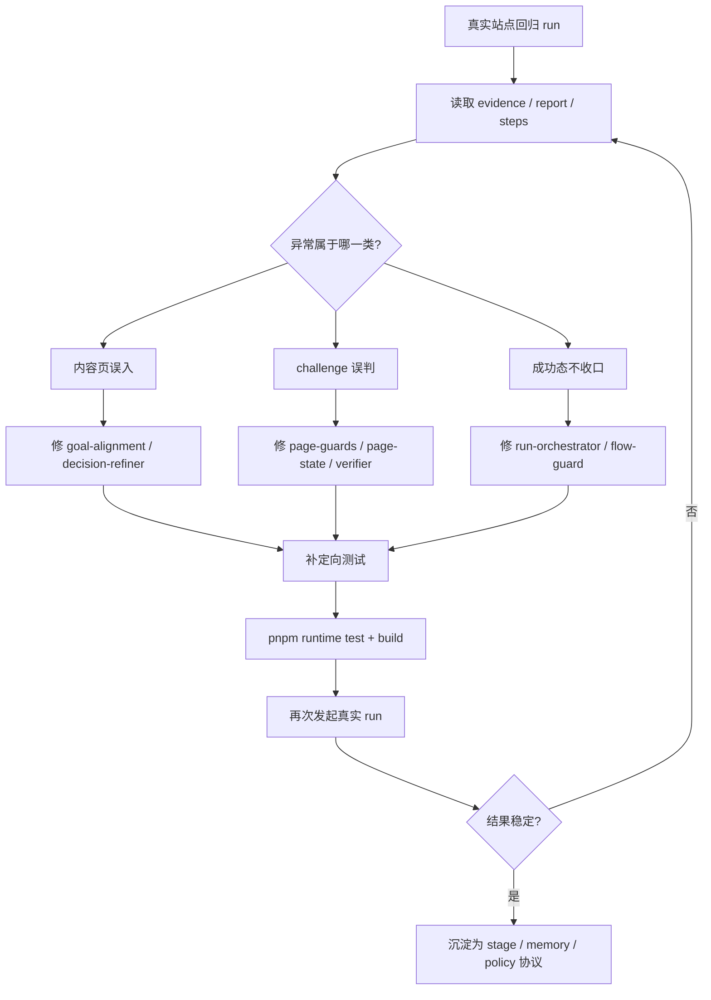
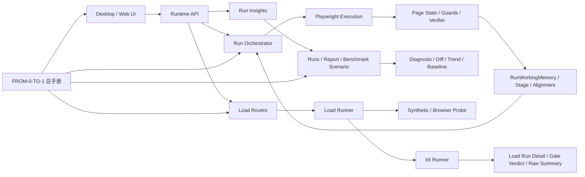

# Codex 增强版日报（2026-04-17，Asia/Shanghai）

## 0. 报告说明

- 统计窗口：`2026-04-17 00:00:00` 至 `2026-04-17 23:59:59`（Asia/Shanghai），等价于 UTC `2026-04-16T16:00:00Z` 至 `2026-04-17T15:59:59Z`。
- 数据来源：
  - `C:\Users\zjy\.codex\session_index.jsonl`
  - `C:\Users\zjy\.codex\sessions\2026\04\16\rollout-2026-04-16T15-55-51-019d954a-0b04-7e61-88ac-0e14c9b7a1cd.jsonl`
  - `C:\Users\zjy\.codex\sessions\2026\04\16\rollout-2026-04-16T10-56-38-019d9438-1acb-7562-9d37-3032a2a47724.jsonl`
  - 工作区证据目录 `C:\Users\zjy\QPilot-Studio\apps\runtime\data\artifacts\runs\*`
  - 工作区输出目录 `C:\Users\zjy\QPilot-Studio\output\*`
- 纳入标准：
  - 只纳入在统计窗口内有持续命令执行、代码或文档落盘、测试验证、设计决策输出的会话。
  - 已扫描本机可访问的 Codex 会话目录；命中统计窗口且有实质工作的会话只有 2 个。
  - 不纳入 2026-04-18 凌晨生成日报本身的自动化线程，也不纳入只有索引更新、没有实质工作的空会话。
- 当日有效会话数：`2`
- 主工作区 / 主仓库：`C:\Users\zjy\QPilot-Studio`
- 会话 runId：
  - 会话 A：`019d954a-0b04-7e61-88ac-0e14c9b7a1cd`
  - 会话 B：`019d9438-1acb-7562-9d37-3032a2a47724`

## 1. 总览摘要

2026-04-17 的主线不是“零碎修几个 bug”，而是把 `QPilot-Studio` 从“能跑一些真实站点和演示页面”的状态，往“可解释、可复盘、可扩展的平台”推了一大步。当天最关键的推进发生在运行时主链路：围绕“真实业务站点步骤 5 卡住、定位不准、到了目标页却不稳定判成功”这组连续问题，运行时从分散启发式修补，升级成共享的 `stage / alignment / workingMemory / action policy` 协议。解决的不是单个站点白名单，而是内容页误入、挑战页误判、成功态不收口、模块互相打架这四类系统性根因。

第二条主线是“把失败解释和回归判断产品化”。当天完成了 `RunDiagnosis / RunComparison / BenchmarkSummary` 后端分析内核，接着把 `RunsPage`、`ReportPage`、`RunDetailPage`、`BenchmarkScenarioPage` 串成一套能直接做判断的工作台：能看最近绿色基线、最近失败、首个分叉步、内联 diff、任意两次 run 对比、趋势窗口、状态筛选，并且可以从报告页或详情页一键 `Rerun And Compare`。这意味着团队开始能回答“为什么失败”“和上次哪里不一样”“现在该看哪个证据”，而不再只是拥有一堆截图和 HTML 报告。

第三条主线是平台能力外扩。白天先产出“整套测试平台”的蓝图和信息架构，明确压测不是外挂，而是新的执行平面；随后落成 `Load Studio MVP`，再推进到真实 `k6` 垂直切片，最后在当天 23:58 左右把本机 `k6` 也安装好并设置了用户级 `K6_BIN`。这使压测能力从“概念设计”推进到“代码链路可跑、环境阻塞只剩进程重启后补一次真实 smoke”。同一天还补齐了一份面向 Python 初学者的总手册 `docs/FROM-0-TO-1.zh-CN.md`，把项目从架构、通信、生命周期到 OCR/数据库/复刻路线一次性讲清，显著提高了后续 onboarding 和知识复盘效率。

## 2. 关键产出一览

### 2.1 运行时 / 调试修复

- 真实站点目标页对齐修复：
  - `C:\Users\zjy\QPilot-Studio\apps\runtime\src\orchestrator\goal-alignment.ts`
  - `C:\Users\zjy\QPilot-Studio\apps\runtime\src\orchestrator\decision-refiner.ts`
- challenge / 成功态边界修复：
  - `C:\Users\zjy\QPilot-Studio\apps\runtime\src\playwright\collector\page-guards.ts`
  - `C:\Users\zjy\QPilot-Studio\apps\runtime\src\playwright\collector\page-state.ts`
  - `C:\Users\zjy\QPilot-Studio\apps\runtime\src\playwright\verifier\basic-verifier.ts`
  - `C:\Users\zjy\QPilot-Studio\apps\runtime\src\orchestrator\general-flow-guard.ts`
  - `C:\Users\zjy\QPilot-Studio\apps\runtime\src\orchestrator\run-orchestrator.ts`
- 统一阶段语义、结构化 memory、动作裁剪：
  - `C:\Users\zjy\QPilot-Studio\packages\shared\src\schemas.ts`
  - `C:\Users\zjy\QPilot-Studio\apps\runtime\src\orchestrator\run-memory.ts`
  - `C:\Users\zjy\QPilot-Studio\apps\runtime\src\orchestrator\stage-action-policy.ts`
  - `C:\Users\zjy\QPilot-Studio\apps\runtime\src\llm\planner.ts`
  - `C:\Users\zjy\QPilot-Studio\apps\runtime\src\llm\planner-cache.ts`

### 2.2 Benchmark / 报告 / 分析能力

- 分析内核与接口：
  - `C:\Users\zjy\QPilot-Studio\apps\runtime\src\analytics\run-insights.ts`
  - `C:\Users\zjy\QPilot-Studio\apps\runtime\src\server\routes\runs.ts`
  - `C:\Users\zjy\QPilot-Studio\apps\web\src\lib\api.ts`
- 工作台与复盘页面：
  - `C:\Users\zjy\QPilot-Studio\apps\web\src\pages\RunsPage.tsx`
  - `C:\Users\zjy\QPilot-Studio\apps\web\src\pages\RunDetailPage.tsx`
  - `C:\Users\zjy\QPilot-Studio\apps\web\src\pages\ReportPage.tsx`
  - `C:\Users\zjy\QPilot-Studio\apps\web\src\pages\BenchmarkScenarioPage.tsx`
- 本地化与产品流 E2E：
  - `C:\Users\zjy\QPilot-Studio\apps\web\src\lib\evidence-i18n.ts`
  - `C:\Users\zjy\QPilot-Studio\apps\web\e2e\console-review.e2e.ts`

### 2.3 Load / 平台能力

- 测试平台蓝图与设计稿：
  - `C:\Users\zjy\QPilot-Studio\docs\testing-platform-blueprint.md`
  - `C:\Users\zjy\QPilot-Studio\apps\web\src\pages\PlatformBlueprintPage.tsx`
- Load Studio MVP 与详情链路：
  - `C:\Users\zjy\QPilot-Studio\apps\runtime\src\server\routes\load.ts`
  - `C:\Users\zjy\QPilot-Studio\apps\runtime\src\analytics\load-insights.ts`
  - `C:\Users\zjy\QPilot-Studio\apps\runtime\src\load\runner.ts`
  - `C:\Users\zjy\QPilot-Studio\apps\web\src\pages\LoadStudioPage.tsx`
  - `C:\Users\zjy\QPilot-Studio\apps\web\src\pages\LoadRunDetailPage.tsx`
- 真实 `k6` 垂直切片：
  - `C:\Users\zjy\QPilot-Studio\apps\runtime\src\load\k6-runner.ts`
  - `C:\Users\zjy\QPilot-Studio\apps\runtime\src\load\k6-parser.ts`
  - `C:\Users\zjy\QPilot-Studio\apps\runtime\src\db\schema.ts`
  - `C:\Users\zjy\QPilot-Studio\apps\runtime\src\db\migrate.ts`
  - `C:\Users\zjy\QPilot-Studio\apps\runtime\src\utils\mappers.ts`

### 2.4 文档 / 方法论

- 零基础总入口：
  - `C:\Users\zjy\QPilot-Studio\docs\FROM-0-TO-1.zh-CN.md`
- 入口关系重组：
  - `C:\Users\zjy\QPilot-Studio\docs\ARCHITECTURE.zh-CN.md`
  - `C:\Users\zjy\QPilot-Studio\docs\ARCHITECTURE-101.zh-CN.md`
  - `C:\Users\zjy\QPilot-Studio\docs\RUN-LIFECYCLE-101.zh-CN.md`
  - `C:\Users\zjy\QPilot-Studio\docs\DB-ORM-101.zh-CN.md`
  - `C:\Users\zjy\QPilot-Studio\docs\PAGE-DETECTION-101.zh-CN.md`

## 3. 按会话的时间线

### 会话 A：继续回归真实业务站点步骤5卡住与定位不准

- 线程名：`继续回归真实业务站点步骤5卡住与定位不准`
- 会话 runId：`019d954a-0b04-7e61-88ac-0e14c9b7a1cd`
- 时间跨度：`2026-04-17 00:01:09` 至 `2026-04-17 23:58:33`（Asia/Shanghai）
- 工作区：`C:\Users\zjy\QPilot-Studio`
- 会话强度：
  - `29` 次 `task_complete`
  - `761` 次 `exec_command_end`
  - `251` 次 `patch_apply_end`

#### 阶段 1：00:01 - 01:02，先把“搜索偏航”和“成功态不收口”收住

- 目标：解释并修复用户反复强调的“步骤 5 卡住 / 定位不准 / 明明进入邮箱还不结束”。
- 过程：
  - 直接回看真实 run 证据，重点分析 `dI37WuMob2FRQHuninEdV`、`DbaA_U3VHy5WhzSfDixYn`、`dsNB3wDrey8HVMurh-KK_`、`CdZXW55JIuy16F0EXotjD`、`gyYhXYy6nem_4_0aJStDt`。
  - 读取运行证据与报告文件，定位到搜索结果点击错链、误入问答页、授权中间态被误拉回搜索、成功态被早期失败残留拖死等问题。
  - 针对性修改 `goal-alignment.ts`、`decision-refiner.ts`、`page-guards.ts`、`page-state.ts`、`basic-verifier.ts`、`general-flow-guard.ts`、`run-orchestrator.ts`。
- 根因：
  - 系统把“文本里提到 QQ 邮箱或 mail.qq.com 的内容页”误当成“可执行入口页”。
  - challenge 识别中过度依赖正文软信号，应用壳页面里的“安全/验证码”文案会误触发阻塞。
  - orchestrator 结算时没有清掉前序可恢复失败，导致已经通过的 run 仍然被标成 `failed`。
- 结果：
  - 旧坏路径 `dI37WuMob2FRQHuninEdV` 证实此前确实会点到 `wenwen.sogou.com` 的“qq邮箱的正确书写格式”。
  - 修复后 `DbaA_U3VHy5WhzSfDixYn` 已能直接走到 QQ 邮箱入口；`gyYhXYy6nem_4_0aJStDt` 能在已登录壳页直接 `passed`。
  - 影响：主问题从“连入口都找不准”下降为“少量成功态和挑战页边界要统一协议化处理”，问题层级被成功抬高。

#### 阶段 2：01:20 - 11:05，把运行时从多套启发式收成统一协议

- 目标：从产品推广视角反推运行时内核，避免各模块“左右脑互搏”。
- 过程：
  - 先输出技术判断：系统不是缺功能，而是缺一致、可预测、可解释的共享语义。
  - 在 `packages/shared/src/schemas.ts` 引入 `RunStage`、`StepOutcome`、`RunWorkingMemory`、`GoalAlignmentStatus`、`StageTransitionReason`。
  - 在 `run-memory.ts` 中统一派生结构化 memory，在 `planner.ts` 和 `planner-cache.ts` 里让 planner 明确消费这份 memory。
  - 新增 `stage-action-policy.ts`，把 `security_challenge -> wait`、`wrong_target -> 回入口`、`authenticated_app + aligned -> 直接完成` 固化为执行前裁剪。
  - 最后把这套动作策略接入 `general flow` 和 `login flow`，不再只有普通流程有统一收束。
- 根因：
  - 旧系统里 `goal guard`、`run memory`、`planner/refiner`、`login flow`、`general flow` 各自维护一套判断标准。
  - 只靠自然语言 `observation` 传递状态，无法可靠复用到缓存键、状态迁移和动作裁剪。
- 结果：
  - 运行时形成了“感知 -> memory -> 规划 -> 动作策略 -> 执行 -> 验证”的共享合同。
  - 真实回归样本 `IEnDVyrWWD9Jvd5xI2NPg`、`yhgzRPRTDYhYgl7w6ETcm`、`9dKKDYq371tO4_OrpaOAl` 分别用来验证成功态、挑战态与策略裁剪边界。
  - 影响：后续 benchmark、对比分析、失败解释和回放修复都可以挂在同一套状态机上，不用再重复猜状态。

#### 阶段 3：11:11 - 12:29，把“失败解释”从页面附属物做成分析内核

- 目标：响应“如果要推广，先从技术解决问题”的要求，把 benchmark、对比和失败诊断真正变成产品能力。
- 过程：
  - 在 `apps/runtime/src/analytics/run-insights.ts` 做出 `buildRunDiagnosis`、`buildRunComparison`、`buildBenchmarkSummary`。
  - 在 `apps/runtime/src/server/routes/runs.ts` 暴露 `GET /api/benchmarks/summary`、`GET /api/runs/compare`、`GET /api/runs/:runId/diagnosis`、`POST /api/runs/:runId/rerun`。
  - `RunsPage.tsx` 新增 benchmark readiness 和场景卡；`ReportPage.tsx` 与 `RunDetailPage.tsx` 支持 `Rerun And Compare`。
- 根因：
  - 老系统虽然能落报告，但无法直接回答“为什么失败”“和谁比”“哪一步开始分叉”“接下来该看哪条 run”。
- 结果：
  - 链路从“看诊断”变成“看诊断 -> 一键重跑 -> 自动带对比”。
  - 影响：排障不再是靠人工拼证据，产品层开始具备面向客户的解释力和面向团队的回归力。

#### 阶段 4：13:17 - 14:18，跑完整产品流 E2E，再按真实体感补 UX 和本地化

- 目标：不靠主观判断，而是亲自走一遍真实产品台流程，找到最影响可信度的界面问题。
- 过程：
  - 编写并反复跑通 `apps/web/e2e/console-review.e2e.ts`，覆盖“失败回放 -> 重跑成功 -> diff 复盘 -> 中英文切换”。
  - 产出截图与观测文件：
    - `C:\Users\zjy\QPilot-Studio\output\e2e\console-review\screenshots\02-runs-benchmark.png`
    - `C:\Users\zjy\QPilot-Studio\output\e2e\console-review\screenshots\03-report-diff.png`
    - `C:\Users\zjy\QPilot-Studio\output\e2e\console-review\screenshots\04-run-detail-compare.png`
    - `C:\Users\zjy\QPilot-Studio\output\e2e\console-review\screenshots\05-run-detail-zh.png`
    - `C:\Users\zjy\QPilot-Studio\output\e2e\console-review\observations.json`
  - 依据真实体感，先修详情页终态不一致和信息堆叠，再把 `diagnosis / comparison / benchmark / raw evidence` 的动态摘要拉通到中文。
- 根因：
  - 之前界面存在“顶部已完成，下面仍说正在运行”的语义冲突。
  - 本地化只覆盖静态 UI，没有覆盖服务端生成的摘要和证据归纳。
- 结果：
  - `RunDetailPage.tsx` 加入“复盘模式 / 技术模式”，终态页面不再混用运行中语义。
  - `evidence-i18n.ts` 成为统一 helper，中文模式下动态结论和关键证据都可读。
  - 影响：这一步直接提高了产品面向外部演示和内部复盘时的可信度。

#### 阶段 5：14:29 - 16:37，把 benchmark 从“统计板”推进成“场景工作台”

- 目标：让 benchmark 不只汇总数字，而是能直接驱动判断与动作。
- 过程：
  - `RunsPage.tsx` 先补 `Needs Coverage / Needs Attention / Healthy Coverage` 分区与动作入口。
  - 再新增 `BenchmarkScenarioPage.tsx`，接入路由，形成独立场景详情页。
  - 持续追加 `Recent Trend`、趋势窗口切换、历史行内联 diff、状态筛选、任意两次 run 对比、`Swap runs` 等能力。
  - 同步扩展 `console-review.e2e.ts`，确保不是“静态页面看起来对”，而是产品流真的可操作。
- 根因：
  - 如果 benchmark 只能展示数字，团队仍然无法快速知道“下一步该干什么”。
- 结果：
  - benchmark 开始具备工作台属性：能选基线、看趋势、看首个分叉步、看完整 step change、看任意两次 run 差异。
  - 影响：产品从“有 benchmark 功能”提升到“benchmark 能指导团队日常回归节奏”。

#### 阶段 6：16:44 - 18:28，先做测试平台蓝图，再落 Load Studio MVP

- 目标：回应“做一整套测试平台”的要求，先统一信息架构，再落最小可用实现。
- 过程：
  - 先产出 `docs/testing-platform-blueprint.md` 与 `PlatformBlueprintPage.tsx`，明确 Control Tower、Functional Lab、Benchmark Workbench、Load Studio、Evidence Hub、Gate Center 六条主线。
  - 明确建议：`k6` 作为压测主引擎，Playwright 继续承担低并发高真实性探针。
  - 在 shared/runtime/web 三层接入 `LoadProfile / LoadRun / LoadStudioSummary`，形成 `Load Studio` 页面、`Load Run Detail` 页面、runtime 路由与 synthetic runner。
  - 顺带把 `App.tsx` 路由改成懒加载，收掉 `>500 kB` bundle warning。
- 根因：
  - 如果压测被设计成独立外挂，未来会形成与功能回归、benchmark、报告体系割裂的第二套平台。
- 结果：
  - 白天结束前，Load 平面已经不是文档构想，而是一条可创建 profile、发起 run、看 gate verdict 和详情的真实链路。
  - 影响：测试平台从单一浏览器 agent 产品，开始演进为多执行平面平台。

#### 阶段 7：23:42 - 23:58，推进真实 `k6` 垂直切片并补齐本机环境

- 目标：把 Load Studio 从 synthetic 演示推进成真实 `k6` 垂直切片。
- 过程：
  - shared/runtime/web 同步接入 `k6_http` engine、执行元数据、`rawSummaryPath`、明确失败语义。
  - 新增 `k6-runner.ts` 与 `k6-parser.ts`，detail 页开始展示 `Execution Source / Executor / k6 Version / Raw summary artifact / Execution Notes`。
  - 先通过代码层验证“没有 k6 时明确失败并给出 `hold`”；随后用户继续要求“能帮我装 k6 么”，于是执行安装与环境变量配置。
- 根因：
  - 在代码能力具备之前，阻塞是“功能未实现”；代码打通之后，阻塞转为“本机还没有 `k6` 二进制”。
- 结果：
  - 23:42 左右代码层已打通真实 `k6` 垂直切片。
  - 23:58 左右环境层完成：`C:\Program Files\k6\k6.exe` 安装完成，版本为 `k6.exe v1.7.1`，用户级 `K6_BIN` 已设为该路径。
  - 影响：剩余工作只是一轮进程重启后的真实 `k6 HTTP` smoke，而不是继续补系统代码。

### 会话 B：详细扩充MD架构文档与前后端通信说明

- 线程名：`详细扩充MD架构文档与前后端通信说明`
- 会话 runId：`019d9438-1acb-7562-9d37-3032a2a47724`
- 时间跨度：`2026-04-17 17:58:53` 至 `2026-04-17 18:32:39`（Asia/Shanghai）
- 工作区：`C:\Users\zjy\QPilot-Studio`
- 会话强度：
  - `2` 次 `task_complete`
  - `57` 次 `exec_command_end`
  - `4` 次 `patch_apply_end`

#### 阶段 1：17:58 - 18:32，做一份真正适合 Python 零基础读者的总手册

- 目标：用户明确指出“解释太少”，要求把 OCR 逻辑、整体架构、前后端通信、如何从 0 到 1 开发这个项目写成超级详细的完善文档。
- 过程：
  - 先系统核对仓库真实结构，确认 Python 入口、OCR 使用位置、`desktop / web / runtime` 分层、`REST / SSE / WebSocket` 通信关系、ORM/SQLite/Drizzle 存储、一次 run 的完整生命周期。
  - 然后直接按计划落成 `docs/FROM-0-TO-1.zh-CN.md`，把“项目现在如何工作”和“如果自己从 0 复刻一个简化版并逐步长成当前架构”写在同一份总文档里。
  - 同步修改 `ARCHITECTURE.zh-CN.md`、`ARCHITECTURE-101.zh-CN.md`、`RUN-LIFECYCLE-101.zh-CN.md`、`DB-ORM-101.zh-CN.md`、`PAGE-DETECTION-101.zh-CN.md`，都改成“先读总手册”的入口关系。
- 根因：
  - 旧文档默认读者已经理解前后端工程分层，只适合专题深挖，不适合零基础 onboarding。
  - 当解释停留在分散专题里时，读者难以建立完整地图，就算单篇写得对，也很难真正学会。
- 结果：
  - `docs/FROM-0-TO-1.zh-CN.md` 成为新的总入口文档。
  - 这次只修改文档，没有改业务代码；业务测试不适用，文档自检为主。
  - 影响：项目知识第一次被整理成适合初学者进入、团队培训、日后复盘和复刻路线讨论的系统材料。

## 4. 命令、测试与验证结论

- 统计摘要：
  - 总计检出 `818` 次命令执行、`255` 次补丁落盘、`31` 次完成态任务。
  - 其中高频验证类命令包括：`19` 次 runtime 定向测试、`20` 次 runtime build、`26` 次 web build、`24` 次 web E2E、`8` 次 `tsc --noEmit`、`17` 次真实 runtime 回归 run 调用、`10` 次与 `k6` 安装/探测相关命令。
  - 检出 `55` 次非零退出命令，但大多数属于排查过程中的路径探测失败、初次 E2E/测试重跑、早期 smoke 样本中止，不是最终阻塞。

### 4.1 运行时修复与真实回归

```powershell
pnpm --filter @qpilot/runtime test -- src/tests/decision-refiner.test.ts src/tests/general-flow-guard.test.ts
pnpm --filter @qpilot/runtime test -- src/tests/verifier.test.ts src/tests/page-state.test.ts src/tests/page-guards.test.ts src/tests/decision-refiner.test.ts src/tests/general-flow-guard.test.ts src/tests/goal-alignment.test.ts
pnpm --filter @qpilot/runtime test -- src/tests/run-memory.test.ts src/tests/planner-cache.test.ts src/tests/decision-refiner.test.ts src/tests/goal-alignment.test.ts src/tests/stage-action-policy.test.ts
pnpm --filter @qpilot/runtime build
Invoke-RestMethod -Uri 'http://127.0.0.1:8787/api/runs' -Method Post ...
Invoke-WebRequest -UseBasicParsing "http://127.0.0.1:8787/api/runs/$runId"
Invoke-RestMethod -Uri 'http://127.0.0.1:8787/api/runs/<runId>/abort' -Method Post
```

结论：
- 运行时不是只做静态推理，而是“改一轮 -> 跑真实 run -> 回看 evidence -> 再改一轮”的闭环。
- 代表性 runId：
  - 坏样本：`dI37WuMob2FRQHuninEdV`
  - 修复后正确入口：`DbaA_U3VHy5WhzSfDixYn`
  - challenge 阻塞样本：`dsNB3wDrey8HVMurh-KK_`
  - 成功态修复前遗留：`CdZXW55JIuy16F0EXotjD`
  - 成功态修复后通过：`gyYhXYy6nem_4_0aJStDt`
  - 统一协议回归样本：`IEnDVyrWWD9Jvd5xI2NPg`、`yhgzRPRTDYhYgl7w6ETcm`、`9dKKDYq371tO4_OrpaOAl`
- 失败命令里有一部分来自早期 smoke 样本中止和初次测试未绿，这属于研发过程中的业务回归与收敛，不是环境噪音。

### 4.2 Benchmark / 报告 / 产品流验证

```powershell
pnpm --filter @qpilot/web exec tsc --noEmit
pnpm --filter @qpilot/web build
pnpm --filter @qpilot/web test:e2e
node --loader ./apps/runtime/node_modules/ts-node/esm.mjs ./apps/web/e2e/console-review.e2e.ts
```

结论：
- `RunsPage`、`RunDetailPage`、`ReportPage`、`BenchmarkScenarioPage` 的新增能力经过了真实产品流 E2E，而不是只依赖 build 通过。
- E2E 在当天中途有多次失败后转绿，表明体验优化是边实现边体感验证的过程，最终不是“看起来合理”，而是“链路可跑通”。
- 关键产物已经落到：
  - `C:\Users\zjy\QPilot-Studio\output\e2e\console-review\screenshots\02-runs-benchmark.png`
  - `C:\Users\zjy\QPilot-Studio\output\e2e\console-review\screenshots\02b-benchmark-scenario-detail.png`
  - `C:\Users\zjy\QPilot-Studio\output\e2e\console-review\screenshots\02c-benchmark-inline-diff.png`
  - `C:\Users\zjy\QPilot-Studio\output\e2e\console-review\screenshots\05-run-detail-zh.png`
  - `C:\Users\zjy\QPilot-Studio\output\e2e\console-review\screenshots\06-report-diff-zh.png`

### 4.3 Load Studio 与真实 `k6`

```powershell
pnpm --filter @qpilot/runtime test -- src/tests/load-insights.test.ts src/tests/k6-parser.test.ts src/tests/load-runner.test.ts
pnpm --filter @qpilot/runtime build
pnpm --filter @qpilot/web build
Get-Command k6
winget search k6
winget install --id GrafanaLabs.k6 -e --accept-package-agreements --accept-source-agreements
& 'C:\Program Files\k6\k6.exe' version
[Environment]::SetEnvironmentVariable('K6_BIN','C:\Program Files\k6\k6.exe','User')
```

结论：
- 代码层在安装 `k6` 之前已经具备真实引擎支持，并且能在缺失二进制时明确返回失败语义，不会静默回退。
- 环境层在当天 23:58 左右补齐，`k6.exe v1.7.1` 已验证通过，`K6_BIN` 已写入用户环境变量。
- 当前剩余的不是开发问题，而是运行时进程刷新问题：需要重启 runtime / Codex 线程后补跑真实 `k6 HTTP` smoke。

### 4.4 文档会话验证

```powershell
Get-Content docs/ARCHITECTURE.zh-CN.md -Raw
Get-Content docs/PAGE-DETECTION-101.zh-CN.md -Raw
Get-Content apps/runtime/src/playwright/executor/action-executor.ts -Raw
Get-Content apps/runtime/src/server/routes/runs.ts -Raw
```

结论：
- 文档会话的核心验证手段是“按源码核对事实”和“检查入口关系是否闭环”，业务测试不适用。
- 这类命令失败为 `无`；当天文档线程没有环境阻塞，主要工作是结构重写和入口归并。

## 5. 解决的问题与根因

- 问题：搜索结果偏航到问答页或教程页。
  - 表现：run 能搜到“相关页面”，却点击到 `wenwen.sogou.com` 之类内容页，后续动作越来越偏。
  - 根因：系统把“语义相关”错误等同于“可执行入口”，缺少对官网入口、登录入口、目标动作意图的结构化偏好。
  - 解决方式：重写 `goal-alignment.ts` 和 `decision-refiner.ts`，引入内容页识别、动作型目标偏好、错误 host 收紧。
  - 影响：从站点白名单修补转向通用目标页判断，后续能复用于更多真实站点。

- 问题：挑战页与成功态边界混乱。
  - 表现：已经进入邮箱壳页仍被当成 `security_challenge`，或在成功后仍继续执行登录动作。
  - 根因：challenge 检测中过度依赖正文软信号，成功态与结算态没有统一收口。
  - 解决方式：同步修 `page-guards.ts`、`page-state.ts`、`basic-verifier.ts`、`general-flow-guard.ts`、`run-orchestrator.ts`。
  - 影响：成功态识别不再只是“页面看起来对”，而是能真正终止 run 并产出稳定结果。

- 问题：planner、refiner、memory、guard 各说各话。
  - 表现：同一页面会出现 planner 想继续、verifier 想结束、goal guard 想重定向的冲突，形成“左右脑互搏”。
  - 根因：缺少共享的结构化状态机和 working memory，模块之间只靠文本 observation 松散传话。
  - 解决方式：引入 `RunStage`、`StepOutcome`、`RunWorkingMemory`、`GoalAlignmentStatus`、`StageTransitionReason`，并新增 `stage-action-policy.ts`。
  - 影响：系统从“多个启发式叠加”升级为“统一状态协议驱动”，维护性和可解释性显著提升。

- 问题：benchmark 有数据，但不能指导动作。
  - 表现：页面能显示场景数、通过率、平均步数，但很难立即知道该重跑谁、该和谁对比、第一处差异在哪。
  - 根因：缺少分析内核、对比接口、场景详情页、内联 diff 和基线选择逻辑。
  - 解决方式：实现 `RunDiagnosis / RunComparison / BenchmarkSummary`，并在 `RunsPage`、`RunDetailPage`、`ReportPage`、`BenchmarkScenarioPage` 完成联动。
  - 影响：benchmark 从“汇报板”进化为“工作台”，适合团队日常复盘和推广展示。

- 问题：本地化停留在静态 UI 层。
  - 表现：切到中文后，导航是中文，但动态诊断、对比摘要和原始证据归纳仍是英文或中英混杂。
  - 根因：语言切换只作用于前端静态字典，没有统一翻译和归纳层。
  - 解决方式：新增 `evidence-i18n.ts`，让 `diagnosis / comparison / benchmark / raw evidence` 的人话摘要跟随当前语言。
  - 影响：产品演示和真实复盘体验更完整，中文用户不再只获得“半翻译”界面。

- 问题：Load Studio 之前只有 MVP，没有真实压测切片。
  - 表现：能创建 load profile 和 synthetic run，但无法接真实 `k6` 引擎。
  - 根因：shared schema、runtime runner、parser、详情页和本机 `k6` 环境缺一不可，之前同时缺失。
  - 解决方式：白天先做蓝图和 MVP，夜间完成 `k6_http` 垂直切片，再安装本机 `k6` 并设置 `K6_BIN`。
  - 影响：压测能力从概念设计进入可执行阶段，平台边界明显外扩。

- 问题：知识材料不适合零基础读者。
  - 表现：文档分散在架构、生命周期、页面检测、数据库等专题里，初学者不知道先读什么，也不知道这些专题如何串起来。
  - 根因：旧文档默认读者已有工程化背景，不适合作为统一入口。
  - 解决方式：新增 `docs/FROM-0-TO-1.zh-CN.md`，并把现有专题文档重新定位为延伸阅读。
  - 影响：知识传递从“专题堆积”升级为“总入口 + 专题延伸”的体系，后续 onboarding 成本下降。

## 6. 流程图与结构图

### 6.1 运行时排障闭环



这张图强调，昨天的运行时修复不是“看到现象就打补丁”，而是完整的证据驱动闭环。真正高价值的部分不是单次修复，而是把有效判断继续抽象成共享协议，减少同类问题反复出现。

### 6.2 昨日形成的平台结构



这张图表达的是“平台形态”的变化。昨天不只是多了几个页面，而是浏览器 agent 主链路、benchmark/报告分析链路、load/k6 执行链路和知识入口开始被组织进同一个系统里。

## 7. 知识整理

### 7.1 DOM 优先，OCR 兜底

- 概念解释：项目不是“默认靠 OCR 操作页面”，而是优先用 DOM、结构化元素、URL、标题、可见文本和验证信号做定位；OCR 是在结构化信号不足时的兜底层。
- 为什么重要：如果误把 OCR 当主流程，就会错误理解系统复杂度和稳定性来源，也会在文档或架构上做出错误判断。
- 关联部分：
  - `C:\Users\zjy\QPilot-Studio\apps\runtime\src\playwright\executor\action-executor.ts`
  - `C:\Users\zjy\QPilot-Studio\apps\runtime\src\playwright\ocr\visual-targeting.ts`

### 7.2 Goal Alignment 不等于关键词相关性

- 概念解释：`GoalAlignment` 要回答的是“当前页是不是目标流程的正确落点”，不是“当前页是否提到了目标品牌词”。
- 为什么重要：这正是昨天内容页误入问题的根因。内容页可以高度相关，但没有下一步业务动作能力。
- 关联部分：
  - `C:\Users\zjy\QPilot-Studio\apps\runtime\src\orchestrator\goal-alignment.ts`
  - `C:\Users\zjy\QPilot-Studio\apps\runtime\src\orchestrator\decision-refiner.ts`

### 7.3 RunWorkingMemory 的真正价值

- 概念解释：`RunWorkingMemory` 是 planner、refiner、orchestrator、flow guard 共享的结构化上下文，内含 `stage / alignment / transitionReason / outcome` 等信息。
- 为什么重要：自然语言 observation 适合给人看，不适合给多模块一致消费。只有结构化 memory 才能进入缓存键、动作裁剪、测试断言和统一诊断。
- 关联部分：
  - `C:\Users\zjy\QPilot-Studio\packages\shared\src\schemas.ts`
  - `C:\Users\zjy\QPilot-Studio\apps\runtime\src\orchestrator\run-memory.ts`
  - `C:\Users\zjy\QPilot-Studio\apps\runtime\src\llm\planner.ts`
  - `C:\Users\zjy\QPilot-Studio\apps\runtime\src\llm\planner-cache.ts`

### 7.4 Stage Action Policy 的位置

- 概念解释：`stage-action-policy` 不替代 planner，而是在 planner/refiner 之后、动作真正执行之前，按共享状态机做最后一层硬裁剪。
- 为什么重要：它能在系统已经知道当前是 `wrong_target`、`security_challenge`、`authenticated_app + aligned` 时，阻止明显错误的动作继续执行。
- 关联部分：
  - `C:\Users\zjy\QPilot-Studio\apps\runtime\src\orchestrator\stage-action-policy.ts`
  - `C:\Users\zjy\QPilot-Studio\apps\runtime\src\orchestrator\run-orchestrator.ts`

### 7.5 Benchmark 不该只是报表

- 概念解释：高价值 benchmark 不是只报通过率，而是围绕“基线是谁、最近失败是谁、哪里开始分叉、现在该点哪个动作”组织排障入口。
- 为什么重要：只有这样 benchmark 才能服务开发节奏，而不只是管理层汇报。
- 关联部分：
  - `C:\Users\zjy\QPilot-Studio\apps\runtime\src\analytics\run-insights.ts`
  - `C:\Users\zjy\QPilot-Studio\apps\web\src\pages\RunsPage.tsx`
  - `C:\Users\zjy\QPilot-Studio\apps\web\src\pages\BenchmarkScenarioPage.tsx`

### 7.6 为什么 `k6` 要作为新执行平面接入

- 概念解释：昨天的设计不是做一个独立压测外挂，而是让 `k6` 成为与浏览器回归并列的执行平面，共享 profile、run、detail、gate 和解释体系。
- 为什么重要：如果压测链路独立，平台会形成两套入口、两套结果解释、两套历史数据，长期会很难维护。
- 关联部分：
  - `C:\Users\zjy\QPilot-Studio\apps\runtime\src\server\routes\load.ts`
  - `C:\Users\zjy\QPilot-Studio\apps\runtime\src\load\k6-runner.ts`
  - `C:\Users\zjy\QPilot-Studio\apps\web\src\pages\LoadStudioPage.tsx`
  - `C:\Users\zjy\QPilot-Studio\apps\web\src\pages\LoadRunDetailPage.tsx`

### 7.7 面向初学者的文档方法论

- 概念解释：对零基础读者，正确文档形态不是继续散写专题，而是“先给总地图，再给延伸阅读”。
- 为什么重要：初学者卡住的常常不是某个 API，而是不知道 desktop/web/runtime、REST/SSE/WebSocket、OCR、数据库、生命周期之间如何拼起来。
- 关联部分：
  - `C:\Users\zjy\QPilot-Studio\docs\FROM-0-TO-1.zh-CN.md`
  - `C:\Users\zjy\QPilot-Studio\docs\ARCHITECTURE.zh-CN.md`

## 8. 自测问答

### 1. 为什么页面里出现 “QQ邮箱” 或 “登录” 等关键词，仍然不能说明它就是正确目标页？

参考答案：
因为“语义相关”不等于“可执行入口”。问答页、教程页、格式说明页同样可能高频出现这些词，但它们并不能完成业务目标。昨天搜索偏航的根因就是把“提到了目标”误判成“就是目标入口”。

### 2. 为什么昨天要引入 `RunWorkingMemory`，而不是继续在 observation 文本里堆更多描述？

参考答案：
因为 observation 文本更适合给人看，不适合让多个模块稳定复用。结构化 memory 能进缓存键、状态迁移、动作裁剪、测试断言和统一诊断，避免每个模块都重新猜一次状态。

### 3. `stage-action-policy` 解决的核心问题是什么？

参考答案：
它解决的不是“让 planner 更聪明”，而是“在执行前做统一裁剪”。当系统已经知道当前是 `wrong_target`、`security_challenge` 或 `authenticated_app + aligned` 时，这一层会阻止明显错误的动作继续执行。

### 4. 为什么修成功态误判时，除了 verifier 还必须改 orchestrator？

参考答案：
因为 verifier 只负责判断“当前页是否通过”，而 orchestrator 决定“整次 run 如何结算”。如果 orchestrator 不清理前序可恢复失败，即使最后页面已通过，整次 run 仍可能被历史状态拖成 `failed`。

### 5. 为什么 benchmark 一定要支持“最近绿色基线”和“任意两次 run 对比”？

参考答案：
因为回归判断本质上是比较问题。没有基线，就不知道当前是恢复、退化还是正常波动；不能自由切换对比对象，就难以定位历史上真正开始分叉的时刻。

### 6. 为什么昨天的产品流 E2E 比单纯 build 通过更重要？

参考答案：
build 只能证明代码可编译，不能证明用户真的能顺着产品路径完成“看诊断 -> 重跑 -> 对比 -> 复盘 -> 切语言”。昨天的多轮 E2E 证明的是完整产品流可用，而不是局部页面可渲染。

### 7. 为什么 `k6` 要做成平台内执行平面，而不是一个独立工具页？

参考答案：
因为如果压测是外挂，就无法共享项目、历史、证据、gate verdict、对比和诊断逻辑。做成平台执行平面后，浏览器回归和压测结果才能被统一复盘。

### 8. `k6` 已安装完成，为什么当天还没有完成真实 `k6 HTTP` smoke？

参考答案：
因为 `K6_BIN` 写入的是用户环境变量，安装发生在当天最后阶段，当前运行中的 runtime / Codex 进程还没有刷新环境。代码和环境都已就绪，剩余动作只是重启相关进程后补跑一次 smoke。

## 9. 未完成事项与后续建议

### 9.1 代码后续

- 重启 runtime / Codex 线程后，立刻补一条真实 `k6 HTTP` smoke，验证 `K6_BIN` 生效后的完整执行链。
- 把 `stage-action-policy` 继续接入 replay/template flow，避免统一协议只覆盖 general flow 和 login flow。
- 为 `LoadRunDetailPage` 增加时间序列图、profile 对比和更明确的执行失败剖面。

### 9.2 产品 / 平台后续

- benchmark 场景页继续补“固定基线 pin/备注”“常用 compare pair 持久化”“更细粒度趋势筛选”。
- 把 `RunDiagnosis` 的解释风格扩展到 load 结果页，形成跨执行平面的统一复盘体验。
- 按 `testing-platform-blueprint.md` 继续把平台收敛为统一测试控制台，而不是功能列表。

### 9.3 文档 / 知识管理后续

- 今后凡是运行时主链路发生语义变更，都优先同步 `docs/FROM-0-TO-1.zh-CN.md`，再补专题文档。
- 可以单独沉淀两份长期文档：一份“统一状态机/阶段迁移表”，一份“真实站点 benchmark 规范”。
- 对新增平台能力继续沿用“总入口 + 专题延伸”的写法，避免知识再次碎片化。

## 10. 给用户的复盘建议

- 先读第 5 节“解决的问题与根因”，确认自己能用一句话解释每个问题为什么发生，再回头看文件路径。
- 再看第 6 节两张图，把“运行时排障闭环”和“平台结构变化”在脑中建立起来，这比记住某个 patch 更重要。
- 做完第 8 节自测问答后，再打开 `goal-alignment.ts`、`run-memory.ts`、`stage-action-policy.ts`、`run-insights.ts`、`k6-runner.ts`，理解效率会高很多。
- 如果要安排下一轮任务，不要先扩新功能，先把“真实 `k6 HTTP` smoke”作为验收动作跑完。
- 如果要带新人或向外部讲项目，优先从 `docs/FROM-0-TO-1.zh-CN.md` 进入，不要让对方先在专题文档之间自己猜顺序。
