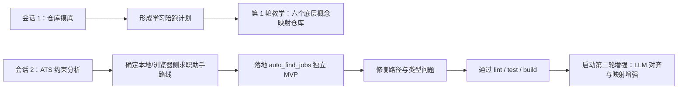
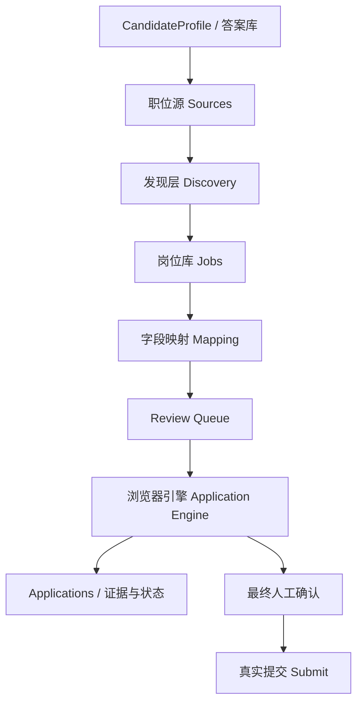

# Codex 增强版日报（2026-04-18，Asia/Shanghai）

## 0. 报告说明

- 统计窗口：`2026-04-18 00:00:00` 至 `2026-04-18 23:59:59`（`Asia/Shanghai`）。
- 数据来源：
  - `C:\Users\zjy\.codex\session_index.jsonl`
  - `C:\Users\zjy\.codex\sessions\2026\04\18\rollout-2026-04-18T11-31-35-019d9ea4-d24b-7953-b5f6-407a2c338637.jsonl`
  - `C:\Users\zjy\.codex\sessions\2026\04\18\rollout-2026-04-18T22-39-28-019da108-4ade-7311-945c-d2f5b6397b3c.jsonl`
- 纳入标准：只纳入有实质工作的会话，要求至少满足以下之一：有代码实现、有调试修复、有明确设计决策、有系统性知识讲解/方法论输出。
- 排除说明：当天索引里共有 8 个会话落在统计窗口内，其中 6 个为“昨日 Codex 日报”自动化会话，仅用于生成上一日报，未纳入本报告。
- 当日有效会话数：`2`
- 主工作区 / 主仓库：
  - 主仓库：`C:\Users\zjy\QPilot-Studio`
  - 子工作区：`C:\Users\zjy\QPilot-Studio\auto_find_jobs`

## 1. 总览摘要

这一天的推进可以分成两条主线。第一条主线是“把复杂仓库讲清楚”，在 `QPilot-Studio` 根仓库里完成了一次从零到一的学习陪跑设计：先扫描 monorepo、主应用、共享包和现有中文架构文档，再基于用户“会一点 Python、希望被详细讲懂”的前提，产出学习计划，并正式完成第 1 轮讲解，把“文件、目录、路径、程序、进程、服务”六个底层概念映射回当前仓库。它解决的问题不是代码缺陷，而是认知门槛过高导致的理解阻塞。

第二条主线是“把本地求职助手 MVP 从架构落到可运行代码”。晚间在 `auto_find_jobs` 子工作区里，先做出一个关键设计判断：公开 ATS 接口适合拿来发现职位，但不适合代替真实申请，因此产品必须坚持“公开接口找岗，浏览器自动化投递，本地人工确认提交”的路线。这个判断直接决定了系统边界、数据模型和交互方式。随后在同一自然日内落地了独立的 `Fastify + React/Vite + SQLite + Playwright` 子应用，补齐了 5 个页面、发现层、映射层、浏览器适配器、运行时和本地数据层，并在午夜前完成 `lint -> test -> build` 基线验证。

需要特别说明的是，这个 `auto_find_jobs` 会话在本地时间 `2026-04-18 23:51` 又开启了下一轮“LLM 配置对齐 + 字段映射增强 + E2E 闭环”改造，但该轮在 `2026-04-18 23:59:59` 前尚未完成验证。报告只纳入这一天实际发生且可证实的部分，不把 `2026-04-19` 凌晨的后续结果提前记入。

## 2. 关键产出一览

### 运行时 / 调试修复

- 修复了 `auto_find_jobs` 首次落盘时的两个关键工程问题：
  - Windows 上大补丁一次性写入失败，暴露为“文件名或扩展名太长”，随后改为分批分层写入。
  - 文件错误写入 `auto_find_jobs/auto_find_jobs/`，导致 `pnpm --filter @qpilot/auto-find-jobs lint` 最初找不到 package；随后通过复制回根层、更新 workspace 配置、删除嵌套目录完成修正。
- 修复了首次类型检查失败：
  - `src/browser/application-engine.ts`
  - `src/server/db.ts`
  - `src/client/pages/ProfilePage.tsx`
- 代表性文件路径：
  - `C:\Users\zjy\QPilot-Studio\auto_find_jobs\src\browser\application-engine.ts`
  - `C:\Users\zjy\QPilot-Studio\auto_find_jobs\src\server\db.ts`
  - `C:\Users\zjy\QPilot-Studio\auto_find_jobs\src\client\pages\ProfilePage.tsx`
  - `C:\Users\zjy\QPilot-Studio\package.json`
  - `C:\Users\zjy\QPilot-Studio\pnpm-workspace.yaml`

### Benchmark / 报告 / 分析能力

- 无。
- 当天没有新增 benchmark、性能报表或分析面板能力。

### Load / 平台能力

- 新建独立子应用 `@qpilot/auto-find-jobs`，并明确不与现有 cockpit 共享运行态数据。
- 完成了四层实现骨架：
  - 候选人资料与答案库：`src/domain/schemas.ts`、`src/server/db.ts`
  - 职位发现：`src/domain/discovery.ts`
  - 字段映射：`src/domain/mapping.ts`
  - 浏览器投递：`src/browser/application-engine.ts`、`src/browser/adapters/greenhouse.ts`、`src/browser/adapters/lever.ts`
- 完成了五页工作台：
  - `Profile`
  - `Sources`
  - `Jobs`
  - `Review Queue`
  - `Applications`
- 代表性文件路径：
  - `C:\Users\zjy\QPilot-Studio\auto_find_jobs\package.json`
  - `C:\Users\zjy\QPilot-Studio\auto_find_jobs\src\server\app.ts`
  - `C:\Users\zjy\QPilot-Studio\auto_find_jobs\src\server\services\runtime.ts`
  - `C:\Users\zjy\QPilot-Studio\auto_find_jobs\src\client\App.tsx`
  - `C:\Users\zjy\QPilot-Studio\auto_find_jobs\src\client\styles.css`

### 文档 / 方法论

- 产出了一套“从 0 到 1 学习陪跑计划”，并完成第 1 轮教学输出。
- 方法论重点不是抽象讲概念，而是把基础概念和真实仓库对照起来，降低入门门槛。
- 讲解时重点利用了现有文档资产：
  - `C:\Users\zjy\QPilot-Studio\docs\FROM-0-TO-1.zh-CN.md`
  - `C:\Users\zjy\QPilot-Studio\docs\FOUNDATIONS-101.zh-CN.md`
  - `C:\Users\zjy\QPilot-Studio\docs\ARCHITECTURE-101.zh-CN.md`
- 当天没有新增文档文件，但有明确的知识结构化输出。

## 3. 按会话的时间线

### 会话 1：从零详细讲解项目架构并分步带你实践入门

- 会话 ID：`019d9ea4-d24b-7953-b5f6-407a2c338637`
- 时间跨度：`2026-04-18 11:33:14` 至 `2026-04-18 12:09:40`（`Asia/Shanghai`）
- 工作区：`C:\Users\zjy\QPilot-Studio`
- 相关 turn / runId：
  - `019d9ea6-3d95-7982-a732-0f762033f8d8`
  - `019d9ec6-b999-7cd2-892c-bed99c1ed03c`

阶段 1：11:33-11:55，摸清仓库与用户起点

- 目标：在不改代码的前提下，先建立“适合用户当前基础的讲解主线”，避免一上来就陷入术语堆砌。
- 过程：
  - 扫描根仓库结构、`apps`、`packages`、`infra`、`docs`。
  - 读取 `README.md`、根 `package.json`、`apps/runtime`、`apps/web`、`apps/desktop` 的包信息与入口文件。
  - 核对现有中文文档，确认仓库里已经有基础教材和架构教材。
  - 通过 `request_user_input` 锁定用户基础为“会一点 Python”，学习策略为“先补地基，再进项目”。
- 根因：
  - 项目本身是 monorepo，既有桌面端、Web、runtime、自动化与共享包，直接讲业务流程会让新手失去定位感。
  - 用户需求不是“看一眼结构图”，而是“每轮都要讲懂并让其练习”，因此必须先定义教学框架。
- 结果：
  - 形成“先地基、再系统边界、再一次 run 的链路、最后关键设计原因”的多轮学习计划。

阶段 2：12:08-12:09，正式交付第 1 轮讲解

- 目标：用仓库里的真实文件路径，把六个最基础概念讲清楚。
- 过程：
  - 把 `文件 / 目录 / 路径 / 程序 / 进程 / 服务` 六个概念逐一定义。
  - 将概念映射到 `README.md`、`package.json`、`apps/runtime/src/server.ts` 等真实路径。
  - 将 monorepo 的目录划分与“服务运行起来之后才形成系统行为”这一点讲清楚。
- 根因：
  - 新手最容易混淆的是“代码文件”和“运行中的系统”不是同一个层次。
  - 如果不先建立这种层次感，后面解释 runtime、Web、Playwright、SQLite 的协作会全部失焦。
- 结果：
  - 当轮完成了一次真正可执行的入门教学输出，而不是空泛路线图。
  - 这为后续继续讲“为什么 Web 不能直接点浏览器，必须经过 runtime”打下了语义基础。

### 会话 2：设计公开接口抓岗与浏览器自动投递架构

- 会话 ID：`019da108-4ade-7311-945c-d2f5b6397b3c`
- 时间跨度（纳入窗口内）：`2026-04-18 22:39:46` 至 `2026-04-18 23:59:43`（`Asia/Shanghai`）
- 工作区：`C:\Users\zjy\QPilot-Studio\auto_find_jobs`
- 相关 turn / runId：
  - `019da108-79e1-7471-b2ed-e63bc476d279`
  - `019da114-101e-71c2-955e-3ebe8fdb8f4e`
  - `019da13d-4f45-7c30-a3ea-1fb2a4f6a600`
  - `019da149-e263-7412-bd7f-93bc65a9656a`（仅统计到 23:59:59，未完成部分不计入最终验证）

阶段 1：22:39-22:49，确定产品边界与系统拆分

- 目标：先回答“这个产品到底能不能靠 ATS API 直接完成正式投递”，再决定架构。
- 过程：
  - 读取用户给出的 Greenhouse / Lever 约束。
  - 对照主仓库现有能力，判断哪些复用、哪些隔离。
  - 最终把系统拆成四层：候选人资料中心、职位发现层、表单理解与映射层、浏览器投递引擎。
- 根因：
  - ATS 的公开接口适合读取职位，不适合代表求职者完成正式申请；正式提交通常依赖公司侧密钥、权限或页面动态问题。
  - 一旦误把“找岗”和“投递”都建在 API 上，产品会在权限和字段覆盖率上立刻失真。
- 结果：
  - 决策为“本地/浏览器侧求职助手”，而不是“云端代投平台”。
  - 这一步决定了后面必须坚持人工确认、证据保留和浏览器本地执行。

阶段 2：22:52-23:28，落地独立 MVP 子应用

- 目标：在 `auto_find_jobs/` 下搭起一个可编译、可测试、可继续扩展的独立应用。
- 过程：
  - 建立目录骨架：`src/server`、`src/client`、`src/domain`、`src/browser`、`data`。
  - 新增 package、tsconfig、Vite 入口、Fastify 入口、SQLite 初始化与运行目录配置。
  - 写出 Greenhouse / Lever 发现与适配器、浏览器引擎、运行时服务、五页 UI。
  - 接回根仓库 `package.json`、`pnpm-workspace.yaml` 与 `.gitignore`。
  - 修复落盘和类型错误后，完成首次 `lint -> test -> build`。
- 根因：
  - 用户要求“与现有 QPilot cockpit 分开运行和存储”，所以不能简单塞进已有 `apps/runtime`。
  - 但又希望复用 monorepo 工具链，因此最稳妥的做法是“同仓隔离的新 package”，而不是新仓库。
- 结果：
  - 子应用 `@qpilot/auto-find-jobs` 在当天已具备独立运行基础。
  - 截止 `23:28`，已经验证类型检查、单测与构建链路能跑通。

阶段 3：23:37-23:46，做 LLM 对齐与 E2E 差距分析

- 目标：在继续增强之前，先回答“和 QPilot 主项目比，auto_find_jobs 还差什么”。
- 过程：
  - 对照 `apps/runtime/src/config/env.ts`、`apps/runtime/src/llm/planner.ts`。
  - 重新检查 `auto_find_jobs/src/server/config.ts`、`src/domain/mapping.ts`、`src/browser/application-engine.ts`。
  - 查看现有 `apps/web/e2e` 的脚本式 Playwright 用法。
- 根因：
  - 先做出可运行 MVP 后，下一步瓶颈已经从“有没有应用”变成“LLM 配置是否稳定、字段映射是否保守、多步表单能否续跑、E2E 是否能闭环”。
- 结果：
  - 明确识别出四个缺口：
    - `env` 加载方式尚未与主 runtime 对齐
    - 映射器仍偏简化，缺少结构化 JSON 输出与严格校验
    - `prepare` 更偏第一页字段抽取，多步表单能力仍有限
    - E2E 组织方式可借鉴主仓库，但当天尚未落地

阶段 4：23:51-23:59，开始第二轮增强但未在当天完成验证

- 目标：先把最关键的“配置入口 + 映射器 + 字段稳定识别”改造铺开。
- 过程：
  - 更新 `package.json` 与 `tsconfig.json`
  - 新增 `src/server/env.ts`
  - 更新 `src/server/config.ts`、`src/domain/schemas.ts`、`src/domain/discovery.ts`
  - 删除并重写 `src/domain/mapping.ts`
  - 更新 `src/browser/form-fields.ts`、`src/browser/adapters/types.ts`
  - 删除并重写 `src/browser/adapters/greenhouse.ts`
  - 开始重写 `src/browser/adapters/lever.ts`，但已跨出统计窗口
- 根因：
  - 第一轮 MVP 解决的是“能跑”，第二轮要解决的是“更稳、更像真实投递”。
- 结果：
  - 当天只统计到已落盘的改动，不把次日凌晨的验证结果、E2E 成功或更多功能补强提前记入。

## 4. 命令、测试与验证结论

- 统计摘要：
  - 代码探索命令：大量使用 `Get-ChildItem`、`Get-Content`、`git status --short`
  - 工程命令：`pnpm install`、`pnpm --filter @qpilot/auto-find-jobs lint`、`pnpm --filter @qpilot/auto-find-jobs test`、`pnpm --filter @qpilot/auto-find-jobs build`
  - 目录修复命令：`New-Item`、`Copy-Item`、`Remove-Item`
  - 当天已完成验证：`lint`、`vitest`、`build`
  - 当天未完成验证：`test:e2e` 不在统计窗口内

代表性命令组 1：仓库与文档摸底

- 命令：
  - `Get-Content README.md`
  - `Get-Content package.json`
  - `Get-ChildItem apps\runtime\src -Recurse -Depth 2`
  - `Get-Content docs\FROM-0-TO-1.zh-CN.md -TotalCount 120`
- 结果：
  - 确认 `QPilot-Studio` 是 `pnpm workspace` monorepo。
  - 确认仓库已具备中文基础文档和架构文档，适合做陪跑式教学。
- 结论：当天白天的核心产出不是改代码，而是把现有复杂工程重新组织成新手能跟住的知识路径。

代表性命令组 2：求职助手脚手架落地

- 命令：
  - `New-Item -ItemType Directory -Force -Path auto_find_jobs\...`
  - `pnpm install`
  - `Get-Content -Raw package.json`
- 结果：
  - 成功创建子应用目录和 monorepo 接线。
  - `pnpm install` 在 `23:23:58` 与 `23:24:49` 两次执行均完成，第二次识别为 `all 9 workspace projects`，说明新 package 已被工作区纳入。
- 结论：到 23:24 左右，`auto_find_jobs` 已从“空目录”变成 workspace 中可解析的真实子项目。

代表性命令组 3：类型检查与修复

- 命令：
  - `pnpm --filter @qpilot/auto-find-jobs lint`
- 第一次结果：
  - 在 `23:24:58` 失败，暴露 `application-engine.ts`、`db.ts`、`ProfilePage.tsx` 的类型契约问题。
- 修复后结果：
  - 在 `23:25:43` 再次执行，返回成功。
- 结论：失败是工程接线问题，不是环境问题；当天已经闭环修复，说明子应用的领域模型和前后端接口已开始稳定。

代表性命令组 4：单元测试

- 命令：
  - `pnpm --filter @qpilot/auto-find-jobs test`
- 结果：
  - `tests/discovery.test.ts`：`3` 项通过
  - `tests/mapping.test.ts`：`2` 项通过
  - `tests/browser-adapters.test.ts`：`2` 项通过
- 结论：在自然日结束前，发现逻辑、字段映射和浏览器适配器已经有最小可验证闭环，而不是只靠肉眼检查代码。

代表性命令组 5：构建验证

- 命令：
  - `pnpm --filter @qpilot/auto-find-jobs build`
- 结果：
  - Vite 成功构建，日志显示 `95 modules transformed`
  - 产物写入 `dist/client`
- 结论：不仅开发态能工作，生产构建链也在当天打通，这对后续做 E2E 和真实本地运行非常关键。

代表性命令组 6：路径修正与清理

- 命令：
  - `Copy-Item -Path .\auto_find_jobs\* -Destination . -Recurse -Force`
  - `Remove-Item -LiteralPath C:\Users\zjy\QPilot-Studio\auto_find_jobs\auto_find_jobs -Recurse -Force`
- 结果：
  - 把误写到嵌套目录的文件整体迁回正确位置，并删除重复目录。
- 结论：这是当天最关键的工程纠偏动作，否则 workspace、检索与后续维护都会持续受污染。

失败或噪音说明

- `rg --files` / `rg -n` 报 `Access is denied`：
  - 类型：环境 / 工具噪音
  - 结论：不影响业务判断，后续用 PowerShell 原生命令替代。
- 首次大补丁失败，报“文件名或扩展名太长”：
  - 类型：Windows 工具链限制
  - 结论：通过分批补丁解决，不属于业务逻辑错误。
- `pnpm --filter @qpilot/auto-find-jobs lint` 第一次失败：
  - 类型：真实代码问题
  - 结论：当天已修复并复验通过。
- `2026-04-18 23:51` 后的新一轮增强未在当天完成验证：
  - 类型：时间窗口截断
  - 结论：应算作“已启动但未结案”，不能在当天报告里写成已完成。

## 5. 解决的问题与根因

- 问题：如果直接依赖 ATS API 做正式申请，产品路线会失真。
  - 表现：公开接口能列职位，但正式申请依赖公司侧 API key、管理员权限或页面自定义问题。
  - 根因：ATS 对“职位公开读取”和“代用户申请”采用了完全不同的权限模型。
  - 解决方式：明确采用“公开接口发现职位，浏览器自动化完成投递，本地人工确认提交”的双轨路线。

- 问题：新子应用一开始没有被 workspace 正确识别。
  - 表现：`pnpm --filter @qpilot/auto-find-jobs lint` 报 “No projects matched the filters”。
  - 根因：补丁相对路径基准判断失误，文件实际写进了 `auto_find_jobs/auto_find_jobs/`。
  - 解决方式：复制文件回根层、更新根仓库 package/workspace、删除嵌套目录，再重新安装依赖。

- 问题：首次批量落文件失败。
  - 表现：第一次大补丁失败，并报“文件名或扩展名太长”。
  - 根因：Windows 环境下，超长补丁与路径组合触发工具限制。
  - 解决方式：改为按“配置层 / 领域层 / 数据层 / 浏览器层 / 前端层”分批提交补丁。

- 问题：MVP 首轮落地后类型约束不完整。
  - 表现：首次 `lint` 失败，错误集中在浏览器引擎参数、手工 review 相关字段以及前端动态键约束。
  - 根因：领域 schema 已经形成，但浏览器引擎、数据库和 React 页面在首轮实现中还没完全统一契约。
  - 解决方式：回补 `application-engine.ts`、`db.ts`、`ProfilePage.tsx`，再执行编译复验。

- 问题：MVP 虽然可运行，但稳态能力不足。
  - 表现：`env` 与主 runtime 配置未对齐，映射器偏简化，多步表单支持不够，E2E 还未形成闭环。
  - 根因：当天先优先解决“从零到一把应用站起来”，而不是一开始就做稳态增强。
  - 解决方式：在 23:51 后开启第二轮增强，先从 `env`、映射器、字段稳定识别和适配器重写入手；但当日未完成验证。

## 6. 流程图与结构图

这张图表达的是当日两条主线如何收束到同一个结果：一条在降低理解门槛，一条在提高产品可落地性。二者都围绕“把复杂系统变成可以解释、可以运行、可以继续迭代的东西”展开。

这张图表达 `auto_find_jobs` 的真实控制流。它不是“抓到岗位就自动投”，而是把资料、岗位、映射、人工审核、浏览器执行和证据留存拆成可观察的阶段，这样既更安全，也更容易调试。

## 7. 知识整理

### 知识点 1：为什么“找岗 API 化”，而“投递浏览器化”

- 概念解释：职位发现和正式申请虽然都发生在 ATS 平台上，但它们是两个权限层次完全不同的问题。前者面向公众，后者面向公司和登录态。
- 为什么重要：这是求职助手产品路线里最关键的边界。如果这个边界判断错了，后面的数据库、UI、自动化引擎和人工确认机制都会设计错。
- 与项目的关系：它直接决定了 `auto_find_jobs` 的实现必须把 `discovery.ts` 和 `application-engine.ts` 分成两套系统，而不能混成一个“万能 API 客户端”。

### 知识点 2：为什么要有 `CandidateProfile -> FillPlan -> ReviewQueue`

- 概念解释：
  - `CandidateProfile` 是稳定的候选人事实库。
  - `FillPlan` 是面向某个具体页面的填表决策结果。
  - `ReviewQueue` 是高风险问题的人工控制口。
- 为什么重要：真实招聘表单不是固定 schema，同一个人的资料要被重复映射到不同页面。把“事实”“决策”“人工确认”混在一起，会让系统无法维护。
- 与项目的关系：当天落地的 `schemas.ts`、`mapping.ts`、`ReviewQueuePage.tsx` 实际上就是在把这三个层次分开。

### 知识点 3：为什么 monorepo 里还要做独立子应用

- 概念解释：复用工具链不等于复用运行时。独立 package 可以共享 TypeScript、PNPM、Playwright 等基础设施，但仍保持自己的数据目录、端口、路由和生命周期。
- 为什么重要：用户明确要求运行和数据与现有 cockpit 分开。如果不独立隔离，就会把“浏览器自动化求职”与“QPilot 主工作流”耦合在一起，后续风险会很高。
- 与项目的关系：当天对 `package.json`、`pnpm-workspace.yaml`、`auto_find_jobs/package.json` 的处理，就是在实现“同仓复用、运行隔离”。

### 知识点 4：为什么新手教学要先讲“文件/目录/路径/程序/进程/服务”

- 概念解释：这些词看似简单，但它们定义了“静态代码”和“运行中系统”之间的层次。
- 为什么重要：如果用户分不清这几层，后续讲 runtime、Web、Playwright、SQLite、Electron 只会变成名词堆砌。
- 与项目的关系：会话 1 的价值不是介绍仓库文件，而是把仓库结构变成可以持续学习的地图。

### 知识点 5：为什么“状态机 + 人工确认”比“全自动提交”更适合这个场景

- 概念解释：浏览器投递过程会遇到登录、验证码、额外问题、站点变体和多步表单。状态机允许系统在合适节点暂停、恢复、留证、继续。
- 为什么重要：求职投递属于高风险操作，一次误提交就可能影响真实申请记录。自动化应该先保证可控，再谈极致自动。
- 与项目的关系：当天在浏览器引擎里明确了 `prepare -> review -> fill -> manual takeover -> submit confirm -> submit` 的思路，这就是把“自动化”限定在可解释边界内。

## 8. 自测问答

1. 为什么 `auto_find_jobs` 不能只靠 Greenhouse / Lever 的公开 API 完成正式投递？
参考答案：因为公开 API 主要提供职位读取能力，正式申请往往需要公司侧 API key、管理员权限或页面上的动态字段与验证流程。对求职者侧工具来说，更可信的路线是“API 找岗位，浏览器在用户本地会话里投递”。

2. 当天为什么要把 `auto_find_jobs` 做成 monorepo 里的独立子应用，而不是直接接进现有 `apps/runtime`？
参考答案：因为用户要求运行态和数据与现有 cockpit 分离，但又希望复用现有工具链。独立 package 可以共享 PNPM、TypeScript、Playwright 等基础设施，同时保持自己的端口、SQLite、路由和数据目录。

3. `CandidateProfile`、`FillPlan` 和 `ReviewQueue` 三者分别解决什么问题？
参考答案：`CandidateProfile` 保存稳定的候选人事实，`FillPlan` 负责把事实映射到某个具体表单页面，`ReviewQueue` 则负责高风险或不确定字段的人工确认。三者分开后，系统才既能复用资料，又能控制风险。

4. 当天 `pnpm --filter @qpilot/auto-find-jobs lint` 一开始为什么会报找不到项目？
参考答案：不是 PNPM 本身出问题，而是文件最初被错误写进了 `auto_find_jobs/auto_find_jobs/`，导致 workspace 没识别到正确的 package。后来通过复制文件回根层并清理嵌套目录修复。

5. 白天那场“从 0 到 1”教学里，为什么先讲“文件、目录、路径、程序、进程、服务”，而不是直接讲 QPilot 的模块？
参考答案：因为用户的瓶颈不是缺一张架构图，而是缺“怎么看工程”的最小认知单位。只有先理解静态文件和运行中系统的差别，后面讲 runtime、Web、Playwright 才不会混掉。

6. 当天 23:51 后开启的第二轮增强，为什么不能直接写进“已完成”？
参考答案：因为本报告严格按 `2026-04-18` 的自然日统计。那一轮虽然在当天内开始了改动，但没有在当天内完成验证，后续成功结果发生在 `2026-04-19`，不能提前记账。

## 9. 未完成事项与后续建议

### 代码后续

- 完成并验证 `23:51` 后启动的第二轮增强：
  - 收尾 `src/browser/adapters/lever.ts`
  - 把 `src/server/services/runtime.ts`、`src/server/app.ts`、`src/server/routes/jobs.ts` 等配套逻辑一起对齐
  - 补上午夜后才完成的 E2E 闭环，不要只停在单测与构建
- 给 `auto_find_jobs` 增加更明确的 artifact 留存策略：
  - 截图
  - HTML 快照
  - 关键状态事件

### 产品 / 平台后续

- 先用真实 `Greenhouse / Lever hosted apply URL` 做小样本人工监督试运行，而不是一上来追求“任意站点全自动”。
- 明确“最终提交前人工确认”在 UI 上的强提示和保护机制，防止误触。
- 尽快定义重复投递保护、失败重试和站点异常的统一状态码，避免后续页面和运行时各自生长。

### 文档 / 知识管理后续

- 把白天完成的第 1 轮教学输出沉淀成可复用文稿，避免同类讲解只能留在会话里。
- 为 `auto_find_jobs` 新增一份架构说明文档，专门解释为什么它必须独立于 QPilot cockpit。
- 在后续日报里继续严格区分“当日已验证”和“已开始但跨日完成”，保持记录可信度。

## 10. 给用户的复盘建议

- 先看“解决的问题与根因”，不要先看文件名列表。这样更容易抓住当天真正推进的东西。
- 对教学型会话，重点复盘“概念有没有映射回真实路径”；对编码型会话，重点复盘“失败是环境噪音、工程问题还是业务边界问题”。
- 遇到跨日会话时，强制按自然日切账，避免把次日验证结果回填到前一天，影响判断。
- 如果第二天继续 `auto_find_jobs`，建议先从 `23:51` 之后启动的那轮增强接着做，而不是重开一条新线，否则上下文会被切碎。
