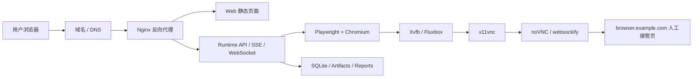
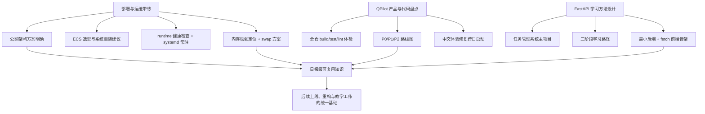
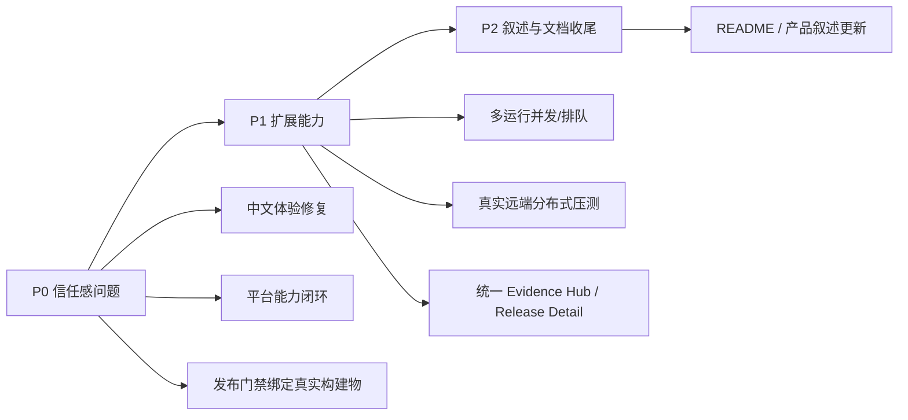

# Codex 增强版日报（2026-04-20，Asia/Shanghai）

## 0. 报告说明

- 统计窗口：`2026-04-20 00:00:00` 至 `2026-04-20 23:59:59`（`Asia/Shanghai`）。
- 对应 UTC 窗口：`2026-04-19T16:00:00Z` 至 `2026-04-20T15:59:59Z`。
- 数据来源：
  - `C:\Users\zjy\.codex\sessions\**\*.jsonl`
  - `C:\Users\zjy\.codex\state_5.sqlite`
  - `C:\Users\zjy\.codex\automations\codex\memory.md`
  - `C:\Users\zjy\.codex\automations\codex\REPORT_TEMPLATE.md`
  - 工作区现有代码与产物目录，例如 `C:\Users\zjy\QPilot-Studio`、`C:\Users\zjy\Documents`
- 纳入标准：
  - 只纳入在统计窗口内存在实质工作的会话。
  - “实质工作”包括：代码/架构审查、部署/调试、问题定位、设计决策、知识解释、方法论输出、学习路线设计。
  - 跨日会话只统计落在本窗口内的消息、命令、分析与结论，不把 `2026-04-21` 凌晨内容倒灌回本日报。
- 排除项：
  - 自动化日报线程 `019da8cc-a03c-7023-a7b1-678858fdd191`
  - 自动化日报线程 `019da8cc-b522-7b12-b058-8151f87d04bd`
- 当日纳入的有效会话数：`3`
  - `019d9438-1acb-7562-9d37-3032a2a47724`
  - `019dab26-54c2-7951-8a68-129230592845`
  - `019dab2e-5e02-74c3-90f3-73be17d33d01`
- 主要工作区：
  - `C:\Users\zjy\QPilot-Studio`
  - `C:\Users\zjy\Documents`

## 1. 总览摘要

2026-04-20 的主线不是单一编码产出，而是围绕 `QPilot-Studio` 做了三条互相支撑的工作流：第一条是把“本地可跑”的自动化测试系统拆解成“如何稳定部署到公网、如何远程看浏览器、如何做人工接管”的可执行运维方案；第二条是对 `QPilot-Studio` 当前产品面做系统性盘点，明确了真正影响可信度和产品化落地的优先级问题；第三条是把“如何从 0 到 1 学会 FastAPI、前后端通信、接口和交互逻辑”收敛成一条适合初学者的学习方法路径。

当天最有价值的结论有四个。第一，针对“单台 Linux 服务器 + 网页访问 + 浏览器实时画面 + 人工接管”的方案，已经不再停留在概念描述，而是明确指出现有代码里已经具备 `runtime` 启 Chromium、WebSocket 推实时画面、前端 Canvas 展示等基础，真正缺的是“服务器侧可被网页接管的桌面层”，因此给出了 `Xvfb + fluxbox + x11vnc + noVNC/websockify` 的完整拓扑。第二，围绕阿里云 ECS 的真实部署过程，完成了从机器选型、重装系统、依赖安装、`.env` 配置、Playwright 安装、`runtime` 健康检查、`systemd` 常驻，到前端构建失败排障的一条完整带练链路，并把典型根因逐个打穿。第三，晚间新会话对项目功能缺口进行了系统分级，明确提出 `P0 中文体验修复`、`P0 平台能力闭环`、`P0 发布门禁与真实构建物绑定`、`P1 多运行并发/排队`、`P1 真实远端分布式压测`、`P1 统一 Evidence Hub / Release Detail`、`P2 README/产品叙述更新`，为之后跨日实现打下了很清晰的工程路线。第四，在 `Documents` 工作区内，给出了一条以“团队任务管理系统 v1”为主项目的 FastAPI 学习法，强调先用 `HTML + JS + fetch` 跑通通信本质，再上数据库、鉴权和前端框架，避免学习路径一开始就被框架复杂度压垮。

需要特别说明的是：当晚 `21:48` 之后的项目优化会话已经启动了针对乱码/中文体验问题的代码改造探索，并进入到“准备整块重写相关文件”的阶段，但该实现闭环与测试通过发生在 `2026-04-21` 凌晨，不纳入本日报的已完成代码产出统计。本日报会把这部分准确记录为“设计与实现启动，代码落地跨日完成”。

## 2. 关键产出一览

### 2.1 代码任务与工程动作

- 已完成的代码交付：无。
- 已完成的代码级审查与落地准备：
  - 对 `QPilot-Studio` 全仓进行了结构、路由、schema、页面、运行时能力和平台能力的系统盘点。
  - 本地实际执行了 `pnpm -r build`、`pnpm -r test`、`pnpm -r lint`，结论是在统计窗口内仓库总体可构建、可测试、可 lint，通过了基础工程体检。
  - 在 `21:57` 之后启动了 `P0 中文体验修复` 的实现准备，重点检查文件包括：
    - `apps/web/src/App.tsx`
    - `apps/web/src/i18n/I18nProvider.tsx`
    - `apps/web/src/lib/evidence-i18n.ts`
    - `packages/shared/src/schemas.ts`
  - 当晚 `22:04` 左右起已进入“整块重写乱码文件”的实施思路，但未在 `23:59:59` 前形成可归档的完成态。

### 2.2 调试、修复与部署推进

- 完成了基于真实 ECS 使用过程的部署带练与排障，核心问题包括：
  - `localhost` 无法对外访问的认知误区。
  - 远程浏览器可视化与人工接管能力缺的不是直播流，而是服务器桌面层。
  - Windows + `2核 2GiB` + 中国内地区域并不适合当前项目的第一阶段上线目标。
  - `pnpm install` 被中断导致 `ts-node` 缺失，进而影响 `runtime` 启动。
  - `apt/dpkg` 锁与交互式配置打断 Playwright 安装。
  - `runtime` 已经起来但 `curl` 检查过早，造成“服务没起来”的错觉。
  - `2GiB` 机器在 `runtime` 常驻 + `Vite/TypeScript` 构建同时进行时内存耗尽，前端 build 卡死。
  - 用户在会话中泄露真实 API Key，需要立刻撤销重建并清理历史。

### 2.3 设计决策

- 部署架构决策：
  - 主站：`qpilot.example.com`
  - 浏览器接管页：`browser.example.com`
  - 第一阶段只部署 `web + runtime`，暂不上 `desktop`、`Redis`、`Postgres`、`noVNC`
  - 若需要人工接管，再在同机补 `Xvfb + fluxbox + x11vnc + noVNC/websockify`
- 资源选型决策：
  - 推荐优先 `中国香港 + Ubuntu 24.04 LTS + 2核 8GiB + 经济型 e + 40GiB ESSD`
  - 如果更在意免费额度消耗，可退一步用 `2核 4GiB`
- 产品优化决策：
  - 先修“信任感和可用性”，再补“发布对象建模与证据闭环”，最后再做平台扩展能力
  - 推荐顺序：`中文修复 -> 发布对象建模 -> 平台 CRUD 闭环 -> 多运行并发 -> 真实分布式压测`

### 2.4 知识解释与方法论输出

- 形成了“本地应用发布到公网 SOP”。
- 形成了“FastAPI 从 0 到 1 学习主项目 + 三阶段推进法”。
- 形成了“先理解通信本质，再引入框架和数据库”的学习路径。
- 明确了 `QPilot-Studio` 当前已经不是单一 MVP，而是两条产品线雏形：
  - 功能测试 / 回放 / 诊断
  - 压测 / 环境 / 门禁治理平台

## 3. 按会话的时间线

### 3.1 会话 `019d9438-1acb-7562-9d37-3032a2a47724`

- 标题：`针对已经存在的 md 架构文档，请描述得更详尽，把我当成小白`
- 工作区：`C:\Users\zjy\QPilot-Studio`
- 统计窗口内活跃时间：`2026-04-20 10:55` 到 `21:21`（Asia/Shanghai）
- 会话性质：部署架构讲解 + 服务器选型 + 真实 ECS 带练 + 运维故障排查 + 方法论沉淀

关键时间点：

- `10:55-10:58`
  - 用户选择“方案 1：单台 Linux 服务器 + 网页打开 + 远程浏览器画面 + 人工接管页”。
  - 先从代码核对控制接口，避免把部署路径讲错。
  - 本地检索到的关键接口位于：
    - `apps/runtime/src/server/routes/runs.ts`
    - `apps/runtime/src/server/routes/platform.ts`
  - 明确存在的控制/查看接口包括：
    - `/api/runs/:runId/control`
    - `/api/runs/:runId/resume`
    - `/api/runs/:runId/pause`
    - `/api/runs/:runId/abort`
    - `/api/runs/:runId/bring-to-front`
    - `/api/platform/control-tower`

- `10:58-11:00`
  - 输出第一轮部署架构结论。
  - 关键判断：当前项目已经具备“服务器起 Chromium + 实时推流 + 前端播放”的基础，缺口不在直播链路，而在“如何让这台服务器上的浏览器桌面可被网页接管”。
  - 因此提出同机部署：
    - `runtime`
    - `Xvfb`
    - `fluxbox`
    - `x11vnc`
    - `noVNC/websockify`

- `11:00-11:05`
  - 用纯白话补了一遍“本地跑通”和“公网可访问”之间的差异。
  - 解释重点：
    - `localhost` 只指向访问者自己的电脑
    - 真正公网访问需要域名、Nginx、后端常驻进程、反向代理
    - 前端和 `runtime` 上线后必须从 `localhost` 迁移到公开地址

- `14:58-15:00`
  - 汇总对“免费云服务器/试用机器”的调研结论。
  - 输出的比较对象包括：
    - Oracle Cloud Free Tier
    - Google Cloud Free Tier
    - 阿里云 ECS 免费试用
    - AWS Free Tier / Credits
    - Azure Free Account
  - 结论不是泛泛列举，而是区分：
    - “长期接近免费”的候选
    - “试用额度型”的候选
    - 哪些更适合中国用户和当前项目

- `15:17`
  - 基于 `QPilot-Studio` 的真实形态给出 ECS 资源选择建议。
  - 根因判断：
    - 项目不是普通静态站点，而是 `Web + Runtime + Playwright + Chromium + SQLite + 本地文件证据`
    - 如果后续再加 `noVNC`，对内存和带宽的要求会进一步提升
  - 推荐配置：
    - `中国香港`
    - `2核 8GiB`
    - `经济型 e`
    - `ESSD Entry 40GiB`
    - `Ubuntu 24.04 LTS`

- `15:23`
  - 决定第一阶段只部署 `Web + Runtime`，暂不引入 `Desktop`、`Redis`、`Postgres`、`noVNC`。
  - 影响：
    - 降低首次上线复杂度
    - 更贴合仓库当前启动方式
    - 把问题收敛到“把网站先跑起来”

- `15:26`
  - 看到用户当前机器为 `华东1（杭州） + Windows Server 2022 + 2核 2GiB` 后，直接给出“建议先重建”的判断。
  - 根因：
    - Windows 对 Playwright/Node 生产部署不是当前最省心路径
    - 中国内地公网站会被备案要求影响
    - `2GiB` 对本项目明显偏小

- `15:50-17:12`
  - 进入一步一步的实际服务器带练。
  - 关键操作序列：
    - 安装基础环境
    - 拉取/上传 `QPilot-Studio` 代码
    - 配置 `.env`
    - 创建数据目录
    - 安装 Playwright Chromium
    - 启动 `runtime`
    - `curl http://127.0.0.1:8787/health`
    - 配 `systemd` 为 `qpilot-runtime.service`
  - 期间连续处理了若干真实故障：
    - `nano` 退出操作错误
    - `.env` 占位值未替换
    - API Key 被贴到会话里，要求立即废弃并重建
    - `apt` 被自动更新占锁
    - `dpkg` 因交互流程未完成卡住
    - `pnpm install` 中断导致 `ts-node` 缺失

- `17:03-17:06`
  - 确认 `runtime` 启动与健康检查恢复正常，并指导改成 `systemd` 常驻。

- `17:03-17:18`
  - 开始前端构建时，进一步定位出“不是命令错了，而是机器内存不足”。
  - 根因证据：
    - `free -h`
    - `ps -eo pid,comm,%mem,%cpu --sort=-%mem | head`
    - `df -h`
  - 给出处理方案：
    - 先停 `qpilot-runtime`
    - 杀掉构建进程
    - 创建 `4G swap`
    - 再次构建前端

- `21:18-21:21`
  - 在前述带练基础上沉淀出一份可复用的“本地应用发布到公网 SOP”。
  - 这使当天工作从“只解决这一次部署”升级为“形成以后可复用的方法资产”。

### 3.2 会话 `019dab26-54c2-7951-8a68-129230592845`

- 标题：`梳理项目现有功能缺口并给出优化策略建议`
- 工作区：`C:\Users\zjy\QPilot-Studio`
- 统计窗口内活跃时间：`2026-04-20 21:48` 到 `23:52`（Asia/Shanghai）
- 会话性质：全仓盘点 + 质量体检 + 产品缺口审查 + 优先级路线制定 + 跨日实现启动

关键时间点：

- `21:48-21:50`
  - 启动全仓扫描，实际执行的本机命令包括：
    - `Get-ChildItem -Force`
    - `rg --files`
    - `git status --short`
    - `Get-Content README.md`
    - `Get-Content package.json`
    - `Get-Content apps/web/package.json`
    - `Get-Content apps/runtime/package.json`
    - `Get-Content apps/desktop/package.json`

- `21:49-21:53`
  - 继续深挖关键实现文件与页面：
    - `apps/runtime/src/server.ts`
    - `apps/runtime/src/db/schema.ts`
    - `packages/shared/src/schemas.ts`
    - `apps/runtime/src/server/routes/platform.ts`
    - `apps/runtime/src/server/routes/load.ts`
    - `apps/web/src/lib/api.ts`
    - `apps/web/src/pages/ControlTowerPage.tsx`
    - `apps/web/src/pages/LoadStudioPage.tsx`
    - `apps/web/src/pages/EnvironmentPage.tsx`
    - `apps/web/src/pages/ReleaseGatePage.tsx`
    - `apps/runtime/src/platform/load-control-plane.ts`
    - `apps/runtime/src/platform/load-queue.ts`
    - `apps/runtime/src/platform/gate-center.ts`

- `21:50-21:51`
  - 直接跑了全仓工程体检：
    - `pnpm -r build`
    - `pnpm -r test`
    - `pnpm -r lint`
  - 结论：
    - 当前仓库工程基本面可用。
    - 但前端自动化测试覆盖仍薄，尤其 `apps/web` 缺少真正有强业务约束的页面测试。

- `21:55`
  - 输出本会话最核心的策略结论：
    - 项目已经不是“只有一个 MVP”，而是两条产品线雏形并存。
    - 最有竞争力的是功能测试/回放/诊断链路。
    - 平台侧已经有 `Control Tower`、`Load Studio`、`Environments`、`Release Gates` 等雏形，但还未形成产品化闭环。
  - 明确问题分级：
    - `P0 中文体验修复`
    - `P0 平台能力闭环`
    - `P0 发布门禁和真实构建物绑定`
    - `P1 多运行并发/排队`
    - `P1 真实远端分布式压测`
    - `P1 统一 Evidence Hub / Release Detail`
    - `P2 README/产品叙述更新`
  - 明确推荐顺序：
    - `中文修复 -> 发布对象建模 -> 平台 CRUD 闭环 -> 多运行并发 -> 真实分布式压测`

- `21:57-23:52`
  - 由策略评审转入实际实现准备。
  - 深入检查：
    - `apps/web/src/i18n/I18nProvider.tsx`
    - `apps/web/src/lib/evidence-i18n.ts`
    - `apps/web/src/App.tsx`
    - `packages/shared/src/schemas.ts`
  - 在 `22:04` 左右明确给出“把乱码文件整块重写成干净版本”的做法，原因是：
    - 逐行修补风险高
    - 乱码问题已经影响可维护性
    - 顺手可以把中文体验与文案一致性一并拉齐
  - 该实现闭环跨到 `2026-04-21` 凌晨完成，因此本日报只记录为“实现启动”，不把次日凌晨结果算进来。

### 3.3 会话 `019dab2e-5e02-74c3-90f3-73be17d33d01`

- 标题：`想做一个 Python/FastAPI 学习项目，从 0 到 1 掌握后端、前后端通信和接口逻辑`
- 工作区：`C:\Users\zjy\Documents`
- 统计窗口内活跃时间：`2026-04-20 21:58` 到 `22:02`（Asia/Shanghai）
- 会话性质：学习路线设计 + 初学者方法论输出 + 第一个项目骨架

关键时间点：

- `21:58`
  - 给出主项目建议：`团队任务管理系统`
  - 方法论不是“先学一堆零散知识”，而是用一个主项目串起：
    - 前端页面怎么发请求
    - FastAPI 怎么收参数
    - 数据怎么存
    - 鉴权怎么接入
    - 部署上线后前后端如何协作

- `21:58-22:00`
  - 把学习路径拆成三阶段：
    - 阶段 1：`HTML + JS + fetch + FastAPI + 内存数据`
    - 阶段 2：`SQLite/PostgreSQL + SQLAlchemy + JWT 鉴权`
    - 阶段 3：`搜索/分页/上传/日志/Docker/Nginx/云服务器/前端框架升级`
  - 核心教学理念：
    - 先跑通通信本质
    - 再上数据库和权限
    - 最后再进入接近真实项目的复杂度

- `22:02`
  - 给出“任务管理系统 v1”第一阶段的最小可执行骨架。
  - 明确让用户自己动手敲的内容：
    - `python -m venv .venv`
    - `.venv\\Scripts\\activate`
    - `pip install fastapi uvicorn`
    - `uvicorn main:app --reload`
    - `GET /tasks`
    - `POST /tasks`
    - `index.html` 中用 `fetch("http://127.0.0.1:8000/tasks")`
  - 重点解释了：
    - `BaseModel` 的角色
    - `response.json()` 的含义
    - 为什么先用 `/docs` 验证接口
    - 为什么先学 `HTML + JS`，而不是一上来进入 React/Vue

## 4. 命令、测试与验证结论

### 4.1 本机会话内实际执行的命令

`QPilot-Studio` 优化审查会话中实际执行的代表性命令：

```powershell
Get-ChildItem -Force
rg --files
git status --short
Get-Content README.md
Get-Content apps/web/package.json
Get-Content apps/runtime/package.json
Get-Content apps/desktop/package.json
pnpm -r build
pnpm -r test
pnpm -r lint
Get-Content apps/web/src/i18n/I18nProvider.tsx
Get-Content apps/web/src/lib/evidence-i18n.ts
Get-Content apps/runtime/src/platform/gate-center.ts
```

验证结论：

- `pnpm -r build`：通过。
- `pnpm -r test`：通过。
- `pnpm -r lint`：通过。
- 代码审查确认了当前产品能力分布、关键页面入口、平台路线和若干核心风险点。
- 同时确认 `apps/web` 的前端自动化验证仍偏薄，后续需要补充真正绑定业务行为的页面测试。

### 4.2 会话中指导用户执行的关键部署命令

部署带练里输出给用户的高频关键命令包括：

```bash
apt update
apt install -y git curl nginx certbot python3-certbot-nginx
pnpm install
pnpm --filter @qpilot/runtime exec playwright install --with-deps chromium
pnpm --filter @qpilot/runtime start
curl http://127.0.0.1:8787/health
systemctl enable --now qpilot-runtime
pnpm --filter @qpilot/web build
free -h
fallocate -l 4G /swapfile
swapon /swapfile
```

从会话反馈可确认的结果：

- `runtime` 健康检查最终通过。
- `qpilot-runtime` 被改造成 `systemd` 常驻服务。
- 前端 build 在 `2GiB` 机器上出现资源瓶颈，不是命令错误，而是容量不足。
- 解决方案收敛为：
  - 停止常驻 `runtime`
  - 清理挂起构建进程
  - 增加 `4G swap`
  - 重新 build

### 4.3 关键验证结论

- 部署侧：
  - “本地可跑”与“公网可访问”之间的鸿沟已经被拆解为可执行步骤，而不是抽象概念。
  - 当前项目可以先以 `web + runtime` 形式上线，再逐步加入远程接管层。
- 产品侧：
  - `QPilot-Studio` 的核心价值在“测试结果诊断 + 治理平台化”，不是单点自动化脚本工具。
  - 当前最影响信任感的是中文体验、发布门禁绑定和平台闭环能力，而不是再继续堆边缘功能。
- 学习侧：
  - FastAPI 的初学者路径已经被压缩成一个能立刻动手的最小主项目，不需要先搭复杂前端框架。

## 5. 解决的问题与根因

### 5.1 为什么“远程看浏览器”不等于“能人工接管浏览器”

根因不是缺少实时画面。现有 `QPilot-Studio` 已经有浏览器画面直播能力，`runtime` 也能直接启动 Chromium，前端也能通过 WebSocket 和 Canvas 把画面显示出来。真正缺的是“服务器上的浏览器运行在一个可被远程接管的桌面环境里”。因此方案从“只补直播流”切换为“补桌面层”，这就是 `Xvfb + fluxbox + x11vnc + noVNC` 组合存在的原因。

### 5.2 为什么 `localhost` 明明能打开，换成公网就不通

根因是网络边界理解错误。`localhost` 永远只代表发起访问的那台机器。把项目搬到公网以后，需要解决的是：

- 域名解析把请求指向服务器
- Nginx 接住公网请求
- `/` 返回前端静态文件
- `/api` 反向代理给 `runtime`
- `runtime` 常驻监听本机端口

当天通过白话解释和实际 SOP，把这个认知坑补掉了。

### 5.3 为什么当前 ECS 选型会让部署过程异常痛苦

根因是机器选型和项目真实负载不匹配。用户当时的选择是 `Windows Server 2022 + 中国内地区域 + 2核 2GiB`，而当前项目需要面对的是 `Node + Playwright + Chromium + 前端构建 + SQLite + 文件证据`。这会同时带来：

- 运维路径复杂
- 文档生态不优
- 备案与公网访问路径更绕
- 内存严重不足

因此会话中明确建议改为 `香港 + Ubuntu 24.04 + 至少 4G，更稳 8G`。

### 5.4 为什么 `runtime` 启动失败会报到 `ts-node` 缺失

根因不是代码本身坏了，而是用户前面的 `pnpm install` 被中断，导致依赖没有完整落齐。这个判断很重要，因为它把问题从“继续怀疑源码”切换成“回到依赖安装完整性”，节省了大量错误排查时间。

### 5.5 为什么 Playwright 安装会反复卡住

当天实际遇到的是两层根因叠加：

- 系统自动更新占用 `apt/dpkg` 锁
- 后续 `dpkg` 还需要补一次非交互式收尾

所以修复动作不是重复执行安装命令，而是先等待锁释放，再执行：

```bash
DEBIAN_FRONTEND=noninteractive NEEDRESTART_MODE=a dpkg --configure -a
```

### 5.6 为什么前端 build 看起来像“卡死”

根因是容量瓶颈，不是脚本死循环。`2GiB` 机器上同时挂着 `runtime`、`TypeScript` 检查、`Vite` 打包时，可用内存迅速见底，`Swap = 0` 又让系统没有缓冲区，最终表现成 build 长时间无响应。当天用 `free -h` 和进程占用输出把这个问题定性为“资源不足”，并给出 `stop runtime + add swap + rebuild` 的最省事修复路径。

### 5.7 为什么晚间产品优化把“中文体验修复”排在最前

根因不是单纯“文案不好看”，而是已经影响可用性和信任感。会话中明确指出 `apps/web/src/i18n/I18nProvider.tsx` 里已经存在“检测坏翻译并回退英文”的兜底逻辑，这说明乱码/坏翻译问题不是边缘问题，而是已侵入核心体验。对于中文用户，这比再多做一个平台模块更优先。

### 5.8 为什么“发布门禁与真实构建物绑定”是 P0

根因是当前 Gate 更像“原型版智能汇总”，缺少稳定的 `scenario/build/commit/release` 绑定。如果继续以字符串标题级匹配为主，就会导致演示看起来很强，但真实发布治理不可靠。这个判断虽然当晚尚未完成代码落地，但已经明确了后续工程主航道。

## 6. 流程图与结构图

### 6.1 QPilot 单机公网部署与人工接管结构图



图解：

- 左半部分解决“网站如何被访问”。
- 右半部分解决“浏览器如何被看见、如何被人工接管”。
- 这张图对应的是当天部署会话的核心架构结论。

### 6.2 当日工作主线与产出流向图



### 6.3 QPilot 优先级收敛图



## 7. 知识整理

### 7.1 本地应用上线到公网的本质

不是“把本地地址换个域名”这么简单，而是要把“本机页面 + 本机后端 + 本机文件/数据库 + 本机浏览器自动化”搬到一台持续在线、可被公网访问的机器上，再由 Nginx、域名和 HTTPS 把入口统一起来。

### 7.2 远程浏览器直播和远程浏览器接管是两回事

直播解决的是“看见”，接管解决的是“操作”。`QPilot-Studio` 现有直播能力说明它已经具备“看见”的基础；若要在网页里人工接管，还必须让服务器侧 Chromium 跑在可远程接入的桌面环境中。

### 7.3 初次上线应先裁复杂度，而不是追求一步到位

当天多次强调“先上 `web + runtime`，不急着上 `desktop`、`Redis`、`Postgres`、`noVNC`”。这不是退缩，而是工程上对首个可用公网版本的正确切分：先确认主链路成立，再逐层补平台化能力。

### 7.4 服务器排障要优先定性问题，再决定修法

当天几次典型排障都遵循同一个原则：

- `ts-node` 缺失：先判断是不是依赖没装完整
- Playwright 卡住：先判断是 `apt lock` 还是安装脚本本身坏了
- build 卡死：先判断是代码死循环还是机器内存耗尽

这类“先定性再动手”的习惯，能显著减少瞎试命令。

### 7.5 面向初学者的后端学习顺序不该从框架炫技开始

当天给 FastAPI 学习路径时，明确选择了：

- `FastAPI`
- `HTML + CSS + JavaScript`
- `fetch`
- 内存数据再升级到 `SQLite`

原因很清楚：这条路径最能暴露和解释“HTTP 请求、JSON、接口、参数校验、浏览器与后端如何协作”的本质。先学明白这些，再迁移到 React/Vue，成本最低。

### 7.6 `QPilot-Studio` 当前最重要的不是“再加功能”，而是“让已有功能可信”

项目已经有不少页面和模型，但真正决定是否能从 demo 变成平台的是：

- 中文体验是否可用
- 发布门禁是否绑定真实构建物
- 平台资源是否有 CRUD/审计/版本闭环
- 运行与压测能力是否能支撑多人、多发布对象和真实执行面

这也是为什么当天路线图把“信任感”和“闭环”放在“扩展能力”之前。

## 8. 自测问答

### 题 1

问：为什么当天部署方案里没有直接把“人工接管浏览器”当成一个前端页面问题处理？

答：因为现有系统已经能把浏览器实时画面推到网页，缺的是服务器侧浏览器的可接管桌面环境。问题本质在桌面层，不在前端播放器层。

### 题 2

问：为什么推荐第一阶段只部署 `web + runtime`，而不是把 `desktop`、`Redis`、`Postgres`、`noVNC` 一次性全部带上？

答：因为首阶段目标是先确认公网主链路成立，复杂度应最小化。把非必要组件一次性带上，会显著增加部署变量和排障成本。

### 题 3

问：当天为什么判断前端 build 卡住的根因是机器资源，而不是代码问题？

答：因为会话中结合 `free -h`、高占用进程和 `Swap = 0` 明确看到了 `2GiB` 机器资源耗尽，且同时存在 `runtime` 常驻和前端构建两个重负载进程。

### 题 4

问：为什么在产品优化路线里把“中文体验修复”排成 `P0`？

答：因为乱码/坏翻译已经影响核心可用性，甚至代码里已经出现“检测坏翻译并回退英文”的兜底逻辑，说明问题早已越过“体验优化”而进入“产品可信度问题”。

### 题 5

问：为什么 FastAPI 学习路径建议先用 `HTML + JS + fetch`，而不是直接上 React/Vue？

答：因为初学者最需要先理解浏览器如何发请求、后端如何接收 JSON、接口如何返回数据、前后端如何联调。先上复杂框架容易把核心通信逻辑淹没。

### 题 6

问：为什么“发布门禁与真实构建物绑定”会被提升为 `P0`，而不是后续慢慢补？

答：因为如果 Gate 只能做标题级、字符串级的松散聚合，就只能支撑演示，不能支撑真实发布治理。这个问题直接影响平台结论是否可信。

## 9. 未完成事项与后续建议

- `QPilot-Studio` 晚间启动的 `P0 中文体验修复` 在统计窗口内尚未完成闭环，后续需继续跟进跨日实现结果。
- `发布门禁与真实构建物绑定` 目前仍停留在清晰的设计判断阶段，尚需转化为 schema、路由、页面和测试层的实际实现。
- ECS 侧虽然已经打通到 `runtime` 健康检查和 `systemd` 常驻，但前端构建与 Nginx/HTTPS 全链路在当天窗口内尚未最终验收完毕。
- 如果用户已经泄露过真实 API Key，必须确认：
  - 旧 key 已废弃
  - 新 key 已替换
  - 必要时终端历史已清理
- FastAPI 学习路线已明确，但项目骨架尚未在 `Documents` 工作区落成真实代码仓库；如果用户要继续，建议直接建一个最小项目目录并让用户亲手补全逻辑。

## 10. 给用户的复盘建议

- 对 `QPilot-Studio`：不要急着继续铺平台页面，先把 `P0 中文体验修复` 和“发布对象绑定真实证据”做扎实。前者解决用户信任感，后者解决平台结论可信度。
- 对部署工作：如果目标是尽快做出公网可访问版本，优先保证机器规格和系统选择正确，避免在 `2GiB`、Windows、备案约束等低层问题上重复消耗时间。
- 对学习路径：继续维持“一个主项目串联知识点”的方法，不要退回到零散看概念。当天给出的任务管理系统路线已经足够支撑 0 到 1 的后端与前后端通信入门。
- 对后续日报关注点：建议下一次重点核对两件事是否真正落地：
  - `QPilot-Studio` 的中文体验修复和发布对象建模是否已完成代码与测试闭环
  - ECS 上是否已经完成前端构建、Nginx 反代和 HTTPS 验收
